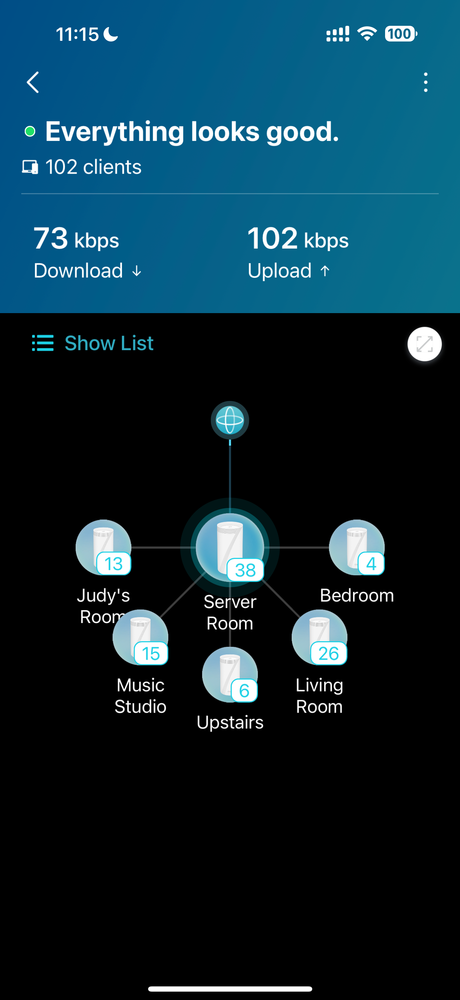

# A Little Dummy Guide to Home Networking

Home networking might seem intimidating at first, but let's break it down step by step. Imagine your Internet Service Provider (ISP) handing you a modem or router with WiFi capabilities—and you're ready to create your own connected world.

Although my home network looks intimidating with its array of equipment including mesh routers and network switches, it's actually quite simple under the hood. The core networking principles remain straightforward, even with advanced hardware.

The basic setup looks like this: Internet ➞ ISP Modem/Router ➞ [Optional] Your Own WiFi Router ➞ Your Devices

Here's what each component does: the ISP modem/router connects your home to the Internet, your optional WiFi router enhances wireless coverage and advanced features, and your devices are the endpoints that connect to this network for internet access.

While ISP-provided routers often include basic WiFi and networking features, a more common setup is to connect your own router with multiple Ethernet ports. This gives you better control over your network and typically provides more advanced features.

When you connect your devices to your router's Ethernet ports (except for the WAN port that connects to the ISP's modem), you create a local home network. This network allows your devices to communicate with each other while sharing the internet connection from your ISP.

Your router creates a local 'private' network that is isolated from the Internet by default. While most users keep this default configuration, it is possible to make parts of your network accessible from the Internet through port forwarding and other advanced settings. However, exposing your network to the Internet requires careful consideration of security implications and is beyond the scope of this guide.

That private network usually uses one of the following IP address ranges reserved for private networks:

- 10.0.0.0 to 10.255.255.255 (10.0.0.0/8)
- 192.168.0.0 to 192.168.255.255 (192.168.0.0/16)
- 172.16.0.0 to 172.31.255.255 (172.16.0.0/12)

Most home routers default to using the 192.168.x.x range, typically starting with 192.168.1.x or 192.168.0.x for connected devices.

When you see these IP address patterns (10.x.x.x, 192.168.x.x, or 172.16-31.x.x), it indicates that the network is private and not directly accessible from the Internet. These ranges are specifically reserved for internal networks and provide a layer of isolation from public Internet traffic.

And that's what we're aiming for: a secure and isolated home network that allows your devices to communicate internally while safely connecting to the Internet through your router's network address translation (NAT).

But what if you run out of ports on your router? While IP addresses aren't a concern (even the smallest private network range can handle thousands of devices), physical Ethernet ports are limited. When you need more ports than your router provides, you can add a network switch - a device that multiplies the number of available Ethernet ports. Simply connect the switch to one of your router's ports, and it will extend your network with additional ports while maintaining the same private network configuration.

This image shows my home network setup, featuring a main network switch connected to two patch panels for organized cable management. While my complete setup includes five additional switches connecting over 100 devices, I recommend starting with a simpler configuration unless you have significant networking experience. A complex network requires careful planning and technical knowledge to maintain properly. For beginners, it's best to start with a simple setup. This allows you to understand the basics before diving into more advanced configurations, making troubleshooting and maintenance much easier.

For most home users, I recommend starting with:
1. A quality router with at least 4 Gigabit Ethernet ports
2. A basic 8-port or 16-port Gigabit network switch, depending on your needs

While 10Gbps networking exists, it requires specialized knowledge, hardware compatibility considerations, and a significantly higher budget. For now, standard Gigabit (1Gbps) equipment will serve most home networking needs well.

Looking at my setup, the switch includes 4 10Gbps ports. While these high-speed ports can be utilized within my internal network, their full potential is limited by your router's capabilities. Without a router that supports 10Gbps, you won't achieve those maximum speeds. Implementing 10Gbps networking requires significant investment in compatible hardware and technical expertise. Don't be swayed by marketing - for most home users, the benefits of 10Gbps networking don't justify the substantial cost and complexity involved.

Having said that, 10Gbps networking should only be considered if you have specific use cases that require such high bandwidth, like transferring large media files between local devices or running network-intensive server applications. While devices like the Mac Mini Pro M4 come with 10Gbps ports, implementing a full 10Gbps network requires significant investment in compatible switches, cables, and network cards across all connected devices. The cost and complexity of 10Gbps networking is typically only justified for professional workloads or specialized home lab setups, well, like mine 🤣

In a nutshell, when you add a network switch to your setup, it seamlessly extends your network by providing additional Ethernet ports while maintaining all the functionality of your existing network configuration. The switch automatically handles the routing of traffic between connected devices, requiring no additional configuration in most cases.

One final note: Whether you're a beginner or consider yourself tech-savvy, every component in your network needs to be properly matched to achieve intended performance. This includes cables, which are often overlooked. For example, using a CAT5e cable in a 10Gbps network will limit your speeds, as these cables only support up to 1Gbps. For 10Gbps networking, you'll need at least CAT6a cables. Always verify that each component - from cables to switches to network cards - meets the requirements of your desired network speed and functionality.

Unfortunately, many older buildings face bandwidth limitations due to their legacy internal wiring infrastructure. Traditional telephone lines, which were never designed for high-speed data transmission, are sometimes still used to carry both phone and internet signals through DSL splitters. This can significantly impact network performance, but the complexities of building wiring infrastructure deserve their own detailed discussion.

Use this guide as a starting point to build your networking knowledge. As technology evolves, continue learning and adapting your setup to meet your needs. The fundamentals covered here will serve as a solid foundation for understanding more advanced networking concepts.