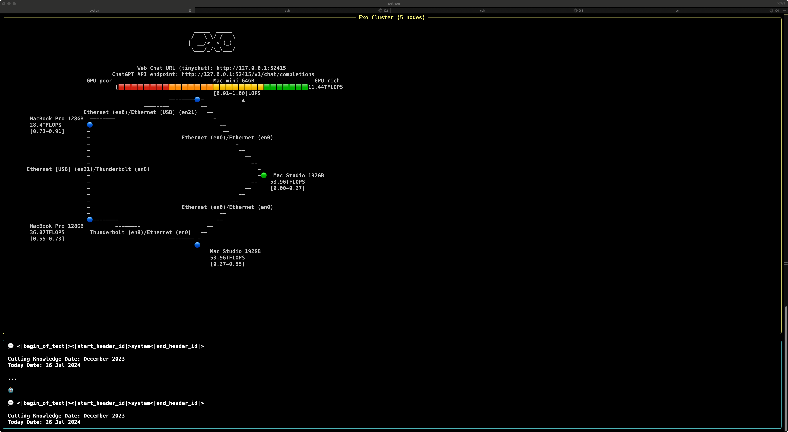
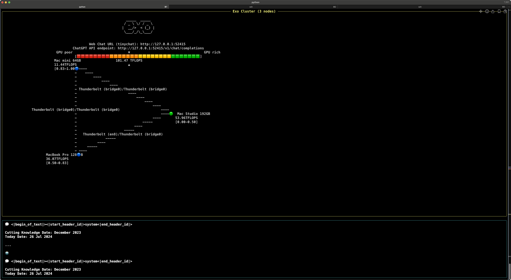

# Running an AI Cluster on Multiple Apple Silicon Macs


Ever wondered if you can run a large AI model across several Apple Silicon Macs at home? With tools like 'exo', it’s possible. But before diving in, let’s set expectations: this approach is more about learning and experimentation than achieving top-tier performance. If your model can fit into a single Mac Studio M2 Ultra with plenty of RAM, that’ll generally be faster and simpler than clustering multiple machines. Still, this is a fun way to explore distributed AI inference and catch a glimpse of what might be possible in the future.

🔗 exo: https://github.com/exo-explore/exo

## Why Consider a Cluster?

- If a Single Machine Isn’t Enough: Large models may exceed the memory of a single computer. A cluster lets you run these models by splitting them across multiple nodes.
- A Learning Experience: You’ll gain practical insights into distributed computing and possibly uncover ways to improve performance over time.

## Reality Check

- Slower if a Single Machine Can Handle It: If the entire model comfortably fits into one high-end Mac, that single node will usually outperform a distributed setup, since there’s no network overhead.  
- Modest Gains at Best: In ideal scenarios, a cluster might offer a minor performance boost, but any speed advantage is generally modest and can be easily offset by network complexity.  
- Network Complexity & Errors: Whether you use Ethernet or Thunderbolt, network latency and the potential for errors introduce complexity, often negating the benefits of a cluster.

In short, a cluster currently isn’t about raw speed gains. It’s more about enabling bigger models when a single machine can’t handle them alone—and learning a bit along the way.

---

## Test Setups

You can set up a cluster using Thunderbolt 4/5, Ethernet, or even WiFi. While WiFi is the simplest option, it's also the slowest and least reliable. Ethernet provides a good balance of performance and ease of setup. Thunderbolt offers the highest theoretical bandwidth but requires more complex configuration. The key requirement is just having a stable local network connection between all nodes in the cluster.

### 5-Node Ethernet Cluster



Nodes:

- 2 × Mac Studio M2 Ultra, 192GB RAM each
- 1 × MacBook Pro Max M3, 128GB RAM
- 1 × MacBook Pro Max M4, 128GB RAM
- 1 × Mac Mini Pro M4, 64GB RAM

Total RAM: 192 + 192 + 128 + 128 + 64 = 704GB

Network: Local Ethernet  

Result: Straightforward setup; everything generally “just works,” but comes with predictable network overhead.

### 3-Node Thunderbolt 4 Cluster


Nodes:

- Mac Mini Pro M4 (64GB RAM): 192.168.1.1 (Hub)
- MacBook Pro Max M4 (128GB RAM): 192.168.1.20
- Mac Studio M2 Ultra (192GB RAM): 192.168.1.30

Here, the Mac Mini serves as the hub, and the other two Macs connect to it via Thunderbolt 4. Assign static IPs to keep things organized. Although Thunderbolt can theoretically deliver higher bandwidth (up to 40Gbps for TB4 and even 80Gbps for TB5), setting it all up is trickier. The cluster will be a bit faster than Ethernet but still not dramatically so.

Important Notes:


1. Thunderbolt interfaces may show “unknown state.” Ignore that; it’s cosmetic.
2. If you reduce the number of nodes, `exo` will download missing shards automatically.
3. Don’t bother configuring a router on the Thunderbolt bridge. It’s unnecessary and can confuse DNS resolution.


---

## Models and Distribution

Try any `exo`-supported model. For instance:

- `models--mlx-community--Llama-3.3-70B-Instruct-4bit`

Best Practices:

- Download Once, Distribute Later: By default, each node downloads the model shards separately. This is bandwidth-inefficient. It’s better to download the full model on one node, then copy it over to others. Once copied, `exo` will only download what’s missing.
- Reduced Nodes: If you later remove a node, `exo` will fetch the missing shards on the remaining machines, so you’re not stuck re-downloading the entire model.

---

## Thunderbolt vs. Ethernet

Thunderbolt (TB4 / TB5):

- Pros: Faster theoretical speeds (40Gbps for TB4, up to 80Gbps for TB5).
- Cons: Complex setups, limited cable lengths, expensive cables, limited ports on each Mac.

Ethernet:

- Pros: Simpler, more flexible setups.
- Cons: Slower speeds (1Gbps or 10Gbps), which can be a bottleneck.

In Practice:

- Thunderbolt’s speed advantage doesn’t always translate into a huge performance gain for AI inference, especially if network stability and complexity issues arise.
- Scalability is easier with Ethernet. Thunderbolt setups are constrained by port counts and cable lengths.

👉 While Thunderbolt devices generally support daisy-chaining, using Mac computers as network passthrough nodes is not recommended. Although it might seem like a solution to port limitations, Macs are not designed to function as network bridges in a daisy-chain configuration. Attempting this would require complex software routing that introduces additional latency and network overhead, ultimately degrading performance. For reliable networking between multiple Macs, it's better to use a proper network switch or direct Thunderbolt connections to a single hub device.

---

## Installing and Running `exo`

Environment Setup:

```bash
# Remove old environment if present AND something's broken
conda remove --name exo --all

# Create a new environment with Python 3.12
conda create --name exo python=3.12

# Activate the environment
conda activate exo

# If needed, install llvm and clang for local compilation
conda install -c conda-forge llvm clang

# Install exo in editable mode from source
pip install -e .
```

Once installed, run:

```bash
exo
```

This will start the `exo` terminal interface, which displays a URL for accessing the web UI. Ensure all nodes are on the same local network and have `exo` running. Each node's terminal should display its status and automatically discover other nodes in the cluster.

Navigate to the displayed URL in your browser to access the web interface. You'll see a standard LLM inference UI where you can select and use models. On first use with a new model, `exo` will automatically handle downloading the model and intelligently distributing shards across your available nodes based on their capabilities and memory. Download progress on each node will be displayed in real-time both through the web interface and in your terminal window. 

Experiment with different configurations to understand how the system behaves:

1. Single Node Testing:
   - Run inference on one machine to establish baseline performance
   - Try different model sizes to find the memory limits of a single node

2. Multi-Node Scenarios:
   - Test with 2-3 nodes to see how model sharding works
   - Observe how the system automatically distributes model weights
   - Monitor inference latency across nodes

3. Network Configuration Tests:
   - Compare performance between Ethernet and Thunderbolt connections
   - Test different network topologies (direct connections vs switch-based)
   - Monitor network bandwidth utilization during inference

Take note of performance metrics, stability, and ease of setup with each configuration. This hands-on experimentation will help you understand the practical tradeoffs between different setups.

---

## Conclusion


Running a distributed AI cluster at home across multiple Apple Silicon Macs is more about learning and experimentation than speed. The performance may not surpass a single high-end node if that node can handle the entire model. Still, if you have multiple Macs and want to try something new, it’s a neat glimpse into the future.


You’ll learn about distributed inference, model sharding, and how network configurations impact performance. Despite the quirks and hurdles, it’s a fun project—just don’t expect it to replace a powerful single-node setup anytime soon.