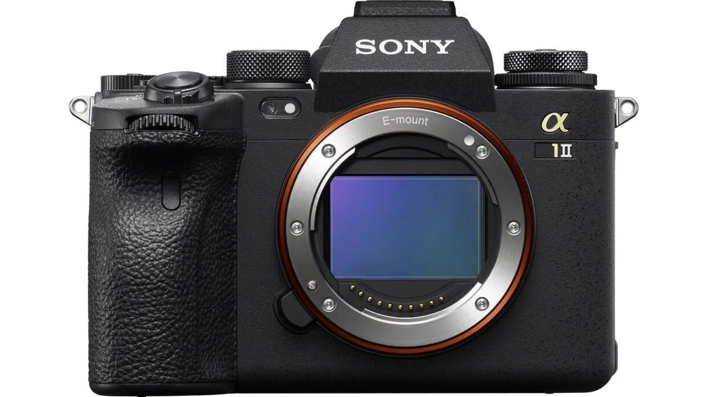
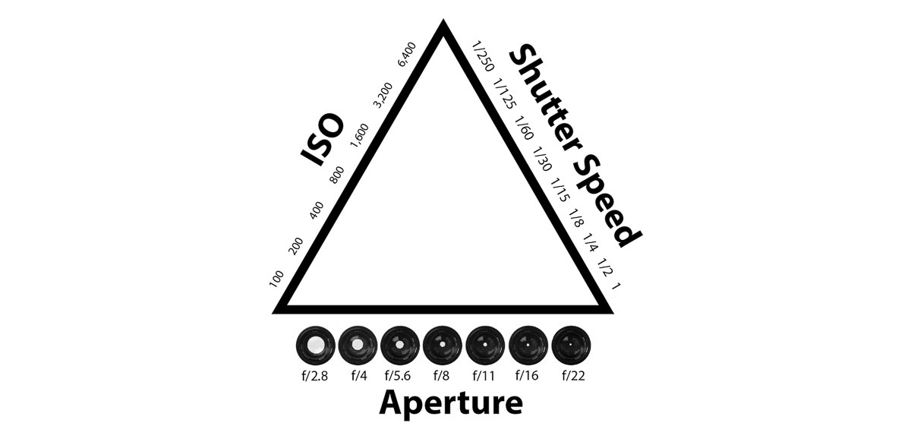

# Why Is Image Stabilization Measured in "Stops"?  
**Sony Alpha 1 Mark II: 8.5 Stops Built-In IS**

I'm thinking about upgrading one of my cameras—the King of mirrorless, the Sony Alpha 1, from Mark I to Mark II. But is the Mark II worth the upgrade? It depends on how much you value some of its new features over the Mark I.

The Mark II offers a much more flexible LCD screen that can tilt, swivel, and twist in almost any direction. Then there's the 8.5 stops of built-in image stabilization, a significant jump from the 5.5 stops in the Mark I. If you're not a professional photographer or videographer, the Mark I itself might already be more than enough. Frankly, even for many pros, the Mark II could be overkill. 

But I'm one of those nerds who loves getting hands-on with every new gadget. So, naturally, here I am, dissecting what "8.5 stops of image stabilization" really means. Let’s break it down.

---

## What Does "Stops" Mean?  

Context matters in any language and any field. A word or phrase can have completely different meanings depending on where, when, and how it's used. This fundamental principle of communication applies universally, from casual conversation to technical discussions.

The term "stop" here refers to the doubling or halving of the light reaching the camera's sensor, adjusted through shutter speed, aperture, or ISO settings. This originates from the early days of photography when apertures were controlled by physical stops—metal plates with holes of different sizes that regulated light. Even as technology evolved, "stop" remained part of the photography vocabulary to describe standardized increments of exposure adjustments. 

When it comes to image stabilization, "stops" quantify how effectively the system allows for slower shutter speeds while keeping images sharp. Essentially, stabilization helps counteract motion blur caused by camera shake, especially in low-light conditions where slower shutter speeds are necessary.  

---

## How Image Stabilization in Stops Works  

Each stop of stabilization doubles the amount of time you can hold the camera steady without introducing motion blur. For instance:  

- If you’re shooting handheld and the minimum sharp shutter speed is 1/100th of a second, a 4-stop stabilization system lets you shoot at approximately 1/6th of a second (1/100 → 1/50 → 1/25 → 1/12 → 1/6) while maintaining sharpness.  

Now, consider the Sony Alpha 1 Mark II’s 8.5 stops. Starting from the same minimum sharp shutter speed of 1/100th of a second:  

- An 8.5-stop stabilization system would theoretically allow you to shoot at about 4 seconds (1/100 → 1/50 → 1/25 → 1/12 → 1/6 → 1/3 → 1/1.5 → 2 → 4).  

This means that, theoretically, I could hold this camera steady for 4 seconds without introducing motion blur or capturing shaky, blurry images. For comparison, try taking a 4-second handheld exposure with a modern smartphone camera - the result would likely be so blurry that you'd want to delete it immediately. Four seconds of perfectly stable handheld shooting is remarkably long, showcasing just how advanced this stabilization system is.

This incredible leap means that even in low-light scenarios, such as a dimly lit interior or a nighttime street scene, you could capture sharp handheld images without resorting to a tripod. However, practical performance might be slightly lower due to factors like focal length and shooting technique.

High-end cameras, like the Sony Alpha 1 series, allow fine-tuned shutter speed adjustments in increments smaller than a stop. For example, the default shutter speed adjustment on the Alpha 1 is 1/3 stop, meaning you turn the shutter speed dial three times to move by one full stop. You can also switch this to 1/2 stop increments if you prefer.

## Why Image Stabilization Stops Matter  

Imagine shooting outdoors on a bright sunny day. You’ll have plenty of light to use fast shutter speeds, so stabilization won’t be much of a concern. But as the sun sets, you need to use slower shutter speeds to let in more light. Slower shutter speeds, however, increase the risk of motion blur from camera shake. This is where stabilization shines—it lets you compensate for the slower shutter speed without sacrificing sharpness.  

It all boils down to managing the **exposure triangle**:  

1. **Aperture**: Determines how much light enters through the lens. A wider aperture (low f-number like f/1.8) lets in more light but decreases depth of field.  
2. **Shutter Speed**: Controls how long the sensor is exposed to light. Longer exposure captures more light but increases motion blur.  
3. **ISO**: Adjusts the sensor's sensitivity to light. Higher ISO settings brighten images in low light but can introduce noise.

Drawing a parallel to human vision, aperture is like adjusting your pupil size, shutter speed is comparable to how long you keep your eyes open to observe something, and ISO is similar to how your eyes naturally become more sensitive in darker conditions. This biological adaptation is remarkably similar to how a camera processes light.

Think of blinking your eyes - a quick blink is like a fast shutter speed, capturing a brief moment in time. The faster you blink, the more motion you can freeze, just like how a fast shutter speed freezes action in a photo.

Stabilization interacts primarily with shutter speed. The better your stabilization, the slower your shutter speed can go without introducing blur.

---

## Practical Effects and Artistic Controls  

Why not just shoot in auto mode and let the camera figure this out? While auto works for many situations, manual control is crucial for achieving specific effects:  

- **Bokeh**: A wide aperture (low f-number) blurs the background beautifully for portraits.  
- **Motion Blur**: A slow shutter speed captures smooth, artistic trails, like silky waterfalls or car light streaks at night.  
- **Slow Motion Video**: Requires a fast shutter speed to ensure each frame is crisp, even when played back in slow motion.  

Even semi-automatic modes like Program mode, which adjusts the exposure triangle dynamically, often can’t deliver these effects precisely.

---

## Image Stabilization in the Sony Alpha 1 Mark II  

Now back to the Sony Alpha 1 Mark II’s 8.5 stops of in-body stabilization. This upgrade means you can theoretically shoot handheld at slower shutter speeds than ever before without introducing motion blur. Compared to the Mark I’s 5.5 stops, the Mark II provides significantly more flexibility, especially for low-light or telephoto shots.

Keep in mind that actual stabilization performance depends on several factors, such as:  

- **Focal Length**: Longer lenses magnify even small movements, making stabilization more critical.  
- **Shooting Technique**: Proper grip and steady hands improve stabilization effectiveness.  
- **Environmental Conditions**: Wind, unstable surfaces, or even caffeine jitters can challenge stabilization.

The 8.5 stops rating serves as a guideline, not a guarantee. When all else fails, using a tripod or gimbal remains the gold standard for maximum stability.

---

## Should You Upgrade?  

If you frequently shoot handheld in challenging conditions or value the enhanced stabilization and flexibility of the Mark II’s LCD screen, it’s a worthwhile upgrade. Otherwise, the Mark I still delivers exceptional performance.

For me, the allure of cutting-edge gear might just seal the deal. But remember: tools are only as good as the hands that wield them. Whether you’re upgrading or sticking with what you have, understanding concepts like stops and the exposure triangle can help you unlock your full creative potential.

In my experience, many of the technical specifications beyond core features have minimal impact on real-world photography and videography. The Mark I remains more than capable for most photographers' needs. While the Mark II boasts improvements in autofocus and AI-powered object detection, the Mark I's capabilities in these areas are already exceptional for typical shooting scenarios. These incremental upgrades, while impressive on paper, may not translate to meaningful improvements in your actual photography.

However, I would still consider upgrading to the Mark II specifically for its articulating screen and impressive 8.5 stops of stabilization - features that offer tangible benefits in practical shooting situations.

Let's be honest - in most day-to-day shooting scenarios, I likely wouldn't notice significant differences between the two cameras. I might even grab either one from my gear bag without checking which model it is, and be perfectly happy with the results. While the technical improvements are real, this realistic assessment acknowledges that both cameras are highly capable tools that can produce excellent images in skilled hands.

Unless you plan to sell your Mark I or are a new Mark II user, keep it real and stick with what you have. The Mark I remains an excellent camera.

As for me, I never sell my gear, which means I'll likely end up with both models. While this creates a small risk of mixing them up, having both cameras gives me flexibility and redundancy in my workflow.