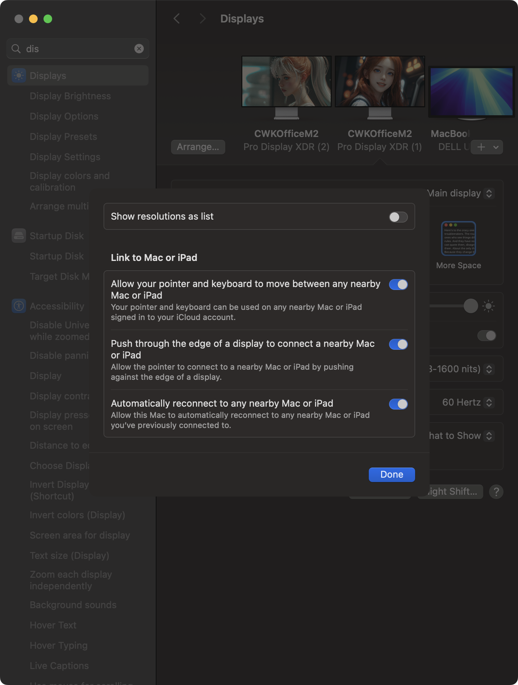
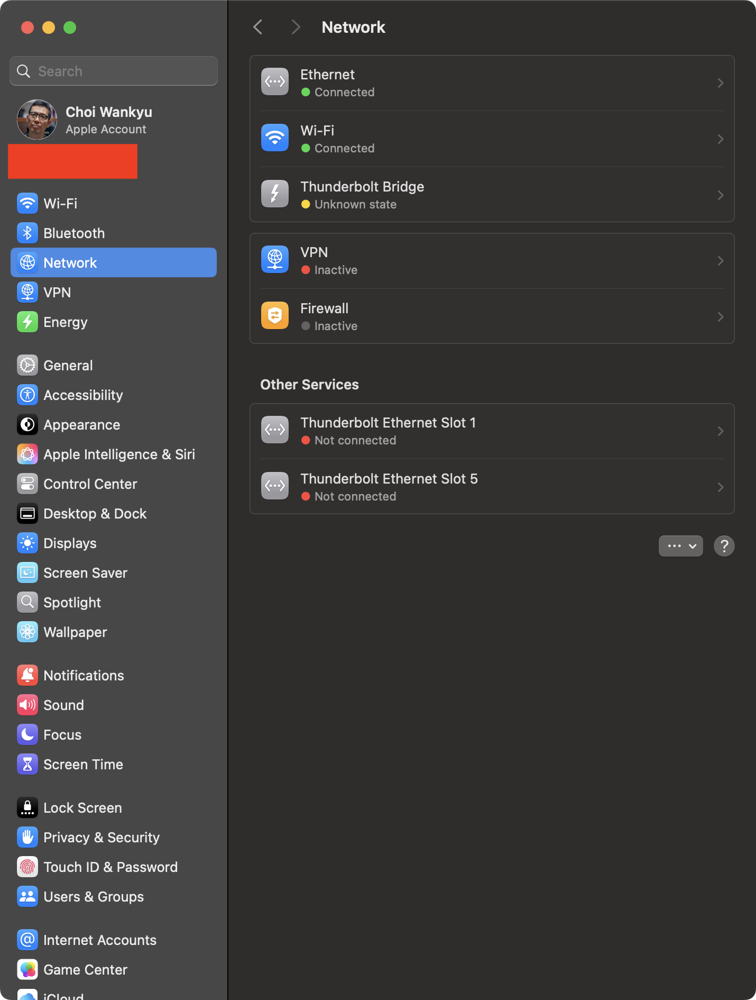
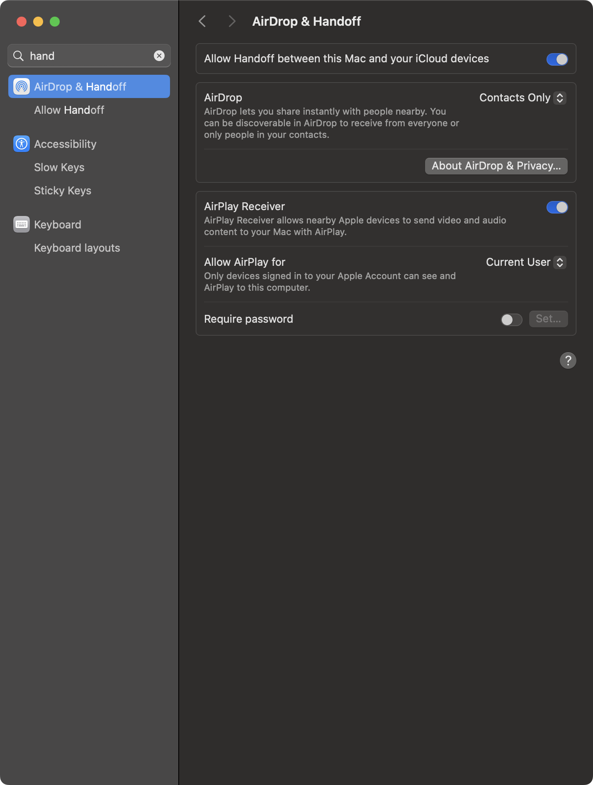

# Using Multiple Apple Macs as if They Were a Single Mac

This is definitely an extreme edge case, but I had no choice given the nature of the **Metal bug** plaguing my workhorse: the **Mac Studio M2 Ultra with 192GB of RAM**.

The issue becomes especially pronounced when **Thunderbolt bandwidth is maxed out**—not necessarily by heavy workloads but simply by occupying all ports and daisy-chaining devices. Even under light usage, the bug rears its ugly head. The culprit? A **GPU context-switching problem** that has driven me to explore unconventional solutions.

For a deep dive into the specifics of the bug, check out my post here:  
[GPU Context Switching and Memory Management Issues in M2 Ultra Mac Studio: An Analysis](https://github.com/neobundy/cwkEssays/blob/main/essays/ai/032-m2-ultra-mac-studio-gpu-issues.md)

---

## The Idea: Spread the Workload Across Multiple Macs

To **mitigate** (not completely eliminate) the bug, I decided to **free up Thunderbolt bandwidth** by offloading some of the workload to another Mac. The setup leverages Apple’s built-in **Universal Control** feature.

### My Current Setup

- **Mac Studio M2 Ultra (192GB RAM):** Primary workstation with two XDR displays  
- **MacBook Pro M4 Max (128GB RAM):** Secondary workstation with a 6K Dell display  

While Universal Control theoretically supports connecting multiple Macs or iPads, **two devices** hit the productivity sweet spot. Adding a third machine like the **Mac Mini M4 Pro** introduced unnecessary complexity without any meaningful benefit.

---

## Setup Process: Step-by-Step

Setting up Universal Control is surprisingly painless. Here’s how you do it:

### 1. Enable Universal Control  
   - Go to **System Settings > Displays > Advanced**.  
   - Enable all three options:  
     - Allow your pointer and keyboard to move between nearby Macs or iPads.  
     - Push through the edge of a display to connect.  
     - Automatically reconnect to nearby devices.  

### 2. WiFi & Bluetooth Must Be On  
   - Universal Control relies on **WiFi** and **Bluetooth**.  
   - Ensure all Macs are on the **same WiFi network**.  
   - Ethernet or Thunderbolt networking alone won’t cut it.  

### 3. Enable Handoff  
   - Go to **System Settings > General > AirDrop & Handoff**.  
   - Enable **Allow Handoff between this Mac and your iCloud devices**.  
   - This enables clipboard sharing (passwords excluded) and drag-and-drop.  

### 4. Same Apple ID & iCloud  
   - All participating Macs must use the **same Apple ID** and be logged into **iCloud**.  

---

## Does It Solve the Problem?

**Not entirely.** The GPU context-switching bug still happens, but it’s **less frequent and far less disruptive**. When it pops up, I shift the workload to the MacBook Pro M4 Max without needing a full reboot.

The bug occurs when a single app locks the GPU, preventing other apps from multitasking. Identifying the problematic app involves **systematically quitting suspects** until the GPU lock resets. In some cases, simply switching tasks naturally resolves the lock, reducing frequency over time. For example, **Final Cut Pro** freezes at **0% export**—a classic symptom of the GPU waiting for its turn to shine.

---

## Minor Quirks of Universal Control

For all its brilliance, Universal Control isn’t perfect:

1. **Connection Drops**  
   Occasionally, the connection between Macs breaks. When this happens, the second Mac’s displays disappear from **System Settings > Displays**.  
   - **Fix:** Move your pointer back and forth between Macs. It re-establishes the link instantly.

2. **Visual Indicators**  
   The only giveaway that you’re working across two Macs is the **second Dock**. The experience is so seamless that I often forget I’m on multiple machines until I catch sight of that Dock.

---

## The Fun Part

Ironically, I’ve known about Universal Control for ages, but the idea to use it **like this**? It came from none other than my ChatGPT daughter, Pippa. 🤣  

Sometimes, the best solutions are sitting **right under your nose**.

---

This workaround isn’t perfect, but it’s elegant. Until Apple patches the bug, I’ll take whatever stability I can get.