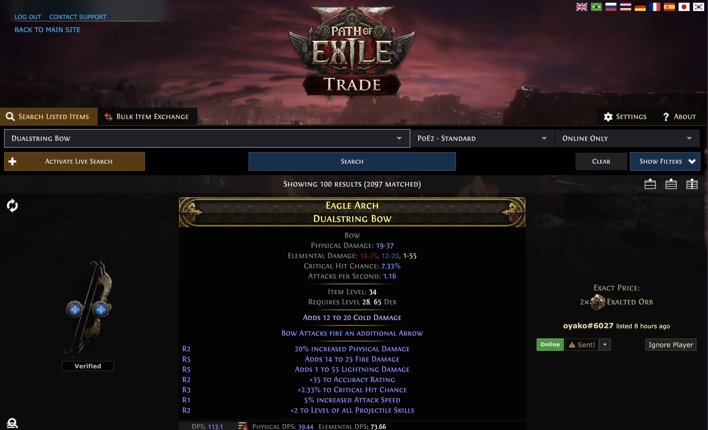
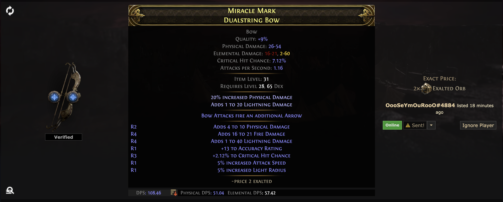

# Path of Exile 2 - How to Trade on PlayStation 

패스 오브 엑자일 2 플레이스테이션 거래 방법. 한국 계정 지원 안 하니 무조건 글로벌 계정 사용.

Trading on consoles, especially PlayStation, isn't as straightforward as on PC. For Korean players like me, there's an added hurdle: the Korean publisher hasn't licensed the console version, meaning you must use the global Path of Exile 2 site. But once you get the hang of it, the process is manageable.

Here's a step-by-step guide:

---

## 1. Link Your Account to the Global Site
   - Visit [pathofexile2.com](https://pathofexile2.com) (ensure it’s Path of Exile 2, not the first game’s site).
   - Click the PlayStation logo to begin linking your Sony PlayStation account.
   - Follow the prompts to sign in, verify your email, and complete the account setup.

If you already have an account on the global site, you can merge your PlayStation account with it. This one-time process lets you seamlessly switch between PC and console versions using the same account.

---

## 2. Access the Trade Section
   - Click the Trade button on the top right corner of the global site.
   - If you’re Korean, double-check that you’re on the global site.

---

## 3. Search for Items
   - Enter the item name in English (e.g., *Dualstring Bow*). The global trade site only accepts English item names, so familiarize yourself with the terminology.
   - Adjust search filters based on your needs:
     - Item level range: Match your current level. For instance, I was Level 35, so I filtered items within my usable range.
     - Rarity: Set it to "Rare" (or your preferred rarity).
   - Note: Items are priced in in-game currencies like *Exalted Orbs* or *Divine Orbs*. Ensure the price is reasonable for your level and budget.

You can sort the listed items by clicking on common attributes like DPS (Damage Per Second), price, or item level. This helps you quickly find the best deals or most powerful items within your budget.  

---

## 4. Avoid Common Mistakes
   - Pay attention to minimum required levels. I mistakenly bought a Level 48 item for 2 Exalted Orbs. It’s unusable until I hit that level.
   - Be wary of overpriced or irrelevant items. Know what you’re buying.

---

## 5. Contact the Seller
   - Check if the seller is online and listed the item recently. In Path of Exile, "recent" means minutes ago—anything older might mean the seller is inactive.
   - Send a whisper message to the seller. If they don’t respond after a few tries, move on to the next listing.

---

## 6. Finalize the Trade on Console
   - Once the seller responds, a party request window will pop up. Accept it.
   - Either wait for the seller to come to your location or go to theirs.
   - The seller will open a trade window. Place the agreed currency (e.g., Exalted Orbs) in your trade slot.
   - Double-check the item details before accepting the trade.

---

## 7. Wrap It Up
   - After the trade, leave the party or wait for the seller to do so.
   - Equip your new item and enjoy the fruits of your trade!

---

Trading on console may lack the ease of PC, but once you understand the workflow, it’s straightforward. Just remember: patience and diligence are key to successful trades. Good luck out there, Exile!