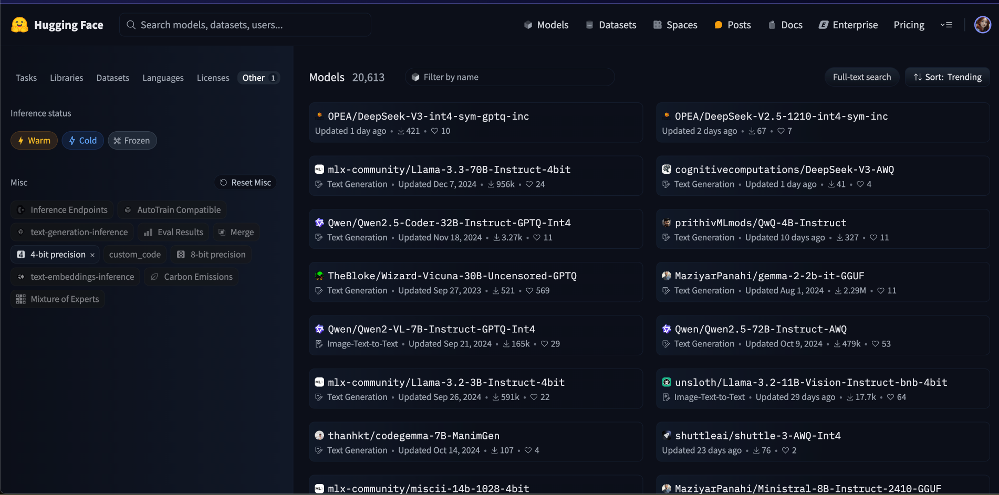
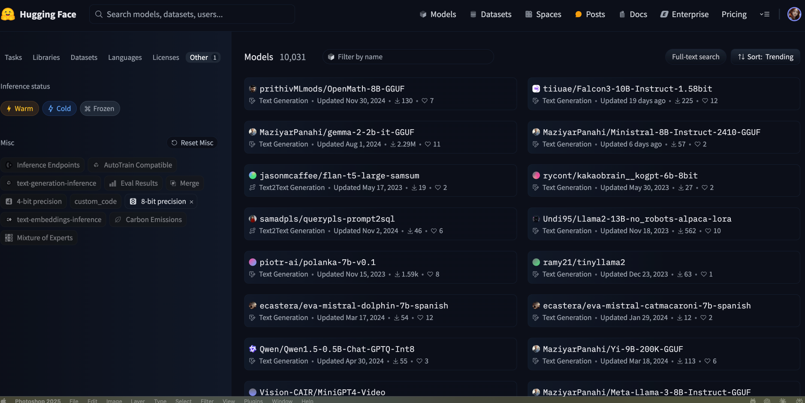

# Understanding Bit-Precision Formats in AI and Computing

Whether you’re delving into AI model optimization or browsing repositories on HuggingFace, you’re bound to see references to different numerical precisions—4-bit, 8-bit, BF16. It can feel like flipping through a cookbook where measurements come in cups, grams, and “a pinch of this.” Just as saying *“I’m going on a trip”* doesn’t explain whether you’re driving to the store or trekking through Antarctica, simply labeling something “4-bit” or “8-bit” only scratches the surface.

Major AI labs and hardware manufacturers emphasize the importance of these formats for efficient model performance. Let’s explore what the AI community has uncovered about bit-precision.

---

## The Bit Width Story: More Than Meets the Eye
A common misconception is that *bit width* simply refers to how many bits you use, as if it’s just the number of ingredients in a recipe. In reality, papers and implementation guides show there’s far more nuance involved.

**1. Same Number, Different Flavors**  
When documentation mentions 4 bits, it’s like saying you’re using “flour.” But *which* flour?

- **INT4**: The all-purpose flour—straightforward and widely used  
- **FP4**: A specialty flour—same size bag, but with different properties

For 8 bits, the industry has other variants:
- **INT8**: A dependable standard, supported by many frameworks  
- **FP8**: A budding approach showcased in cutting-edge research  
- **Custom formats**: Proprietary solutions from various R&D teams

**2. The Art of Balance**  
Floating-point formats come in different “recipes,” each with unique trade-offs:

- **FP16**: Composed of 1 sign bit, 5 exponent bits, and 10 mantissa bits—a widely used standard  
- **BF16**: Trades some mantissa precision for a wider exponent range  
- **FP4**: A lean format that captures core numerical essentials

In floating-point math, each component acts like a piece of a number’s “DNA”:
- **Sign**: The simplest part—positive (0) or negative (1).  
- **Exponent**: The *zoom* or *scale* factor, allowing for tiny decimals (0.000001) or huge values (1,000,000).  
- **Mantissa**: The “fingerprint” of the number—where more bits mean more precision.

Don't worry if these technical details feel overwhelming - you can still use these formats effectively without diving into the nitty-gritty. Most modern AI frameworks handle the complexity for you, letting you focus on your actual work.

Think of these formats like vehicles in your garage - each one's built for a specific purpose. Just like you wouldn't use a sports car to move furniture or a pickup truck for your daily city commute, different bit-precision formats excel in different scenarios. The key is matching the format to your needs, whether that's blazing speed, memory efficiency, or maintaining high precision. And just like how hybrid cars balance power with fuel economy, some formats strike a sweet spot between competing demands.

---

## Real-World Applications in Precision

**1. Documentation Patterns**  
You’ll often see notes such as:
- “4-bit quantization supported” (though the exact format may vary)  
- “8-bit optimization available” (could mean INT8, FP8, or another variant)  
- “16-bit precision support” (could be FP16 or BF16)

**2. Hardware Considerations**  
Different hardware platforms shine with different formats:

- NVIDIA GPUs often favor BF16 because their Tensor Cores are specifically designed to accelerate mixed-precision operations. The choice of BF16 is particularly clever here - it maintains the same exponent range as FP32 while reducing precision in the mantissa, which works well for neural network training where gradient scales matter more than ultra-fine precision.

- Apple Silicon has specialized optimizations for certain formats through its Neural Engine and AMX (Apple Matrix coprocessor) blocks. These hardware units are designed to efficiently handle various precisions, but they're particularly optimized for 16-bit operations in machine learning tasks. The exact implementation details vary across different Apple chip generations.

- Edge devices usually run INT8 more efficiently because their hardware is optimized for integer math, and INT8 operations consume less power while providing sufficient accuracy for most inference tasks. Mobile processors, in particular, often include dedicated INT8 acceleration units.

**3. Performance Characteristics**  
Benchmarks and research reveal:
- BF16 cuts memory usage roughly in half compared to FP32  
- INT8 can achieve about a 4× size reduction and 3× speed boost  
- 4-bit formats come with intriguing trade-offs:
  - **INT4**: Excellent for weight storage in large models (e.g., GPT-Q 4-bit quantization), capturing patterns in weights effectively.  
  - **FP4**: Offers a broader numeric range, making it great for activation values that need more dynamic flexibility.  

Which 4-bit format you choose depends on your performance requirements—**FP4** shines with a wider numerical range, while **INT4** fits use cases that can tolerate fixed-range precision.

---

## Making Informed Choices

**For Training**  
- **FP32** remains the gold standard for accuracy  
- **BF16** is widely used on newer hardware for a strong balance of range and precision  
- Lower precision (e.g., FP16, INT8) might work but needs thorough validation

**For Inference**  
- **INT8** is a reliable standard for most practical scenarios  
- **4-bit formats** are emerging but require careful testing  
- **FP16/BF16** still play a role in tasks with tight precision demands

**Future Developments**  
- **FP8** is making waves in recent research  
- Experimental formats need time and testing before hitting production  
- Keeping fallback options—like switching back to FP16 or BF16—is generally wise

---

## A Note on Naming Conventions

In the AI/ML production space, there's an important unwritten convention:
- When you see just a number (4-bit, 8-bit) without a prefix, it typically means INTEGER precision (INT4, INT8)
- Floating point formats are explicitly marked with prefixes (FP16, BF16, FP8, FP4)

This convention is widely followed across model hubs, documentation, and tooling, making it easier to identify quantization formats at a glance.

---

## HuggingFace - Filtering by bit-precision 

When browsing quantized models on HuggingFace, you might notice that the "4-bit precision" filter doesn't specify whether models use INT4 or FP4. Here's how to identify the quantization format:

1. **Look for Keywords in Model Names**:
   - Models with "GPTQ" or "GGUF" in their names use INT4 quantization
   - "AWQ" also indicates INT4, but uses a different quantization method
   - "Instruct-4bit" typically means INT4

2. **Check Model Card Dependencies**:
   - If the model uses libraries like `auto-gptq`, `llama.cpp`, or `bitsandbytes`, it's using INT4
   - These are the most common quantization tools in production models

Note that FP4 is still relatively rare in production models and is more commonly seen in research papers and experimental implementations. Most 4-bit models you'll encounter on HuggingFace are using INT4 quantization.

Similar patterns emerge with 8-bit models. The quantization format can be identified by:

1. **Model Name Indicators**:
   - "GPTQ-Int8" explicitly indicates INT8 quantization
   - "8bit" or "-8B-" in GGUF models typically means INT8
   - Models using `bitsandbytes` default to INT8

2. **Common Use Cases**:
   - INT8 dominates the 8-bit space due to its robust hardware support
   - FP8 implementations are still primarily in research, similar to FP4
   - Most consumer GPUs and NPUs have optimized INT8 paths

---

## For Non-Technical Readers: It's All Around Us!

Think about how we handle precision in everyday life:

1. **Photography**:
   - Your phone's "RAW" photos are huge (20-40MB)
   - Regular JPEGs are much smaller (2-4MB)
   - Can you spot the difference? Usually not!

2. **Streaming Video**:
   - Blu-ray movies are massive (40GB+)
   - Netflix 4K streams use way less data
   - Yet both look fantastic on your TV

3. **Music**:
   - Studio recordings: Super high-quality (192kHz/24-bit)
   - Your streaming service: Standard quality (44.1kHz/16-bit)
   - Both sound great because 44.1kHz already exceeds what human ears can detect

4. **AI Models Follow the Same Logic**:
   - Full precision: Like having a professional camera
   - Reduced precision (4-bit, 8-bit): Like having a really good phone camera
   - For most uses, the difference is hardly noticeable

It's like buying a car - you don't need a Formula 1 racer to get groceries. A regular car works perfectly fine and is much more practical. The same goes for AI models - we don't always need the highest precision to get great results.

---

## If you're still confused...

Still debating about FP4 vs FP32? Let's make it simple:

- 32-bit (FP32) π = 3.14159265359...
- 16-bit (FP16) π ≈ 3.1416
- 8-bit (FP8)  π ≈ 3.14
- 4-bit (FP4)  π ≈ 3.1

For most real-world uses, which one do you actually need? If you're baking a pie, even "about 3" would work fine. If you're building a rocket, you might want every decimal place you can get. AI models are the same - you pick the precision that matches your needs.

---

## The Bottom Line

Let's break this down into practical terms:

Imagine you have two rulers, both 8 inches long (like our 8-bit formats):
- One ruler (INT8) is divided into 256 equal parts, perfect for measuring things within that fixed range
- The other ruler (FP8) can "zoom" in and out, trading precision for range when needed

This is why:
- INT8 is great for tasks like image processing, where pixel values fit nicely in a fixed range (0-255)
- FP8 works better for tasks like training, where numbers can be very large or very small

Research from major AI labs points to three fundamental principles:

1. **Numbers Don't Tell the Whole Story**
   - Example: A 4-bit model isn't automatically worse than an 8-bit one
   - Some 4-bit models can match 8-bit performance by being smarter about which bits matter

2. **Match the Tool to the Task**
   - For training: Higher precision (FP32, BF16) usually works better
   - For deployment: Lower precision (INT8, INT4) often suffices
   - For specialized tasks: Mixed approaches might be optimal

3. **Mix and Match When Needed**
   - Modern models often use different precisions for different parts:
     * Weights might use INT4
     * Activations might need FP8
     * Critical layers might keep FP16

The field keeps evolving, but these principles help navigate the growing number of options in numerical precision.

One final thought: The joy of working in AI and computing is that there's always something new to discover. Every time I dive deeper into these topics, I find fascinating nuances I hadn't noticed before. It's like having an endless puzzle that keeps revealing new pieces - and that's what makes this field so exciting. Stay curious, keep exploring, and enjoy the journey of continuous learning!
