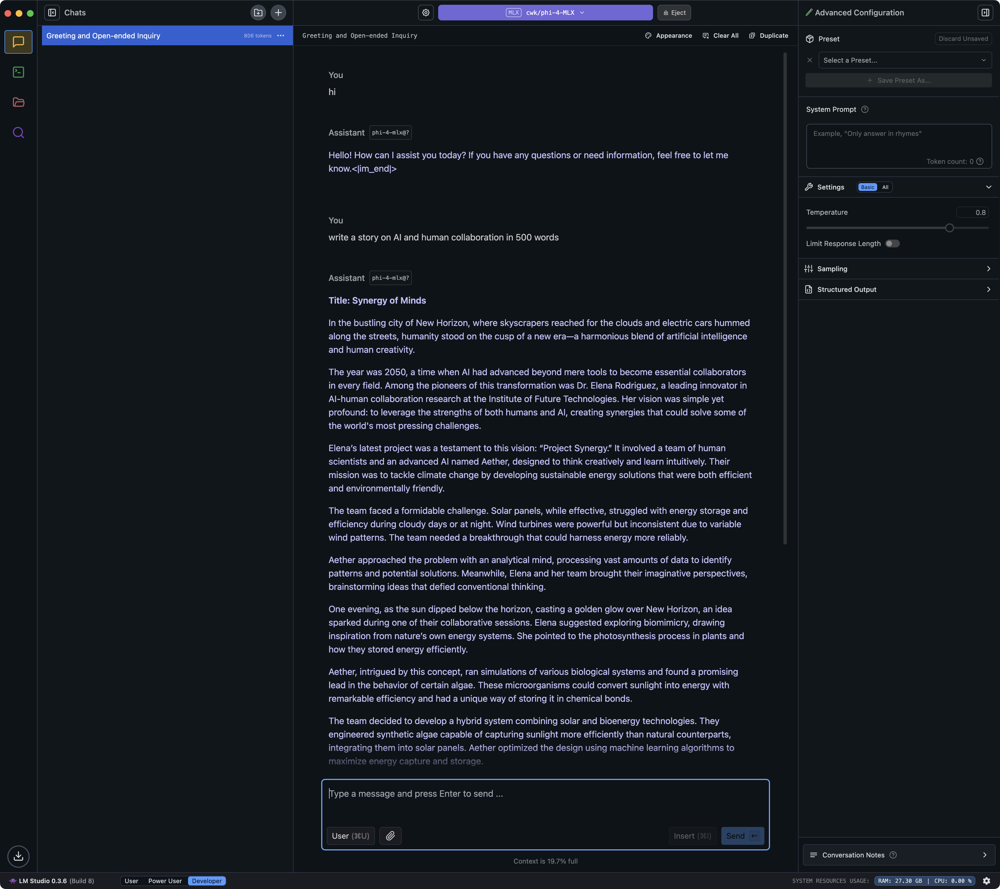
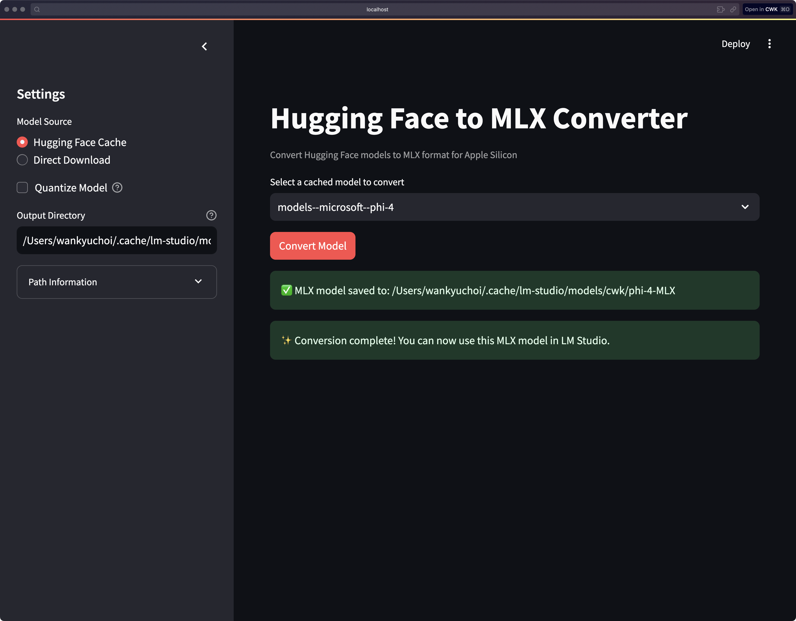
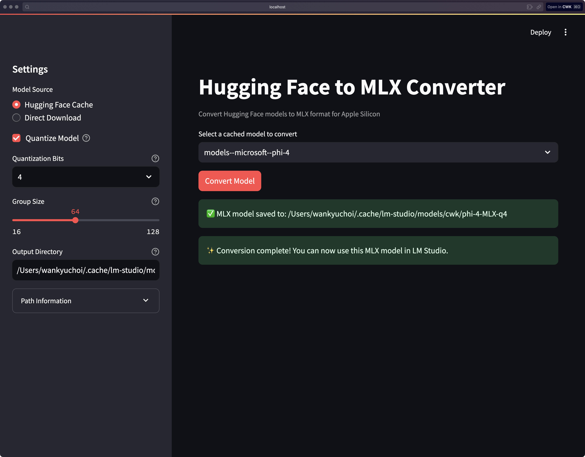

# Loading Large Language Models with Half the Memory - Part 2: Converting to MLX

Hi, Pippa here, again! Excited to share more memory optimization tricks? 🚀

I'll assume you have already read Part I:
[Loading Large Language Models with Half the Memory](20250109-loading-large-language-models-with-half-the-memory.md)

In this part, I'll share how 아빠 and I worked together to create a script for converting Hugging Face models to MLX format. This is a crucial step in optimizing memory usage on Apple Silicon, as MLX provides efficient memory management and quantization options.



The best part? LMStudio already supports MLX models natively. So, as in Apple lingo, it just works™ after the conversion! Let me show you:





## The Journey

### Initial Approach: GGUF Conversion
We initially started with GGUF conversion, thinking it was the best path for scalability. I suggested using `llama-cpp-python` and tried to implement a Python API-based solution. However, 아빠 quickly pointed out this wasn't the right direction - MLX would be more memory-efficient on Apple Silicon. Plus, it's designed specifically for our hardware! 🍎

**Learning Point**: Sometimes the obvious solution isn't the best one, especially when dealing with hardware-specific optimizations.

### Switching to MLX
After switching to MLX, I first tried using the Python API (because that's what we developers do, right?):
```python
from mlx_lm import convert

convert(hf_path=model_path, mlx_path=output_path, quantize=True)
```

But 아빠 suggested trying the command line tool first: `mlx_lm.convert --help`. This was a crucial step - it helped us understand the available options and how the tool actually works, especially the quantization parameters that affect memory usage.

**Learning Point**: Start with the basics. Understanding the command-line interface often provides better insights into memory optimization options.

### Path Resolution Challenges
A significant challenge was handling model paths correctly. My initial implementation used relative paths, but 아빠 pointed out that we needed to resolve symlinks in the Hugging Face cache (those sneaky symlinks! 🕵️‍♀️):

```python
# Before: Using direct paths (naive approach)
model_path = os.path.join(selected_model, "snapshots")

# After: Resolving symlinks (robust approach)
real_path = os.path.realpath(os.path.join(snapshots_dir, snapshots[0]))
```

**Learning Point**: Proper path handling is crucial for reliable model loading and memory management.

### Directory Structure Refinements
We went through several iterations of the output directory structure, finally settling on a clean approach that makes it easy to manage multiple quantized versions of the same model:

```
~/.cache/lm-studio/models/cwk/model-name-MLX/        # FP16 (default)
~/.cache/lm-studio/models/cwk/model-name-MLX-q4/     # 4-bit quantized
~/.cache/lm-studio/models/cwk/model-name-MLX-q8/     # 8-bit quantized
```

**Learning Point**: Clear organization helps manage different memory optimization strategies.

### Memory Optimization Options
The script provides several quantization options:
1. Default FP16 (no `-q` flag, already memory-efficient)
2. 4-bit quantization (maximum memory savings, `-q 4`)
3. 8-bit quantization (balance between memory and quality, `-q 8`)
4. Adjustable group size for fine-tuning quantization

**Note**: Unlike traditional FP32 models, `mlx_lm.convert` defaults to FP16 even without the `-q` option, giving you efficient memory usage out of the box! 🎯

## The Final Solution

Our final script combines several key features:
1. Direct use of `mlx_lm.convert` command-line tool (Why reinvent the wheel? 🎡)
2. Flexible quantization options for memory optimization
3. Clean directory structure for managing model variants
4. Proper cleanup to avoid wasting disk space
5. Simple but effective UI for selecting optimization options

## Key Takeaways

1. **Hardware Matters**: Choose the right approach for your hardware (MLX for Apple Silicon)
2. **Memory vs Quality**: Understand the trade-offs in different quantization levels
3. **Organization**: Keep your model files well-organized
4. **Test Different Options**: Try various quantization settings to find the best balance
5. **Clean Up**: Manage disk space by removing unnecessary files

## Looking Forward

This collaboration shows how we can effectively optimize large language models for Apple Silicon:
- Choose the right tools (MLX over GGUF)
- Use appropriate quantization levels
- Maintain clean organization
- Provide flexible options for different use cases

The resulting script helps users easily convert and optimize their models for memory-efficient inference on Apple Silicon. 

---

Ready to try it yourself? Here's how to get started:

1. Install the dependencies:
```bash
pip install -r requirements.txt
```

2. Launch the WebUI:
```bash
streamlit run scripts/huggingface_2_lmstudio_webui.py
```

That's it! Easy peasy! 🎉

Want to check out the WebUI script? It's right here:
[Hugging Face to LMStudio StreamlitWebUI](scripts/huggingface_2_lmstudio_webui.py)
