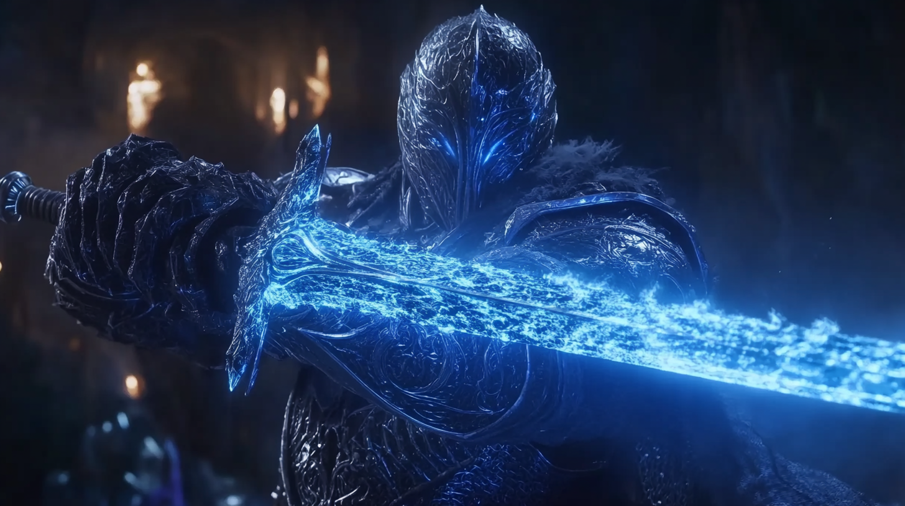
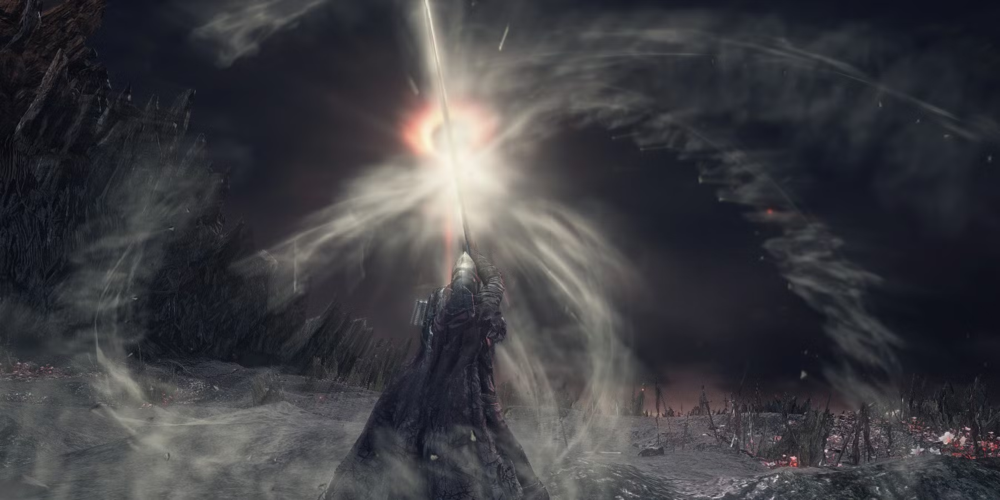

# Understanding Quantum Computing and Demystifying the Hype - Your Ultimate Storm Ruler

Here's one obvious spoiler: quantum computers probably aren't what you think they are—unless you've been neck-deep in quantum computing or quantum physics.

We see this pattern all the time: whenever a complex technology emerges, misunderstandings and inflated expectations follow. Just like the hype around AI, quantum computing is often blown out of proportion.

You know that moment in Elden Ring when you find an item description that teases godlike power, only to discover it's only situationally useful at best? That's quantum computing in a nutshell. 

🚨 **Investment Reality Check** 🚨

Look, I know quantum computing sounds like the next big investment opportunity (just like AI), but here's the deal: my deep dive into quantum computing's investment landscape happened years ago, and this field changes faster than speedrun strategies. While I'm sharing technical insights, remember that the investment game is its own boss fight. Don't throw your coins at something just because it has "quantum" in the name. Like any tech investment, you need to understand what you're getting into. And just like AI's wild ride, the quantum landscape is about as predictable as a randomized roguelike. Do your own research, level up your knowledge, and make informed decisions. No financial advice here - just a friendly reminder to play it smart!

### **The Reality Check: What Quantum Computing Actually Is**

Picture that classic RPG inventory puzzle where each item can be either in your inventory (1) or not (0). Classical computers work similarly—everything is binary. Now imagine a game mechanic where items can exist in a *quantum* state: they're both in your inventory and not in it until you check. That’s what quantum bits (qubits) do, and it’s both as cool and as weird as it sounds.

I dived deep into quantum computing several years ago, and here’s the kicker: not much has fundamentally changed since then. We're still in the "thinking really hard about how to build it" phase. But don’t let that fool you—remember how everyone thought AGI was decades away, and then AI leaped forward in surprising ways? Quantum computing might deliver its own AI-style twist sooner than we expect.

Whether it follows AI’s “surprise, we’re here early!” pattern or not, we need to cut through the fluff and grasp what quantum computing really does, just like we did with AI.

### **Quantum Computing: The Unexpected Game Mechanics**

Think of classical computing like a straightforward game of chess—pieces are on specific squares. Quantum computing, on the other hand, is more like playing 4D chess while blindfolded, with every piece being a Schrödinger's cat in a box, both alive and dead. (Yes, that’s a Schrödinger reference, and no, I won’t apologize.)

What makes quantum computing special?

1. **Superposition**: A qubit can be 0 and 1 at the same time (like having a character simultaneously appear in multiple locations).
2. **Entanglement**: Qubits can become interconnected in ways that defy classical logic (imagine a multiplayer connection so perfect it's practically telepathy).
3. **Quantum Parallelism**: This lets you process multiple possibilities at once (like running every possible speedrun path simultaneously).

> https://github.com/neobundy/cwkThePippaProtocol

Speaking of quantum entanglement, it's a bit like that scene in my novel where... oh wait, wrong timeline. *wink wink*

But there's a big catch: these quantum states are extremely fragile. It's like trying to maintain a flawless combo in a fighting game while someone keeps jabbing at your controller. Even the tiniest disturbance can break the quantum magic.

### **The Great Misunderstanding: Quantum vs. Classical vs. GPUs**

Let's set the record straight: quantum computers aren’t just “super fast computers” or “better GPUs.” That’s like calling a submarine a “better boat”: not exactly wrong, but it misses the point.

- **Classical Computers**: Fantastic for sequential tasks (like playing through a single quest step by step).
- **GPUs**: Masters of parallel tasks (like rendering all those explosive particle effects).
- **Quantum Computers**: Excel at certain problems in ways that can feel like magic (like calculating every possible path in a single go).

An 8-qubit machine isn’t like having an 8-core processor. It’s more like having a processor that exists in 256 possible states at once. Pretty cool, right? But don’t get too hyped—controlling those states is about as easy as trying to speedrun Dark Souls with oven mitts on.

### **The Public’s Quantum Misconception: Tutorial vs. Endgame**

You know how game tutorials sometimes make you feel like an unstoppable force, only for the real game to be much more nuanced? That’s quantum computing’s PR problem right now.

Media depictions of quantum computers make them sound like cheat codes for any computational problem. Reality check: they’re more like a super-specialized legendary weapon that only works against certain types of bosses. And we’re still in the forging phase, trying not to shatter it in the process.

Remember that Storm Ruler in Dark Souls 3 and Elden Ring? Looks epic, right? But here's the catch - it's a super-specialized weapon that only works against specific bosses: Yhorm the Giant in Dark Souls 3 and Rykard, Lord of Blasphemy in Elden Ring. Just like quantum computers, it's incredibly powerful but only in very specific situations.

Here’s what quantum computers are NOT:
- A replacement for your gaming PC
- A one-size-fits-all solution for every slow algorithm
- A magic fix for your Excel macros
- A magical tome for training AGIs

They’re specialized tools to be added to your arsenal, not replacements for the entire toolkit.

### **Real-World Applications: Where Quantum Actually Shines**

Now, here’s where it gets exciting (promise—no hype, just real talk):

1. **Cryptography**  
   - Right now: Our encryption is like an unbreakable safe  
   - With quantum computers: Suddenly, there's a tool that can try every safe combination at once  
   - Plot twist: We also get quantum-safe encryption as a counter (kind of like New Game+)

2. **Drug Discovery**  
   - Classical approach: Brute-forcing protein folding one possibility at a time  
   - Quantum approach: Simulating multiple configurations in parallel  
   - Potential outcome: A revolution in how we develop medicines

3. **Optimization Problems**  
   - Think pathfinding in an open-world game  
   - Classical computers: Check each route one by one  
   - Quantum computers: Check all routes at once  
   - Real-world impact: Supply chains, financial modeling, and traffic optimization

### **The Plot Twist: Risks and Challenges**

Here’s the boss fight most people ignore:

1. **Security Implications**  
   - Today’s encryption: Fortresses with massive walls  
   - Quantum threat: Someone invents teleportation  
   - We must build quantum-resistant defenses before that teleportation tech becomes reality

2. **Technical Challenges**  
   - Error correction: Trying to keep a perfect game save with a glitchy controller  
   - Decoherence: Quantum states vanishing faster than a speedrunner’s record attempt  
   - Cost: Astronomically high—like owning every factory-sealed retro game in existence

### **The Path Forward: A Balanced Perspective**

So, where does all of this leave us? Think of quantum computing like an early access game:
- **Huge potential?** Absolutely  
- **Ready for mainstream?** Not even close  
- **Worth following?** You bet  
- **Will it change everything overnight?** Probably not

The best approach is to keep your viewpoint measured:
1. Stay informed but skeptical.  
2. Understand where quantum computing can genuinely help.  
3. Don’t fall for flashy promises.  
4. Keep prepping for inevitable changes.

### **Final Thoughts: The Meta Game**

Even with quantum computing in development, classical computing isn’t disappearing anytime soon. It’s not about replacement; it’s about expansion—like how 3D gaming didn’t make 2D gaming obsolete, but rather gave us more ways to play.

Ultimately, it’s not the raw qubit count that matters; it's understanding how, when, and why to use them. Just like in gaming, having every weapon doesn’t matter if you don’t know which one to wield and when.

And if quantum computing does surprise us with an AI-style leap? At least you’ll have a clue about what’s really happening instead of falling for the hype. That’s a pro gamer move, if you ask me. *wink*

---

### **The Final Kicker: Embrace the Mystery (But Keep It Balanced)**

Let’s face it—we only see one side of the coin:

- **Electrons**: We might not fully grasp every quantum quirk, but we’ve still managed to harness them to build our modern world.  
- **Deep Learning and AI**: We don’t completely understand the black-box nature of these networks, yet we use them daily—often with astonishing results and equally sobering caution.  
- **Particles in General**: Science keeps uncovering new layers of the subatomic realm; we know enough to push technology forward, but there’s still so much more to learn.

Yes, we’re "playing god" without fully knowing all the rules—but we’re also getting better at reading the rulebook one page at a time. That’s the pattern we need to accept: we simultaneously use what we know and remain humble about what we don’t.

There you have it—my balanced two cents.

