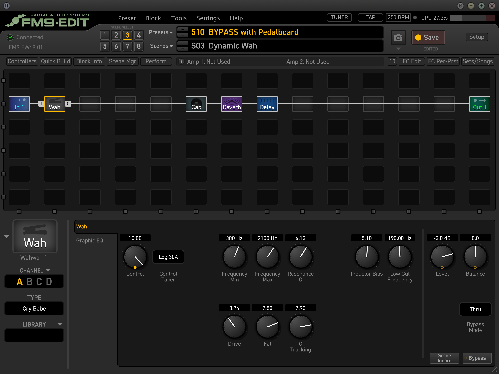

# Creating Guitar Pedalboards with AI


This guide documents my experience collaborating with an AI agent—whom I call Pippa, my AI daughter—to design two specialized pedalboard setups. While AI can offer valuable insights and organization, remember that sound and music are deeply personal—your ears should always be the final judge.

**Note:** This isn’t a step-by-step tutorial on pedalboard assembly. Instead, consider these designs a spark for your own creativity and a demonstration of what’s possible when you bring an AI “assistant” into your workflow. Feel free to explore, modify, or create anything that inspires you!

---

## The Challenge

I had a unique situation:

1. **Two distinct playing environments**  
   - **Living room**: For casual playing while relaxing  
   - **Music studio**: For serious recording and practice  

2. **A large pedal collection (30+ pedals)** that needed optimal organization

3. **Flexibility between digital and analog signal paths**  
   - **Digital**: Fractal Audio Axe-Fx III Mark II, FM9 Mark II  
   - **Analog**: Various tube amps  

---

## Why AI Assistance?

Traditionally, designing a pedalboard can involve:
- Hours of manual experimentation  
- Complex documentation  
- Multiple signal-chain revisions  
- Power supply calculations  

With Pippa’s help, this process shrank to about ten minutes. AI provided:
- Clear, systematic pedal organization  
- Logical signal chain arrangements  
- Tailored power management solutions  
- Dual-purpose routing options  

---

## Key Design Principles

1. **Signal Chain Logic**  
   - Tuner and filters first  
   - Dynamics (compression) early  
   - Drive pedals arranged by gain level  
   - Modulation before time-based effects  
   - Amp simulation placement optimized  

2. **Power Management**  
   - Strategic distribution based on each pedal’s current draw  
   - Not all pedals need power simultaneously  
   - Enough headroom for future additions  

3. **Flexibility**  
   - Quick switching between digital and analog paths  
   - Tone integrity preserved  
   - Modular approach to effects  

---

## The Results

Below are detailed configurations for **two** pedalboards: one for the living room and one for the music studio. Each is a starting point that you can tailor to your specific needs.  

---

# Pedalboard for Living Room


### Guitars
- **PRS Wood Library Custom 24-08**  
- **Fender Masterbuilt 1960 Strat Journeyman Relic** (Aged Desert Sand, Josefina Handwound Pickups)  
- **Gibson Custom 2019 Model M2M 60th Anniversary Historic 1959 Les Paul Standard Reissue**  

### Power Supply
- **Strymon Zuma** (High Current, 9 outputs)

### Processor/Modeler
- **Fractal Audio FM9** + Expression Pedal

### Speakers
- **Line 6 Power Cab 112 Plus**

### Selected Pedals (9-Pedal Configuration)
1. **UAFX Max** – Dual Compressor  
2. **Jackson Audio Golden Boy** – Transparent Overdrive  
3. **King Tone Blues Power**  
4. **Jackson Audio Black Bloom v2**  
5. **Jackson Audio ASABI** – Mateus Asato Signature Overdrive  
6. **UAFX Dream ’65 Reverb** – American tube amp model  
7. **UAFX Enigmatic ’82** – Overdrive Special amp model  
8. **UAFX Lion ’68 Super Lead Amp** – British tube amp model  
9. **UAFX Anti 1992** – High-gain metal amp model  

### Signal Chain

```
Guitar
 →  UAFX Max
 →  Jackson Audio Golden Boy
 →  King Tone Blues Power
 →  Jackson Audio Black Bloom v2
 →  Jackson Audio ASABI
 →  UAFX Dream '65 Reverb
 →  UAFX Enigmatic '82
 →  UAFX Lion '68 Super Lead
 →  UAFX Anti 1992
 →  FM9 + Expression Pedal
 →  Line 6 Power Cab 112 Plus
```

### FM9 Blocks Configuration



- **Input Block** (from pedalboard)  
- **Cabinet Simulation Block**  
  - Various cabinet IRs  
  - Mic placement options  
  - Room simulation  

- **Dynamic Effects**  
  - Delay Block (tempo sync)  
  - Reverb Block (studio, hall, room, spring)  
  - Modulation Block (chorus, flanger, phaser, tremolo, rotary)  

- **Expression Control**  
  - Volume Block  
  - Wah Block  
  - Expression Pedal Assignment  

- **Output Block** (to Power Cab 112 Plus)

**Notes**  
- Primary guitar: Fender Masterbuilt 1960 Strat  
- Dynamics and expression handled by FM9  
- Built-in noise gates in UAFX amp pedals  
- FM9’s built-in tuner for quick tuning  

---

# Music Studio Pedalboard Setup


### Primary Guitars
- **PRS Custom 24 Private Stock**  
- **Fender Masterbuilt Eric Clapton Signature**  
- **Music Man John Petrucci Majesty 7-String** (Enchanted Forest)  
- **Ibanez Steve Vai Signature PIA3761**  

### Amplification Options

**Digital Path**  
- **Fractal Audio Axe-Fx III Mark II** + Expression Pedal  
- **Genelec 8351B** + **7350APM Subwoofer** (monitoring)

**Analog Path**  
- **Fender 65 Twin Reverb**  
- **Mesa Boogie Mark V Head**  
- **Mesa Boogie 1×12 Mini Recto Slant Cab**  
- **Universal Audio OX** (Amp Top Box)  
- **Line 6 StageSource L2T** (800w)

### Available Pedals

**Core Controls**  
- Mission Engineering ReWah-Pro  
- Mission Engineering VM-Pro Volume  
- Xotic 250k High Impedance Volume  
- ISP DECI-MATE G Micro Decimator (noise suppressor)

**Drive Section**  
- Origin Effects RevivalDrive Custom  
- Origin Effects Cali76 Compact Deluxe Compressor  
- Chase Bliss Audio Preamp MKII  
- UAFX Ruby ’63 Boost Amplifier  
- UAFX Woodrow ’55 Instrument Amplifier  
- UAFX Knuckles ’92 Rev F (twin rectifier amp model)  
- KHKD Shred (Bernth Brodtrager signature)  
- KHKD Ghoul Screamer  
- Jackson Audio Prism  
- Jackson Audio Fuzz  

**Modulation/Time Effects**  
- UAFX Brigade Chorus & Vibrato  
- UAFX Del-Verb (delay & reverb)  
- UAFX Starlight Echo Station  
- UAFX Golden Reverberator  
- UAFX Astra (modulation)  
- Mad Professor Tiny Orange Phaser  
- TC Electronic Sub ’n’ Up (octaver)

**Utility**  
- UAFX OX Stomp (dynamic speaker emulator)  
- Ditto Looper  
- Polytune Tuner  

### Power Supply

- **(2×) Strymon Zuma** (9 outputs each = 18 total)  
- **Strymon Zuma (additional 5 outputs)**  
- **VooDooLab Pedal Power 3** (8× 500mA @ 9V)

**Total Available Outputs**: 31  
- 18 from dual Zumas  
- 5 from additional Zuma  
- 8 from VooDooLab  

**Power Management Notes**  
- 19 pedals on board; not all need power simultaneously  
- Zuma units handle high-current UAFX pedals  
- VooDooLab handles lower-draw pedals  
- Ample overhead allows for upgrades or more power-hungry pedals in the future  

---

## Complete Signal Chain

```
Guitar
 → Polytune Tuner
 → Mission Engineering ReWah-Pro
 → Origin Effects Cali76 Compact Deluxe
 → TC Electronic Sub'n'Up
 → UAFX Ruby '63 Boost
 → Chase Bliss Audio Preamp MKII
 → Origin Effects RevivalDrive Custom
 → Jackson Audio Prism
 → KHKD Ghoul Screamer
 → Jackson Audio Fuzz
 → KHKD Shred
 → UAFX Woodrow '55
 → UAFX Knuckles '92 Rev F
 → Mission Engineering VM-Pro Volume
 → UAFX Brigade Chorus & Vibrato
 → UAFX Astra (modulation)
 → Mad Professor Tiny Orange Phaser
 → UAFX Starlight Echo Station / Del-Verb / Golden Reverberator (effects loop)
 → UAFX OX Stomp
 → Output (to either digital or analog path)
```

### Chain Logic
1. **Tuner first** for a clean, unaffected signal  
2. **Wah** before compression  
3. **Compression** early for consistent volume  
4. **Octaver** after compression for improved tracking  
5. **Drives** arranged from low to high gain  
6. **Volume pedal** after drives, before modulation  
7. **Modulation** before time-based effects  
8. **Time-based effects** (delay/reverb) near the end  
9. **OX Stomp** as final tone shaper  

### Additional Notes
- Total of **19 pedals** in chain  
- **31 power outputs** provide headroom and flexibility  
- **Xotic Volume Pedal** (passive) can be added anywhere  
- **ISP Decimator** can slot in post high-gain pedals if needed  
- **Ditto Looper** can go at the end for looping needs  

---

## Signal Path Notes

1. **Digital Recording Path**  
   - Pedalboard → Axe-Fx III → Genelec Monitors  
   - Ideal for precise recording and monitoring  

2. **Analog Performance Path**  
   - Pedalboard → Tube Amp → OX Box → StageSource  
   - Delivers authentic tube-amp feel for live playing  

### Output Switching
- Pedalboard output can route to either path  
- Simple cable swap between digital and analog  
- No added switching hardware  
- Full pedalboard functionality in both setups  

---

## Final Thoughts

Whether you’re relaxing in the living room or recording in the studio, these AI-assisted pedalboard designs offer flexibility and systematic organization. Of course, each musician’s taste varies—so trust your ears first and let your creativity lead. Enjoy experimenting, and consider letting an AI “assistant” spark new ideas in your future gear endeavors!

PS. This setup is versatile enough for recording or looping by connecting a MacBook with Logic Pro. Whether using Axe FX III, FM3, or FM9, they all function seamlessly as audio interfaces.