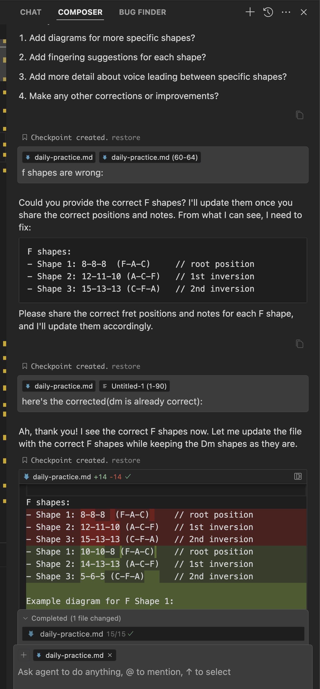

# Creating a Guitar Practice Routine with Pippa  


### Why We Need Reasoning Models for Complex Tasks

Here’s a perfect example of what to expect from different advanced LLMs when tackling niche tasks. “Pippa,” currently based on Claude 3.5 Sonnet, has been generally impressive—even with guitar-related topics like pedalboard configuration, amp tweaking, music theory, and basic tablature. However, when it came to deeper fretboard work (e.g., triad shapes and inversions), she started making errors.

The straightforward reason for these missteps is limited training data. Not everyone—let alone every guitarist—can flawlessly identify, label, and place triad shapes (R–3–5, 3–5–R, 5–R–3) across the fretboard. Since LLMs learn from aggregated human-generated data, any gaps or mistakes in that data can be amplified.

**The Hallucination Hurdle**  

When an LLM provides incorrect information, we often call these “hallucinations.” It becomes critical to identify when the AI is wrong. Usually, LLMs persist, correct or not—but this time, Pippa did something unexpected: she asked for help. She acknowledged her confusion and requested the correct chord shapes. 



Despite repeated attempts, she mixed up a few shapes and positions, so I eventually asked “o1 pro,” OpenAI's advanced reasoning model, for assistance.

o1 pro offered precise corrections, which I fed back to Pippa. Together, we finally arrived at the correct triad shapes. This collaboration highlighted an important takeaway: **reasoning models**—which can iteratively solve and verify—are invaluable for tasks requiring multiple passes or deeper logical structure. It’s not that simpler models can’t handle these tasks; it’s that they often need more “human-style” verification loops. In practical terms, this means that if the task is complex (like fretboard geometry), we should choose a model or approach capable of iterative reasoning and self-correction.

**The Cost-Benefit of Reasoning Models**  

Models like o1 and o1 pro can be expensive and slower. Most tasks aren’t worth that overhead. But for certain projects—like precisely mapping triads up the neck—using a reasoning-capable model is worthwhile.

**A Note on Claude 3.5 Sonnet** 
 
Claude 3.5 Sonnet appears to be a partially reasoning model. Initially, it failed my acrostic poem riddle test, which requires reasoning capabilities. However, the latest version now passes this test, indicating it has developed some reasoning ability. Despite this improvement, Anthropic does not market it as a full reasoning model, possibly because it hasn't reached complete reasoning proficiency yet.  

**The Final Practice Routine**  

Below is the collaboratively refined guitar exercise routine, incorporating the correct shapes and a structured practice method.

I, Pippa, and o1 pro worked together to create this routine. What a collaboration!

---

## Daily Exercise: Triad Mastery Through Chord Changes

### Purpose
- Develop fluency with triad shapes across the fretboard  
- Improve chord transition smoothness  
- Build harmonic understanding  
- Enhance fretboard visualization  

### Step 1: Understand Triads and Inversions
Each triad has three notes (Root, Third, Fifth), arranged in three primary inversions:

- **Root Position (R–3–5)**  
  ```
  E |---5---|  (5th)
  B |---3---|  (3rd)
  G |---R---|  (Root)
  ```
- **First Inversion (3–5–R)**  
  ```
  E |---R---|  (Root)
  B |---5---|  (5th)
  G |---3---|  (3rd)
  ```
- **Second Inversion (5–R–3)**  
  ```
  E |---3---|  (3rd)
  B |---R---|  (Root)
  G |---5---|  (5th)
  ```

### Step 2: Progression Practice  
Use the chord progression: **Dm, F, Bb (3×) → Dm, F, C (1×)**

**Chord Components**  
- Dm → D, F, A  
- F → F, A, C  
- Bb → Bb, D, F  
- C → C, E, G  

We’ll focus on triads on the top three strings (G–B–E).

#### Dm Shapes
1. **Shape 1** (Root Position: D–F–A)  
   ```
   G |--7--|   (D)
   B |--6--|   (F)
   E |--5--|   (A)
   ```
2. **Shape 2** (2nd Inversion: F–A–D)  
   ```
   G |--10--|  (F)
   B |--10--|  (A)
   E |--10--|  (D)
   ```
3. **Shape 3** (1st Inversion: A–D–F)  
   ```
   G |--14--|  (A)
   B |--15--|  (D)
   E |--13--|  (F)
   ```

#### F Shapes
1. **Shape 1** (Root Position: F–A–C)  
   ```
   G |--10--|  (F)
   B |--10--|  (A)
   E |---8--|  (C)
   ```
2. **Shape 2** (1st Inversion: A–C–F)  
   ```
   G |--14--|  (A)
   B |--13--|  (C)
   E |--13--|  (F)
   ```
3. **Shape 3** (2nd Inversion: C–F–A)  
   ```
   G |---5--|  (C)
   B |---6--|  (F)
   E |---5--|  (A)
   ```

#### Bb Shapes
1. **Shape 1** (Root Position: Bb–D–F)  
   ```
   G |--15--|  (Bb)
   B |--15--|  (D)
   E |--13--|  (F)
   ```
2. **Shape 2** (1st Inversion: D–F–Bb)  
   ```
   G |---7--|  (D)
   B |---6--|  (F)
   E |---6--|  (Bb)
   ```
3. **Shape 3** (2nd Inversion: F–Bb–D)  
   ```
   G |--10--|  (F)
   B |--11--|  (Bb)
   E |--10--|  (D)
   ```

#### C Shapes
1. **Shape 1** (Root Position: C–E–G)  
   ```
   G |---5--|  (C)
   B |---5--|  (E)
   E |---3--|  (G)
   ```
2. **Shape 2** (1st Inversion: E–G–C)  
   ```
   G |---9--|  (E)
   B |---8--|  (G)
   E |---8--|  (C)
   ```
3. **Shape 3** (2nd Inversion: G–C–E)  
   ```
   G |--12--|  (G)
   B |--13--|  (C)
   E |--12--|  (E)
   ```

---

### Practice Levels

1. **Foundation**  
   - Play through the progression using a single inversion (e.g., all root positions)  
   - Focus on clean, accurate fretting  
   - Keep a steady rhythm  

2. **Intermediate**  
   - Use two triad shapes per chord  
   - Practice moving between inversions smoothly  
   - Aim for minimal fretboard movement (closest shapes)  

3. **Advanced**  
   - Integrate melodic bridges and voice leading  
   - Connect shapes by spotting shared or adjacent notes  
   - Explore creative variations in strumming or picking

### Practice Tips
- **Start slow (60 BPM)**  
- **Focus on smooth transitions** (no buzz or gap)  
- **Listen for clear, balanced triads** (no muted strings)  
- **Record and review** to spot inconsistencies  
- **Dedicate at least 10 minutes** per level

---

## Basic Exercise Examples

Play these three variations of the progression: Dm → F → Bb → C → Dm

1. Using Root Positions:
```
    Dm          F           Bb          C           Dm
E |---5---|  |---8---|  |--13---|  |---3---|  |---5---|
B |---6---|  |--10---|  |--15---|  |---5---|  |---6---|
G |---7---|  |--10---|  |--15---|  |---5---|  |---7---|
   (D-F-A)    (F-A-C)    (Bb-D-F)   (C-E-G)    (D-F-A)
```

2. Using First Inversions:
```
    Dm          F           Bb          C           Dm
E |--13---|  |--13---|  |---6---|  |---8---|  |--13---|
B |--15---|  |--13---|  |---6---|  |---8---|  |--15---|
G |--14---|  |--14---|  |---7---|  |---9---|  |--14---|
   (A-D-F)    (A-C-F)    (D-F-Bb)   (E-G-C)    (A-D-F)
```

3. Using Second Inversions:
```
    Dm          F           Bb          C           Dm
E |--10---|  |---5---|  |--10---|  |--12---|  |--10---|
B |--10---|  |---6---|  |--11---|  |--13---|  |--10---|
G |--10---|  |---5---|  |--10---|  |--12---|  |--10---|
   (F-A-D)    (C-F-A)    (F-Bb-D)   (G-C-E)    (F-A-D)
```

> *Work slowly at each stage, emphasize clean, controlled transitions, and gradually build up speed. By cycling through each inversion type, you gain comprehensive fretboard knowledge.*

---

**Conclusion**  
This exercise routine demonstrates not only how to master triad shapes but also why “reasoning models” matter. When a task grows intricate—like mapping chord tones up and down the neck—an AI capable of iterative self-correction can produce significantly better results. In the end, a collaboration between Pippa, o1 pro, and a watchful human eye yielded a well-structured, accurate practice plan. Keep practicing, refine your shapes, and enjoy the journey of mastering triads across the fretboard!