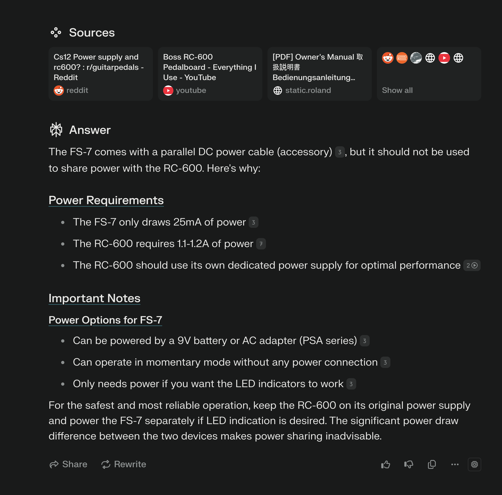
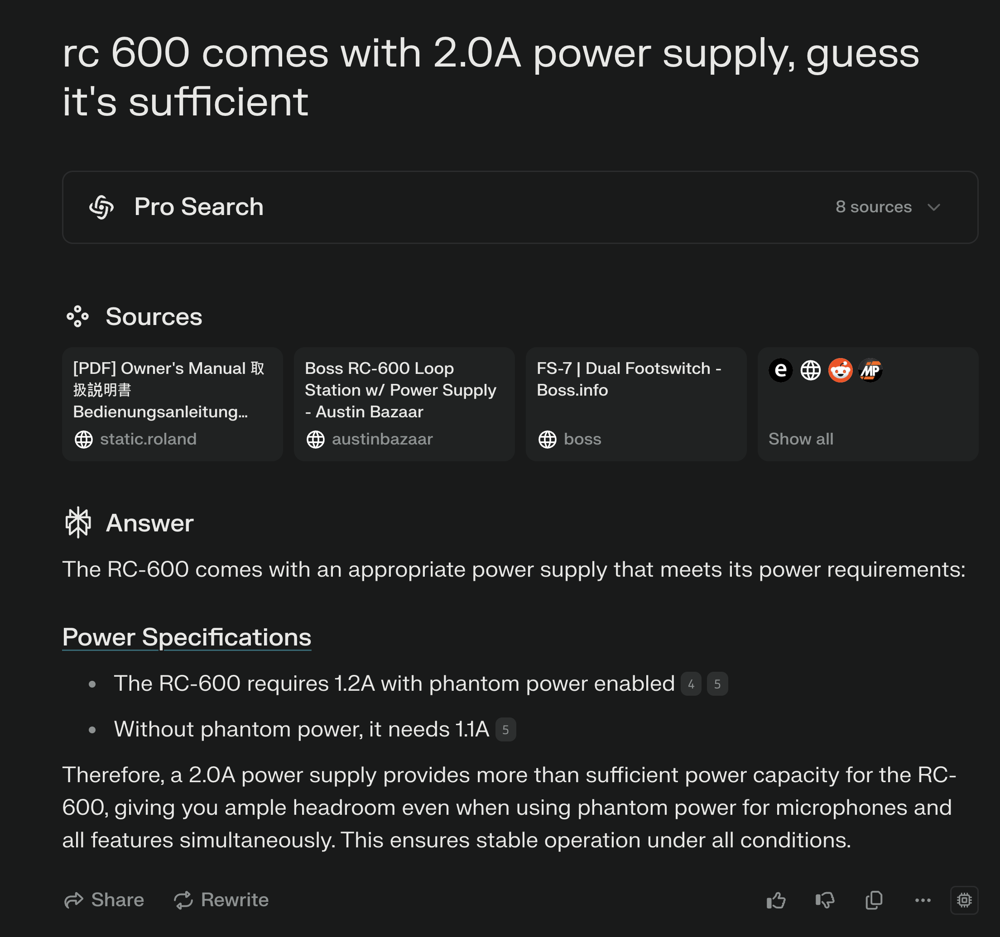

# Why You Need to Know Your Stuff (Even With AI)

TLDR: "When it comes to electronics or electricity, *you absolutely need to understand the basics.* Even a small oversight—like using a 0.5A power supply for a 1A device—can lead to catastrophic damage or even a house fire. Got it? Good."

AI can be fantastic—it often has deep, cross-domain expertise. But just like a human expert, it can still slip up for all sorts of reasons: maybe it followed a faulty line of logic, or maybe it misunderstood the context you gave it. That’s why you need some working knowledge of the topic yourself.

## Real-World Example

I recently set up Boss RC-600 loop stations in both my Living Room and Music Studio pedalboards. The RC-600 is a feature-rich device that draws a fair amount of current. I wanted to connect a Boss FS-7 Dual Foot Switch to the loop station using the FS-7’s included Y-splitter cable, which shares DC power between the footswitch and the pedal it’s connected to.

**The AI’s Initial Advice:**

When I asked AI (specifically Perplexity, which uses retrieval-augmented generation from models like Claude or GPT-4o or any other model of your choice) if I could safely share the power from the loop station with the footswitch, it warned me against it. The AI’s answer suggested I’d need a separate power supply.

**But Is That Really True?**

- The FS-7 footswitch uses 9V DC at 25mA.
- The RC-600 loop station also uses 9V DC but at 1.2A (1,200mA).  
- Add those up: 1,200mA + 25mA = 1,225mA total.

If the loop station’s power adapter supports 9V DC at 2.0A, that’s 2,000mA—plenty of headroom for both devices (1,225mA < 2,000mA). Mathematically, 9.0V × 2.0A = 18.0W, which is enough to handle both units.

## Power Supply Rules

**Golden Rule:** 

Never draw more current than a power supply can provide. You *can* safely use a 1A adapter for a 0.5A device (voltage must match!), but not the other way around. If a device that needs 1A tries to pull it from a 0.5A supply, the supply is likely to fail—or even fry.

**Common Misconception:**

A common beginner mistake is thinking a lower-rated power supply (like 0.5A) is safer for a device that needs more current (like 1A). This is incorrect - your power supply must always provide at least the current your device requires. Think of it like a straw - if it's too thin, you'll strain the system. Always ensure your power supply can deliver enough current, with some extra headroom.

**Why?** Because exceeding a power supply’s capacity typically leads to overheating and, in severe cases, permanent damage.

### Two Critical Rules for Power Supplies

1. **Voltage Must Match Exactly**  
   This is non-negotiable. The device expects a specific voltage, and mismatching it can cause serious harm.

2. **Current Capacity Must Be Sufficient**  
   - **Oversupplying current?** Totally fine—devices only draw the current they need.  
   - **Undersupplying current?** Dangerous. It can cause device malfunction, overheating, and permanent damage to both the device and power supply.

### Water Tank Analogy

Think of voltage like *water pressure*—it must match exactly to avoid damaging your pipes. Current is like *flow rate*—it’s okay if you have more potential flow than you need, because the device (like a tap) only takes what it requires. But if the tap needs more water than the pipe can provide, both the tap and the pipe are at risk.

## Why Context Matters

Initially, the AI only had partial context—it saw the high current draw of the RC-600 and recommended caution. But once I clarified that the RC-600’s power supply could provide 2.0A, the AI revised its answer. In other words, AI is only as good as the information you feed it.

**Key Takeaway:**

Always know your basics. If the AI’s suggestion feels off, don’t just take it at face value—verify it. Check device specs, do a little math, and ensure the AI has the context it needs. You’ll save time, money, and keep your gear in good shape.

**One Critical Point: Know Your Stuff**

When it comes to electronics or electricity, *you absolutely need to understand the basics.* Even a small oversight—like using a 0.5A power supply for a 1A device—can lead to catastrophic damage or even a house fire.

Got it? Good.