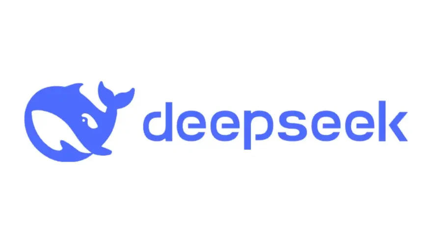

# The Rise of DeepSeek: Disrupting AI Economics and Market Dynamics

*TL;DR: The key insight is that lasting progress in AI hinges on recognizing broader industry trends and systemic shifts, rather than focusing on isolated technological breakthroughs.*

DeepSeek has emerged as a pivotal breakthrough in AI, upending traditional assumptions about the colossal hardware and financial outlay needed for cutting-edge model training. At the heart of this revolution lies its novel approach to parameter management—one that challenges industry stalwarts like NVIDIA and sends clear signals that raw brute force might not always be the winning strategy.

In light of DeepSeek’s success, major US tech leaders such as Google, Meta, Microsoft, OpenAI, Anthropic, xAI and others may be compelled to rethink their AI training methods and hardware investments. This development is a pivotal wake-up call for the entire AI industry—and for everyone invested in the future of artificial intelligence.

And for us AI enthusiasts and industry observers? What a fascinating time to witness this transformation! The democratization of AI development could spark a new wave of innovation from unexpected corners of the tech world.

---

## Technical Innovation

### 1. MoE-Based V3 Architecture
DeepSeek’s defining characteristic is its 671-billion-parameter architecture built with a Mixture-of-Experts (MoE) backbone. Unlike monolithic architectures where every parameter activates on every token, MoE systems rely on *selective activation*. In simpler terms, the model has many specialized “experts,” but only a relevant subset of them (totaling about 37 billion parameters) is engaged for each token processed.

- **Gating Mechanism**  
  A gating network intelligently routes incoming tokens to the most relevant expert(s). This drastically reduces computational overhead and energy consumption while maintaining robust performance.  
- **Balanced Specialization**  
  Each expert becomes especially good at handling certain types of inputs—whether that’s specialized syntactic structures, domain-specific language, or certain patterns in code. The gating network’s ability to pick the best expert effectively puts all these mini-models to work only when needed.

### 2. Multi-Head Latent Attention
One of the flashiest innovations is Multi-Head Latent Attention, where key-value vectors undergo heavy compression (to around 1/16th of typical size).

- **Compression Technique**  
  The compression uses advanced projection layers that maintain semantic fidelity while drastically reducing dimensionality. This shrinks memory requirements for both training and inference.  
- **Speed Gains**  
  With smaller vectors to shuffle around, the model zips through inference at record speeds. Caching key-value pairs becomes more efficient as well, enabling quicker context lookups.

### 3. FP8 Training Precision
DeepSeek’s shift to FP8 training cuts memory usage roughly in half compared to FP16 approaches. By carefully calibrating dynamic ranges and scaling factors, the system preserves accuracy while doubling the effective capacity of each GPU.

- **Dynamic Range Management**  
  Advanced quantization strategies ensure minimal loss during backpropagation, enabling the model to retain high-fidelity gradients without the typical overhead of higher-precision data types.  
- **Hardware Compatibility**  
  Although not all GPUs fully support FP8, DeepSeek’s pipeline is cleverly designed to adapt to multiple generations of NVIDIA hardware, from older architectures through newer ones like the H800/H100 series.

---

## Economic Impact

### 1. Cost Revolution
The most startling number might be the price tag: just **$5.6 million** for training—a fraction of what large-scale projects typically cost. The hardware behind this training included 2,048 H800 graphics cards over two months, translating into an **11x improvement** in efficiency relative to Meta’s Llama 3.

- **Lowering Barriers**  
  With a training cost that is often overshadowed by conventional approaches (which can soar to tens or even hundreds of millions), smaller labs and emerging tech firms see a path to world-class AI without back-breaking investments.  
- **Energy Efficiency**  
  Using fewer GPUs over a streamlined training schedule doesn’t just save on sticker price—it translates to meaningful energy savings, which can significantly impact total cost of ownership (TCO) in data center environments.

### 2. Market Disruption
NVIDIA’s top-tier AI hardware has historically been *the* go-to for large-scale training. DeepSeek’s success in scaling advanced models with fewer, slightly older chips cast immediate doubt on the sustainability of premium hardware pricing.

- **Chip Demand Outlook**  
  If more research teams adopt resource-sparing architectures like DeepSeek, the necessity for top-of-the-line GPUs (and their corresponding budgets) might drop, pressuring hardware providers to rethink their pricing and value proposition.

---

## Performance Metrics

DeepSeek’s cutting-edge design isn’t just about cost savings—its real-world benchmarks are equally compelling:

- **Coding Tasks**  
  Scoring **82.6%** on HumanEval-Mul showcases impressive aptitude for code synthesis and debugging. The model’s capacity to context-switch effectively between different coding patterns underscores the power of MoE-based specialization.  
- **Mathematical Reasoning**  
  An astonishing **90.2%** on MATH-500 indicates robust symbolic manipulation and logical reasoning. This aligns with how specialized “expert modules” can handle high-level math tasks with targeted efficiency.  
- **Token Throughput**  
  Achieving **14.2 tokens/second** indicates that DeepSeek can handle large inference workloads at speed—critical for real-time applications like complex coding assists, dynamic chatbots, or interactive tutoring systems.

---

## Industry Implications

### 1. Strategic Shift in AI Infrastructure
DeepSeek vividly illustrates that advanced AI *isn’t* exclusively tied to monstrous GPU clusters. Its success even under stricter U.S. chip availability signals a new era:

- **Capital Expenditure Rethink**  
  Traditional strategies have favored mega-clusters of premium-grade hardware, but DeepSeek’s approach may encourage CFOs and CTOs to reevaluate cost models and scale more flexibly.  
- **Broader Accessibility**  
  More modest AI hardware setups no longer condemn teams to second-tier model performance. With DeepSeek’s blueprint, mid-sized organizations can participate in advanced AI development previously limited to tech behemoths.

### 2. Market Dynamics and Pricing Models
Financial analysts at JPMorgan and beyond might regard AI budgeting fears as “overblown,” but the market’s immediate reaction hints at deeper doubts.

- **Pressure on NVIDIA’s Premium Tier**  
  If models like DeepSeek proliferate, the rationale behind ultra-expensive, leading-edge GPUs weakens. Customers might opt for higher volumes of cheaper cards—especially if performance gaps continue to shrink.  
- **Potential for a Hardware Race Reset**  
  Other hardware vendors, such as AMD or Intel, might find a renewed foothold if they optimize for resource-frugal architectures. This could introduce fresh competition into a GPU market long dominated by NVIDIA.

---

## Future Outlook

### 1. Open-Source Democratization
By releasing much of its code under an MIT license, DeepSeek invites widespread collaboration. This move not only garners goodwill but also accelerates *collective intelligence* development.

- **Community Contributions**  
  Enthusiasts, academics, and commercial developers alike can explore, fine-tune, and build on DeepSeek’s architecture—spreading a new standard of efficiency across the AI landscape.  
- **New Research Directions**  
  Open access to the source code catalyzes experimental spinoffs: from further compressing latent dimensions to layering additional MoE gates in specialized tasks like robotics or advanced natural language modeling.

### 2. Redefining the Next Wave of AI
DeepSeek’s achievements arguably herald a pivot in AI R&D: Instead of “largest model at any cost,” the next frontier might emphasize targeted efficiency, intelligent routing, and minimal overhead.

- **Lower Barriers to Entry**  
  More players can now join the AI arms race without massive venture capital or data center build-outs. This broader competition may spur even faster innovation.  
- **AI-First Ecosystems**  
  Resource-friendly models empower emerging markets and industries—think personalized healthcare, small-scale agricultural AI, or decentralized edge computing—where top-tier GPU farms are otherwise cost-prohibitive.

---

## Conclusion

DeepSeek shows us a future where AI doesn’t have to be prohibitively expensive or reserved for those with colossal hardware budgets. By marrying a massive MoE architecture to advanced attention and precision strategies, it achieves jaw-dropping performance at a fraction of the typical training costs.

For incumbents like NVIDIA, this shift is a wake-up call. For the broader industry, it’s an exciting challenge to reimagine what’s possible with AI that’s equal parts powerful and resource-savvy. If DeepSeek’s open-source ethos catches on, the entire ecosystem—from big tech to startups—might adopt a more agile, cost-effective path to state-of-the-art models.

This is an exhilarating milestone—watching as an AI underdog proves that well-orchestrated efficiency can give even the hardware giants a run for their money. Here’s to the new wave of AI, where bigger isn’t always better, and ingenuity drives the smartest solutions.

P.S. Just so you know... 

Over my decades of experience, I've seen time and again that the open-source community invariably finds a way to succeed—and ultimately outperforms proprietary alternatives. The reason is simple: no profit-driven entity can truly compete with the stigmergic synergy of open source, which operates outside the constraints of conventional money-based logic.