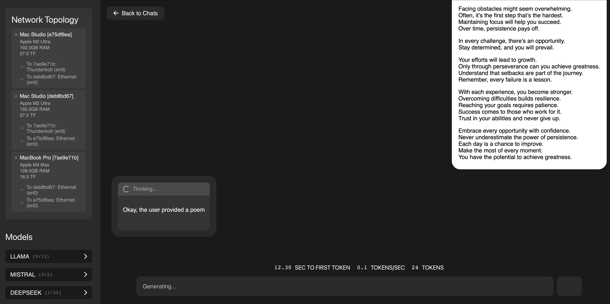
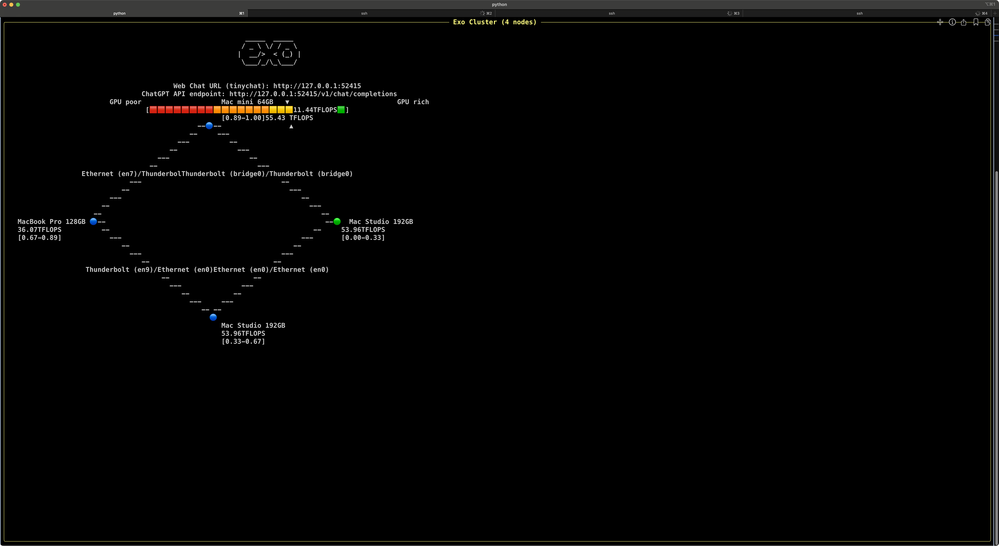
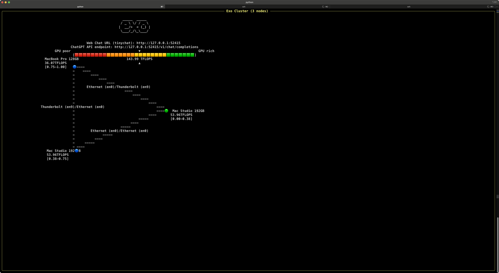

# Running DeepSeek R1 on a Local AI Cluster Using exo — Intended Exclusively for AI Explorers

This guide outlines my experience running the **`mlx-community/DeepSeek-R1-4bit`** model—which boasts **671 billion parameters**—on a local cluster using **exo**.

Note: I won't detail how to run `exo`; please refer to the documentation provided in their repository for complete instructions.

https://github.com/exo-explore/exo



## Minimum VRAM Requirement

For a comprehensive explanation of parameter counts and corresponding GPU memory requirements, refer to my previous guide: 

[Parameter Counts and VRAM Requirements for LLMs - Comprehensive Guide](https://github.com/neobundy/cwkGuides/blob/main/guides/2025/01/20250131-parameter-counts-and-vram-requirements-for-llms-comprehensive-guide.md)


A straightforward way to estimate the VRAM required per model shard is:

```
Minimum VRAM = Number of Parameters × (Bits per Parameter / 8)
```

For a 4-bit model:

```
671B × (4 / 8) ≈ 335.5 GB
```

With overhead (often ~20% for framework overhead and memory alignment):

```
Adjusted VRAM ≈ 671B × (4 / 8) × 1.2 ≈ 402 GB
```

Although the stated total model size is roughly **390.74 GB**, small variations arise from overhead and quantization details.

## VRAM Formula Breakdown

Use the formula below to estimate the **base** memory requirement:

```
Base Memory (GB) = N × (B / 8) × (1 + O)
```

Where:
- **N** = number of parameters (in billions)
- **B** = bits per parameter (e.g., 32 for FP32, 16 for FP16, 8 for INT8, 4 for INT4)
- **O** = overhead factor (often 0.1 to 0.3)
- Divide by 8 to convert bits to bytes

## Potential Challenges

1. **Large Downloads**  
   Downloading a model of this size requires a stable, high-speed connection. It’s typically best to download once via a single exo instance, then distribute locally.

2. **Intermittent Connectivity**  
   Frequent connection hiccups to the Hugging Face Hub caused repeated shard download failures and retries, wasting bandwidth.

3. **Manual Intervention**  
   Some shards (31, 32, and 34–43, in my case) repeatedly failed. I had to manually download these from:  
   **[https://huggingface.co/mlx-community/DeepSeek-R1-4bit/tree/main](https://huggingface.co/mlx-community/DeepSeek-R1-4bit/tree/main)**

## Cluster Configuration



All nodes are maxed-out spec machines. Initial options included:

- **Mac Studio M2 Ultra, 192GB RAM × 2**  
- **Mac Mini Pro M4, 64GB RAM × 1**  
- **MacBook Pro M3, 128GB RAM × 1**  
- **MacBook Pro M4, 128GB RAM × 1**

Because performance doesn’t scale linearly with node count, I went with a setup providing a combined **512GB** of RAM:



- **Mac Studio M2 Ultra, 192GB RAM × 2**  
- **MacBook Pro M4, 128GB RAM × 1**

## Performance Observations

- **Initial Latency:**  
  The first interaction is slow, given the large loading time into memory.
- **Subsequent Interactions:**  
  Later queries fare slightly better, but overall latency remains significant.

## Important Considerations

- **Limit Quantization Cuts:**  
  Reducing quantization below 4-bit can degrade model performance (“dumbing down” the model).
- **Distilled Models:**  
  Distilled alternatives trade genuine reasoning for speed and size. They replicate teacher model outputs rather than offer the original’s depth.

Hence, sticking to the **original, non-distilled 4-bit model** strikes a balance between functional performance and feasibility.

## Conclusion

Though it’s possible to run this model on a local cluster with the outlined setup, its sheer size makes it impractical for day-to-day use. Currently, such a deployment is most valuable for experimentation and research into large-scale local inference.

That said, the future is bright: as further quantization methods emerge (such as 1.58-bit precision) and hardware evolves, we’re edging closer to a world where models of this magnitude could run on everyday machines—including laptops. For now, unless you’re conducting research, a hosted service is usually the most efficient option.
