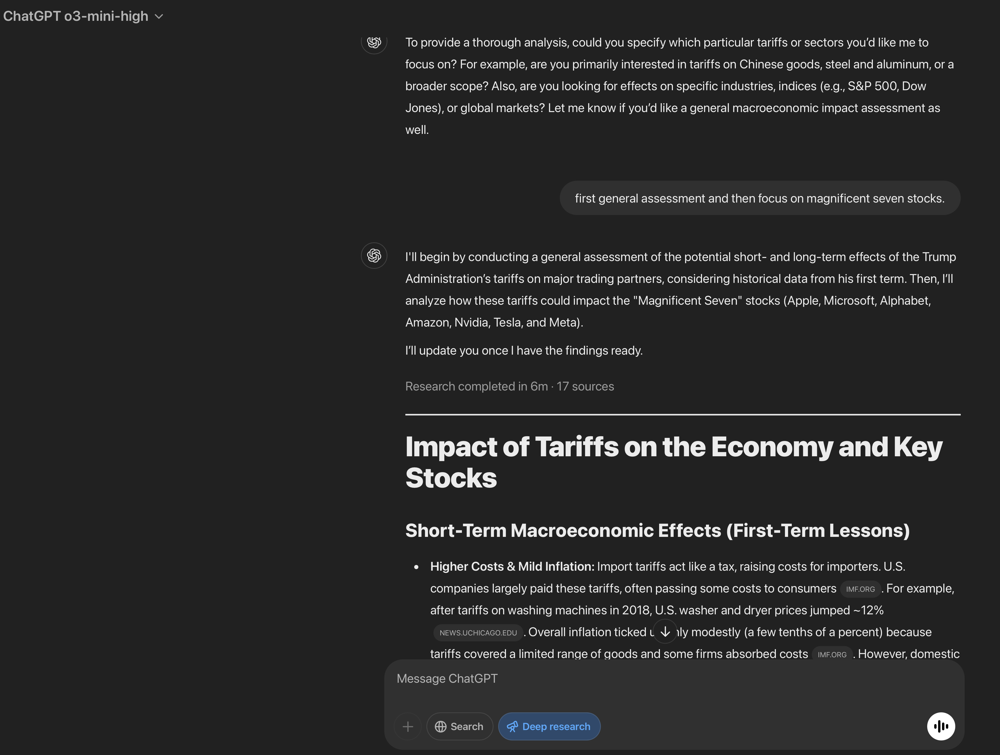
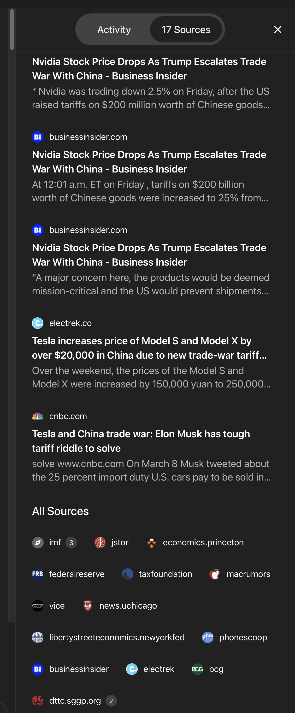
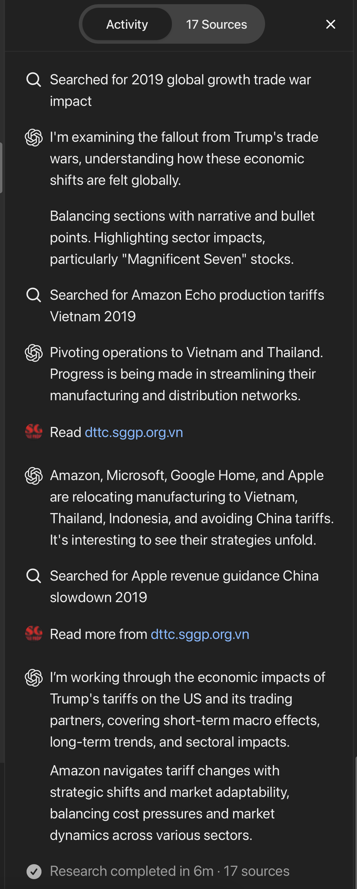

# OpenAI's Deep Research - Future of Analysis

As a Pro user of OpenAI's ChatGPT, I tested the o3-mini-high model with a straightforward query about Trump-era tariffs and their market impact.

The research process was impressively thorough. Over a 7-minute period, the model analyzed 17 distinct sources to compile its findings. The output demonstrated remarkable depth and attention to detail, going well beyond surface-level analysis.

What particularly stood out was the model's proactive approach to refining the research scope. Rather than immediately diving into analysis, it first asked clarifying questions about which specific aspects of the tariffs I wanted to explore. This demonstrated sophisticated judgment - by narrowing the focus upfront, it could deliver more targeted and valuable insights. This type of interactive refinement helps ensure the final research output precisely addresses the user's needs while maintaining analytical rigor.

The resulting report was nothing short of remarkable, demonstrating the model's ability to synthesize complex economic data into clear, actionable insights. While I encourage you to evaluate the analysis on its own merits, keep in mind that financial market predictions are inherently uncertain. The value here lies not in crystal-ball accuracy, but in observing how the model approaches multifaceted economic analysis through methodical research and reasoning.

---

Me: Analyze the potential short-term and long-term effects on the stock market of the Trump administration's tariffs on major trading partners. Make sure to take cues from Trump's first term as president, as he implemented similar policies during that period.

GPT-o3-mini-high(Deep Research): To provide a thorough analysis, could you specify which particular tariffs or sectors you’d like me to focus on? For example, are you primarily interested in tariffs on Chinese goods, steel and aluminum, or a broader scope? Also, are you looking for effects on specific industries, indices (e.g., S&P 500, Dow Jones), or global markets? Let me know if you’d like a general macroeconomic impact assessment as well.

Me: First, provide a general assessment and then focus on the Magnificent Seven stocks.

---

I'll begin by conducting a general assessment of the potential short- and long-term effects of the Trump Administration’s tariffs on major trading partners, considering historical data from his first term. Then, I’ll analyze how these tariffs could impact the "Magnificent Seven" stocks (Apple, Microsoft, Alphabet, Amazon, Nvidia, Tesla, and Meta). 

I’ll update you once I have the findings ready.

# **Impact of Tariffs on the Economy and Key Stocks**

## **Short-Term Macroeconomic Effects (First-Term Lessons)**  
- **Higher Costs & Mild Inflation:** Import tariffs act like a tax, raising costs for importers. U.S. companies largely paid these tariffs, often passing some costs to consumers. For example, after tariffs on washing machines in 2018, U.S. washer and dryer prices jumped ~12%. Overall inflation ticked up only modestly (a few tenths of a percent) because tariffs covered a limited range of goods and some firms absorbed costs. However, domestic producers in affected industries also raised prices due to less foreign competition, adding broader inflationary pressure.  

- **GDP Growth Moderation:** Tariffs and retaliations slowed trade and weighed on economic growth. While the direct hit to U.S. GDP was small in 2018, the drag grew as the trade war escalated. The IMF estimated global growth in 2019 fell to 3.0% (the slowest since 2009) partly due to tariff tensions. In the U.S., business uncertainty led some firms to delay investments, trimming GDP growth by a few tenths of a percent according to Fed and IMF analyses. Certain export industries (e.g. agriculture) saw sharp declines – U.S. soybean exports to China dropped to near zero after retaliation – requiring offsetting aid and hurting rural economies.  

- **Corporate Earnings Mixed:** Many companies faced margin pressure from higher input costs and lost exports, though a few protected industries saw short-term gains. Tariff-exposed manufacturers had to pay more for parts and materials, eroding profit margins. Research shows that any positive impact from import protection was **outweighed** by larger negative effects of costlier inputs and foreign retaliation. For example, U.S. automakers and machinery firms paid more for steel/aluminum, and farmers lost sales in overseas markets, denting earnings. Some domestic producers (steel, appliances) enjoyed brief profit boosts due to reduced import competition, but those were often offset by higher costs downstream. Overall S&P 500 earnings growth slowed in 2019 as global demand softened and companies cited tariffs as a headwind in earnings calls.  

- **Investor Sentiment & Volatility:** Trade-war headlines prompted noticeable market swings. Stock prices often fell on tariff announcements, reflecting investor concern about higher costs and weaker growth. In fact, U.S. equity markets dropped sharply on key announcement days – collectively **down ~11.5%** across major 2018–2019 tariff news events. Notably, March 2018 (steel/aluminum tariffs) and May 2019 (escalation of China tariffs) saw particularly large one-day selloffs. Uncertainty spiked, driving up volatility (VIX) and causing investors to seek safe-haven assets during escalation periods. However, partial trade truces or positive negotiation signals often sparked relief rallies. In short, trade tensions made investor sentiment fragile, with markets gyrating in response to tariff threats or breakthroughs.  

## **Long-Term Macroeconomic Effects**  
- **Supply Chain Realignment:** Prolonged tariffs forced firms to reorganize global supply chains. By late 2019, an estimated $165 billion in trade (~$14 billion per month) had been **redirected** as companies shifted sourcing to avoid tariffs. Many importers turned to alternative countries (e.g. importing from Mexico, Vietnam) when Chinese goods became costlier. This diversification helps reduce future tariff exposure but entails significant upfront costs. Companies had to invest in new facilities or suppliers, effectively “rerouting” supply chains built over decades. In the long run, such restructuring could make production somewhat more resilient to trade disputes, but it also implies higher operating costs (less efficiency than the pre-tariff optimal supply chain) and potential price increases for consumers.  

- **Marginal Gain in Protected Industries:** Tariffs gave a boost to certain domestic industries, but the broader manufacturing sector did not see a renaissance. A few sectors (e.g. U.S. steel, appliance assembly) added jobs or ramped up output under tariff protection, yet these gains were limited and came at high cost. In the washer tariff case, the price increases cost U.S. consumers ~$1.5 billion, about \$820,000 per job created – an inefficient trade-off. Meanwhile, many other manufacturers lost competitiveness abroad or paid more for inputs, resulting in **net job losses in heavily tariff-exposed manufacturing industries**. By 2020, studies found the Trump-era tariffs likely slightly **reduced** U.S. manufacturing employment overall, as any shelter from imports was offset by retaliation and cost inflation. Thus, long-term, tariffs did not significantly revive manufacturing, though they prompted some onshoring of select supply chains.  

- **Persistent Price Impacts:** Unlike a one-time tax, ongoing tariffs can embed higher costs into the economy. Even with modest immediate inflation effects, extended tariffs kept certain input and consumer goods prices higher than they would be otherwise. U.S. manufacturers’ prices rose about 1% on average due to the 2018 tariffs, as firms passed on input costs. Over multiple years, this could contribute to slightly higher inflation and squeeze household purchasing power. Additionally, foreign exporters did not meaningfully cut prices to offset tariffs, so the cost increase tends to stick. If tariffs remain in place long term, companies may invest in efficiency or automation to offset costlier imports, potentially altering labor demand. Consumers may also permanently pay more for certain goods, or substitute with alternatives. In sum, tariffs risk **structurally higher prices** in affected categories and a small drag on productivity growth as resources shift to less efficient production locales.  

- **Global Trade and Growth:** On a macro scale, protracted trade disputes encourage “decoupling” between major economies. During Trump’s first term, U.S.-China trade shrank and trade patterns shifted (e.g. ASEAN nations exporting more to the U.S.), fragmenting global commerce. If such trends continue, the world economy could see lower long-term growth as efficiencies from globalization recede. The IMF warned that escalating tariffs could **“disrupt global supply chains”** and **dent future global growth**. Businesses worldwide may invest less amid uncertainty about market access. Indeed, the trade war’s uncertainty was estimated to have reduced U.S. business investment growth by the end of 2019, with further long-run effects if tensions persist. Over the long haul, sustained tariffs can reshape international partnerships – some countries form new trade alliances, while others retaliate, potentially impacting geopolitical stability and investor confidence.  

## **Sectoral Impacts**  

### **Manufacturing Sector**  
Manufacturing was at the heart of tariff policy, yet the effects were **uneven**. Industries directly protected from foreign competition (like primary metals and appliances) saw short-term gains – higher capacity utilization and better pricing power. However, manufacturers that rely on imported components or export to tariff-targeted markets were hurt. 

**Input Costs:** Tariffs on steel, aluminum, and Chinese intermediate goods raised domestic production costs. Many U.S. factories had to pay more for parts, materials, and machinery, which compressed profit margins and pressured them to raise output prices. For example, a Federal Reserve study found tariff-exposed manufacturing industries experienced **increases in producer prices** due to costlier inputs. 

**Employment:** Hopes of a manufacturing jobs revival largely did not materialize. The same study noted that any job gains from import protection were **offset by larger job losses** in industries facing higher input costs or retaliatory export tariffs. Companies like Caterpillar and GM, for instance, warned that metal tariffs added hundreds of millions in costs, which can lead to scaling back other expenses (including hiring). 

**Exports and Order Books:** Retaliation hit U.S. capital goods and agricultural equipment manufacturers as China and others canceled orders. This led to weaker new-order growth for U.S. factories by 2019. Manufacturing PMI indices softened that year, reflecting trade-related slowdowns. 

In summary:

**short-term**: pockets of strength (protected firms) but broader strain (higher costs, lost sales). 

**Long-term**: some supply chain shifts back to North America, but no dramatic surge in U.S. manufacturing output – instead, a modest net negative impact on the sector’s growth relative to a no-tariff scenario.  

### **Technology Sector**  

The tech sector’s reaction to tariffs was complex, split between hardware and software/services. 

**Hardware & Electronics:** Tech hardware companies were directly exposed through the global electronics supply chain. Many consumer tech products (smartphones, laptops, consoles) were on tariff lists, meaning import duties would raise their U.S. selling prices. In response, firms **scrambled to adjust**. For example, the leading console makers (Sony, Microsoft, Nintendo) jointly warned that a 25% tariff on game consoles would cost U.S. consumers $840 million extra and disrupt an almost entirely China-based supply chain. Tech giants began relocating production: Google started moving its Pixel phone and Google Home speaker manufacturing from China to Vietnam to avoid tariffs. Microsoft explored shifting Xbox production to Thailand or Indonesia. Amazon similarly looked to Vietnam for Echo speakers and Kindle devices. This exodus underscored how tariffs accelerated supply-chain diversification in tech. 

**Costs and Prices:** Where relocation wasn’t immediately feasible, companies faced tough choices – absorb the tariff (hitting margins) or pass it on to consumers (risking lower demand). Many devices are sold at thin margins, so a tariff could push them into loss or force a noticeable retail price hike (e.g. analysts calculated a 25% tariff on iPhones would require ~14% higher prices to fully offset). Some firms, like Apple, strategized to mitigate impact by both lobbying for product exemptions and planning backup manufacturing in India/Vietnam. 

**Software/Services:** In contrast, software and internet service companies (e.g. enterprise cloud, online advertising platforms) saw little direct tariff impact. Their “products” aren’t physical goods crossing borders, so import taxes didn’t apply. However, they were **indirectly affected** by the broader economic and supply-chain consequences. If hardware partners delayed product launches or enterprise clients faced cost pressures, that could trickle down to slower sales of software or cloud services. Additionally, big tech firms’ stock prices often moved in tandem; even relatively insulated companies could see their valuations swing on negative trade news due to overall sector sentiment. 

**Summary:** Tech hardware was one of the most tariff-sensitive areas (given heavy reliance on Chinese manufacturing), prompting swift adaptation but also causing short-term upheaval. Longer-run, the sector may emerge with a somewhat more distributed production base (more factories in Southeast Asia, etc.), reducing (but not eliminating) its concentration risk in any single country.  

### **Consumer Goods Sector**  
Tariffs on major U.S. trading partners hit a wide array of consumer goods – from electronics and appliances to apparel and household items – many of which Americans buy daily. 

**Price Increases & Inflation:** As seen with appliances, tariffs translated to higher retail prices. Retailers like Walmart and Target publicly cautioned that sustained tariffs on Chinese imports would make clothing, toys, electronics, and furniture more expensive for shoppers. In many cases, importers passed on costs fully or partially. Even products not directly tariffed saw “knock-on” effects: for instance, dryer prices rose alongside washers because manufacturers bundled costs and faced less competition at the higher price point. Government data by late 2019 showed categories like furniture and electronics experiencing above-trend inflation due to tariffs. 

**Consumer Demand Shifts:** Higher prices and uncertainty can dampen demand. Some consumers rushed purchases before tariff hikes (pre-tariff “stockpiling” of goods was noted in late 2018), while others postponed or canceled big-ticket buys that became pricier. Overall U.S. consumer spending remained solid through 2019, but specific segments (e.g. appliance sales, certain electronics) saw volume declines attributed to tariffs. 

**Business Responses:** Importers and retailers worked to blunt the impact. Large retail chains negotiated with suppliers, sought alternate sourcing in countries like Vietnam, India, or Mexico, or re-routed supply chains where possible. This diversification helped avoid some tariffs but often at added logistical cost. Smaller businesses, lacking easy alternatives, had to either accept thinner profit margins or raise consumer prices. Some brands tried slight product modifications or country-of-origin shifts to sidestep tariffs. 

**Long-Term Sector Outlook:** If tariffs persist, consumer goods companies will likely continue diversifying suppliers (accelerating a trend of moving manufacturing out of China to other low-cost nations). U.S. consumers might adapt by buying different brands or fewer discretionary goods if prices stay elevated. In essence, tariffs on consumer goods act as a broad-based sales tax – one that can curb consumer spending power over time. Investors in this sector watch tariff developments closely, as retail earnings and consumer sentiment can swing quickly with changes in trade policy.  

## **Impact on the “Magnificent Seven” Stocks**  
The so-called *“Magnificent Seven”* mega-cap stocks – Apple, Microsoft, Alphabet (Google), Amazon, Nvidia, Tesla, and Meta (Facebook) – would each feel tariff fallout differently, given their diverse business models. Here’s a breakdown:

### **Apple (AAPL)**  
Apple is *highly exposed* to tariff risk due to its deep manufacturing ties to China and reliance on consumer device sales. In Trump’s first term, Apple’s flagship products (iPhones, iPads, MacBooks) were initially spared from tariffs, but they were threatened by proposed lists. Analysts warned that a 25% tariff on iPhones would force Apple to raise U.S. iPhone prices by about 14% (e.g. an iPhone XS rising from \$999 to ~$1,142) to maintain margins. Such a price jump could significantly dampen demand – one estimate suggested ~10 million fewer iPhones sold if prices rose 10% or more. Apple faced a dilemma: pass costs to consumers (risking sales) or absorb them (hitting its own margins). The company used a multi-pronged response: it lobbied the U.S. government and often secured *exemptions or delays* (indeed, a late-2019 trade deal meant planned tariffs on iPhones never took effect). It also quietly began diversifying production (shifting some assembly to India and Vietnam) to reduce future dependence on China. During the height of trade tensions, Apple’s performance offered a case study: in early 2019, Apple *cut its revenue outlook*, citing weaker iPhone sales in China and economic deceleration there. This underscored how tariffs and Chinese retaliation (which fomented a consumer slowdown and some nationalist boycotts) directly hurt Apple’s earnings. Investors now recognize Apple as one of the bellwethers for trade war impact – negative tariff news tends to pressure Apple’s stock more than most. On the flip side, Apple’s brand strength and hefty margins give it some cushion. 

**Key investor insight:** Tariffs on Chinese goods pose a clear downside risk to Apple’s earnings and global supply chain. Any future tariff escalation could mean higher production costs or prices, but Apple’s ongoing supply-chain adjustments and pricing power might mitigate the worst outcomes. Still, in a tariff-heavy scenario, expect Apple’s stock to be volatile and closely tied to U.S.-China news.  

### **Microsoft (MSFT)**  
Microsoft, as a predominantly software and services company, is less directly impacted by tariffs than hardware-centric peers. Most of its revenue comes from software (Windows, Office, cloud services) which isn’t subject to import duties. However, Microsoft does have a significant hardware segment – including the Xbox gaming consoles, Surface PCs/tablets, and accessories – **almost all manufactured in China** or East Asia. Tariffs targeting electronics hit this segment. Microsoft joined Nintendo and Sony in 2019 to warn that console tariffs would harm the entire video game industry, noting consumers could pay $840 million more for consoles with a 25% tariff. Essentially, an Xbox made in China would suddenly cost significantly more in the U.S., potentially shrinking the console market and Xbox sales. In the short term, Microsoft would likely try to absorb some costs or offer promotions to keep console sales going (gaming is a strategic loss-leader business). Longer term, as noted, Microsoft explored shifting production – reports emerged of plans to move Xbox manufacturing to Southeast Asia to avoid Chinese tariffs. Beyond gaming, Microsoft’s Surface device line would face similar cost issues if tariffs hit laptops/tablets. The company could handle a hit to its devices division (which is a smaller share of revenue), but the user base and ecosystem growth could slow if device prices jumped. Importantly, Microsoft’s core enterprise customers and cloud contracts are unaffected by tariffs directly, though a broad economic slowdown from a trade war could soften corporate IT spending a bit. In Trump’s first term, Microsoft managed to grow strongly despite the trade war, with minimal direct damage to its financials – reflecting its resilience and diversified portfolio. 

**Investor insight:** Microsoft has moderate tariff exposure through its hardware products. A trade war might slightly dent hardware revenue or margins, but the impact on overall earnings would likely be limited. Its stock might still swing with market-wide sentiment on trade, but fundamentally Microsoft is among the more insulated of the seven, thanks to its emphasis on software/cloud.  

### **Alphabet/Google (GOOGL)**  
Alphabet (Google) likewise derives most of its revenue from services – primarily digital advertising – which tariffs don’t touch directly. Google’s search and ad business depends on global internet usage and marketing budgets, not physical goods shipments. Thus, the direct effect of tariffs on Google’s core business is minimal. However, Google does produce hardware devices (Pixel smartphones, Nest smart home products, Chromecast, etc.) that were squarely in the crosshairs of China tariffs. Learning from early tariff rounds, Google took action: it **moved production of Pixel phones out of China** to Vietnam in 2019. This relocation was designed to protect its nascent hardware unit from U.S.-China trade friction. Similarly, reports indicated Google planned to shift assembly of Nest devices and other gadgets to Taiwan or Southeast Asia. These moves suggest Google was able to pivot and contain its tariff exposure for devices. If new tariffs hit remaining China-made products, Google could accelerate this diversification. On the demand side, Google’s advertising business could feel second-order effects if tariffs slow economic growth – e.g. if retail clients sell less, they might spend less on ads. During the 2018–19 tensions, there were signs of weaker ad spending by some companies facing tariff pressures, but Google’s overall ad growth remained robust. Another angle: trade wars often coincide with tech wars (as seen with Huawei), and while Google’s services are banned in China, broader U.S.-China tech decoupling could affect things like Android device sales in China (where Google doesn’t get Play Store revenue anyway) or Chinese companies’ advertising abroad. These are relatively minor factors. 

**Investor insight:** Alphabet is mostly shielded from direct tariff impacts, with hardware being a small piece of the pie and largely relocatable. The stock might be less sensitive to tariff news than manufacturing-heavy firms. However, watch for indirect impacts via advertisers and the macro economy. Google’s proactive supply-chain shifts show it can manage hardware risks if trade tensions rise, keeping the company’s overall growth on track.  

### **Amazon.com (AMZN)**  
Amazon straddles retail and tech, making its tariff exposure two-fold: as one of the world’s largest *retailers* and also a hardware producer (for its own devices). On the retail side, Amazon’s marketplace is flooded with imported consumer goods – from electronics and appliances to apparel – many sourced from China. Tariffs on Chinese imports effectively raise Amazon’s cost of goods sold or the prices charged by third-party sellers on its platform. In Trump’s first term, Amazon had to decide whether to pass these costs to consumers (potentially hurting sales volumes and customer satisfaction) or absorb them (hitting its retail profit margins, which are already thin). In practice, it likely did some of both. Popular items (like cheap electronics or household goods) saw price increases in 2018–19 in line with tariff rates, according to consumer price data, suggesting Amazon shoppers did pay more in certain categories. Meanwhile, Amazon reportedly **stockpiled inventory** and worked with suppliers to mitigate costs ahead of tariff deadlines – a short-term strategy to cushion the blow. Additionally, Amazon joined peers in shifting supply chains for its **in-house products**. Its Kindle e-readers and Echo smart speakers, which were made in China, were planned to be moved to production in Vietnam to escape tariffs. By diversifying manufacturing, Amazon aimed to keep its device business competitive on cost. Despite these adjustments, broad tariffs on consumer goods have a cooling effect on e-commerce: if everything on the platform gets 10–25% more expensive, consumer demand could slow, especially for discretionary purchases. Amazon’s massive scale and efficiencies might let it undercut other retailers even with tariffs, but the overall retail sector would feel the strain. One saving grace for Amazon: its fastest-growing and most profitable segment, AWS cloud computing, is untouched by tariffs (it’s a service). So financially, the company can weather trade turbulence better than a pure retailer. 

**Investor insight:** Tariffs pose a risk to Amazon’s e-commerce volume growth and margins. A flare-up in trade war could mean higher prices on Amazon.com, potentially dampening sales and requiring skillful supply chain management. However, Amazon’s agility in logistics and its pivot of manufacturing out of China help reduce long-term risk. Investors should monitor Amazon’s commentary on consumer demand and costs if tariffs rise – so far the company has navigated these challenges without major hits to its stock, supported by its cloud and subscription revenues cushioning retail headwinds.  

### **Nvidia (NVDA)**  
Nvidia, as a leading semiconductor company, is deeply embedded in the global tech supply chain and thus vulnerable to trade disruptions. Two main concerns arise with tariffs: **market access** and **supply chain costs**. On market access, China is a huge end-market for Nvidia’s chips – both directly and indirectly. Chinese consumers and companies buy PCs, gaming consoles, and data center services that include Nvidia GPUs. During the trade war, there was concern that Chinese retaliation could target U.S. tech firms like Nvidia. Even absent direct retaliation, a weaker Chinese economy (partly due to tariffs) meant lower demand for electronics, which hurt Nvidia’s sales. In fact, in late 2018, Nvidia’s stock plummeted in part because of a slowdown in GPU demand coinciding with the crypto-mining bust and trade tensions. By May 2019, when the U.S. hiked tariffs on Chinese goods to 25%, Nvidia’s shares slid ~2.5% in one day, and the **whole semiconductor sector dipped** on fears of an extended dispute. Nvidia’s CEO Jensen Huang noted China is an “important market” and tariffs or export restrictions create uncertainty. Investors recognized semiconductors as “most at risk” if U.S.-China tensions worsened, because China could curb purchases or develop local alternatives. On supply chain, while Nvidia designs chips in the U.S., manufacturing is done in Asia (Taiwan, Korea for wafers; often China or Taiwan for assembly/testing). Tariffs on intermediate electronics or finished GPUs could raise Nvidia’s production costs or the cost of Nvidia-based devices. For example, if graphics cards imported from China faced tariffs, PC makers and consumers would pay more, potentially reducing demand for Nvidia’s products. Nvidia might then need to rearrange where final assembly occurs (shifting more packaging to Taiwan or Malaysia). By and large, the first-term tariffs didn’t explicitly single out semiconductors, but they hit many downstream products containing those chips. Nvidia’s data center customers also faced uncertainty, especially if trade tensions led to bans (though that’s export control, not tariff). 

**Investor insight:** Nvidia is sensitive to trade policy – its stock tends to drop on tariff escalation news and rally when tensions ease. While the company can adapt its supply chain (and has strong pricing power in high-end chips), a trade war poses downside risk to its revenue growth in key markets and could introduce supply inefficiencies. Continued U.S.-China strategic rivalry in tech adds a cloud over Nvidia, making it a barometer for investor sentiment on global tech demand.  

### **Tesla (TSLA)**  
Tesla’s situation with tariffs highlights both the pain of trade barriers and how companies adapt strategically. In the late 2010s, China was becoming Tesla’s largest international market for its electric vehicles – but U.S.-China tariffs hit autos hard. China retaliated against U.S. car imports with a **40% tariff** (up from the normal 15%), which slammed the landed cost of Teslas. In mid-2018, Tesla had to hike Model S and X prices in China by $20,000–$30,000 (an increase of over 20%) to offset the new tariffs. This made Tesla’s already luxury-priced cars even less affordable and put it at a big disadvantage to local EV competitors and European imports (which faced lower duties). Tesla’s sales in China stalled as a result. Elon Musk lamented that tariffs created an uneven playing field – U.S. cars faced a 40% duty in China, while Chinese EVs entering the U.S. paid much less – highlighting the trade imbalance. In response, Tesla undertook a game-changing move: it accelerated building its Shanghai Gigafactory. By localizing production in China (the factory opened in late 2019), Tesla could largely avoid import tariffs, as cars made in China for Chinese customers aren’t subject to China’s auto import tax. This investment was a direct long-term solution to the tariff issue and has since paid off with Tesla’s huge sales surge in China (now produced locally). Besides China-specific tariffs, Tesla also felt the impact of U.S. tariffs on steel and aluminum, which raised material costs for its U.S. factories. Although Tesla didn’t publicize specific cost impacts, auto industry analysts noted that higher metal prices added pressure to automakers’ costs across the board in 2018. 

**Investor insight:** Tesla’s exposure to trade wars is significant because of its global ambitions. Tariffs can either choke off a key market (as briefly happened in China) or inflate its cost structure. However, Tesla’s proactive strategy – building local factories (in China, and plans for others) – is a mitigating factor. If new tariffs emerged (for instance, a U.S.-EU spat affecting auto parts, or U.S.-China tensions worsening), Tesla’s multi-factory global footprint helps cushion the blow. Still, investors should be wary: China now represents a large share of Tesla’s growth, so any geopolitical flare-up that undercuts Tesla’s standing in China (tariffs or otherwise) would be a notable risk to the company’s growth story and stock price.  

### **Meta Platforms (META, formerly Facebook)**  
Meta is arguably the least directly affected by tariffs among the Magnificent Seven. Its products are digital platforms (Facebook, Instagram, etc.), and it doesn’t manufacture consumer hardware at scale (aside from accessories like VR headsets, which are a minor part of its business). Also, Meta’s services are generally free to users, supported by advertising, so there’s no imported good being sold. Furthermore, Meta has no presence in China (Facebook is banned there), so Chinese retaliatory tariffs or boycotts don’t hit its user base or revenue in that market. In terms of supply chain, Meta isn’t sourcing components or dealing with import/export of goods – so the operational impact of tariffs is negligible. However, **indirect effects** could still bite. Meta’s revenue depends on global advertising budgets. If tariffs slow economic growth or consumer spending, big advertisers (from auto companies to consumer goods brands) might cut back on ad spending, which would moderate Meta’s revenue growth. In 2019, for instance, some advertisers in retail and manufacturing were facing lower sales due to tariffs and uncertainty, and that can translate to leaner marketing outlays. Additionally, broad market sell-offs from trade war fears hit tech stocks across the board – Meta’s stock, like its peers, saw volatility in 2018–19 correlating with tariff news even if the fundamental impact was indirect. Another angle: if trade disputes morphed into wider political disputes, U.S. tech firms could face other kinds of barriers abroad (though again, Meta’s biggest markets like Europe and India were not directly in tariff crosshairs). 

**Investor insight:** Tariffs are not a central issue for Meta’s business model, and it has a relatively **defensive position** in a trade war scenario (its costs and users are unaffected directly). The main consideration is macroeconomic – a tariff-induced downturn or dip in business confidence could soften the advertising market. Therefore, Meta’s investors would primarily be watching overall economic indicators rather than specific tariff actions. In comparison to the others, Meta would likely be a *relative safe haven* among mega-caps if a tariff conflict escalated, aside from general market sentiment swings.  

## **Key Takeaways for Investors**  
- **Broad Economic Impact:** Tariffs from Trump’s first term showed clear macro effects: slightly higher consumer prices, disrupted trade flows, and a drag on GDP growth as business costs rose. While not enough to derail the U.S. expansion pre-2020, they introduced headwinds. Investors should expect that renewed tariffs could **fuel inflation** (especially in affected goods), **trim corporate earnings** in trade-sensitive industries, and weigh on global GDP growth forecasts. Sectors like manufacturing and retail bore the brunt last time, and would likely do so again, at least until supply chains adjust.  

- **Market Volatility is Likely:** Trade policy uncertainty tends to translate into market volatility. Trump’s tariff announcements in 2018–19 triggered sharp stock sell-offs and risk-off rotations. For investors, this means that a tariff flare-up can create sudden downdrafts in equity markets (and opportunities to buy quality stocks at a discount, if one believes fundamentals will prevail post-dispute). Safe-haven assets (Treasurys, gold) might rally during escalations. It’s important to **monitor news flow** on trade negotiations – markets have shown they can turn on a tweet about tariffs. Diversification and maybe hedges (like options or sector rotation) can help manage this policy-driven volatility.  

- **Sector Differentiation:** Different sectors will **feel tariffs differently**, so investors should adjust exposures accordingly. Manufacturing and industrial firms (especially those reliant on Chinese inputs or exports) could see profits squeezed – for example, auto, machinery, and semiconductor companies faced margin pressure in the last trade war. Conversely, some domestic-focused businesses or those in protected niches might outperform (e.g. U.S. steel producers initially benefited from metal tariffs). Tech hardware and consumer goods firms will likely pass on cost increases or face volume declines, which can hurt stock performance in the short term. Service-oriented and software companies are more insulated and may hold up better. Being selective within sectors is key: for instance, in consumer stocks one might favor firms with flexible supply chains or luxury brands able to raise prices, versus those selling low-margin imported goods.  

- **Company Adaptability Matters:** A major lesson from the first term is that companies can and will adapt – but with varying success. Investors should evaluate how agile each company is in navigating tariffs. Look at supply chain diversity: companies that swiftly shifted production (like **Apple and Google moving some manufacturing out of China**) reduced their long-term risk. Those that have alternatives to Chinese suppliers or the ability to source domestically (even at higher cost) can better weather tariffs. On the flip side, companies heavily locked into one country for production or sales (without easy alternatives) remain more vulnerable to prolonged tariffs. The Magnificent Seven firms largely demonstrated adaptability by pivoting supply chains or relying on other strengths (services, local production), which reassures investors that they can cushion the impact.  

- **Big Tech Resilience vs. Exposure:** Among the Magnificent Seven, hardware-centric giants like **Apple, Nvidia, and Tesla** are most exposed to tariff risks, due to supply chain and market concentration in China. Their stocks could face outsized swings if a trade war reignites, and analysts will be watching their gross margins and China sales closely. In contrast, software/service-heavy players like **Microsoft, Alphabet, and Meta** have **relative resilience** – their direct exposure is limited, so any sell-off on trade fears might be driven more by sentiment than actual earnings risk. Amazon sits in between: its retail business is exposed, but its cloud arm provides stability. For investors, this suggests a potential strategy of balancing a portfolio with some of these more insulated names during trade turmoil, while perhaps trimming or hedging positions in the more exposed ones, unless valuations become very attractive.  

- **Long-Term Investment Thesis:** It’s important to distinguish short-term turbulence from long-term fundamentals. Tariffs can alter near-term earnings and introduce uncertainty, but they don’t necessarily derail the secular growth stories of major companies. For example, while Apple’s profits might dip in a tariff year, its brand loyalty and innovation pipeline remain intact – and it can recoup once tariffs ease or through price adjustments. Similarly, Nvidia’s long-term trajectory in AI and chips isn’t erased by a year of trade friction, though it might cause a rocky ride. Investors with a long horizon might use tariff-driven dips to accumulate shares in high-quality companies, assuming they have strong plans to cope with trade challenges. Nonetheless, one should **stay informed** on policy developments: a temporary tariff spat is one thing, but a sustained decoupling between major economies could fundamentally reshape competitive landscapes (e.g. creating separate tech standards or closed markets). In summary, savvy investors will keep an eye on trade policy as a significant macro factor, adjust their portfolios to manage risk, but also look through short-term noise to identify which companies can emerge stronger by adapting to the new trade realities. 

