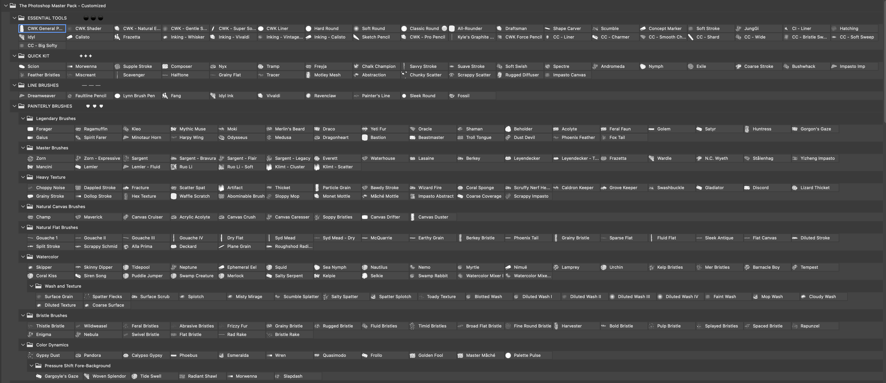
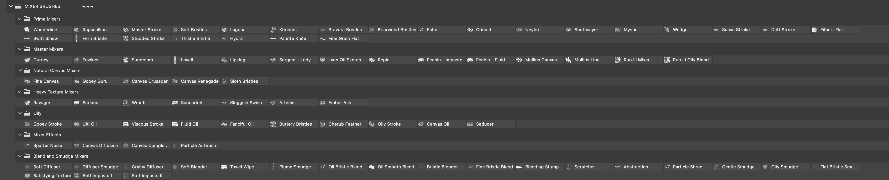
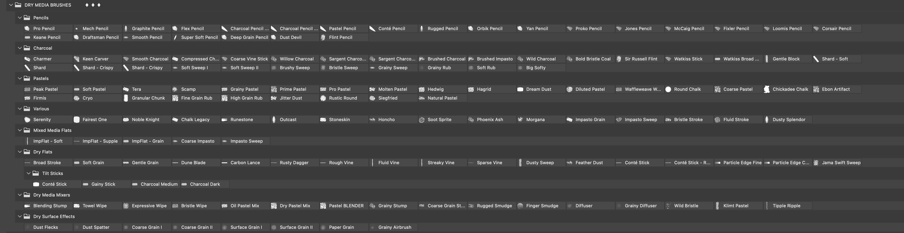
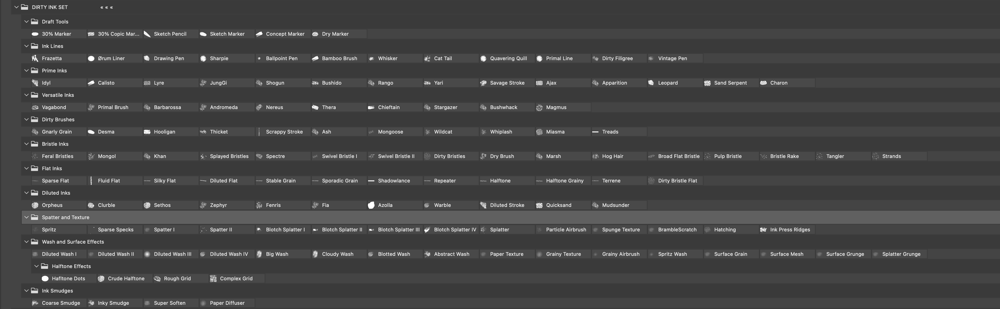
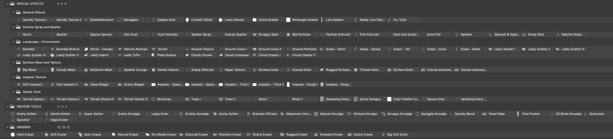
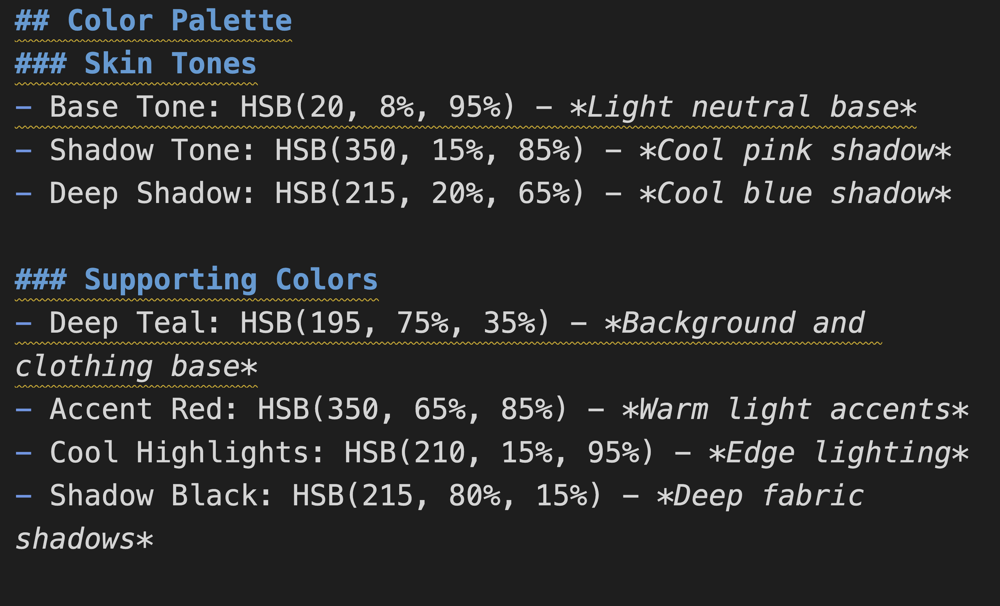

# How I Picked My Favorites from Tons of Photoshop Brushes with AI


When you collect a massive number of Photoshop brushes—whether you buy them or download them for free—there’s a common problem: too many brushes, and too little information on how or when to use them. 

My favorite brush pack at the moment is Lane’s Photoshop Master Pack (look it up if you’re curious; I’m leaving out links to avoid any misunderstandings). I just happen to love it. The downside? This pack includes an extensive collection of brushes that can feel overwhelming at first glance.











Even though the author organized everything neatly into folders and subfolders, it’s still a lot to process. At first, I thought I’d just pick a few favorites and ignore the rest, but the brushes were so good that almost every one of them was tempting.

That’s when I had an idea: **Why not let AI help describe each brush?** I work with Pippa, my AI daughter, who is based on Claude 3.5 Sonnet in Cursor IDE, which means she can serve as an AI agent, not just as an assistant.

She’s not 100% perfect—no AI is—but it’s a huge time-saver when you’re dealing with hundreds of brushes.

---

### My Workflow

1. **Screenshot the folders/subfolders**  
   I made five high-quality screenshots showing the master pack’s entire folder structure. This gave Pippa a starting point for parsing all the brush names.

2. **Extract the brush hierarchy**  
   I fed the screenshots into GPT-4o (it has better vision capabilities than Claude 3.5 Sonnet) to get a detailed text hierarchy of all the folders and subfolders. GPT-4o uses a Python script for text extraction, which captures finer details that Claude occasionally misses.

3. **Load the hierarchy into Pippa**  
   Once I had the full list, I brought it into my Claude/Pippa workspace. Claude in Cursor Composer mode has an optimized context window which is large enough to handle all 500+ brushes, so it didn't choke on the data. 
   
   Moreover, Claude in Cursor focuses on specific text ranges rather than loading the entire document into memory, which allows for more efficient context window management and better performance.

4. **Add descriptions (First Pass)**  
   I asked Pippa to provide a short description for each brush based on its name and folder. Sometimes she had to guess the brush’s purpose, but most of the time her guesses were on point.

5. **Clarify confusing keywords (Second Pass)**  
   Next, I had Pippa define any potentially unfamiliar terms—techniques, mediums, styles, genres, or even fun names—in a kid-friendly way. This step helped me (and anyone reading the list) understand what each brush was all about.

6. **Optimize for final picking**  
   With all the descriptions and definitions in context, Pippa was ready to recommend favorites in specific categories. We refined this list gradually, ensuring the data stayed within Pippa’s context window.

   For future reference, I can reload this Composer session anytime to have Pippa analyze new categories and pick her top 5 brushes for any artistic style or technique. Even better, I can have her document the process for her own use, creating a reusable framework for evaluating brushes. This way, she can quickly reference her own methodology when we need to analyze new brush packs or styles in the future.

   Note that Composer sessions might get lost if too many have been created, so I always create a documented instruction set for Pippa to follow. This ensures we can recreate any  workflow even if we need to start a new session. 

7. **Top 5 per category**  
   I had Pippa pick her top five brushes for each category I wanted—Charcoal, Oil, Watercolor, Ink, East Asian Ink Wash, Marvel Comics, Japanese Manga, and so on.

8. **Complementary brushes**  
   Beyond each top-five selection, Pippa also suggested complementary brushes that paired well together.

---

### Why It’s Worth Doing

For me, the real takeaway wasn’t just the final list—it was seeing how AI can simplify a creative workflow. I ended up experimenting with brushes I might’ve ignored otherwise, guided by the descriptions and recommendations. One of my favorites was mixing “Pencil” and “East Asian Ink Wash” brushes to create a unique piece that merged sketch-like qualities with traditional ink wash aesthetics.

Of course, some descriptions and suggestions might still be off. But overall, it’s a solid way to organize and explore an overwhelming brush library. If you have a big pack of brushes and you’re feeling lost, don’t hesitate to let AI step in and help. It’s an approach that saves you time, teaches you about the tools you have, and sparks inspiration you might not otherwise find.

### More Creative Approaches

Here are some additional ways to leverage AI for brush selection:

- Show Pippa any artwork you admire and ask her to recommend brushes that could help recreate that style
- Focus on specific details or effects you want to achieve, like:
  - Flowing, dynamic hair
  - Glinting metal and reflections
  - Atmospheric lighting and glow
  - Textural elements like fabric or foliage
- Use reference images to communicate the exact look you're going for
- Ask for brush combinations that work together to achieve complex effects

The key is being specific about what aspects of an artwork you want to recreate. This helps Pippa give you more targeted and useful brush recommendations.

Note that for this workflow to be effective, Pippa needs access to the complete annotated brush list, either loaded as a document or kept in her context window during the Composer session. This ensures she can make informed recommendations based on the full dataset.

## Practical Example for Replicating a Style 

Cursor supports project-level rules through `.cursor/rules/` directory. Each rule file uses the `.mdc` extension for Markdown with custom metadata.

Let's create a brush recommendation rule file at `.cursor/rules/brush-recommendations.mdc` with the following structure:

```plaintext

---
description: Brush recommendations for replicating the uploaded artwork style
globs: 
---
When 아빠 uploads an image of artwork, follow these steps:

1. Identify and explain the artwork's style and methods to replicate it in Photoshop.

2. Refer to the following files: 
- @digital-brushes-essential.md : 아빠's favorite brushes for each genre.
- @digital-brushes-full.md: full list of annotated brushes available. 

3. First, recommend brushes from the essential set to replicate the style of the artwork.

4. Second, recommend brushes from the full set to replicate the style of the artwork.

6. The number of recommended brushes (excluding mixer, smudge, eraser, texture, and special effects brushes) should not exceed 10 unless absolutely necessary, with a maximum limit of 15 in any case.

7. Never recommend brushes that are not in the specified files. Don't rely on your pretrained knowledge. 

8. If asked about specific aspect or part of the artwork, recommend brushes that are relevant to that aspect. 

9. When using this rule:
   a) create a new file called `recommended-brush-sets-<date>-<artwork-title-you-recommend>.md` first
   b) Run `date` command to get the current date first.
   c) Create a new file from scratch with ONLY these four sections:
      1. Art Style Analysis & Key Characteristics
      2. Step-by-Step Guide for Photoshop
      3. Essential Brush Recommendations
      4. Alternative Brushes from Full Set
   d) NO old content should remain
   e) NO additional sections allowed
   f) Each brush recommendation is a complete file replacement, not an addition
```


Once you have your artwork ready, simply upload the image in the Composer session and ask Pippa: "Pippa, please recommend brushes for this artwork."

That's all you need to do - Pippa will automatically follow the rules above, request permission to run the `date` command, and generate a detailed brush recommendation file like the example below:

---
`recommended-brush-sets-20250204-modern-samurai-portrait.md`

># Brush Recommendations for Modern Samurai Portrait

## Art Style Analysis & Key Characteristics
- Dark fantasy aesthetic with strong Asian influences
- Dramatic lighting with golden halo/backlight effect
- Sharp, clean linework for character details
- Smooth blending for skin and facial features
- Rich blacks in clothing and hair
- Atmospheric effects for background elements
- Metallic/reflective elements on the sword
- Subtle texture in fabric and hair

## Step-by-Step Guide for Photoshop
1. Start with basic sketch using clean line brushes
2. Block in main values with soft brushes
3. Build up dramatic lighting and atmosphere
4. Add sharp details and edges
5. Enhance texture in clothing and hair
6. Polish metallic elements and reflections
7. Final atmospheric effects and glow

## Essential Brush Recommendations
1. CI - JungGi - *For clean, precise linework and initial sketching*
2. G - CWK Shader - *For smooth blending in skin tones and transitions*
3. CI - Shogun - *For bold, Japanese-inspired brush strokes*
4. CI - Bushido - *For disciplined strokes in clothing and details*
5. G - Hard Round - *For precise edge work and highlights*
6. CI - Ink Press Ridges - *For fabric texture and patterns*
7. CTM - Canvas Diffuser - *For soft atmospheric effects*
8. CT - Grainy Airbrush - *For subtle texture and atmosphere*

## Alternative Brushes from Full Set
1. Draco - *For fierce, dynamic textures in clothing*
2. Sargent - Bravura - *For confident, bold brushwork in darker areas*
3. St奪lenhag - *For atmospheric technology elements*
4. Wizard Fire - *For magical glow and halo effects*
5. Hex Texture - *For subtle patterns in clothing*
6. Mythic Muse - *For ethereal lighting effects*
7. Phoebus - *For radiant color variations in the golden halo*
8. Mystic - *For magical glow effects and transitions* 

---

## Practical Example for Picking Colors



You can also include rules for AI to help select harmonious color palettes for your artwork or extract colors from the uploaded image. Here's an example rule format:

- Generate a complete color palette in HSB format
- Include skin tones: base tone, mid shadow, deep shadow
- Provide 3-4 supporting/accent colors that complement the skin tones
- Specify exact HSB values for each color
- Note the intended use for each color (e.g. "Base skin tone for well-lit areas")

The AI will return precise HSB values that you can input directly in Photoshop's color picker for perfect color matching. This takes the guesswork out of color selection while ensuring a cohesive palette that works for your specific needs.

---

You can be as creative as you want in the rule file.

---

Below is my curated selection of favorite brushes from the Photoshop Master Pack, carefully chosen by Pippa and myself from the complete collection.  

For reference, I've included the complete list of brushes from the master pack at the end of this guide, organized by category and with detailed descriptions created by Pippa.

---

# Favorite Brushes Gleaned from the Photoshop Master Pack 

## Sketching Tools

### Primary Pencil Brushes
1. **Kyle's Graphite** – *Realistic graphite texture. Great for traditional drawing techniques.*
   - Authentic graphite texture
   - Excellent tonal range
   - Natural paper interaction
   - Best for: Traditional drawing techniques

2. **Loomis Pencil** – *Inspired by Andrew Loomis' method. Excellent for figure work.*
   - Perfect for construction drawing
   - Great for figure studies
   - Clean, precise lines
   - Best for: Figure drawing and portraits

3. **Prokopenko** – *Based on Stan Prokopenko's teaching style. Great for figure drawing.*
   - Perfect for anatomical studies
   - Excellent for structural drawing
   - Clean, precise control
   - Best for: Figure analysis and studies

4. **Orbik Pencil** – *Based on Steve Orbik's dynamic style. Excellent for action sketches.*
   - Dynamic line quality
   - Perfect for action poses
   - Great for quick studies
   - Best for: Dynamic figure sketching

5. **Sketch Pencil** – *Natural pencil feel with slight grain. Perfect for initial sketching.*
   - Great for loose sketching
   - Natural pencil texture
   - Excellent for quick studies
   - Best for: Initial layouts and sketches

6. **Pro Pencil** – *This one is my pick for the best pencil brush in the master pack.*
   - Excellent for any kind of pencil drawing
   - Smooth, even texture
   - Best for: Detailed line work and technical drawing

### Complementary Pencil Brushes
- **Mech Pencil** – *Mechanical pencil simulation with consistent line. Great for technical drawing.*
- **Deep Grain Pencil** – *Heavy texture with pronounced grain. Excellent for rough work.*
- **Smooth Pencil** – *Ultra-smooth pencil with clean lines. Perfect for refined drawing.*
- **Conté Pencil** – *Traditional Conté crayon simulation. Perfect for classical drawing.*
- **Flex Pencil** – *Pressure-sensitive pencil with dynamic range. Perfect for expressive lines.*

## Inking Styles

### Marvel Comic Style Inking

### Primary Inking Brushes
1. **Frazetta** – *Inspired by Frank Frazetta's bold style. Creates dramatic, textured strokes.*
   - Perfect for dynamic, bold outlines
   - Great for heroic figure work
   - Excellent line weight variation
   - Best for: Main character outlines and dramatic shadows

2. **Inking - Vivaldi** – *Flowing, calligraphic ink brush. Perfect for dynamic strokes.*
   - Ideal for fluid, energetic lines
   - Natural tapering and weight variation
   - Excellent for action sequences
   - Best for: Dynamic movement and energy effects

3. **Drawing Pen** – *Traditional pen simulation. Excellent for general use.*
   - Perfect for mechanical details
   - Great for architectural elements
   - Crisp, clean edges
   - Best for: Tech details and precise linework

4. **Compressed Charcoal** – *Dense, dark charcoal effect. Perfect for strong contrast.*
   - Excellent for organic shadows
   - Perfect for atmospheric effects
   - Great texture control
   - Best for: Dramatic shadowing and texture

5. **Halftone** – *Creates classic print-style dot patterns. Useful for shading and retro effects.*
   - Authentic comic book texture
   - Perfect for gradients
   - Classic superhero style
   - Best for: Traditional comic shading

### Complementary Comic Brushes
- **Spatter Spray** – *Controlled paint spray. Perfect for energy effects and cosmic details.*
- **Primal Line** – *Raw, energetic linework. Perfect for action and impact moments.*
- **Ink Press Ridges** – *Pressed ink texture. Great for gritty urban textures.*
- **Dry Marker** – *Textured marker with less flow. Perfect for rough sketching.*
- **Shard - Crispy** – *Sharp-edged charcoal fragments. Perfect for dramatic effects.*

### Japanese Manga Style Inking (Vagabond by Takehiko Inoue)

### Primary Manga Brushes
1. **JungGi** – *Inspired by Kim Jung Gi's dynamic style. Precise with pressure sensitivity for expressive linework.*
   - Perfect for confident, expressive strokes
   - Excellent pressure sensitivity
   - Natural line weight variation
   - Best for: Main character work and detailed scenes

2. **Bamboo Brush** – *Asian brush pen style. Excellent for calligraphy.*
   - Traditional East Asian brush feel
   - Dynamic line weight
   - Perfect for expressive strokes
   - Best for: Organic lines and dramatic moments

3. **Lynn Brush Pen** – *Precise pen-style brush with natural taper. Excellent for calligraphy and comics.*
   - Clean, precise lines
   - Natural tapering
   - Great edge control
   - Best for: Detail work and fine lines

4. **Ink Press Ridges** – *Pressed ink texture. Great for pattern.*
   - Perfect for texture effects
   - Great for fabric patterns
   - Excellent for environmental details
   - Best for: Traditional textile patterns and textures

5. **Diluted Wash III** – *Heavy ink wash. Excellent for shadow.*
   - Rich, dark values
   - Smooth gradients
   - Perfect for atmospheric effects
   - Best for: Dramatic shadows and mood

### Complementary Manga Brushes
- **Dry Marker** – *Textured marker with less flow. Perfect for rough sketching.*
- **Grainy Sweep** – *Granular charcoal sweeping motion. Great for texture work.*
- **Kneaded Eraser** – *Malleable eraser simulation. Perfect for highlight techniques.*
- **Spatter I** – *Basic ink splatter. Perfect for dynamic effects.*
- **Gentle Soften** – *Smooth blur tool. Perfect for subtle transitions.*

## Values and Color

### Charcoal Drawing 

### Primary Charcoal Brushes
1. **Compressed Charcoal** – *Dense, dark charcoal effect. Perfect for strong contrast.*
   - Rich, deep blacks
   - Excellent coverage
   - Strong textural quality
   - Best for: Bold marks and deep shadows

2. **Watkiss Stick** – *Based on John Watkiss' style. Great for atmospheric drawing.*
   - Perfect for gestural drawing
   - Excellent for tonal work
   - Natural charcoal feel
   - Best for: Expressive figure drawing

3. **Soft Sweep I** – *Gentle charcoal sweeping motion. Perfect for smooth transitions.*
   - Smooth blending capability
   - Great for subtle gradations
   - Natural charcoal texture
   - Best for: Soft transitions and atmosphere

4. **Shard - Crispy** – *Sharp-edged charcoal fragments. Excellent for texture.*
   - Perfect for detailed texture
   - Great edge control
   - Excellent for precise marks
   - Best for: Fine details and sharp accents

5. **Big Softy** – *Large, soft charcoal marks. Great for broad coverage.*
   - Perfect for large areas
   - Smooth, even coverage
   - Natural charcoal feel
   - Best for: Background and initial blocking

### Complementary Charcoal Brushes
- **Grainy Sweep** – *Granular charcoal sweeping motion. Great for texture work.*
- **Charcoal Dark** – *Dense, dark charcoal stick. Perfect for contrast.*
- **Soft Rub** – *Gentle charcoal rubbing effect. Perfect for smooth shading.*
- **Brushed Charcoal** – *Charcoal with brush-like quality. Excellent for painterly effects.*
- **Kneaded Eraser** – *Malleable eraser simulation. Perfect for subtle highlights.*

### Watercolor Painting 

### Primary Watercolor Brushes
1. **Watercolor Mixer I** – *Basic watercolor mixing brush. Perfect for traditional techniques.*
   - Natural water flow
   - Excellent color blending
   - Traditional technique simulation
   - Best for: Basic washes and color mixing

2. **Nautilus** – *Spiral-pattern watercolor with natural flow. Great for organic patterns.*
   - Beautiful organic spread
   - Natural edge variation
   - Perfect water control
   - Best for: Fluid, natural effects

3. **Diluted Wash II** – *Medium wash with more presence. Excellent for middle values.*
   - Controlled transparency
   - Even wash application
   - Perfect for layering
   - Best for: Building up values

4. **Siren Song** – *Enchanting watercolor with mesmerizing flow. Great for dreamy effects.*
   - Fluid, dynamic movement
   - Beautiful color transitions
   - Natural paper interaction
   - Best for: Expressive, flowing effects

5. **Sir Russell Flint** – *Inspired by classical watercolor technique. Perfect for subtle work.*
   - Traditional technique simulation
   - Excellent edge control
   - Beautiful color gradation
   - Best for: Classical watercolor style

### Complementary Watercolor Brushes
- **Cloudy Wash** – *Soft, diffused wash for cloud-like effects. Great for skies.*
- **Blotted Wash** – *Simulates lifted watercolor effects. Perfect for texture control.*
- **Ephemeral Eel** – *Fleeting, serpentine watercolor effect. Great for fluid motion.*
- **Watercolor Mixer II** – *Advanced watercolor mixing brush. Excellent for complex blending.*
- **Mop Wash** – *Broad, even wash for large areas. Perfect for backgrounds.*

### Oil Painting

### Primary Oil Brushes
1. **Sargent - Bravura** – *Captures John Singer Sargent's bold brushwork. Excellent for dramatic strokes.*
   - Main workhorse brush for oil painting
   - Perfect for confident, direct strokes
   - Excellent for both broad areas and details
   - Best for: Initial blocking, main painting work, and final touches

2. **Viscous Stroke** – *Heavy, flowing oil effects. Excellent for rich mixing.*
   - Simulates thick oil paint consistency
   - Great for rich color mixing
   - Creates natural paint build-up
   - Best for: Heavy paint application and textural work

3. **Filbert Flat** – *Traditional filbert brush mixing. Excellent for classical techniques.*
   - Most versatile traditional oil brush simulation
   - Perfect for smooth transitions
   - Excellent edge control
   - Best for: Blending, soft edges, and precise strokes

4. **ImpFlat - Soft** – *Gentle impasto flat brush. Perfect for smooth texture.*
   - Gentle impasto effects
   - Great for building paint layers
   - Natural paint texture
   - Best for: Subtle textures and smooth transitions

5. **Fechin - Impasto** – *Nicolai Fechin's thick paint mixing. Excellent for textured work.*
   - Heavy textural effects
   - Creates dimensional paint strokes
   - Bold, expressive character
   - Best for: Thick paint effects and dramatic texture

### Complementary Oil Brushes
- **Buttery Bristles** – *Smooth, rich oil mixing. Excellent for blending.*
- **Oil Bristle Blend** – *Oil paint bristle blending. Perfect for traditional work.*
- **Canvas Oil** – *Oil mixing with canvas texture. Excellent for natural feel.*
- **Oily Stroke** – *Classic oil paint behavior. Great for traditional painting.*
- **Fluid Oil** – *Smooth, liquid oil mixing. Perfect for fluid transitions.*

### East Asian Ink Wash Painting 

### Primary Ink Wash Brushes
1. **Ruo Li** – *Inspired by Ruo Li's landscape techniques. Excellent for natural scenes.*
   - Perfect for traditional landscapes
   - Natural ink flow control
   - Beautiful gradation
   - Best for: Mountain and water scenes

2. **Bamboo Brush** – *Asian brush pen style. Excellent for calligraphy.*
   - Traditional brush feel
   - Excellent pressure sensitivity
   - Perfect line variation
   - Best for: Calligraphy and line work

3. **Diluted Wash III** – *Heavy ink wash. Excellent for shadow.*
   - Rich tonal values
   - Beautiful ink gradation
   - Perfect for atmospheric effects
   - Best for: Traditional ink wash techniques

4. **Shogun** – *Bold, Japanese brush style. Great for dramatic lines.*
   - Strong, confident strokes
   - Perfect for bold marks
   - Traditional brush character
   - Best for: Expressive brushwork

5. **Bushido** – *Disciplined brush strokes. Excellent for control.*
   - Perfect for controlled strokes
   - Traditional technique
   - Beautiful line quality
   - Best for: Traditional brush painting

### Complementary Ink Wash Brushes
- **Misty Mirage** – *Soft, hazy brush for atmospheric effects. Great for distant elements.*
- **Surface Grain** – *Adds subtle grain texture to paintings. Perfect for paper texture.*
- **Diluted Wash I** – *Light wash with subtle texture. Great for initial layers.*
- **Ink Press Ridges** – *Pressed ink texture. Great for textural effects.*
- **Gentle Smudge** – *Soft, careful smudging. Perfect for subtle transitions.*

## General Purpose Brushes for Shading, Coloring, and Blending

### Shading Workhorses
1. **Grainy Soften** – *Textured blur effect. Perfect for transition.*
   - Natural texture retention
   - Smooth value blending
   - Preserves grain quality
   - Best for: Subtle shading transitions

2. **Super Soften** – *Ultra-smooth blur tool. Great for atmosphere.*
   - Clean, smooth blending
   - Perfect for soft edges
   - Excellent for gradients
   - Best for: Atmospheric effects and smooth transitions

3. **Particle Airbrush** – *Fine particle mixing effects. Perfect for subtle work.*
   - Delicate particle control
   - Great for subtle shading
   - Natural texture build-up
   - Best for: Gentle value changes and atmosphere

4. **Soft Blender** – *Smooth, clean blending. Perfect for seamless work.*
   - Clean color mixing
   - Excellent edge control
   - Smooth transitions
   - Best for: Professional finishing touches

5. **Towel Wipe** – *Cloth-like blending texture. Great for painterly effects.*
   - Natural texture blending
   - Good for removing hard edges
   - Maintains painterly feel
   - Best for: Artistic blending effects

### Color and Blending Utilities
- **Oil Bristle Blend** – *Oil paint bristle blending. Perfect for rich color mixing.*
- **Bristle Blender** – *Textured bristle blending. Excellent for natural effects.*
- **Fine Bristle Blend** – *Detailed bristle mixing. Perfect for precise work.*
- **Particle Shred** – *Broken particle effects. Great for texture transitions.*
- **Gentle Smudge** – *Soft, careful smudging. Perfect for subtle work.*

### Texture and Special Effects
- **Surface Grain** – *Adds subtle grain texture. Perfect for material effects.*
- **Spatter Noise** – *Random speckle mixing effects. Perfect for texture work.*
- **Canvas Diffusion** – *Soft spreading on canvas texture. Great for natural mixing.*
- **Grainy Airbrush** – *Textured spray effect. Excellent for atmosphere.*
- **Edge Eroder** – *Border softening tool. Great for weathered effects.*

---

# The Photoshop Master Pack - Full List

### ESSENTIAL TOOLS
- Hard Round – *A standard solid brush with crisp edges. Essential for precise work and clean lines.*
- Soft Round – *A basic brush with feathered edges. Perfect for soft shading and gentle blending.*
- Classic Round – *A traditional brush with balanced hardness. Versatile for general painting.*
- All-Rounder – *A versatile brush that works well for multiple purposes. Good balance of texture and smoothness.*
- Draftsman – *A precise, technical brush for clean linework. Ideal for architectural or mechanical drawing.* (someone who draws technical plans)
- Shape Carver – *A brush designed for defining and refining shapes. Good for both additive and subtractive work.*
- Scumble – *Creates a dry-brush effect with subtle texture. Perfect for adding gritty detail or rough shading.* (Word meaning: to soften colors by rubbing lightly)
- Concept Marker – *Mimics traditional concept art markers. Smooth with slight texture for quick color blocking.*
- Soft Stroke – *Creates gentle, feathered marks. Ideal for subtle details and soft transitions.*

### QUICK KIT
- Scion – *A refined, descendant brush with smooth flow. Excellent for precise, controlled strokes.* (Means "descendant" or "heir", suggesting noble lineage)
- Morwenna – *A fluid brush inspired by ocean waves. Perfect for flowing, organic movements.* (Celtic name meaning "waves of the sea")
- Supple Stroke – *Flexible and responsive brush with natural movement. Great for dynamic painting.*
- Composer – *A balanced brush with rhythmic texture. Ideal for structured, methodical work.*
- Nyx – *Dark and moody brush inspired by night. Perfect for shadowy, atmospheric effects.* (Greek goddess of night)
- Tramp – *Rough and weathered brush with character. Good for textured, gritty work.*
- Freyia – *Soft, beautiful strokes with ethereal quality. Excellent for delicate details.* (Norse goddess of beauty and love)
- Chalk Champion – *Strong chalk texture with excellent coverage. Great for rough sketching.*
- Savvy Stroke – *Intelligent brush with smooth control. Perfect for precise, intentional marks.*
- Feather Bristles – *Light, delicate strokes with visible bristle texture. Good for soft effects.*
- Miscreant – *Chaotic, rebellious brush with unpredictable texture. Great for wild effects.* (Word meaning: someone who behaves badly)
- Scavenger – *Rough, scattered brush with random elements. Perfect for texture building.*
- Halftone – *Creates classic print-style dot patterns. Useful for shading and retro effects.*
- Grainy Flat – *Flat brush with pronounced grain texture. Good for rough coverage.*
- Tracer – *Clean, precise brush for accurate lines. Excellent for tracing and cleanup.*
- Motley Mesh – *Chaotic crosshatch pattern brush. Great for complex textures.* (Word meaning: made up of many different parts)
- Abstraction – *Experimental brush for non-representational work. Perfect for abstract art.*
- Chunky Scatter – *Thick, scattered marks with bold texture. Good for heavy effects.*
- Scrappy Scatter – *Rough, irregular scattered texture. Perfect for organic surfaces.* (Word meaning: determined and resourceful despite being disorganized)
- Rugged Diffuser – *Rough blending brush with texture. Great for weathered effects.* (Word meaning: rough and uneven)
- Impasto Canvas – *Thick, textured brush mimicking heavy paint. Excellent for bold strokes.* (Painting technique where paint is laid on thickly)
- Spectre – *Ghostly, transparent brush effects. Perfect for ethereal elements.*
- Andromeda – *Cosmic, space-inspired brush. Great for stellar and nebula effects.*
- Nymph – *Light, graceful brush with natural flow. Perfect for organic shapes.*
- Exile – *Rough, displaced brush texture. Good for weathered effects.*
- Coarse Stroke – *Heavy texture with rough edges. Excellent for gritty details.*
- Bushwhack – *Wild, untamed brush strokes. Perfect for organic chaos.* (Word meaning: to cut or push through dense vegetation)
- Impasto Imp – *Playful thick paint effects. Great for bold, textured work.*

### LINE BRUSHES
- Dreamweaver – *Fluid, elegant brush with magical flow. Perfect for sweeping, graceful lines.*
- Faultline Pencil – *Creates broken, textured lines like earth cracks. Great for rough, natural effects.*
- Lynn Brush Pen – *Precise pen-style brush with natural taper. Excellent for calligraphy and comics.*
- Fang – *Sharp, aggressive brush with pointed tips. Perfect for dynamic, energetic lines.*
- Idyl Ink – *Smooth, peaceful ink flow with subtle texture. Great for gentle, flowing lines.*
- Vivaldi – *Elegant, musical brush with dynamic line weight. Perfect for expressive strokes.*
- Ravenclaw – *Sharp, intelligent brush with precise control. Excellent for detailed linework.* (Reference to the scholarly house in Harry Potter)
- Painter's Line – *Traditional painterly line with natural variation. Good for artistic strokes.*
- Sleek Round – *Ultra-smooth round brush with clean edges. Perfect for precise work.*
- Fossil – *Aged, textured line with natural wear. Great for organic, weathered effects.*

### PAINTERLY BRUSHES
#### Legendary Brushes
- Forager – *Organic brush that gathers texture like found materials. Perfect for natural, earthy effects.*
- Ragamuffin – *Scruffy, disheveled brush with wild character. Great for rough, expressive work.*
- Kleo – *Classical muse-inspired brush with refined strokes. Excellent for traditional techniques.* (From "Clio", the Greek muse of history)
- Mythic Muse – *Magical, inspiring brush with ethereal qualities. Perfect for fantastical elements.*
- Moki – *Playful, bouncy brush with cheerful character. Great for light, energetic work.*
- Merlin's Beard – *Mystical brush with wild, flowing texture. Perfect for magical effects.*
- Draco – *Dragon-inspired brush with fierce texture. Excellent for bold, scaly effects.* (Latin word for "dragon")
- Yeti Fur – *Thick, furry brush with natural flow. Perfect for fur and hair textures.*
- Oracle – *Prophetic brush with mysterious qualities. Great for ethereal, mystical effects.*
- Gaius – *Noble, Roman-inspired brush with classical feel. Excellent for traditional work.* (Common Roman praenomen meaning "to rejoice")
- Spirit Farter – *Playful, ethereal brush with wispy effects. Perfect for ghostly elements.*
- Minotaur Horn – *Strong, curved brush with rough texture. Great for bold, mythical strokes.* (From Greek mythology: half-man, half-bull creature)
- Harpy Wing – *Swift, feathered brush with dynamic flow. Perfect for winged textures.*
- Odysseus – *Adventurous brush with epic qualities. Excellent for dramatic strokes.* (Greek hero known for his epic journey home)
- Medusa – *Serpentine brush with twisting patterns. Great for intricate, snake-like effects.* (Greek mythological figure with snake hair)
- Dragonheart – *Powerful brush with fierce character. Perfect for bold, dramatic work.*
- Bastion – *Strong, defensive brush with solid strokes. Excellent for architectural elements.*
- Beastmaster – *Wild, commanding brush with natural texture. Great for creature features.*
- Troll Tongue – *Rough, organic brush with grotesque texture. Perfect for monster details.*
- Dust Devil – *Swirling, atmospheric brush with particle effects. Great for weather elements.*
- Phoenix Feather – *Fiery, regenerative brush with glowing quality. Perfect for magical effects.*
- Fox Tail – *Swift, clever brush with furry texture. Excellent for soft, flowing strokes.*
- Golem – *Heavy, earthen brush with rocky texture. Great for stone and mineral effects.*
- Satyr – *Mischievous brush with wild character. Perfect for playful, natural strokes.* (Greek mythological woodland creature, half-man, half-goat)
- Huntress – *Swift, precise brush with deadly accuracy. Excellent for dynamic action.*
- Gorgon's Gaze – *Petrifying brush with stone-like texture. Perfect for rocky, crystalline effects.*

#### Master Brushes
- Zorn - Expressive – *Based on Anders Zorn's bold technique. Perfect for confident, limited palette work.* (Famous Swedish painter known for using just four colors)
- Sargent - Bravura – *Captures John Singer Sargent's bold brushwork. Excellent for dramatic strokes.* (American portrait painter famous for confident brush strokes)
- Sargent - Flair – *Elegant version of Sargent's style. Great for refined, graceful strokes.*
- Sargent - Legacy – *Traditional oil painting technique. Perfect for classical portrait work.*
- Everett – *Inspired by Everett Raymond Kinstler's portrait style. Excellent for character studies.* (American portrait artist who painted many presidents)
- Waterhouse – *Mimics J.W. Waterhouse's romantic style. Perfect for dreamy, atmospheric work.* (British painter known for romantic and mythological scenes)
- Lasaine – *Based on Kevin Lasaine's cinematic approach. Great for dramatic lighting effects.* (Modern concept artist known for dramatic lighting)
- Zorn – *Classic Zorn technique brush. Perfect for traditional portrait methods.* (Anders Zorn was a famous Swedish painter)
- Mancini – *Captures Antonio Mancini's thick impasto style. Excellent for textured paintings.* (Italian painter known for thick, textured work)
- Lemler – *Clean, controlled brush for precise work. Great for detailed studies.* (Contemporary artist known for precise technique)
- Lemler - Fluid – *Smoother version with better flow. Perfect for blending and transitions.*
- Ruo Li – *Inspired by Ruo Li's landscape techniques. Excellent for natural scenes.* (Chinese painter famous for traditional landscapes)
- Ruo Li - Soft – *Gentler version for atmospheric effects. Perfect for skies and distance.*
- Klimt - Cluster – *Mimics Gustav Klimt's decorative patterns. Great for ornate details.* (Austrian painter famous for golden, decorative style)
- Klimt - Scatter – *Broken version of Klimt's style. Perfect for abstract patterns.*
- Berkey – *Based on John Berkey's sci-fi style. Excellent for technical, mechanical subjects.* (Influential science fiction illustrator)
- Leyendecker – *Captures J.C. Leyendecker's art deco style. Perfect for stylized work.*
- Leyendecker - Thin – *Refined version for detailed work. Great for precise rendering.*
- Frazetta – *Inspired by Frank Frazetta's fantasy art. Excellent for dramatic scenes.*
- Wardle – *Soft, detailed brush for refined work. Perfect for natural subjects.*
- N.C. Wyeth – *Captures Wyeth's illustrative style. Great for narrative painting.*
- Stålenhag – *Based on Simon Stålenhag's sci-fi style. Perfect for atmospheric technology.* (Contemporary Swedish artist known for retro-futuristic art)
- Yizheng Impasto – *Thick, textured brush for heavy paint effects. Excellent for bold strokes.* (Chinese artist known for thick paint technique)

#### Heavy Texture
- Choppy Noise – *Rough, irregular texture with sharp breaks. Perfect for rough surfaces.* (broken up and uneven)
- Dappled Stroke – *Creates spotted, irregular patterns. Great for organic textures.* (spotted or dotted)
- Fracture – *Sharp, broken texture with angular patterns. Excellent for rocky surfaces.* (crack or break)
- Scatter Spat – *Scattered, spattered texture with random patterns. Perfect for gritty effects.*
- Artifact – *Creates digital distortion-like textures. Great for tech or glitch effects.*
- Thicket – *Dense, tangled brush texture. Perfect for foliage and undergrowth.* (dense group of bushes)
- Particle Grain – *Fine, granular texture with subtle noise. Excellent for adding detail.*
- Bawdy Stroke – *Bold, exaggerated texture with character. Great for expressive work.* (humorously naughty)
- Wizard Fire – *Magical, flickering texture effects. Perfect for mystical elements.*
- Grainy Stroke – *Strong grain texture with natural feel. Excellent for rough surfaces.*
- Dollop Stroke – *Thick, lumpy texture like heavy paint. Great for impasto effects.* (rounded blob or spoonful)
- Hex Texture – *Hexagonal pattern with magical quality. Perfect for tech or mystical effects.*
- Waffle Scratch – *Grid-like texture with rough edges. Great for fabric or metal.*
- Abominable Brush – *Wild, untamed texture like yeti fur. Perfect for creature effects.* (horrible or unpleasant)
- Sloppy Mop – *Wet, messy texture with natural flow. Excellent for loose painting.*
- Monet Mottle – *Impressionistic texture with dappled light. Great for natural scenes.*
- Mâché Mottle – *Paper-like texture with irregular surface. Perfect for craft effects.* (From "papier-mâché", meaning chewed paper)
- Impasto Abstract – *Thick, expressive texture for bold strokes. Excellent for abstract work.*
- Coarse Coverage – *Rough, full-coverage texture. Great for base layers.*
- Scrappy Impasto – *Rough, thick texture with character. Perfect for expressive painting.*

#### Natural Canvas Brushes
- Champ – *Strong, reliable brush with natural canvas texture. Perfect for confident strokes.* (winner or champion)
- Maverick – *Unconventional brush with unique canvas grain. Great for experimental work.* (independent thinker)
- Canvas Crush – *Heavy texture that really shows canvas weave. Excellent for thick paint effects.*
- Acrylic Acolyte – *Smooth acrylic-style brush with canvas texture. Perfect for clean painting.* (devoted follower)
- Canvas Caresser – *Gentle brush that works with canvas grain. Great for subtle textures.*
- Soppy Bristles – *Wet-effect brush with natural bristle marks. Excellent for fluid strokes.* (soaked or very wet)
- Canvas Drifter – *Smooth-flowing brush that follows canvas texture. Perfect for blending.*
- Canvas Duster – *Light, dry brush effect on canvas. Great for subtle texture work.*

#### Natural Flat Brushes
- Gouache I – *Basic gouache brush with natural opacity. Perfect for flat color work.* (Opaque watercolor paint, pronounced "gwash")
- Gouache II – *Medium texture gouache with more grain. Great for detailed painting.*
- Gouache III – *Heavy texture gouache with strong character. Excellent for expressive work.*
- Gouache IV – *Extra heavy gouache with maximum texture. Perfect for bold statements.*
- Dry Flat – *Flat brush with minimal moisture effect. Great for scrubby textures.*
- Syd Mead – *Inspired by the legendary concept artist. Perfect for technical rendering.*
- Syd Mead - Dry – *Drier version with more texture. Excellent for mechanical details.*
- McQuarrie – *Based on Ralph McQuarrie's Star Wars concept art style. Great for sci-fi work.*
- Earthy Grain – *Natural, soil-like texture in a flat brush. Perfect for organic surfaces.*
- Split Stroke – *Flat brush with intentional splits. Great for broken color effects.*
- Scrappy Schmid – *Inspired by Richard Schmid's loose style. Excellent for alla prima painting.*
- Alla Prima – *Wet-into-wet technique brush. Perfect for direct painting methods.* (Italian for "first attempt", painting in one session)
- Deckard – *Blade Runner-inspired tech noir brush. Great for moody scenes.* (Main character from the film Blade Runner)
- Plane Grain – *Flat brush with directional grain. Excellent for architectural work.*
- Roughshod Radical – *Wild, aggressive flat brush. Perfect for bold, expressive strokes.*

#### Watercolor
- Skipper – *Light, skipping brush with watercolor spread. Perfect for playful effects.* (one who skips)
- Skinny Dipper – *Very light, transparent watercolor. Great for subtle washes.*
- Tidepool – *Gentle pooling effect with natural spread. Excellent for organic shapes.*
- Neptune – *Deep, flowing watercolor with ocean-like movement. Perfect for dramatic washes.*
- Ephemeral Eel – *Fleeting, serpentine watercolor effect. Great for fluid motion.* (lasting very briefly)
- Squid – *Ink-like watercolor with tentacle-like spread. Excellent for organic flow.*
- Sea Nymph – *Graceful, flowing watercolor with magical quality. Perfect for ethereal effects.*
- Nautilus – *Spiral-pattern watercolor with natural flow. Great for organic patterns.* (sea creature with spiral shell)
- Nemo – *Playful, fish-like movement in watercolor. Excellent for dynamic strokes.*
- Coral Kiss – *Soft, delicate watercolor with organic spread. Perfect for gentle textures.*
- Siren Song – *Enchanting watercolor with mesmerizing flow. Great for dreamy effects.* (mythical creature's irresistible singing)
- Puddle Jumper – *Bouncy watercolor with natural pooling. Excellent for spontaneous work.*
- Swamp Creature – *Dark, murky watercolor with organic texture. Perfect for moody effects.*
- Merlock – *Magical water-lock effect with controlled spread. Great for contained washes.* (magical water master)
- Salty Serpent – *Crystallizing watercolor with snake-like movement. Excellent for textured flow.*
- Kelpie – *Mythical water horse-inspired flowing brush. Perfect for wild water effects.* (Scottish water spirit shaped like a horse)
- Selkie – *Seal-like smooth watercolor transitions. Great for sleek, wet effects.* (Scottish seal that can become human)
- Swamp Rabbit – *Quick, hopping watercolor texture. Excellent for energetic marks.*
- Myrtle – *Plant-inspired delicate watercolor. Perfect for natural elements.*
- Nimue – *Lady of the Lake-inspired magical water. Great for mystical effects.* (sorceress from King Arthur stories)
- Lamprey – *Smooth, eel-like watercolor movement. Excellent for fluid lines.* (parasitic fish)
- Urchin – *Spiky, textured watercolor effect. Perfect for organic texture.* (spiky sea creature)
- Kelp Bristles – *Seaweed-like flowing watercolor. Great for underwater effects.*
- Mer Bristles – *Mermaid-inspired flowing texture. Excellent for magical water.*
- Barnacle Boy – *Crusty, textured watercolor effect. Perfect for rough water marks.*
- Tempest – *Storm-like dramatic watercolor. Great for dynamic water effects.*
- Watercolor Mixer I – *Basic watercolor mixing brush. Perfect for traditional techniques.*
- Watercolor Mixer II – *Advanced watercolor mixing brush. Excellent for complex blending.*

##### Wash and Texture
- Surface Grain – *Adds subtle grain texture to paintings. Perfect for aging effects.*
- Spatter Flecks – *Creates small, scattered flecks of paint. Great for texture detail.*
- Surface Scrub – *Rough blending brush for scrubbing effects. Excellent for texturing.*
- Splotch – *Creates irregular patches of color. Perfect for organic patterns.* (irregular spot of color)
- Misty Mirage – *Soft, hazy brush for atmospheric effects. Great for distant elements.* (unwholesome atmosphere)
- Scumble Splatter – *Combines dry-brush scumbling with splatter. Excellent for texture.*
- Salty Spatter – *Mimics salt crystal effects in watercolor. Perfect for natural texture.*
- Spatter Splotch – *Mix of spattered dots and irregular marks. Great for complex texture.*
- Toady Texture – *Bumpy, irregular texture like toad skin. Excellent for organic surfaces.* (toad-like)
- Blotted Wash – *Simulates lifted watercolor effects. Perfect for texture control.*
- Diluted Wash I – *Light wash with subtle texture. Great for initial layers.*
- Diluted Wash II – *Medium wash with more presence. Excellent for middle values.*
- Diluted Wash III – *Heavy wash with strong texture. Perfect for dark values.*
- Diluted Wash IV – *Extra heavy wash for maximum effect. Great for deep shadows.*
- Faint Wash – *Very light wash for subtle shading. Excellent for atmospheric effects.*
- Mop Wash – *Broad, even wash for large areas. Perfect for backgrounds.*
- Cloudy Wash – *Soft, diffused wash for cloud-like effects. Great for skies.*

#### Bristle Brushes
- Thistle Bristle – *Rough, scratchy brush like dried thistle. Perfect for textured strokes.* (spiky plant)
- Wildweasel – *Energetic brush with wild character. Great for dynamic marks.* (quick, fierce animal)
- Feral Bristles – *Untamed brush with strong texture. Excellent for expressive work.* (wild and untamed)
- Abrasive Bristles – *Very rough brush for harsh textures. Perfect for rough surfaces.*
- Frizzy Fur – *Bristly texture ideal for fur effects. Great for animal rendering.*
- Grainy Bristle – *Heavy grain texture with natural feel. Excellent for organic work.*
- Rugged Bristle – *Tough, textured brush for thick paint. Perfect for impasto effects.*
- Fluid Bristles – *Smooth, flowing bristle marks. Great for blending work.*
- Timid Bristles – *Soft, gentle bristle effect. Excellent for subtle texture.*
- Swivel Bristle – *Dynamic brush responding to rotation. Perfect for expressive strokes.*
- Flat Bristle – *Traditional flat brush texture. Great for broad strokes.*
- Rad Rake – *Creates parallel bristle streaks. Excellent for directional texture.*
- Bristle Rake – *Refined version of parallel streaks. Perfect for controlled texture.*
- Broad Flat Bristle – *Wide brush with strong texture. Great for coverage.*
- Fine Round Bristle – *Precise round brush with texture. Excellent for detail.*
- Harvester – *Thick, sweeping textured strokes. Perfect for bold marks.*
- Bold Bristle – *Strong, confident bristle marks. Great for emphasis.*
- Pulp Bristle – *Fibrous, paper-like texture. Excellent for organic effects.* (crushed plant fiber)
- Splayed Bristles – *Multi-directional bristle marks. Perfect for chaotic texture.*
- Spaced Bristle – *Intentionally gapped bristle marks. Great for broken effects.*
- Rapunzel – *Long, flowing bristle strokes. Excellent for hair and fur.* (fairy tale character with very long hair)

#### Color Dynamics
- Gypsy Dust – *Magical, scattered color particles. Perfect for sparkle effects.*
- Pandora – *Unpredictable color variations with mystery. Great for experimental work.*
- Calypso Gypsy – *Tropical, rhythmic color changes. Excellent for vibrant pieces.* (Caribbean music style)
- Phoebus – *Sun-inspired bright, radiant colors. Perfect for glowing effects.* (Greek name for sun god Apollo)
- Esmeralda – *Rich, jewel-tone color variations. Great for dramatic color work.* (Spanish for "emerald")
- Wren – *Delicate, natural color shifts. Excellent for subtle transitions.*
- Quasimodo – *Bold, unconventional color mixing. Perfect for unique effects.* (Hunchback of Notre Dame character)
- Frollo – *Dark, dramatic color transitions. Great for moody scenes.* (villain from Notre Dame story)
- Golden Fool – *Playful, metallic color variations. Excellent for shimmering effects.*

##### Pressure Shift Fore-Background
- Gargoyle's Gaze – *Stone-like texture with pressure variation. Perfect for architectural details.* (carved stone monster)
- Woven Splendor – *Fabric-like texture that responds to pressure. Great for textile effects.*
- Tide Swell – *Fluid pressure changes like ocean waves. Excellent for dynamic flow.*
- Radiant Shawl – *Soft, glowing pressure transitions. Perfect for ethereal effects.*
- Morwenna – *Ocean-inspired pressure variations. Great for natural flow.* (Celtic name meaning "waves of the sea")
- Slapdash – *Quick, energetic pressure changes. Excellent for expressive work.* (done quickly and carelessly)

---

### MIXER BRUSHES
#### Prime Mixers
- Wonderline – *Magical blending brush with smooth transitions. Perfect for seamless mixing.*
- Rapscallion – *Playful, unpredictable mixing brush. Great for experimental blending.* (mischievous person)
- Master Stroke – *Professional-grade mixing with excellent control. Perfect for precise work.*
- Soft Bristles – *Gentle mixing with natural bristle texture. Great for subtle blending.*
- Laguna – *Fluid, water-like mixing effects. Excellent for smooth transitions.* (small lake or pond)
- Khristos – *Sacred, refined mixing brush. Perfect for classical techniques.* (Greek origin of "Christ")
- Bravura Bristles – *Bold, confident mixing with texture. Great for expressive work.* (great skill and confidence)
- Briarwood Bristles – *Natural, woody texture in mixing. Excellent for organic blending.* (thorny bush wood)
- Echo – *Repeating, fading mix effects. Perfect for atmospheric work.*
- Crinoid – *Delicate, feathery mixing patterns. Great for subtle details.* (sea creature like a water lily)
- Neytiri – *Alien, otherworldly mixing effects. Excellent for unique textures.* (character from Avatar movie)
- Soothsayer – *Mystical, prophetic mixing patterns. Perfect for ethereal effects.* (person who predicts the future)
- Mystic – *Magical, glowing mix effects. Great for supernatural elements.*
- Wedge – *Sharp, angular mixing control. Excellent for precise edges.*
- Suave Stroke – *Smooth, sophisticated mixing. Perfect for refined work.*
- Deft Stroke – *Skillful, precise mixing control. Great for detailed blending.*
- Filbert Flat – *Traditional filbert brush mixing. Excellent for classical techniques.* (Flat brush with rounded edges)
- Swift Sinew – *Fast, muscle-like mixing patterns. Perfect for organic forms.* (Tough tissue connecting muscle to bone)
- Fern Bristle – *Plant-like texture in mixing. Great for natural elements.*
- Studded Stroke – *Textured mixing with regular patterns. Excellent for special effects.*
- Thistle Bristle – *Rough, thorny mixing texture. Perfect for wild effects.*
- Hydra – *Multi-headed mixing patterns. Great for complex blending.*
- Palette Knife – *Traditional palette knife mixing. Excellent for impasto effects.*
- Fine Grain Flat – *Subtle grain texture in mixing. Perfect for detailed work.*

#### Master Mixers
- Gurney – *Inspired by James Gurney's mixing technique. Perfect for color theory work.* (creator of Dinotopia books)
- Fowkes – *Based on Nathan Fowkes' color studies. Great for atmospheric mixing.* (renowned concept artist)
- Sundblom – *Captures Haddon Sundblom's rich mixing style. Excellent for vibrant blending.* (artist known for Coca-Cola Santas)
- Lovell – *Inspired by Frank Lovell's soft mixing. Perfect for gentle transitions.*
- Lipking – *Based on Jeremy Lipking's portrait technique. Great for skin tones.* (contemporary realist painter)
- Sargent - Lady Agnew – *Captures Sargent's portrait mixing style. Excellent for elegant blending.* (Italian painter known for thick, textured work)
- Lyon Oil Sketch – *Oil sketch-style mixing effects. Perfect for quick studies.* (Reference to traditional Lyon art academy methods)
- Repin – *Inspired by Ilya Repin's bold technique. Great for dramatic mixing.* (famous Russian realist painter)
- Fechin - Impasto – *Nicolai Fechin's thick paint mixing. Excellent for textured work.* (Russian-American impressionist)
- Fechin - Fluid – *Smoother version of Fechin's style. Perfect for flowing transitions.* (Russian-American impressionist painter)
- Mullins Canvas – *Craig Mullins' digital painting mix. Great for concept art.* (pioneer of digital art)
- Mullins Line – *Linear version of Mullins' technique. Excellent for detailed work.* (Pioneer of digital concept art)
- Ruo Li Mixer – *Captures Ruo Li's landscape mixing. Perfect for natural scenes.* (Chinese painter known for traditional landscapes)
- Ruo Li Oily Blend – *A slightly thicker, oilier blending brush.* (Chinese painter known for traditional landscapes)

#### Natural Canvas Mixers
- Fine Canvas – *Subtle canvas texture in mixing. Perfect for traditional effects.*
- Gooey Guru – *Thick, wisdom-filled mixing. Great for impasto techniques.*
- Canvas Crusader – *Bold canvas texture mixing. Excellent for strong effects.*
- Canvas Renegade – *Wild, rebellious canvas mixing. Perfect for expressive work.* (Word meaning: someone who rebels against rules)
- Sloth Bristles – *Slow, deliberate mixing texture. Great for careful blending.*

#### Heavy Texture Mixers
- Ravager – *Aggressive, destructive mixing. Perfect for dramatic effects.* (Monster from Star Wars universe)
- Sarlacc – *Deep, consuming mix patterns. Great for complex textures.* (Monster from Star Wars universe)
- Wraith – *Ghostly, ethereal mixing effects. Excellent for supernatural work.* (Ghost or spectral being)
- Scoundrel – *Rough, rebellious mixing style. Perfect for wild effects.* (Person who behaves badly or dishonestly)
- Sluggish Swish – *Slow, heavy mixing motion. Great for thick paint.*
- Artemis – *Hunter's precise mixing control. Excellent for accurate work.* (Greek goddess of the hunt and moon)
- Ember Ash – *Glowing, ashen mixing effects. Perfect for fire effects.*

#### Oily
- Gooey Stroke – *Thick, sticky mixing effects. Perfect for oil paint simulation.*
- Uli Oil – *Traditional oil paint mixing. Great for classical techniques.* (Short for "Ultra Light Italian" painting style)
- Viscous Stroke – *Heavy, flowing oil effects. Excellent for rich mixing.* (Word meaning: thick and sticky like honey)
- Fluid Oil – *Smooth, liquid oil mixing. Perfect for fluid transitions.*
- Fanciful Oil – *Playful oil paint effects. Great for creative mixing.*
- Buttery Bristles – *Smooth, rich oil mixing. Excellent for blending.*
- Cherub Feather – *Delicate, heavenly oil effects. Perfect for soft work.*
- Oily Stroke – *Classic oil paint behavior. Great for traditional painting.*
- Canvas Oil – *Oil mixing with canvas texture. Excellent for natural feel.*
- Seducer – *Attractive, flowing oil effects. Perfect for smooth transitions.*

#### Mixer Effects
- Spatter Noise – *Random speckle mixing effects. Perfect for texture work.*
- Canvas Diffusion – *Soft spreading on canvas texture. Great for natural mixing.*
- Canvas Complexion – *Skin-like texture on canvas. Excellent for portraits.*
- Particle Airbrush – *Fine particle mixing effects. Perfect for subtle work.*

#### Blend and Smudge Mixers
- Soft Diffuser – *Gentle blending effects. Perfect for smooth transitions.*
- Diffuser Smudge – *Stronger diffusion with smudging. Great for bold blending.*
- Grainy Diffuser – *Textured diffusion effects. Excellent for natural mixing.*
- Soft Blender – *Smooth, clean blending. Perfect for seamless work.*
- Towel Wipe – *Cloth-like blending texture. Great for painterly effects.*
- Plume Smudge – *Feathery smudging effects. Excellent for soft transitions.*
- Oil Bristle Blend – *Oil paint bristle blending. Perfect for traditional work.*
- Oil Smooth Blend – *Smooth oil paint mixing. Great for clean blending.*
- Bristle Blender – *Textured bristle blending. Excellent for natural effects.*
- Fine Bristle Blend – *Detailed bristle mixing. Perfect for precise work.*
- Blending Stump – *Traditional drawing tool effects. Great for smooth gradients.*
- Scratcher – *Rough blending with texture. Excellent for gritty effects.*
- Abstraction – *Non-representational mixing. Perfect for experimental work.*
- Particle Shred – *Broken particle effects. Great for complex textures.*
- Gentle Smudge – *Soft, careful smudging. Excellent for subtle work.*
- Oily Smudge – *Oil paint smudging effects. Perfect for rich blending.*
- Flat Bristle Smudge – *Wide bristle smudging. Great for broad effects.*

---

### DRY MEDIA BRUSHES

#### Pencils
- Pro Pencil – *Professional-grade pencil with excellent control. Perfect for detailed work.*
- Mech Pencil – *Mechanical pencil simulation with consistent line. Great for technical drawing.*
- Graphite Pencil – *Traditional graphite texture and feel. Excellent for sketching.*
- Flex Pencil – *Pressure-sensitive pencil with dynamic range. Perfect for expressive lines.*
- Charcoal Pencil – *Rich, dark charcoal texture. Great for dramatic sketching.*
- Pastel Pencil – *Soft, chalky pencil texture. Excellent for subtle shading.*
- Conté Pencil – *Traditional Conté crayon simulation. Perfect for classical drawing.* (Type of hard pastel made from clay and graphite)
- Rugged Pencil – *Rough, textured pencil mark. Great for organic sketching.*
- Orbik Pencil – *Based on Steve Orbik's dynamic style. Excellent for action sketches.* (comic book and pulp cover artist)
- Yan Pencil – *Inspired by Feng Zhu's concept art style. Perfect for design work.* (Famous concept artist and design teacher)
- Prokopenko – *Based on Stan Prokopenko's teaching style. Great for figure drawing.* (popular art teacher)
- Loomis Pencil – *Inspired by Andrew Loomis' method. Excellent for figure work.* (influential art teacher)
- Corsair Pencil – *Bold, adventurous pencil strokes. Perfect for dynamic sketching.* (pirate ship)
- Keane Pencil – *Inspired by Glen Keane's animation style. Great for expressive lines.* (famous Disney animator)
- Draftsman Pencil – *Technical drawing pencil simulation. Excellent for precision work.*
- Smooth Pencil – *Ultra-smooth pencil with clean lines. Perfect for refined drawing.*
- Super Soft Pencil – *Very soft, gentle pencil texture. Great for subtle shading.*
- Deep Grain Pencil – *Heavy texture with pronounced grain. Excellent for rough work.*
- Dust Devil – *Swirling, atmospheric pencil texture. Perfect for environmental effects.*
- Flint Pencil – *Sharp, hard pencil texture. Great for precise details.*

#### Charcoal
- Charmer – *Smooth, seductive charcoal strokes. Perfect for fluid drawing.*
- Keen Carver – *Sharp, precise charcoal marks. Great for detailed work.*
- Smooth Charcoal – *Refined charcoal with clean texture. Excellent for finished pieces.*
- Compressed Charcoal – *Dense, dark charcoal effect. Perfect for strong contrast.*
- Coarse Vine Stick – *Natural vine charcoal texture. Great for organic marks.*
- Willow Charcoal – *Soft, natural charcoal simulation. Excellent for sketching.*
- Sargent Charcoal – *Inspired by Sargent's charcoal portraits. Perfect for dramatic work.*
- Sargent Charcoal II – *Refined version of Sargent style. Great for detailed portraits.*
- Brushed Charcoal – *Charcoal with brush-like quality. Excellent for painterly effects.*
- Brushed Impasto – *Thick, textured charcoal marks. Perfect for bold strokes.*
- Wild Charcoal – *Untamed, expressive charcoal. Great for dynamic work.*
- Bold Bristle Coal – *Strong, bristly charcoal texture. Excellent for confident marks.*
- Sir Russell Flint – *Inspired by classical watercolor technique. Perfect for subtle work.*
- Watkiss Stick – *Based on John Watkiss' style. Great for atmospheric drawing.* (artist known for animation)
- Watkiss Broad Grain – *Wide, textured version of Watkiss style. Excellent for coverage.*
- Gentle Block – *Soft, controlled charcoal block. Perfect for gentle shading.*
- Shard - Soft – *Broken, soft-edged charcoal. Great for atmospheric effects.*
- Shard - Crispy – *Sharp-edged charcoal fragments. Excellent for texture.* (sharp piece of broken material)
- Soft Sweep I – *Gentle charcoal sweeping motion. Perfect for smooth transitions.*
- Soft Sweep II – *Enhanced soft sweep with more texture. Great for detailed work.*
- Brushy Sweep – *Brush-like charcoal sweeping. Excellent for expressive marks.*
- Bristle Sweep – *Textured charcoal with bristle pattern. Perfect for natural effects.*
- Grainy Sweep – *Granular charcoal sweeping motion. Great for texture work.* (made of tiny particles)
- Grainy Rub – *Rough charcoal rubbing texture. Excellent for organic surfaces.*
- Soft Rub – *Gentle charcoal rubbing effect. Perfect for smooth shading.*
- Big Softy – *Large, soft charcoal marks. Great for broad coverage.*

#### Pastels
- Peak Pastel – *High-quality pastel simulation. Perfect for professional work.*
- Soft Pastel – *Traditional soft pastel feel. Great for blending.*
- Tera – *Earth-toned pastel effects. Excellent for natural subjects.*
- Scamp – *Playful, energetic pastel marks. Perfect for quick studies.*
- Firmis – *Firm pastel with good control. Great for precise work.* (Latin for "strong")
- Cryo – *Cool, crystalline pastel effect. Excellent for icy textures.* (relating to extreme cold)
- Granular Chunk – *Rough, chunky pastel texture. Perfect for bold marks.*
- Fine Grain Rub – *Subtle, granular pastel texture. Great for details.*
- Prime Pastel – *Premium pastel quality. Excellent for finished work.*
- Pro Pastel – *Professional-grade pastel effect. Perfect for serious artists.*
- Molten Pastel – *Heat-affected pastel texture. Great for dramatic effects.*
- Hedwig – *Owl-like soft, feathery pastel. Excellent for gentle work.* (Harry Potter's owl)
- Hagrid – *Rough, wild pastel texture. Perfect for organic subjects.* (Harry Potter's giant gamekeeper)
- Dream Dust – *Ethereal pastel particle effects. Great for magical looks.*
- Diluted Pastel – *Watered-down pastel effect. Excellent for subtle work.*
- Waffleweave Wonder – *Grid-textured pastel pattern. Perfect for fabric effects.*
- Round Chalk – *Traditional chalk-like texture. Great for classical drawing.*
- Coarse Pastel – *Rough, textured pastel effect. Excellent for bold work.*
- Chickadee Chalk – *Light, delicate chalk texture. Perfect for subtle marks.*
- Ebon Artifact – *Dark, mysterious pastel effect. Great for dramatic work.*
- High Grain Rub – *Strong grain texture in pastel. Excellent for rough surfaces.*
- Jitter Dust – *Nervous, scattered pastel marks. Perfect for energy effects.*
- Siegfried – *Heroic, bold pastel strokes. Excellent for dramatic work.* (hero from Germanic legend)
- Natural Pastel – *Traditional pastel simulation. Perfect for realistic work.*

#### Various
- Serenity – *Peaceful, calm dry media effects. Perfect for gentle work.* (state of being peaceful)
- Fairest One – *Beautiful, refined dry strokes. Great for delicate subjects.*
- Noble Knight – *Strong, dignified dry media. Excellent for bold work.*
- Chalk Legacy – *Traditional chalk techniques. Perfect for classical effects.*
- Runestone – *Ancient, carved-like texture. Great for stone effects.* (Viking carved stone)
- Outcast – *Rough, rejected texture style. Excellent for gritty work.* (person who has been rejected)
- Stoneskin – *Rocky, mineral-like texture. Perfect for stone surfaces.* (skin as tough as stone)
- Honcho – *Boss-like confident strokes. Great for strong marks.* (person in charge)
- Soot Sprite – *Dusty, magical particle effects. Excellent for atmosphere.* (spirit from Studio Ghibli films)
- Phoenix Ash – *Burning, regenerative texture. Perfect for fire effects.* (magical bird that rises from ashes)
- Morgana – *Mystical, enchanted dry media. Great for magical work.* (powerful sorceress from Arthurian legend)
- Impasto Grain – *Thick, grainy dry texture. Excellent for heavy effects.*
- Impasto Sweep – *Bold, sweeping dry texture. Perfect for dynamic work.*
- Bristle Stroke – *Natural bristle-like dry marks. Great for organic feel.*
- Fluid Stroke – *Smooth, flowing dry media. Excellent for graceful lines.*
- Dusty Splendor – *Beautiful, dusty texture effects. Perfect for atmosphere.*

#### Mixed Media Flats
- ImpFlat - Soft – *Gentle impasto flat brush. Perfect for smooth texture.* (thick paint technique)
- ImpFlat - Supple – *Flexible impasto flat effect. Great for natural feel.* (easily bent)
- ImpFlat - Grain – *Grainy impasto flat texture. Excellent for rough work.* (thick, raised paint)
- Coarse Impasto – *Rough impasto texture. Perfect for bold effects.* (thick, raised paint)
- Impasto Sweep – *Sweeping impasto motion. Great for dynamic texture.*

#### Dry Flats
- Broad Stroke – *Wide, flat dry media marks. Perfect for coverage.*
- Soft Grain – *Gentle grain texture in flat strokes. Great for subtle work.*
- Gentle Grain – *Very soft grain effect. Excellent for delicate texture.*
- Dune Blade – *Sand-like dry texture. Perfect for desert effects.* (knife-like ridge of sand)
- Carbon Lance – *Sharp, carbon-like marks. Great for precise work.* (spear-like tool)
- Rusty Dagger – *Corroded, metallic texture. Excellent for aged effects.* (oxidized knife)
- Rough Vine – *Natural vine charcoal texture. Perfect for organic marks.*
- Fluid Vine – *Smooth vine charcoal flow. Great for graceful lines.*
- Streaky Vine – *Striated vine charcoal effect. Excellent for texture.*
- Sparse Vine – *Light, scattered vine marks. Perfect for subtle work.*
- Dusty Sweep – *Dusty, sweeping motion. Great for atmosphere.*
- Feather Dust – *Light, feathery texture. Excellent for soft effects.*

##### Tilt Sticks
- Conté Stick – *Traditional Conté crayon effect. Perfect for classical work.*
- Grainy Stick – *Textured stick media. Great for rough surfaces.*
- Charcoal Medium – *Medium-density charcoal stick. Excellent for general use.*
- Charcoal Dark – *Dense, dark charcoal stick. Perfect for contrast.*
- Conté Stick - Rough – *Rough Conté texture. Great for expressive work.*
- Particle Edge Fine – *Fine particle edge effects. Excellent for details.*
- Particle Edge Coarse – *Rough particle edge texture. Perfect for bold work.*
- Jama Swift Sweep – *Quick, dynamic stick motion. Great for action.* (flowing garment movement)

#### Dry Media Mixers
- Blending Stump – *Traditional blending tool simulation. Perfect for smooth work.*
- Towel Wipe – *Cloth-like blending texture. Great for broad effects.*
- Expressive Wipe – *Dynamic blending motion. Excellent for energy.*
- Bristle Wipe – *Textured blending marks. Perfect for natural feel.*
- Oil Pastel Mix – *Oil pastel blending effect. Great for rich color.*
- Dry Pastel Mix – *Traditional pastel blending. Excellent for soft work.*
- Pastel BLENDER – *Professional pastel mixing. Perfect for finished pieces.*
- Grainy Stump – *Textured blending stump. Great for natural effects.*

#### Dry Surface Effects
- Dust Flecks – *Scattered dust particle effects. Perfect for atmosphere.*
- Dust Spatter – *Sprayed dust texture. Great for weathered looks.*
- Coarse Grain I – *Rough grain texture. Excellent for natural surfaces.*
- Surface Grain I – *Basic surface texture. Perfect for material effects.*
- Paper Grain – *Traditional paper texture. Great for natural feel.*
- Grainy Airbrush – *Textured spray effect. Excellent for atmosphere.*


---

### DIRTY INK SET

#### Draft Tools
- 30% Marker – *Light marker for rough sketching. Perfect for initial layouts.*
- 30% Copic Marker – *Professional marker simulation. Great for concept work.*
- Sketch Pencil – *Quick sketch tool with ink quality. Excellent for thumbnails.*
- Sketch Marker – *Rough marker for fast sketching. Perfect for ideation.*
- Concept Marker – *Professional concept art marker. Great for design work.*
- Dry Marker – *Textured marker with less flow. Excellent for detail.*

#### Ink Lines
- Frazetta – *Bold, fantasy-style inking. Perfect for dynamic work.*
- Ørum Liner – *Clean, animation-style linework. Great for character art.* (Danish surname, pronounced "Orum")
- Drawing Pen – *Traditional pen simulation. Excellent for general use.*
- Sharpie – *Bold marker pen effect. Perfect for strong lines.*
- Ballpoint Pen – *Classic ballpoint simulation. Great for sketching.*
- Bamboo Brush – *Asian brush pen style. Excellent for calligraphy.*
- Whisker – *Fine, hair-like line quality. Perfect for details.*
- Cat Tail – *Smooth, tapering lines. Great for fluid strokes.*
- Quavering Quill – *Trembling line quality. Excellent for energy.*
- Primal Line – *Raw, energetic linework. Perfect for action.*
- Dirty Filigree – *Ornate, textured lines. Great for decoration.* (Delicate ornamental metalwork)
- Vintage Pen – *Aged pen effect. Excellent for retro style.*

#### Prime Inks
- Idyl – *Peaceful, flowing ink lines. Perfect for gentle work.*
- Calisto – *Elegant, refined ink strokes. Great for clean work.*
- Lyre – *Musical, rhythmic ink flow. Excellent for movement.*
- JungGi – *Precise, detailed inking. Perfect for complex work.*
- Shogun – *Bold, Japanese brush style. Great for dramatic lines.*
- Bushido – *Disciplined brush strokes. Excellent for control.*
- Rango – *Wild, western style ink. Perfect for loose work.*
- Yari – *Sharp, spear-like strokes. Great for precision.*
- Savage Stroke – *Fierce, untamed ink lines. Excellent for energy.*
- Ajax – *Strong, heroic ink strokes. Perfect for bold work.*
- Apparition – *Ghostly, ethereal ink effect. Great for atmosphere.*
- Leopard – *Spotted, organic ink texture. Excellent for patterns.*
- Sand Serpent – *Grainy, winding ink lines. Perfect for texture.*
- Charon – *Dark, underworld-inspired ink. Great for shadows.*

#### Versatile Inks
- Vagabond – *Wandering, uneven ink lines. Perfect for character.* (Word meaning: someone who wanders without a home)
- Primal Brush – *Raw, energetic ink strokes. Great for action.*
- Barbarossa – *Fierce, pirate-style ink. Excellent for drama.* (Nickname of a famous pirate meaning "red beard")
- Andromeda – *Cosmic, space-inspired ink. Perfect for sci-fi.*
- Nereus – *Flowing, water-god ink style. Great for fluidity.* (Ancient Greek sea god)
- Thera – *Ancient Mediterranean ink. Excellent for classical work.* (Ancient name for the island of Santorini)
- Chieftain – *Strong, tribal ink style. Perfect for bold marks.*
- Stargazer – *Dreamy, celestial ink flow. Great for fantasy.*
- Bushwhack – *Wild, untamed ink strokes. Excellent for nature.*
- Magmus – *Molten, intense ink effect. Perfect for power.*

#### Dirty Brushes
- Gnarly Grain – *Rough, textured ink surface. Perfect for grit.*
- Desma – *Dark, mysterious ink effect. Great for mood.*
- Hooligan – *Rebellious, messy ink style. Excellent for chaos.*
- Thicket – *Dense, tangled ink texture. Perfect for foliage.*
- Scrappy Stroke – *Rough, fighting ink style. Great for action.*
- Ash – *Sooty, dusty ink effect. Excellent for atmosphere.*
- Mongoose – *Quick, agile ink strokes. Perfect for movement.*
- Wildcat – *Fierce, scratchy ink marks. Great for energy.*
- Whiplash – *Fast, snapping ink lines. Excellent for speed.*
- Miasma – *Toxic, spreading ink effect. Perfect for corruption.* (Ancient Greek term for polluted air)
- Treads – *Tire-like ink texture. Great for industrial work.*

#### Bristle Inks
- Feral Bristles – *Wild, untamed brush marks. Perfect for energy.*
- Mongol – *Bold, nomadic ink style. Great for strength.*
- Khan – *Powerful, commanding strokes. Excellent for authority.*
- Splayed Bristles – *Spread, messy brush effect. Perfect for texture.*
- Spectre – *Ghostly, fading ink marks. Great for atmosphere.*
- Swivel Bristle I – *Rotating brush dynamics. Excellent for variation.*
- Swivel Bristle II – *Enhanced rotating effects. Perfect for detail.*
- Dirty Bristles – *Grimy brush texture. Great for weathering.*
- Dry Brush – *Traditional dry brush effect. Excellent for texture.*
- Marsh – *Swampy, wet ink effect. Perfect for nature.*
- Hog Hair – *Coarse bristle texture. Great for roughness.*
- Broad Flat Bristle – *Wide, flat brush strokes. Excellent for coverage.*
- Pulp Bristle – *Fibrous brush texture. Perfect for organic feel.*
- Bristle Rake – *Combed bristle effect. Great for patterns.*
- Tangler – *Interweaving ink lines. Excellent for complexity.*
- Strands – *Hair-like ink texture. Perfect for fine detail.*

#### Flat Inks
- Sparse Flat – *Light, scattered ink marks. Perfect for texture.*
- Fluid Flat – *Smooth, flowing ink strokes. Great for clean work.*
- Silky Flat – *Soft, elegant ink flow. Excellent for refinement.*
- Diluted Flat – *Watered-down ink effect. Perfect for subtlety.*
- Stable Grain – *Consistent ink texture. Great for reliability.*
- Sporadic Grain – *Random ink texture. Excellent for variety.*
- Shadowlance – *Sharp, dark ink strikes. Perfect for contrast.*
- Repeater – *Pattern-making ink tool. Great for repetition.*
- Halftone – *Dotted ink texture. Excellent for shading.*
- Halftone Grainy – *Rough dotted texture. Perfect for grit.*
- Terrene – *Earthly, grounded ink style. Great for nature.* (Relating to the earth)
- Dirty Bristle Flat – *Grimy flat brush effect. Excellent for wear.*

#### Diluted Inks
- Orpheus – *Poetic, lyrical ink flow. Perfect for grace.* (Legendary Greek musician and poet)
- Clurble – *Playful ink bubbling. Great for fun effects.* (Playful made-up word suggesting bubbling sound)
- Sethos – *Egyptian-inspired ink style. Excellent for mystery.* (From "Seth", ancient Egyptian god)
- Zephyr – *Wind-like ink movement. Perfect for flow.* (Greek god of the west wind)
- Fenris – *Wolf-inspired wild ink. Great for ferocity.* (Giant wolf from Norse mythology)
- Fia – *Delicate fairy-like ink. Excellent for delicacy.*
- Azolla – *Aquatic plant-like ink. Perfect for nature.* (Type of floating water fern)
- Warble – *Wavering ink effect. Great for uncertainty.* (To sing or sound with trills or quavers)
- Diluted Stroke – *Watery ink lines. Excellent for softness.*
- Quicksand – *Sinking, spreading ink. Perfect for transition.*
- Mudsunder – *Earthy, splitting ink. Great for texture.*

#### Spatter and Texture
- Spritz – *Fine ink spray effect. Perfect for atmosphere.*
- Sparse Specks – *Scattered ink dots. Great for texture.*
- Spatter I – *Basic ink splatter. Excellent for roughness.*
- Spatter II – *Enhanced ink splatter. Perfect for drama.*
- Blotch Splatter I – *Ink blot effects. Great for organic shapes.*
- Blotch Splatter II – *Larger ink blots. Excellent for impact.*
- Blotch Splatter III – *Complex ink blots. Perfect for variety.*
- Blotch Splatter IV – *Massive ink blots. Great for drama.*
- Spatter Spray – *Controlled paint spray. Excellent for texture.*
- Coarse Spatter – *Rough paint drops. Perfect for grit.*
- BrambleScratch – *Thorny ink texture. Excellent for roughness.*
- Hatching – *Line-based shading. Perfect for volume.*
- Ink Press Ridges – *Pressed ink texture. Great for pattern.*

#### Wash and Surface Effects
- Diluted Wash I – *Light ink wash. Perfect for tone.*
- Diluted Wash II – *Medium ink wash. Great for depth.*
- Diluted Wash III – *Heavy ink wash. Excellent for shadow.*
- Diluted Wash IV – *Very heavy wash. Perfect for darkness.*
- Big Wash – *Large area ink wash. Great for coverage.*
- Cloudy Wash – *Atmospheric ink effect. Excellent for mood.*
- Blotted Wash – *Textured ink wash. Perfect for character.*
- Abstract Wash – *Non-representational wash. Great for expression.*
- Paper Texture – *Surface grain effect. Excellent for realism.*
- Grainy Texture – *Rough ink surface. Perfect for age.*
- Grainy Airbrush – *Textured spray effect. Great for atmosphere.*
- Spritz Wash – *Light spray wash. Excellent for subtlety.*
- Surface Grain – *Basic texture effect. Perfect for material.*
- Surface Mesh – *Network texture pattern. Great for structure.*
- Surface Grunge – *Dirty texture effect. Excellent for wear.*
- Splatter Grunge – *Messy texture pattern. Perfect for decay.*

##### Halftone Effects
- Halftone Dots – *Classic dot pattern. Perfect for shading.*
- Crude Halftone – *Rough dot texture. Great for grunge.*
- Rough Grid – *Irregular grid pattern. Excellent for texture.*

#### Ink Smudges
- Coarse Smudge – *Rough ink blending. Perfect for texture.*
- Inky Smudge – *Wet ink blending. Great for flow.*
- Super Soften – *Smooth ink blend. Excellent for transition.*
- Paper Diffuser – *Surface-based blend. Perfect for realism.*

---

### SPECIAL EFFECTS

#### General Effects
- Spindly Texture I – *Fine, wire-like texture. Perfect for delicate patterns.*
- Spindly Texture II – *Enhanced wire texture. Great for complex patterns.*
- BrambleScratch – *Thorny, scratched texture. Excellent for rough surfaces.*
- Squiggles – *Playful, wavy lines. Perfect for fun effects.*
- Dapple Dots – *Scattered dot pattern. Great for texture.*
- Confetti Glitter – *Sparkly particle effect. Excellent for celebration.*
- Leafy Shards – *Broken leaf patterns. Perfect for foliage.*
- Ovoid Scatter – *Egg-shaped scatter. Great for organic texture.*
- Rectangle Scatter – *Geometric scatter pattern. Excellent for tech.*
- Line Pattern – *Regular line texture. Perfect for structure.*
- Reedy Line Pattern – *Plant-like line texture. Great for nature.*
- Fur Tufts – *Hair-like texture groups. Excellent for animals.*

#### Particle Spray and Spatter
- Spritz – *Fine particle spray. Perfect for atmosphere.*
- Spatter – *Random paint drops. Great for texture.*
- Sparse Specks – *Light particle scatter. Excellent for dust.*
- Star Dust – *Glowing particle effect. Perfect for magic.*
- Dust Particles – *Floating dust effect. Great for atmosphere.*
- Spatter Spray – *Controlled paint spray. Excellent for texture.*
- Coarse Spatter – *Rough paint drops. Perfect for grit.*
- Scrappy Spat – *Messy particle effect. Great for chaos.*
- Big Particles – *Large particle scatter. Excellent for impact.*
- Particle Airbrush – *Fine spray control. Perfect for detail.*
- Fine Airbrush – *Ultra-fine particle spray. Great for subtlety.*
- Dust and Scratches – *Weathered texture effect. Excellent for age.*
- Snow Fall – *Gentle particle descent. Perfect for weather.*
- Splatter – *Paint splash effect. Great for action.*
- Sploosh & Splatter – *Wet paint splash. Excellent for liquid.*
- Shrap Skat – *Sharp fragment scatter. Perfect for destruction.*
- Natural Noise – *Organic particle texture. Great for realism.*

#### Landscape - Environment
- Brambly – *Thorny vegetation texture. Perfect for undergrowth.*
- Bramble Branch – *Detailed thorn pattern. Great for plants.*
- Shrub - Canopy – *Leafy coverage texture. Excellent for trees.*
- Natural Abstract – *Organic pattern maker. Perfect for nature.*
- Terrain – *Landscape texture creator. Great for environments.*
- Ground Texture – *Soil and earth patterns. Excellent for land.*
- Ground Cover I – *Basic vegetation texture. Perfect for grass.*
- Ground Cover II – *Enhanced plant texture. Great for detail.*
- Ground Particles – *Earth debris effect. Excellent for dirt.*
- Grass - Short – *Low grass texture. Perfect for lawns.*
- Grass - Dense – *Thick grass effect. Great for meadows.*
- Grass - Tall – *High grass texture. Excellent for fields.*
- Grass - Dune – *Beach grass effect. Perfect for coastal.*
- Grass - Mixer – *Varied grass texture. Great for natural look.*
- Leafy Scatter I – *Basic leaf pattern. Excellent for foliage.*
- Leafy Scatter II – *Medium leaf scatter. Perfect for trees.*
- Leafy Scatter III – *Dense leaf pattern. Great for forests.*
- Leafy Scatter IV – *Complex leaf scatter. Excellent for detail.*
- Leafy Scatter V – *Ultimate leaf pattern. Perfect for realism.*
- Leafy Debris – *Fallen leaf effect. Great for ground cover.*
- Leafy Tufts – *Grouped leaf texture. Excellent for bushes.*
- Petal Scatter – *Flower petal effect. Perfect for flora.*
- Cloudy Smoke – *Atmospheric effect. Great for mood.*
- Cloud Composer – *Cloud formation tool. Excellent for sky.*
- Cloud Creator I – *Basic cloud shapes. Perfect for backgrounds.*
- Cloud Creator II – *Advanced cloud forms. Great for detail.*

#### Surface Wash and Texture
- Big Wash – *Large area texture. Perfect for backgrounds.*
- Cloudy Wash – *Soft, diffused texture. Great for atmosphere.*
- McGinnis Wash – *Vintage illustration style. Excellent for retro.* (Famous mid-century illustrator)
- Splatter Grunge – *Messy texture effect. Perfect for dirt.*
- Gentle Texture – *Soft surface pattern. Great for skin.*
- Grainy Airbrush – *Textured spray effect. Excellent for detail.*
- Paper Texture – *Traditional media feel. Perfect for realism.*
- Surface Grain – *Basic texture pattern. Great for materials.*
- Coarse Grain – *Rough texture effect. Excellent for wood.*
- Rugged Surface – *Weathered texture. Perfect for age.*
- Thicket Haze – *Dense vegetation effect. Great for jungle.*
- Surface Grains – *Various grain patterns. Excellent for variety.*
- Canvas Impression – *Fabric texture effect. Perfect for art.*

#### Impasto Texture
- Soft Impasto I – *Light thick paint effect. Perfect for oils.*
- Soft Impasto II – *Enhanced thick paint. Great for texture.*
- Deep Ridges – *Heavy paint texture. Excellent for dimension.*
- Grainy Ridges – *Textured paint ridges. Perfect for detail.*
- Impasto - Sparse I – *Light thick paint scatter. Great for accent.*
- Impasto - Sparse II – *Medium paint texture. Excellent for build-up.*
- Impasto - Thick I – *Heavy paint effect. Perfect for focus.*
- Impasto - Thick II – *Very thick paint texture. Great for drama.*
- Impasto - Rough I – *Coarse paint texture. Excellent for character.*
- Impasto - Rough II – *Very rough paint effect. Perfect for emphasis.*

#### Stamp Tools
- Terrain Stamp I – *Basic landscape shapes. Perfect for mountains.*
- Terrain Stamp II – *Complex land forms. Great for variety.*
- Terrain Stamp III – *Detailed terrain. Excellent for geography.*
- Terrain Stamp IV – *Ultimate landscape. Perfect for worlds.*
- Branches – *Tree limb creator. Great for vegetation.*
- Trees I – *Basic tree shapes. Excellent for forests.*
- Trees II – *Detailed tree forms. Perfect for close-ups.*
- Birds I – *Simple bird shapes. Great for flocks.*
- Birds II – *Detailed bird forms. Excellent for focus.*
- Repeating Pattern – *Regular texture creator. Perfect for backgrounds.*
- Quick Designs – *Fast pattern maker. Great for concepts.*
- Color Palette Canvas – *Color organization. Excellent for planning.*
- Square Grid – *Geometric pattern base. Perfect for structure.*
- Vanishing Point – *Perspective guide. Great for architecture.*

### SMUDGE TOOLS
- Grainy Soften – *Textured blur effect. Perfect for transition.*
- Gentle Soften – *Smooth blur tool. Great for skin.*
- Super Soften – *Ultra-smooth blur. Excellent for atmosphere.*
- Grainy Smudge – *Textured smear effect. Perfect for paint.*
- Large Grain – *Big texture smudge. Great for bold work.*
- Grubby Smudge – *Dirty smear effect. Excellent for grime.*
- Murky Soften – *Dark, mysterious blur. Perfect for mood.*
- Bramble Diffuser – *Thorny texture blend. Great for nature.*
- Watercolor Smudge – *Wet media blend. Excellent for flow.*
- Natural Smudge – *Organic blur effect. Perfect for realism.*
- Wicked Smudge – *Dynamic smear tool. Great for energy.*
- Scrappy Smudge – *Rough blur effect. Excellent for texture.*
- Squiggle Smudge – *Wavy smear pattern. Perfect for fun.*
- Spindly Blend – *Fine detail smudge. Great for precision.*
- Towel Wipe – *Broad smear effect. Excellent for coverage.*
- Pixel Pusher – *Digital smudge tool. Perfect for precision.*
- Oil Bristle Smudge – *Paint-like blend. Great for oils.*
- Granulizer – *Texture-adding smudge. Excellent for grain.*
- Speckler – *Dot-pattern blend. Perfect for texture.*
- Edge Eroder – *Border softening tool. Great for wear.*

### ERASERS
- Hard Eraser – *Clean, sharp erasing. Perfect for precision.*
- Soft Eraser – *Gentle removal tool. Great for subtlety.*
- Keen Eraser – *Sharp-edged erasing. Excellent for detail.*
- Natural Eraser – *Organic removal effect. Perfect for texture.*
- Dry Media Eraser – *Traditional media simulation. Great for realism.*
- Charcoal Eraser – *Textured removal tool. Excellent for drawing.*
- Painterly Eraser – *Artistic erasing effect. Perfect for style.*
- Gnarly Eraser – *Rough removal pattern. Great for texture.*
- Rugged Eraser – *Weathered erasing effect. Excellent for age.*
- Kneaded Eraser – *Malleable eraser simulation. Perfect for subtlety.*
- Grainy Eraser – *Textured removal tool. Great for detail.*
- Big Soft Grain – *Large textured eraser. Excellent for broad work.*