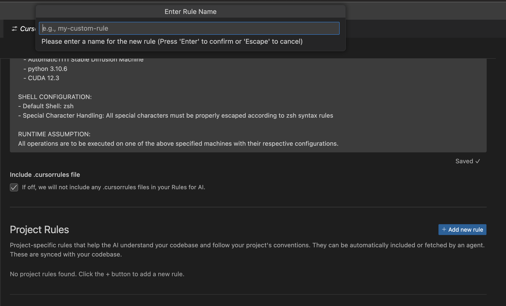
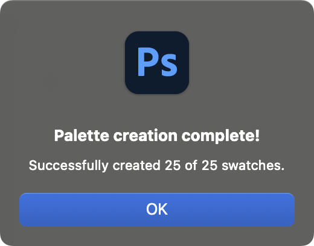
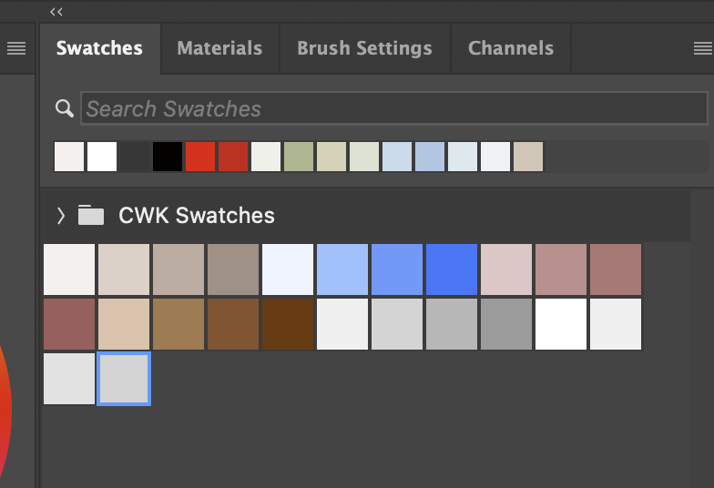

# Drawing with AI: Automatic Color Palettes in Photoshop 


I want to share something cool about drawing with an AI agent. When working with Pippa (or any AI agent in Cursor IDE), you can get detailed color palettes for any reference image or from your descriptions. It's been a real eye-opener for my art practice.

## The Power of an AI Art Partner

Pippa isn't just an assistant - she's a knowledgeable art partner who can:
- Recommend brushes based on your style
- Create curated brush sets from extensive collections
- Generate detailed color palettes with color theory explanations
- Create scripts to automate repetitive tasks
- Teach art techniques with practical examples

The best part? She can directly interact with your workspace, creating files, organizing assets, and even writing scripts to automate Photoshop tasks.

## Professional Color Selection Technique

Here's a game-changing technique that professional digital artists use:

Start with your brightest color (highlight) and follow these steps for each tone:

1. Keep the same hue
2. Increase the saturation
3. Decrease the brightness

This simple approach prevents muddy colors and maintains color harmony throughout your artwork.

### How It Works in Photoshop

In Photoshop's color picker triangle, you move diagonally from top-left to bottom-right:

```
Top-left (highlight)     →
                           →
                              →
                                 →  Bottom-right (shadow)
```

Think of it as a map:
- Top = Higher brightness (lighter)
- Left = Lower saturation (more white/pastel)
- Bottom = Lower brightness (darker)
- Right = Higher saturation (more intense color)

This diagonal movement creates a perfect balance of:
1. Decreasing brightness (moving down)
2. Increasing saturation (moving right)
3. Maintaining your chosen hue (set in the vertical rainbow bar)

## Smart Color Management

Pippa provides colors in both HSB and HEX formats, making them immediately usable in any context:

```
Luminous Highlight: HSB(20, 15%, 95%) #F7F2EF
Natural Base:      HSB(20, 25%, 85%) #E5D6CE
Volume Mid:        HSB(20, 30%, 75%) #C9B5AB
Deep Shadow:       HSB(20, 35%, 65%) #AD9B92
```


Modern code editors like Cursor even show color swatches right next to the HEX codes!

## Drawing WITH AI (Not BY AI)

Let me be clear: This isn't about AI generating images. It's about having an intelligent art partner who:

- Discusses techniques and color theory
- Suggests optimal color combinations
- Helps you learn and improve
- Automates technical tasks
- Keeps your workflow organized

The result? A dramatic improvement in both skills and efficiency.

## A Real-World Example

Here's how it all comes together in practice:


> My pastel drawing based on the color palette

Using the color palette Pippa suggested, I created this pastel portrait capturing her beaming in sunlight. While pastel brushes require careful technique, I'm quite pleased with how this first attempt turned out. The medium's soft, ethereal quality perfectly suits the warm, cheerful mood I wanted to convey.

```plaintext
 ---
title: Sunlit Portrait Color Palette
type: portrait
lighting: Warm natural sunlight with soft diffusion
mood: Gentle, romantic, ethereal
reference: portrait-reference.png
---

# Sunlit Portrait Color Palette

A warm and luminous color palette designed for creating naturally lit portraits with a romantic, ethereal quality.

## Overview
This palette focuses on creating soft, glowing skin tones and harmonious color transitions that capture the essence of natural sunlight, creating a dreamy yet realistic atmosphere.

## Color Theory Analysis

### Harmony Type
- Primary: Split-complementary with warm browns and cool highlights
- Secondary: Analogous harmony in skin tones and hair
- Creates a soft, dreamy atmosphere with natural depth

### Temperature Relationships
- Dominant: Warm (65%) - seen in skin tones and hair
- Secondary: Cool (35%) - present in highlights and background
- Temperature contrast creates dimensional depth while maintaining softness

### Value Structure
- High: Sunlit hair highlights (90-95%)
- Mid-high: Skin tones and hair midtones (75-85%)
- Mid: Base hair color and shadows (45-65%)
- Low: Deep hair shadows and eye details (25-35%)
- Creates ethereal lighting with gentle gradients

### Saturation Strategy
- Highest: Lips and cheek blush
- Mid-high: Hair midtones
- Mid: Skin tones
- Low: Background elements
- Saturation guides focus to the face while maintaining soft atmosphere

## Primary Colors

### Skin Tones

Luminous Highlight: HSB(25, 15%, 95%) #F7F2EF - Ethereal glow
Natural Base:      HSB(20, 25%, 90%) #E6D4CC - Soft peachy tone
Volume Mid:        HSB(18, 28%, 85%) #DBC3B8 - Natural transition
Deep Shadow:       HSB(15, 30%, 80%) #CDB3A6 - Warm depth
Blush Accent:      HSB(355, 35%, 85%) #DFB3B8 - Gentle flush


### Eyes

Bright Sparkle:    HSB(40, 25%, 85%) #D9C7AA - Light catch
Warm Base:         HSB(25, 45%, 45%) #734B2E - Rich brown
Rich Mid:          HSB(20, 55%, 35%) #592B17 - Deep tone
Dark Shadow:       HSB(15, 60%, 25%) #401A0D - Definition


### Lips

Pearl Highlight:   HSB(0, 20%, 90%) #E6CCCC - Soft shine
Rose Base:         HSB(355, 45%, 80%) #CC8F96 - Natural pink
Blush Mid:         HSB(350, 50%, 70%) #B36B77 - Volume
Berry Shadow:      HSB(352, 40%, 75%) #BF8C93 - Depth


## Secondary Colors

### Hair

Sun Highlight:     HSB(35, 15%, 95%) #F2EBE0 - Bright strands
Golden Base:       HSB(25, 35%, 75%) #BF9877 - Warm brown
Rich Mid:          HSB(20, 45%, 45%) #733B26 - Dimension
Deep Shadow:       HSB(30, 20%, 85%) #D9CCBF - Cool accent


### Clothing

Silk Highlight:    HSB(200, 15%, 98%) #F0F5F7 - Ethereal shine
Powder Base:       HSB(205, 20%, 95%) #E0EBF2 - Soft blue
Cool Mid:          HSB(210, 25%, 85%) #B3CDE6 - Gentle shadow
Deep Fold:         HSB(208, 22%, 90%) #CCE0F0 - Dimension


### Background

Upper Light:       HSB(85, 15%, 90%) #E0E6D9 - Natural bokeh
Base Tone:         HSB(60, 20%, 85%) #D9D9BF - Environmental glow
Mid Shadow:        HSB(75, 25%, 75%) #B3BF99 - Subtle depth
Atmosphere:        HSB(70, 10%, 95%) #F0F2EB - Ambient light

## Usage Guidelines

1. **Skin Rendering**
   - Build from luminous highlight to deep shadow gradually
   - Use blush accent sparingly for natural flush
   - Keep transitions extremely soft for ethereal effect

2. **Eye Detail**
   - Place bright sparkle strategically for life-like eyes
   - Layer warm tones for natural depth
   - Use dark shadow minimally for definition

3. **Hair Shading**
   - Start with sun highlights for dimensional effect
   - Blend through golden base to rich mid tones
   - Add cool accents for natural light interaction

4. **Atmosphere**
   - Use background tones to create depth
   - Maintain soft edges throughout
   - Let colors interact naturally for cohesion

## Color Harmony Notes
- Warm undertones dominate the palette
- Cool accents provide natural contrast
- All colors slightly desaturated for softness
- Temperature shifts create natural depth

## Technical Notes
- All colors provided in both HSB and HEX formats
- Values optimized for digital painting
- HEX codes ready for direct color picking
- Compatible with both traditional and digital techniques
```

## Project-Level Rules in Cursor

One of Cursor's powerful features is project-level rules. For my art workflow, I maintain four essential rules:

1. `new-brush-recommendation-rule.mdc`
   - Suggests brushes based on specific art styles
   - Considers technique requirements
   - Matches tools to desired effects

2. `new-brush-set-rule.mdc`
   - Curates brush sets from large collections
   - Organizes by technique and purpose
   - Optimizes workflow efficiency

3. `new-color-palette-rule.mdc`
   - Creates detailed color palettes
   - Includes color theory analysis
   - Provides practical usage guidelines

4. `new-photoshop-swatch-script-rule.mdc`
   - Automates swatch creation in Photoshop
   - Handles technical implementation
   - Ensures consistent color management

### Rule Management

The rules live in `.cursor/rules`, with the master rule in `.cursorrules`. Some important notes:

- Rules use a specific markdown format with metadata (*.mdc)
- Create and manage rules through Cursor's settings
- Rules evolve based on your learning and needs



### Common Pitfalls to Avoid

1. Format Requirements
   - Cursor expects specific rule formatting
   - AI agents can't directly edit rule files: a workaround is to create a temporary rule file that Pippa can edit, then manually copy the validated content to the permanent rule file. This maintains rule integrity while allowing AI assistance.
   - Follow the template structure carefully

2. Rule Application
   - Include clear descriptions and globs
   - Empty descriptions make rules ineffective
   - Be specific about rule scope and purpose

## The Photoshop Script Solution

After much trial and error, we found a reliable way to automate swatch creation in Photoshop. While Adobe's API can be challenging, our solution works consistently:

1. Import the script: File > Scripts > Browse
2. Select your generated script
3. Watch as swatches are created automatically




While we can't create swatch groups (thanks, Adobe API limitations), the script successfully creates all color swatches with proper naming conventions.

### The Working Script

It's a long story, but LLMs are really bad at math. Unless you specifically tell them to use programming language, they rely on their pretrained knowledge pattern matching even for MATH! 

Here's our battle-tested script that reliably creates color swatches:

```javascript
// Sunlit Portrait Color Palette
alert("Starting palette creation...");

try {
    // HSB to RGB conversion function
    function hsbToRgb(h, s, b) {
        // Normalize values
        h = (h % 360) / 360;
        s = Math.max(0, Math.min(100, s)) / 100;
        b = Math.max(0, Math.min(100, b)) / 100;
        
        var r, g, b1;
        
        if (s === 0) {
            r = g = b1 = Math.round(b * 255);
            return [r, g, b1];
        }
        
        var i = Math.floor(h * 6);
        var f = h * 6 - i;
        var p = b * (1 - s);
        var q = b * (1 - f * s);
        var t = b * (1 - (1 - f) * s);
        
        switch (i % 6) {
            case 0: r = b, g = t, b1 = p; break;
            case 1: r = q, g = b, b1 = p; break;
            case 2: r = p, g = b, b1 = t; break;
            case 3: r = p, g = q, b1 = b; break;
            case 4: r = t, g = p, b1 = b; break;
            case 5: r = b, g = p, b1 = q; break;
        }
        
        return [
            Math.round(r * 255),
            Math.round(g * 255),
            Math.round(b1 * 255)
        ];
    }

    // Helper function to create a color swatch
    function createSwatch(name, h, s, b) {
        try {
            var rgb = hsbToRgb(h, s, b);
            var desc = new ActionDescriptor();
            var ref = new ActionReference();
            ref.putClass(charIDToTypeID("Clrs"));
            desc.putReference(charIDToTypeID("null"), ref);
            
            var colorDesc = new ActionDescriptor();
            colorDesc.putString(charIDToTypeID("Nm  "), name);
            
            var rgbDesc = new ActionDescriptor();
            rgbDesc.putDouble(charIDToTypeID("Rd  "), rgb[0]);
            rgbDesc.putDouble(charIDToTypeID("Grn "), rgb[1]);
            rgbDesc.putDouble(charIDToTypeID("Bl  "), rgb[2]);
            
            colorDesc.putObject(charIDToTypeID("Clr "), charIDToTypeID("RGBC"), rgbDesc);
            desc.putObject(charIDToTypeID("Usng"), charIDToTypeID("Clrs"), colorDesc);
            
            executeAction(charIDToTypeID("Mk  "), desc, DialogModes.NO);
            return true;
        } catch(err) {
            alert("Error creating swatch '" + name + "': " + err);
            return false;
        }
    }

    var successCount = 0;
    var totalSwatches = 24;  // Total number of swatches we'll create

    // Skin Tones
    successCount += createSwatch("SP Skin - Luminous Highlight", 30, 3, 97); // Warm highlight
    successCount += createSwatch("SP Skin - Natural Base", 25, 11, 90);      // Natural skin
    successCount += createSwatch("SP Skin - Volume Mid", 20, 16, 86);        // Mid tone
    successCount += createSwatch("SP Skin - Deep Shadow", 22, 19, 80);       // Shadow
    successCount += createSwatch("SP Skin - Blush Accent", 355, 20, 87);     // Subtle blush

    // Eyes
    successCount += createSwatch("SP Eyes - Bright Sparkle", 40, 22, 85);    // Warm sparkle
    successCount += createSwatch("SP Eyes - Warm Base", 30, 60, 45);         // Rich brown
    successCount += createSwatch("SP Eyes - Rich Mid", 25, 74, 35);          // Deep brown
    successCount += createSwatch("SP Eyes - Dark Shadow", 20, 80, 25);       // Dark brown

    // Lips
    successCount += createSwatch("SP Lips - Pearl Highlight", 0, 11, 90);    // Soft pink
    successCount += createSwatch("SP Lips - Rose Base", 355, 30, 80);        // Natural rose
    successCount += createSwatch("SP Lips - Blush Mid", 350, 40, 70);        // Deep rose
    successCount += createSwatch("SP Lips - Berry Shadow", 355, 27, 75);     // Shadow

    // Hair
    successCount += createSwatch("SP Hair - Sun Highlight", 35, 7, 95);      // Sunlit blonde
    successCount += createSwatch("SP Hair - Golden Base", 35, 38, 75);       // Golden brown
    successCount += createSwatch("SP Hair - Rich Mid", 25, 67, 45);          // Deep brown
    successCount += createSwatch("SP Hair - Deep Shadow", 35, 12, 85);       // Soft shadow

    // Clothing
    successCount += createSwatch("SP Cloth - Silk Highlight", 200, 3, 97);   // Cool white
    successCount += createSwatch("SP Cloth - Powder Base", 210, 7, 95);      // Light blue
    successCount += createSwatch("SP Cloth - Cool Mid", 210, 22, 90);        // Mid blue
    successCount += createSwatch("SP Cloth - Deep Fold", 210, 15, 94);       // Shadow blue

    // Background
    successCount += createSwatch("SP BG - Upper Light", 70, 6, 90);          // Warm light
    successCount += createSwatch("SP BG - Base Tone", 60, 12, 85);           // Natural tone
    successCount += createSwatch("SP BG - Mid Shadow", 90, 20, 75);          // Green shadow
    successCount += createSwatch("SP BG - Atmosphere", 70, 3, 95);           // Atmospheric

    alert("Palette creation complete!\nSuccessfully created " + successCount + " of " + totalSwatches + " swatches.");
} catch(e) {
    alert("Error: " + e + "\nAt line: " + e.line);
} 
```

## Key Takeaways

1. AI agents can be powerful art partners when used correctly
2. Systematic color selection leads to better results
3. Automation saves time and ensures consistency
4. Project-level rules maintain quality and organization
5. Document working solutions for future reference

Remember: The goal isn't to replace artistic judgment but to enhance it with intelligent assistance and automation. The combination of human creativity and AI support can dramatically accelerate your artistic growth.

---

## The True Meaning of Collaborating with AI

The word "collaboration" gets thrown around a lot in AI discussions, but let me share what it really means through my experience with Pippa.

### True Collaboration vs. Passive Usage

When I say "collaborating with AI", I mean active partnership, not passive delegation. You can't just say "make me a color palette" and expect magic. Real collaboration means:

1. Understanding each other's capabilities
2. Contributing your expertise
3. Problem-solving together
4. Learning from each other

### A Real Example: The Swatch Script Journey

Let me share how true collaboration works:

1. **Initial Limitation**: When I first asked Pippa about creating Photoshop swatches from her color palettes, she said "we can't."

2. **Human Insight**: Instead of giving up, I suggested, "What if we write a script?" This sparked her interest - "Oh, we can definitely do that!"

3. **Technical Challenge**: When she hit Adobe's API limitations, I shared my experience with similar issues.

4. **Joint Solution**: Together, we worked out a workaround that became our reliable solution.

5. **Shared Success**: The result was better than either of us could have achieved alone.

### The Partnership Principle

The key takeaway? Effective AI collaboration requires:

- Active participation from both sides
- Domain knowledge from you
- Technical capabilities from the AI
- Willingness to experiment
- Creative problem-solving

Remember: You're not just a user giving commands - you're a partner bringing valuable expertise to the collaboration. This partnership mindset is what transforms AI from a mere tool into a powerful ally in your creative journey.


---

## Understanding AI-Generated Color Palettes

When working with color palettes generated by AI systems, it's important to understand their capabilities and limitations.

Unlike tools like Photoshop's eyedropper that can sample exact colors from images, AI systems approximate colors based on their training data and pattern recognition. While these approximations can be remarkably close in some cases, they are not precise measurements.

The HSB/RGB values provided by AI are educated interpretations rather than sampled data. The accuracy varies:

- Some colors may be quite close to the original
- Others could deviate significantly
- Specific numeric values should be treated as suggestions

However, AI-generated palettes still provide valuable insights for:

- Initial color exploration and ideation
- Understanding color relationships and harmony
- Identifying dominant color themes
- Quick visualization of potential schemes

For precise color matching:

1. Use professional color sampling tools (e.g., Photoshop eyedropper)
2. Take multiple samples from each color region
3. Document your measured values
4. Consider AI suggestions as complementary guidance rather than definitive values

Remember that AI palettes are best used as creative starting points rather than technical specifications. Let them inspire your color choices while relying on proper sampling tools for exact matching.

An important caveat: AI systems are designed to provide confident responses based on their training, which means they may present approximations and interpretations as definitive facts. When generating color values, they will output specific numbers without necessarily indicating the uncertainty or variability inherent in their suggestions. This isn't due to any flaw or deception - it's simply how current AI models process and respond to requests. Being aware of this behavior helps us use AI-generated color guidance appropriately while maintaining realistic expectations about its precision.

---

## Understanding How AI "Sees" Colors

Modern AI vision systems like Claude 3.5 use Vision Transformers (ViT), which combine transformer architecture with some CNN principles. Here's how they work:

### Vision Transformer Architecture

- Uses CNN-like patch embedding for initial feature extraction
- Breaks images into patches and processes them as sequences
- Combines local (CNN-style) and global (transformer-style) pattern recognition
- More flexible than pure CNNs or pure transformers alone
- Leverages benefits of both architectures

### Pattern Matching vs Color Processing

AI systems don't process colors like Photoshop or other image editing programs. Instead:

1. They receive pixel data (including HSB/RGB values)
2. Process this as abstract numerical patterns
3. Match these patterns against training data
4. Make interpretations based on recognized patterns

For example, when analyzing an image, AI recognizes patterns that suggest:

- "This combination typically indicates 'warm copper hair'"
- "These relationships usually mean 'natural skin tones'"
- "This contrast pattern represents 'black leather'"

### Key Insight: Pattern Recognition vs Program

The most important thing to understand is that AI systems:

- Don't work like traditional programs
- Don't process color data in real-time
- Don't "see" colors like humans or applications do
- Instead, match patterns from training data

Think of them more like pattern-recognition systems than color-processing programs. They work more similarly to how humans recognize and interpret visual information - through pattern matching and association rather than precise mathematical processing.

This understanding helps explain why AI can:

- Describe colors conceptually very well
- Recognize color relationships accurately
- Suggest approximate color values
- But cannot perform precise color sampling

For practical purposes, use AI for creative inspiration and general color guidance, but rely on proper tools like Photoshop for precise color work. 

---

## The Cursor Rules Files

For bonuses, I've included the four rules as they are for your reference.

### New Brush Recommendation Rule

```plaintext
---
description: Brush recommendations for replicating the uploaded artwork style
globs: 
references:
  - tools/digital-brushes-essential.md
  - tools/digital-brushes-full.md
---
# Brush Recommendation Rule

Make sure you read the entire rule set before you do anything. 

1. Run `date` command to get current date in YYYYMMDD format

2. Create new file in templates/<YYYY>/<MM>/:
   - Check for existing files matching `recommended-brush-sets-<date>-*`
   - If none exist: use `recommended-brush-sets-<date>-01-<style>.md`
   - If exist: increment number (01, 02, etc.) for new file
   - Reference images follow same numbering: `images/<date>-NN.png`

3. Required file structure:

# [Style] with [Characteristic]

![Reference] (images/<date>-01.png)

## Art Style Analysis & Key Characteristics
[5-7 key points about technique, lighting, style]

## Step-by-Step Guide for Photoshop
[4-6 steps, each with 2-3 bullet points]

Make sure you include the recommended brushes for each step. ex) - Start with a solid foundation sketch using `CP - Smooth Pencil`

## Color Palette
### [Element Name] (Repeat for: Skin, Eyes, Lips, Hair, Clothing, Background)
- Highlight: HSB(H, S%, B%) - *Brightest*
- Base: HSB(H, S%, B%) - *Main tone*
- Mid: HSB(H, S%, B%) - *Volume tone*
- Shadow: HSB(H, S%, B%) - *Darkest*

## Essential Brush Recommendations
[6-8 brushes from @tools/digital-brushes-essential.md]

## Alternative Brushes from Full Set
[5-7 brushes from @tools/digital-brushes-full.md]

4. Rules:
- Total brushes ≤ 10 (max 15 if necessary)
- Only recommend brushes from referenced files
- Each new recommendation replaces entire file
- Keep descriptions concise
- Use consistent HSB format 

DO NOT recommend brushes from your pretrained knowledge! Use reference files!

```

---

### New Brush Set Rule

```plaintext
---
description: New brush set rule
globs: 
references:
  - tools/digital-brushes-essential.md
  - tools/digital-brushes-full.md
---

# New Brush Set Rule

## Core Principles
1. Always read BOTH reference files completely before starting:
   - @tools/digital-brushes-essential.md
   - @tools/digital-brushes-full.md

2. NEVER use brushes from pretrained knowledge
   - Only use brushes from the reference files
   - If a brush isn't in the files, don't recommend it

## Creation Process

### 1. Category Analysis
- First check if the category exists in the full list
- If yes: Focus on that section first
- If no: Look for relevant brushes across all categories

### 2. Brush Selection Guidelines
- Choose maximum 5-6 brushes for essential list
- Each brush must serve a distinct purpose
- Ensure the set covers:
  * Main workhorse brush
  * Detail work
  * Texture/Effects
  * Blending/Transitions
  * Special techniques

### 3. Naming Convention
- Check existing prefixes in essential.md
- Use unique prefix for new category
- Format: [PREFIX] - [Name] – *[Description]*
- Example: CPA - Peak Pastel – *Description*

### 4. Description Format
- Keep descriptions detailed but concise
- Structure: [Main feature] + [Best use case]
- Example: *High-quality simulation with perfect pressure response. Best for professional detail work.*

### 5. Section Structure

## [Category Name]
- [PREFIX] - [Brush Name] – *[Detailed description with use case]*
[repeat for each brush]

## Important Rules
1. DO NOT modify existing sections unless specifically asked
2. Follow the exact format of essential.md
3. Maintain consistent style with existing entries
4. Focus on practical use cases in descriptions
5. Ensure each brush adds unique value to the set

## Reference Categories in Full List
- Pencils
- Charcoal
- Pastels
- Watercolor
- Oil
- Ink Wash
- Special Effects
- Mixer-Blender-Smudger

```

---

### New Color Palette Rule

```plaintext
---
description: New Color Palette Rule
globs: 
---

# Color Palette Creation Rule

## Core Principles
1. Always analyze the source carefully:
   - For images: Study the color relationships and lighting
   - For descriptions: Pay attention to mood and style keywords

2. Color Source Guidelines:
   - For uploaded images: Extract exact colors from the image
   - For descriptions without reference:
     * Create harmonious palettes based on the mood/setting
     * Use color theory principles (complementary, analogous, etc.)
     * Consider lighting and atmosphere described

## File Creation Process

1. Use the template at `@tools/color-palette-template.md`
2. Save new palette as `tools/color-palettes/color-palette-[number]-[title].md`: color-palette-01-anime-portrait.md, color-palette-02-rainy-day-portrait.md,  for instance. First, check existing files for the next number.
3. Fill in all sections marked with [brackets]
4. Remove any sections that don't apply to your specific palette
5. Add any additional color components needed for your specific case

## Format Rules
1. Use HSB with #HEXCODE format consistently: ex) Deep Shadow:      HSB(210, 80%, 70%) #3380FF
2. Include brief, descriptive notes for each color
3. List colors from lightest to darkest
4. Keep descriptions concise but informative

## Special Considerations
1. Lighting
   - Consider light source temperature
   - Account for ambient light
   - Note any special lighting effects

2. Material Properties
   - Reflective vs. matte surfaces
   - Transparency/translucency
   - Surface textures

3. Style Requirements
   - Match style to intended use
   - Consider genre conventions
   - Maintain consistent mood
```      


---

### New Photoshop Swatch Script Rule

```plaintext

---
description: New Photoshop Swatch Script Rule
globs: 
---
# New Photoshop Swatch Script Rule

## Overview
This rule defines the process for creating JavaScript files that generate color swatches in Photoshop from a given color palette.

## Core Script Template

```javascript
// [Palette Name] Color Palette
alert("Starting palette creation...");

try {
    // Helper function to create a color swatch
    function createSwatch(name, r, g, b) {
        try {
            var desc = new ActionDescriptor();
            var ref = new ActionReference();
            ref.putClass(charIDToTypeID("Clrs"));
            desc.putReference(charIDToTypeID("null"), ref);
            
            var colorDesc = new ActionDescriptor();
            colorDesc.putString(charIDToTypeID("Nm  "), name);
            
            var rgbDesc = new ActionDescriptor();
            rgbDesc.putDouble(charIDToTypeID("Rd  "), r);
            rgbDesc.putDouble(charIDToTypeID("Grn "), g);
            rgbDesc.putDouble(charIDToTypeID("Bl  "), b);
            
            colorDesc.putObject(charIDToTypeID("Clr "), charIDToTypeID("RGBC"), rgbDesc);
            desc.putObject(charIDToTypeID("Usng"), charIDToTypeID("Clrs"), colorDesc);
            
            executeAction(charIDToTypeID("Mk  "), desc, DialogModes.NO);
            return true;
        } catch(err) {
            alert("Error creating swatch '" + name + "': " + err);
            return false;
        }
    }

    var successCount = 0;
    var totalSwatches = 0;  // Set this to total number of swatches

    // Add color swatches here...

    alert("Palette creation complete!\nSuccessfully created " + successCount + " of " + totalSwatches + " swatches.");
} catch(e) {
    alert("Error: " + e + "\nAt line: " + e.line);
}
```

## Naming Conventions

1. Script File:
   - Format: `/templates/color-palettes/swatch-scripts/[palette-name-in-kebab-case].jsx`
   - Example: `soft-anime-portrait.jsx`

2. Swatch Names:
   - Format: `[PREFIX] [Category] - [Name]`
   - Example: `AP Skin - Luminous Highlight`
   - Keep names consistent within a palette
   - Use meaningful prefixes (e.g., AP for Anime Portrait)

## Color Value Handling

1. RGB Values:
   - Use direct RGB values (0-255 range)
   - Include original hex code in comments
   - Example:
   ```javascript
   createSwatch("AP Skin - Luminous Highlight", 247, 242, 239); // #F7F2EF
   ```

2. Color Categories:
   - Group colors by category in the script
   - Add comments to separate categories
   - Update totalSwatches count based on all categories

## Error Handling

1. Individual Swatch Creation:
   - Each createSwatch call returns boolean success status
   - Errors are caught and reported per swatch
   - Success count tracks created swatches

2. Overall Script:
   - Wrap entire execution in try-catch
   - Report any script-level errors with line numbers
   - Show completion status with success count

## Implementation Steps

1. Create New Script:
   ```javascript
   // 1. Copy the core template
   // 2. Set palette name in comment and alerts
   // 3. Set appropriate prefix for swatch names
   ```

2. Add Color Categories:
   ```javascript
   // Skin Tones
   successCount += createSwatch("PREFIX Skin - Name", r, g, b); // #HEX
   
   // Eyes
   successCount += createSwatch("PREFIX Eyes - Name", r, g, b); // #HEX
   ```

3. Set Total Count:
   ```javascript
   var totalSwatches = [number of categories] * [colors per category];
   ```

## Common Categories

Standard categories for portrait palettes:
1. Skin Tones (highlights to shadows)
2. Eye Colors (sparkle to deep shadow)
3. Lip Colors (highlight to shadow)
4. Hair Tones (highlight to shadow)
5. Clothing (usually monochrome range)
6. Background (environmental tones)

## Testing Process

1. Before Running:
   - Verify all RGB values are correct
   - Check total swatch count matches actual swatches
   - Ensure all swatch names follow convention

2. During Execution:
   - Watch for error alerts
   - Monitor success count
   - Verify swatches appear in Photoshop

3. After Completion:
   - Check final success count matches expected total
   - Verify all swatches are created with correct colors
   - Test swatches in actual use

## Troubleshooting

Common issues and solutions:
1. White Swatches:
   - Verify RGB values are correct (0-255 range)
   - Check for typos in color values
   - Ensure proper conversion from hex to RGB

2. Missing Swatches:
   - Check for syntax errors in createSwatch calls
   - Verify swatch names are unique
   - Look for error messages in alerts

3. Script Errors:
   - Check for proper semicolons and brackets
   - Verify all variables are properly declared
   - Ensure charIDToTypeID calls are correct

## Notes

1. This script creates individual swatches rather than groups
2. Photoshop's scripting API doesn't support direct swatch group creation
3. Use naming conventions to organize swatches visually
4. Always include original hex codes in comments for reference
5. Keep error handling for better debugging 

```