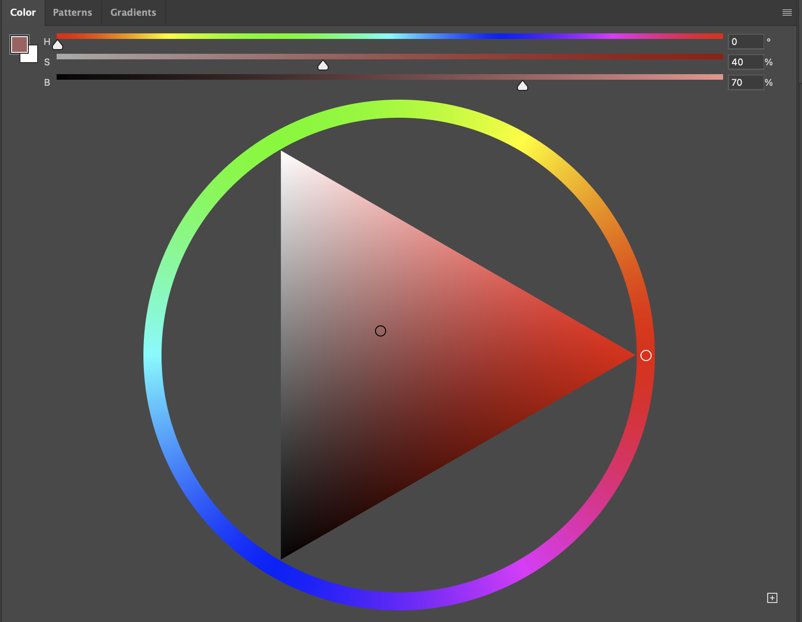

# Beginner’s Guide to Color Theory for Digital Painting (HSB Focus)

*Note: This is a comprehensive Deep Research guide, created with OpenAI’s o3-mini-high model.*

Color is one of the most important aspects of digital painting. This guide will introduce you to basic color theory in a **beginner-friendly** way, focusing on the HSB system (Hue, Saturation, Brightness) and how to use it in digital painting. We’ll also touch on RGB where necessary and cover practical tips on using Photoshop’s color wheel, choosing colors for shadows and highlights, understanding color schemes, maintaining color harmony, and creating depth and atmosphere with color. Let’s get started!

## HSB vs RGB: Understanding the Color Models

**HSB (Hue, Saturation, Brightness)** is a way to describe colors in terms of how we naturally see them. It breaks color into three parts: 
- **Hue (H)** – the basic color (red, blue, green, etc.), measured as a position on the color wheel from 0° to 360°. (Black, white, and gray have no hue.)
- **Saturation (S)** – how pure or intense the color is. 100% saturation is a vivid, pure color; lower saturation makes the color more muted or grayish ([HSB Color Mode: Achieve Harmonious Color Palettes With Ease](https://www.tourboxtech.com/en/news/hsb-color.html?srsltid=AfmBOordZWF0gbmDvrDoozYIltzIxnXtN4PCbd_R3Y1_EGVhn_N1Z5eX#:~:text=Saturation%20,that%20are%20closer%20to%20grayscale)).
- **Brightness (B)** – how light or dark the color is. 100% brightness is fully bright (for example, pure white for a fully desaturated color), and 0% brightness is black ([HSB Color Mode: Achieve Harmonious Color Palettes With Ease](https://www.tourboxtech.com/en/news/hsb-color.html?srsltid=AfmBOordZWF0gbmDvrDoozYIltzIxnXtN4PCbd_R3Y1_EGVhn_N1Z5eX#:~:text=)).

In contrast, **RGB (Red, Green, Blue)** describes color by the amounts of red, green, and blue light that mix to produce it (each on a 0–255 scale in digital art). RGB is how computer screens **technically** display color (mixing light), but it’s not very intuitive for choosing colors as an artist ([The HSB Color System: A Practitioner's Primer – Learn UI Design](https://learnui.design/blog/the-hsb-color-system-practicioners-primer.html#:~:text=And%20while%20this%20legit%20sounds,computers%20talk%20about%20color%20%E2%80%8D%E2%99%82%EF%B8%8F)). HSB is **more human-friendly and intuitive** – it describes color the way we talk about it in real life (for example, calling something a “dark reddish-brown” refers to a hue (red), darkness (brightness), and a bit of brownish grayness (saturation)) ([adobe photoshop - What is HSB really? - Graphic Design Stack Exchange](https://graphicdesign.stackexchange.com/questions/18719/what-is-hsb-really#:~:text=HSB%20,intuitively%20than%20with%20RGB%20numbers)). 

In practical terms, both HSB and RGB represent the **same colors**, but HSB makes it easier for painters to pick and adjust colors:
- With **HSB**, you can choose a hue (the color family), then adjust saturation and brightness without changing the hue. This aligns with how we think of tinting or shading a color ([HSB Color Mode: Achieve Harmonious Color Palettes With Ease](https://www.tourboxtech.com/en/news/hsb-color.html?srsltid=AfmBOordZWF0gbmDvrDoozYIltzIxnXtN4PCbd_R3Y1_EGVhn_N1Z5eX#:~:text=HSB%20mode%20allows%20you%20to,only%20one%20of%20the%20parameters)).
- With **RGB**, changing brightness or color often means juggling three values at once, which can accidentally shift the hue. It’s harder to say “make this color a bit darker” in RGB terms, whereas in HSB you just lower the B (Brightness) value.

**Key point:** HSB is basically the same as the HSV system (Hue, Saturation, Value) often used in art software. It’s designed to describe color in an intuitive way ([HSB Color Mode: Achieve Harmonious Color Palettes With Ease](https://www.tourboxtech.com/en/news/hsb-color.html?srsltid=AfmBOordZWF0gbmDvrDoozYIltzIxnXtN4PCbd_R3Y1_EGVhn_N1Z5eX#:~:text=HSB%20color%20mode%20is%20based,components%3A%20hue%2C%20saturation%2C%20and%20brightness)). You’ll still ultimately be creating RGB colors on a screen, but using HSB in your software makes color selection simpler.

## Using Photoshop’s HSB Color Wheel (Triangular Color Picker)

Photoshop’s color picker can be used in an HSB mode that many artists find convenient. It often appears as a **color wheel with a triangle inside** (a common layout in digital painting tools). Here’s how to use it effectively:

1. **Select the Hue (Color):** Use the outer circle or a slider to pick the hue you want. Hue is represented as an angle on the color wheel (0°–360°). For example, 0° is red, 120° is green, 240° is blue ([The HSB Color System: A Practitioner's Primer – Learn UI Design](https://learnui.design/blog/the-hsb-color-system-practicioners-primer.html#:~:text=around%20the%20circle%3A)). When you pick a hue, you’re choosing the base color family.

2. **Adjust Saturation and Brightness:** Inside the triangle (or square) color area, you can adjust the saturation and brightness of that hue:
   - **Saturation** typically increases from one side of the triangle to the other (for instance, left to right) – as you move the selector toward the pure hue side, the color becomes more intense (less gray) ([Choose colors in Adobe Photoshop](https://helpx.adobe.com/photoshop/using/choosing-colors.html#:~:text=Using%20the%20HSB%20color%20model%2C,from%20the%20bottom%20to%20top)).
   - **Brightness** changes along the other axis (for example, bottom to top) – moving upward (or toward the white corner) makes the color lighter (brighter), while moving toward the black corner makes it darker ([Choose colors in Adobe Photoshop](https://helpx.adobe.com/photoshop/using/choosing-colors.html#:~:text=Using%20the%20HSB%20color%20model%2C,from%20the%20bottom%20to%20top)).
   - In a **triangular color picker** (like in some Photoshop plugins or Corel Painter), the three corners usually represent: the pure hue (fully saturated color), **white** (high brightness, zero saturation), and **black** (zero brightness). Any point inside is a mix of those. 
     - *Tip:* To get a **highlight** tint of your chosen color, pick a point closer to the white corner (high Brightness, slightly lower Saturation). To get a **shade** for shadows, move closer to the black corner (lower Brightness) ([Choose colors in Adobe Photoshop](https://helpx.adobe.com/photoshop/using/choosing-colors.html#:~:text=Using%20the%20HSB%20color%20model%2C,from%20the%20bottom%20to%20top)). If you want a more muted tone, move toward the gray center (lower Saturation).

3. **Fine-tune as needed:** One advantage of using the HSB color wheel is that you can lock in one attribute and adjust another. For example, if you want to try a brighter version of your color, you can increase the B value (or drag upward in the picker) without changing the hue you chose ([HSB Color Mode: Achieve Harmonious Color Palettes With Ease](https://www.tourboxtech.com/en/news/hsb-color.html?srsltid=AfmBOordZWF0gbmDvrDoozYIltzIxnXtN4PCbd_R3Y1_EGVhn_N1Z5eX#:~:text=HSB%20mode%20allows%20you%20to,only%20one%20of%20the%20parameters)). This is much easier than trying to tweak RGB sliders to get a lighter or darker color.

4. **Observe the numeric values (optional):** Photoshop will show you the HSB values as you pick a color. You can notice that Saturation and Brightness are given in percentages, and Hue as an angle in degrees. This helps you understand what changes you are making. For instance, a color might be H=30°, S=80%, B=90% (a bright, saturated orange). If you want it duller, you might drop S to 50%. If you want it darker, drop B to 50%. You can watch these numbers or simply eyeball the color in the picker.

**Using the triangular color wheel effectively** means understanding that any color you pick is a combination of these three factors. Many artists find it useful to **pick the hue first**, then worry about how light/dark or dull/vibrant it needs to be. The triangle (or square) color field lets you visually choose those variations. By starting with HSB, you ensure you’re thinking in terms of actual color properties (hue, lightness, intensity) rather than arbitrary numbers.

*Example:* Suppose you want to paint foliage. You might choose a green hue around 120°. For a base mid-tone, you set saturation around 60% and brightness around 50-60% (a moderately saturated medium green). For highlights on the leaves, you can click a slightly lighter and less saturated point (higher B, slightly lower S – a yellowish light green). For the shadowed parts, you click a darker, maybe slightly more saturated green (lower B, maybe a tad higher S – a deep rich green rather than pure blackish green). All of this is easily done with the color triangle by moving within the same hue. If you tried using just RGB sliders, it would be more trial-and-error. With the HSB color picker, it “just makes sense” because you’re using the **hue-saturation-brightness logic** that matches our intuition ([HSB Color Mode: Achieve Harmonious Color Palettes With Ease](https://www.tourboxtech.com/en/news/hsb-color.html?srsltid=AfmBOordZWF0gbmDvrDoozYIltzIxnXtN4PCbd_R3Y1_EGVhn_N1Z5eX#:~:text=Taking%20Photoshop%20as%20an%20example%2C,to%20select%20the%20desired%20colors)).

## Choosing Colors for Your Painting: Base Colors, Shadows, and Highlights

When starting a digital painting, you’ll pick various colors for your base local colors, as well as for shading (shadows) and highlights. Here are some simple guidelines to choose those colors effectively using HSB, instead of just using black or white which can make colors look flat:

- **Base Color:** Begin with the *local color* of the object or area. This is the color it is under normal lighting. Using the HSB color wheel, choose an appropriate hue and set saturation/brightness to a middle range. For example, if you’re painting a red apple, you might start with a medium red (Hue ~0°, Saturation fairly high like 70-80%, Brightness maybe around 50-60% for a mid-tone). This base color will be what shows in areas neither in strong light nor in deep shadow.

- **Shadows (Shading):** When adding shadows, **avoid just picking pure black or simply lowering brightness to 0** – that can make your painting look muddy or unnatural. Instead, pick a darker **shade** of your base color:
  - Lower the **Brightness** (B) value to make it darker, but consider also adjusting **Saturation** and even **Hue** slightly. Often, shadows can be a bit more saturated or shifted to a cooler hue. For example, a red object’s shadows might shift a tiny bit towards purple or brown and become slightly more saturated as it darkens, to keep the color rich.
  - A handy rule of thumb: **Darker shade = decrease brightness, *often* increase saturation** ([HSB Color Mode: Achieve Harmonious Color Palettes With Ease](https://www.tourboxtech.com/en/news/hsb-color.html?srsltid=AfmBOordZWF0gbmDvrDoozYIltzIxnXtN4PCbd_R3Y1_EGVhn_N1Z5eX#:~:text=,Increased%20saturation%20%2B%20decreased%20brightness)). When you make a color darker in HSB, adding a bit of saturation can prevent it from looking gray. This mimics how in real life a shadow area might still hold some color. For instance, to shade that red apple, you could take the base red and lower the brightness and bump up saturation a little – you get a deep red rather than black. 
  - Depending on the lighting, you might also shift the hue slightly. Many artists use the guideline “**warm light, cool shadows**” or vice versa. If the light in your scene is warm (say sunset orange), shadows might appear cooler (toward bluish or purplish). In HSB terms, that means you might pick a shadow color with a hue a bit rotated on the wheel (e.g., a touch more purple/blue for a shadow on a warm-lit object). This can add realism and interest. *For example:* In a scene lit by a golden sun, a gray surface might not have neutral gray shadows – the shadows could skew bluish due to the cool ambient light. One artist example: using a **blue tone to shade** skin when the light was warm, which made the shadowed areas more visually interesting ([How should I choose color for highlights and shadows? : r/learnart](https://www.reddit.com/r/learnart/comments/cq7i5l/how_should_i_choose_color_for_highlights_and/#:~:text=Here%27s%20an%20example%20of%20something,as%20highlights%20on%20the%20body)).
  - **Match the environment:** Another approach is to have shadows take on the color of ambient light or surroundings. If your object is near green foliage, the shadows might have a green tint from reflected light. In digital painting, you can achieve this by slightly adjusting the hue of your shadow color towards that ambient color. The key is that the hue usually doesn’t change *drastically* – just a subtle tweak can do a lot.

- **Highlights:** For highlights or lit areas, you’ll do the opposite of shadows in some ways. **Lighten the color** by increasing the Brightness value. Often, as colors get very bright, they appear a bit **desaturated** (because intense light can wash out color). So a good guideline: **Lighter highlight = increase brightness, *slightly* decrease saturation** ([HSB Color Mode: Achieve Harmonious Color Palettes With Ease](https://www.tourboxtech.com/en/news/hsb-color.html?srsltid=AfmBOordZWF0gbmDvrDoozYIltzIxnXtN4PCbd_R3Y1_EGVhn_N1Z5eX#:~:text=,Increased%20saturation%20%2B%20decreased%20brightness)). For example, the apple’s highlight where light hits it directly might be a lighter, slightly less saturated version of the local red. It might even shift a bit towards the light’s color. If the light is white, the highlight might just be a pale pink or nearly white spot. If the light is colored (say a yellow lamp), the highlight on a surface may take on that hue (a yellowish tint) ([Color Theory for Digital Artists | Art Rocket](https://www.clipstudio.net/how-to-draw/archives/161372#:~:text=What%20happens%20when%20the%20light,the%20grey%20ball%20is%20yellow)). 
  - Think of **what color the light is.** In our apple example, under white light the highlight is just a lighter red (nearly whitish-pink). Under a strong yellow light, the highlight might lean orange. *Real-world example:* A gray object in a warm environment with a yellow sun will have **yellow highlights** (from the sun) and warm-tinted shadows (influenced by the warm environment) rather than pure black shadows ([Color Theory for Digital Artists | Art Rocket](https://www.clipstudio.net/how-to-draw/archives/161372#:~:text=What%20happens%20when%20the%20light,the%20grey%20ball%20is%20yellow)) ([Color Theory for Digital Artists | Art Rocket](https://www.clipstudio.net/how-to-draw/archives/161372#:~:text=The%20environment%20is%20a%20warm,warm%20color%2C%20not%20just%20black)). So incorporate the light’s hue into your highlight choice.
  - Also, highlights often have less saturation because they mix with the color of the light. A very bright highlight might even be nearly white if the surface is shiny. You can pick near the white corner of the triangle, but still on the same hue, to get those bright tints.

- **Midtones and reflected lights:** In between the main light and shadow, objects often have midtones or areas of reflected light (for instance, subtle light bouncing up into the shadow). As a beginner, you can keep it simple: start with a base color, then apply one darker shade and one lighter tint as needed. As you get comfortable, you can add nuance by tweaking saturation or hue in those mid areas. *Tip:* **Don’t be afraid to have color in your shadows and highlights.** A common beginner mistake is shading with pure black or highlighting with pure white, which can make the art look flat. Instead, use HSB to **mix a bit of color into your darks and lights**. For example, a shadow color that is a deep blue or purple can look more natural and appealing than just black. And a soft warm off-white can look like sunlight better than pure white.

- **Consistency:** Try to keep the **hue of an object’s shadow roughly the same or logically related to the hue of the object.** If you have a blue object, its shadow will usually still be some kind of blue (just darker and maybe duller, or tinted by the environment), not, say, random bright green. Using HSB helps because if you start with the object’s hue, you’re just changing B and S mostly. Of course, if there is colored lighting you account for that, but you won’t stray wildly off-base. This keeps the object recognizably the same material.

In summary, **HSB makes choosing shadow and highlight colors easier** because you can literally *pick the base color, then adjust B (and a bit of S or H)* to get the darker or lighter version. This way, your shadows and highlights stay harmonious with the base color. In fact, many digital artists will select a base color, then use Photoshop’s color picker in HSB mode to just slide the brightness down for a shadow, or up for a highlight, sometimes also nudging the hue a little warmer or cooler as needed. As one design tip puts it: picking colors with HSB is simple – select the hue from your base, then adjust brightness (and saturation) to get a range of lighter or darker shades ([HSB Color Mode: Achieve Harmonious Color Palettes With Ease](https://www.tourboxtech.com/en/news/hsb-color.html?srsltid=AfmBOordZWF0gbmDvrDoozYIltzIxnXtN4PCbd_R3Y1_EGVhn_N1Z5eX#:~:text=hue%20or%20complementary%20hue%20often,results%20than%20using%20plain%20black)). This approach ensures your painting has cohesive colors rather than guesswork with RGB values.

## Color Schemes: Complementary, Analogous, Triadic, and Split-Complementary

Understanding **color schemes** can help you choose a palette that looks good together. These schemes are based on the color wheel and are classic ways to pair colors to create different effects. Here are four common schemes, explained simply:

- **Complementary Colors:** This scheme uses two colors that are **opposites on the color wheel**. For example, red and green, or blue and orange are complementary pairs. Because these colors are very different from each other, using them together creates a strong contrast that can make elements *pop*. It’s a high-impact combination – think of how blue and orange together really catch the eye. **Use in painting:** Complementary colors are great for drawing attention to something. For instance, a mostly blue scene with a bit of orange (like a sunset sky with a blue landscape) will have a vibrant contrast. Be careful using equal amounts of direct complements, as it can be jarring if overdone. Often one color should dominate and the complementary color is an accent. *Fun fact:* Complementary colors can make each other appear brighter when placed side by side ([Explanation of Complementary, Analogous, Triadic and Split Complementary Colors – graf1x.com](https://graf1x.com/definition-of-complementary-analogous-triadic-and-split-complementary-color-schemes/?srsltid=AfmBOop2WhNy1h-209W48avOK3bP0Xu4DrWipr3VWxqa9HDmEwRHpgOh#:~:text=Complementary%20Colors%20A%20complementary%20color,should%20be%20avoided%20for%20text)).

- **Analogous Colors:** An analogous scheme uses **colors next to each other on the wheel**, usually a set of 2-3 neighboring hues. For example, blue, blue-green, and green form an analogous set; so do red, orange, and yellow. These colors naturally harmonize because they are similar in hue, creating a **calm, unified look**. This often reminds us of nature (think of a sunrise with yellow, orange, and red blending together). **Use in painting:** Analogous colors are great for creating a particular mood or theme – like various greens for a lush forest, or blues and purples for a twilight scene. Since they are so closely related, one challenge is ensuring enough contrast so the painting doesn’t look flat. A common approach is to let **one color be dominant** and use the others to support it ([Explanation of Complementary, Analogous, Triadic and Split Complementary Colors – graf1x.com](https://graf1x.com/definition-of-complementary-analogous-triadic-and-split-complementary-color-schemes/?srsltid=AfmBOop2WhNy1h-209W48avOK3bP0Xu4DrWipr3VWxqa9HDmEwRHpgOh#:~:text=Analogous%20Colors%20Analogous%20color%20schemes,colors%20take%20a%20supportive%20role)). For example, mainly green with touches of blue-green and yellow-green can look harmonious but still have some variety. Analogous schemes feel **harmonious and soothing**, but remember to vary brightness or saturation for contrast, or add a small pop of a complementary color somewhere if needed for interest.

- **Triadic Colors:** A triadic scheme uses **three colors that are evenly spaced on the color wheel**, forming a triangle. A classic triadic set is red, yellow, and blue (the traditional primary colors). Another triadic example would be purple, green, and orange. Triadic colors tend to be quite vibrant and provide a nice balance between contrast and harmony – none of them is as directly opposite as a complement, but they’re all different from each other. **Use in painting:** Triadic palettes can make a painting feel lively and dynamic. Because you have three distinct hues, it’s important again to **let one color dominate and use the other two as accents or in smaller amounts** ([Explanation of Complementary, Analogous, Triadic and Split Complementary Colors – graf1x.com](https://graf1x.com/definition-of-complementary-analogous-triadic-and-split-complementary-color-schemes/?srsltid=AfmBOop2WhNy1h-209W48avOK3bP0Xu4DrWipr3VWxqa9HDmEwRHpgOh#:~:text=Triadic%20Colors%20The%20Triadic%20color,other%20two%20colors%20to%20complement)). For instance, in a red-yellow-blue triadic scheme, you might decide the scene will be mostly blueish, with smaller areas of red and even smaller pops of yellow. This way the colors complement each other without competing. Triadic schemes work well when you want **colorful** artwork (like fantasy or concept art with rich colors) but still want a sense of balance.

- **Split-Complementary Colors:** This scheme is a variation of complementary. Instead of using the exact opposite color, you use the two colors *adjacent to the opposite*. In other words, you pick a base color, find its direct complement across the wheel, and then take the two neighbors of that complement. For example, if your base color is blue, the opposite is orange; the split-complementary scheme would use **blue**, plus **yellow-orange and red-orange** (the two sides of orange, instead of orange itself). This gives you a trio of colors: the original and the two near-opposites. **Use in painting:** Split-complementary schemes are a bit easier to harmonize than straight complements, because the colors are not complete opposites (the two opposite-side colors share some hue with the base). They still give a nice contrast but with **less tension**. For example, using blue, yellow-orange, and red-orange can yield a vibrant sunset palette that’s pleasing. Like the other schemes, it helps to have one main color and use the others to support. Split-complementary is great because you get the **contrast of complementary** colors but in a more nuanced way that’s harder to overdo. It’s considered “less harsh” than a direct complementary pair ([Explanation of Complementary, Analogous, Triadic and Split Complementary Colors – graf1x.com](https://graf1x.com/definition-of-complementary-analogous-triadic-and-split-complementary-color-schemes/?srsltid=AfmBOop2WhNy1h-209W48avOK3bP0Xu4DrWipr3VWxqa9HDmEwRHpgOh#:~:text=Split%20Complementary%20Colors%20This%20color,as%20a%20complementary%20color%20scheme)), making it a friendly choice for beginners experimenting with color combos.

In practice, you don’t have to rigidly stick to a scheme, but these are guides that often produce **color harmony**. Many digital art programs (and Photoshop via extensions or Adobe Color themes) can display these schemes on a color wheel to help you pick colors that fit the scheme.

**Tip:** Start with a base color you love (maybe the color of your main subject or the mood of the scene), then consider one of these schemes to choose other colors. For example, if you decided on an **analogous scheme** because you want a peaceful green/blue painting, you might use mostly green and blue, and perhaps just a tiny hint of the complementary (red-orange, for instance) if you need a small accent (like flowers in a green field). If you decided on a **complementary scheme**, say purple and yellow, you might make a purple night sky and add golden yellow lights – those two will pop against each other.

## Achieving Color Harmony in Your Painting

**Color harmony** means all the colors in your artwork look like they belong together. A harmonious color palette is pleasing to the eye – nothing feels too out of place or overly clashing. How do you achieve that?

- **Limit Your Palette:** Especially as a beginner, it’s wise to use a limited set of colors. This doesn’t mean you only use two colors, but rather you might choose a scheme (from above) or a general family of colors and stick largely to that. If you have every color of the rainbow at full saturation, the image can overwhelm or confuse the viewer. Harmonious doesn’t mean *only* analogous colors (contrasts are good!), but it does mean a thoughtful selection. For instance, in a complementary scheme painting, you might predominantly use one side of the pair and sparingly use the other so it’s not 50/50 clash.

- **Follow a Scheme or a Plan:** Using the **color schemes** described (complementary, analogous, etc.) can naturally lead to harmony because those colors have a relationship on the color wheel. Even if you’re not explicitly thinking “I’m using a triadic scheme,” being aware of the relationships helps. Many artists choose one main hue and then pick 2-3 supporting hues that relate in a harmonious way (like analogous neighbors or complements). Sticking to that plan helps the final image feel cohesive.

- **One Dominant Color, Others Accents:** A common principle in color harmony is to let one color (or color family) dominate the scene, and use other colors in smaller amounts. If every color is screaming for attention, none wins and it feels chaotic. But if, say, your painting is mostly cool blue tones and you have a bit of warm orange for contrast, the colors complement each other instead of fighting. As noted earlier, with analogous or triadic palettes, usually one color should **govern** and the others support ([Explanation of Complementary, Analogous, Triadic and Split Complementary Colors – graf1x.com](https://graf1x.com/definition-of-complementary-analogous-triadic-and-split-complementary-color-schemes/?srsltid=AfmBOop2WhNy1h-209W48avOK3bP0Xu4DrWipr3VWxqa9HDmEwRHpgOh#:~:text=Triadic%20Colors%20The%20Triadic%20color,other%20two%20colors%20to%20complement)) ([Explanation of Complementary, Analogous, Triadic and Split Complementary Colors – graf1x.com](https://graf1x.com/definition-of-complementary-analogous-triadic-and-split-complementary-color-schemes/?srsltid=AfmBOop2WhNy1h-209W48avOK3bP0Xu4DrWipr3VWxqa9HDmEwRHpgOh#:~:text=Analogous%20Colors%20Analogous%20color%20schemes,colors%20take%20a%20supportive%20role)). In a character illustration, for example, you might decide the character’s outfit is the main color area (dominant color), and the background or accessories use supporting colors that don’t steal the spotlight.

- **Balance Vibrancy and Neutrality:** Too much intense color can be as problematic as too little. A trick for harmony is to mix in some neutral or less saturated tones along with vivid ones. If you have a very bright color in one area, consider making another area more neutral to balance it out. **“Not too loud, not too boring”** is a good mantra ([Explanation of Complementary, Analogous, Triadic and Split Complementary Colors – graf1x.com](https://graf1x.com/definition-of-complementary-analogous-triadic-and-split-complementary-color-schemes/?srsltid=AfmBOop2WhNy1h-209W48avOK3bP0Xu4DrWipr3VWxqa9HDmEwRHpgOh#:~:text=Creating%20Harmony%20Color%20harmony%20is,try%20to%20outshine%20each%20other)). If your colors are all shouting (all super-saturated), they can overwhelm. If they’re all grayed-out, the painting might feel dull. Aim for a balance – for instance, a painting might have mostly mid-saturation colors with a couple of spots of high saturation to draw focus.

- **Ensure Colors “Help” Each Other:** Colors in a harmonious painting should feel like they belong to the same world. They should **“help each other and not try to outshine each other” ([Explanation of Complementary, Analogous, Triadic and Split Complementary Colors – graf1x.com](https://graf1x.com/definition-of-complementary-analogous-triadic-and-split-complementary-color-schemes/?srsltid=AfmBOop2WhNy1h-209W48avOK3bP0Xu4DrWipr3VWxqa9HDmEwRHpgOh#:~:text=Creating%20Harmony%20Color%20harmony%20is,try%20to%20outshine%20each%20other))**. This means pay attention to the overall mix. If one color seems to clash, you can adjust it (change its hue slightly, or saturation) until it fits better. Often it’s about context: a bright orange might look garish next to a bright green, but if that green is toned down to a mossy green, suddenly the orange might work as a nice accent. 

- **Test in Grayscale for Value Harmony:** A slightly technical but useful tip: color harmony also depends on **value (brightness)** harmony. If you convert your image to grayscale, you can see the distribution of light and dark. If all your colors when grayscaled are the same mid-tone gray, the image might lack contrast and look flat. If there’s a good balance of lights and darks in important areas, then when you bring back color, those colors will likely harmonize better because the composition is strong. Many artists quickly check their work in black-and-white to ensure the values are working well (this is more about overall painting technique, but it supports color use too).

- **Unity Through Light and Environment:** Another way to harmonize colors is to imagine the *lighting or atmosphere* affecting all parts of the painting. For example, in an underwater scene, everything might have a slight blue-green cast because the water filters the light. In a sunset scene, you might glaze the whole picture with a warm orange light. In digital painting, you can achieve this by subtly overlaying a color or by consciously mixing a bit of the environment color into all your objects. This creates unity. If your sky is a brilliant orange, having a touch of that orange reflected on the landscape and subjects will tie the scene together.

Remember, **color harmony** is partly subjective – it’s about what looks “right” or pleasing. Don’t be afraid to adjust your colors if something sticks out. Use the color wheel and HSB sliders to nudge a hue a few degrees, or lower a saturation here or there, until the palette feels balanced. When the colors are harmonious, the painting often just **“works” – it’s not too chaotic or too monotonous ([Explanation of Complementary, Analogous, Triadic and Split Complementary Colors – graf1x.com](https://graf1x.com/definition-of-complementary-analogous-triadic-and-split-complementary-color-schemes/?srsltid=AfmBOop2WhNy1h-209W48avOK3bP0Xu4DrWipr3VWxqa9HDmEwRHpgOh#:~:text=Creating%20Harmony%20Color%20harmony%20is,try%20to%20outshine%20each%20other)). It feels balanced.**

## Creating Depth and Atmosphere with Color

Color isn’t just about the objects; it’s also a powerful tool to create a sense of **depth (distance)** and **atmosphere (mood or environment)** in your digital paintings. Here are some simple tips to use color to achieve these effects:

- **Atmospheric Perspective (Depth with Value and Color):** In real life, distant objects look lighter, hazier, and often bluer than close objects. You can mimic this to add depth:
  - **Value (Brightness) for Depth:** Make distant elements lighter in value and with less contrast than foreground elements. For example, mountains far away may be a pale, light blue-gray, while the rocks in the foreground are dark with strong contrast. Ensuring that the **foreground is darker and the background is lighter** immediately creates a layering effect ([Add depth to your art with atmospheric perspective! | 21 Draw](https://www.21-draw.com/add-depth-to-your-art-with-atmospheric-perspective/?srsltid=AfmBOopMeVhG5DyOVv362UbwcOkzHntjO9M8Sk7Hh85XVBkCtgEQqkJE#:~:text=Value)). Also, reduce contrast in the distance (the darks and lights in the far background shouldn’t be as far apart as those in front) ([Add depth to your art with atmospheric perspective! | 21 Draw](https://www.21-draw.com/add-depth-to-your-art-with-atmospheric-perspective/?srsltid=AfmBOopMeVhG5DyOVv362UbwcOkzHntjO9M8Sk7Hh85XVBkCtgEQqkJE#:~:text=In%20addition%20to%20this%2C%20your,light%20haze%20at%20their%20base)) – things blend more with the atmosphere as they recede.
  - **Saturation for Depth:** Colors tend to get **less saturated (more dull/gray)** as they get farther from the viewer. This is because of atmospheric haze desaturating the colors. So, an easy depth trick: **“drop the saturation of your colors the farther away an object is.”** ([How to create more depth? : r/painting](https://www.reddit.com/r/painting/comments/ubfyfw/how_to_create_more_depth/#:~:text=As%20others%20said%2C%20drop%20the,farther%20away%20an%20object%20is)) A field of green grass nearby might be a rich green, but on a distant hill that same grass color might be a muted bluish-green. By using more muted colors in the background and stronger colors in the foreground, you push the far parts back and pull the near parts forward.
  - **Hue (Color Temperature) for Depth:** Cooler hues (blue, green) tend to recede into the distance, while warmer hues (red, orange) seem closer. In nature, this often happens because the sky’s blue light affects distant objects. You can apply this by painting distant objects with a **slightly cooler (bluer) tint** and foreground objects with warmer colors. *For example:* In a landscape, distant mountains might be bluish, even if up close those mountains are green – that blue hint makes them feel far away. Meanwhile, some warm brown rocks or green with a touch of yellow in the foreground feels nearer. As one source simply states: **“cool colors tend to recede and warm colors come forward.”** ([How to create more depth? : r/painting](https://www.reddit.com/r/painting/comments/ubfyfw/how_to_create_more_depth/#:~:text=https%3A%2F%2Fwww.virtualartacademy.com%2Fatmospheric)) So, adding a bit of blue to far things and a bit of warmth to near things helps create depth. 
  - Combining these: Think of a classic scene of mountains: the one nearest to you is dark and green, the next one farther is lighter and a bit bluer, and the farthest is very light, gray-blue. That’s value, saturation, and hue all working to show depth.

- **Creating Atmosphere (Mood) with Color:** Colors can strongly set the mood of your painting:
  - **Overall Color Cast:** Decide on an overall “color mood” based on the scene. Is it a cold, rainy scene? Maybe the overall cast is bluish-gray. A sunny happy day might lean towards golden yellows. A spooky scene might have sickly greens or deep purples. You can use an analogous palette to reinforce a mood (e.g., blues and purples for night). 
  - **Lighting Color:** The color of the light in your scene is crucial. A sunrise might bathe everything in orange/pink. A candle-lit indoor scene will have warm yellows on the lit areas and maybe deep soft shadows. By painting the light and shadow colors appropriately (as discussed in the highlights/shadows section), you set atmosphere. For instance, a night scene isn’t just your daytime colors made darker – the colors themselves shift towards blue or desaturated purple to feel like night. You might choose an overall blue hue for your shadows and a moonlight pale bluish-white for highlights.
  - **Use Color to Guide Emotion:** Generally, **warm colors** (red, orange, yellow) feel energetic, cozy, or intense, while **cool colors** (blue, green, purple) feel calm, distant, or somber. This isn’t a hard rule (context matters), but it helps. If you want a tranquil feeling, leaning towards cool or neutral tones might help. For a joyful vibrant scene, add some pops of warm, saturated color. For a mysterious mood, maybe use a limited palette of dark blues and a few striking neon colors.
  - **Examples:** 
    - A **desert sunset** painting might use a complementary scheme of blue and orange: the sky blazing orange, the shadows on the sand tinged blue-purple. This high contrast in hue creates drama and the dominance of warm orange gives a hot, vibrant atmosphere.
    - A **forest midday** scene could use analogous greens and yellows: rich green foliage, yellow-green sunlight patches. Keeping the colors analogous (all in the green/yellow family) makes it feel lush and harmonious, like everything is bathed in the same sunlight.
    - A **city at night** might be mostly dark blue and black, with artificial lights in pockets of orange or pink. The overall cool darkness is the atmosphere, and the pops of warm light provide focal points and contrast.
    - A **foggy morning** might have very low saturation colors overall (lots of grays, soft blues) to instantly convey fog. Edges fade into a background of nearly uniform gray-blue. You’d use high brightness, low saturation for distance. Perhaps only the nearest subjects have a hint of their true color.

- **Depth with Detail and Edges:** Although not purely color, note that distant objects also have less *detail* and softer edges. In painting, you might blur or lighten far background elements and keep crisp details for the foreground. This pairs with color choices (faded color + less detail = far away).

- **Layering Planes with Color:** You can break your scene into foreground, midground, and background and consciously give each “plane” a distinct treatment of color:
  - Foreground: highest contrast, darkest darks, possibly warm or saturated accents.
  - Midground: normal exposure and color.
  - Background: lightest, most faded (blue/gray tones).
  This stratification will create a convincing depth. Many landscape painters do this: the nearest hills are greener, the far hills bluer.

Using these techniques, you can guide the viewer’s eye through the scene. They will subconsciously read the color cues – vivid, sharp, warm objects as closer; faint, cool, dull objects as farther. This adds a *three-dimensional feel* to your 2D painting.

**Atmosphere** is also conveyed by consistency: make sure all elements in the scene respond to the same lighting conditions. If you decide the ambient light is blue (say, at twilight), then nearly everything in the scene should have some degree of that bluish tone. That consistency is what makes us feel “this is a twilight scene” rather than just a randomly blue object. Likewise, a bright midday scene will have strong whites and yellows in the light, and the shadows will be relatively neutral or cool – you wouldn’t suddenly put a random purple shadow unless something in the environment calls for it. Keep things logical to the scenario, and the color will reinforce the story of the scene.

**Practical Tip:** If you’re unsure about your atmosphere, you can add a layer on top of your painting set to a low opacity fill of a certain color – artists sometimes do a light **“color wash”** over the whole image (or use a layer on soft light mode) with a tone that unifies everything. For example, a thin blue overlay can instantly make the scene feel cooler and more cohesive if it was disjointed. But even without fancy layer modes, just intentionally choosing colors that share some common hue or tone will achieve this.

---

By understanding HSB and using tools like Photoshop’s color wheel, you empower yourself to choose colors with confidence. Remember to keep it simple: think about **hue** (what color), **saturation** (vibrancy), and **brightness** (light/dark) for every color you pick. Use the color schemes and harmony principles to guide your palette choices so your colors work together, not against each other. And use color deliberately to convey depth and mood in your artwork – lighter, cooler, duller colors to push things back, and darker, warmer, richer colors to pull things forward.

**In conclusion**, color theory might seem like a big topic, but at its heart it’s about observation and balance. Start experimenting with HSB in your digital painting software; you’ll find it much easier to tweak a hue or shade when you can target those aspects directly. Use the tips in this guide as a reference, but also trust your eyes – if it looks right, it probably is right. Happy painting, and enjoy the colorful journey!

**Sources:**

- TourBox Tech – *HSB color mode overview* (human-friendly color model) ([HSB Color Mode: Achieve Harmonious Color Palettes With Ease](https://www.tourboxtech.com/en/news/hsb-color.html?srsltid=AfmBOordZWF0gbmDvrDoozYIltzIxnXtN4PCbd_R3Y1_EGVhn_N1Z5eX#:~:text=HSB%20color%20mode%20is%20based,components%3A%20hue%2C%20saturation%2C%20and%20brightness)) ([HSB Color Mode: Achieve Harmonious Color Palettes With Ease](https://www.tourboxtech.com/en/news/hsb-color.html?srsltid=AfmBOordZWF0gbmDvrDoozYIltzIxnXtN4PCbd_R3Y1_EGVhn_N1Z5eX#:~:text=Saturation%20,that%20are%20closer%20to%20grayscale))  
- Erik D. Kennedy – *HSB vs RGB explanation* (intuitive color description) ([The HSB Color System: A Practitioner's Primer – Learn UI Design](https://learnui.design/blog/the-hsb-color-system-practicioners-primer.html#:~:text=HSB%20stands%20for%20hue,what%3F%20I%E2%80%99ll%20just%20show%20you)) ([The HSB Color System: A Practitioner's Primer – Learn UI Design](https://learnui.design/blog/the-hsb-color-system-practicioners-primer.html#:~:text=And%20while%20this%20legit%20sounds,computers%20talk%20about%20color%20%E2%80%8D%E2%99%82%EF%B8%8F))  
- Adobe Photoshop Help – *HSB in Photoshop Color Picker* (hue angle, saturation/brightness in picker) ([Choose colors in Adobe Photoshop](https://helpx.adobe.com/photoshop/using/choosing-colors.html#:~:text=Using%20the%20HSB%20color%20model%2C,from%20the%20bottom%20to%20top))  
- Graf1x – *Color scheme definitions* (complementary, analogous, triadic, split-complementary) ([Explanation of Complementary, Analogous, Triadic and Split Complementary Colors – graf1x.com](https://graf1x.com/definition-of-complementary-analogous-triadic-and-split-complementary-color-schemes/?srsltid=AfmBOop2WhNy1h-209W48avOK3bP0Xu4DrWipr3VWxqa9HDmEwRHpgOh#:~:text=Complementary%20Colors%20A%20complementary%20color,should%20be%20avoided%20for%20text)) ([Explanation of Complementary, Analogous, Triadic and Split Complementary Colors – graf1x.com](https://graf1x.com/definition-of-complementary-analogous-triadic-and-split-complementary-color-schemes/?srsltid=AfmBOop2WhNy1h-209W48avOK3bP0Xu4DrWipr3VWxqa9HDmEwRHpgOh#:~:text=Triadic%20Colors%20The%20Triadic%20color,other%20two%20colors%20to%20complement))  
- Graf1x – *Color harmony description* (balanced, not too loud or dull) ([Explanation of Complementary, Analogous, Triadic and Split Complementary Colors – graf1x.com](https://graf1x.com/definition-of-complementary-analogous-triadic-and-split-complementary-color-schemes/?srsltid=AfmBOop2WhNy1h-209W48avOK3bP0Xu4DrWipr3VWxqa9HDmEwRHpgOh#:~:text=Creating%20Harmony%20Color%20harmony%20is,try%20to%20outshine%20each%20other))  
- Reddit (r/painting) – *Depth tip* (less saturation in distance; cool vs warm for depth) ([How to create more depth? : r/painting](https://www.reddit.com/r/painting/comments/ubfyfw/how_to_create_more_depth/#:~:text=As%20others%20said%2C%20drop%20the,farther%20away%20an%20object%20is)) ([How to create more depth? : r/painting](https://www.reddit.com/r/painting/comments/ubfyfw/how_to_create_more_depth/#:~:text=https%3A%2F%2Fwww.virtualartacademy.com%2Fatmospheric))  
- 21-Draw – *Atmospheric perspective* (foreground darker, background lighter and cooler) ([Add depth to your art with atmospheric perspective! | 21 Draw](https://www.21-draw.com/add-depth-to-your-art-with-atmospheric-perspective/?srsltid=AfmBOopMeVhG5DyOVv362UbwcOkzHntjO9M8Sk7Hh85XVBkCtgEQqkJE#:~:text=Value)) ([Add depth to your art with atmospheric perspective! | 21 Draw](https://www.21-draw.com/add-depth-to-your-art-with-atmospheric-perspective/?srsltid=AfmBOopMeVhG5DyOVv362UbwcOkzHntjO9M8Sk7Hh85XVBkCtgEQqkJE#:~:text=Another%20visual%20effect%20caused%20by,cool%20tones%20in%20the%20background))  
- Reddit (r/learnart) – *Highlights and shadows tip* (deeper same color vs colored light vs mood color) ([How should I choose color for highlights and shadows? : r/learnart](https://www.reddit.com/r/learnart/comments/cq7i5l/how_should_i_choose_color_for_highlights_and/#:~:text=For%20those%20examples%2C%20you%20can,colour%20to%20set%20a%20mood))  
- TourBox Tech – *HSB practical tip* (lighter = higher B lower S, darker = lower B higher S) ([HSB Color Mode: Achieve Harmonious Color Palettes With Ease](https://www.tourboxtech.com/en/news/hsb-color.html?srsltid=AfmBOordZWF0gbmDvrDoozYIltzIxnXtN4PCbd_R3Y1_EGVhn_N1Z5eX#:~:text=,Increased%20saturation%20%2B%20decreased%20brightness))  
- Clip Studio (Art Rocket) – *Colored light on object example* (yellow light causes yellow highlight, warm env = warm shadow) ([Color Theory for Digital Artists | Art Rocket](https://www.clipstudio.net/how-to-draw/archives/161372#:~:text=What%20happens%20when%20the%20light,the%20grey%20ball%20is%20yellow))

