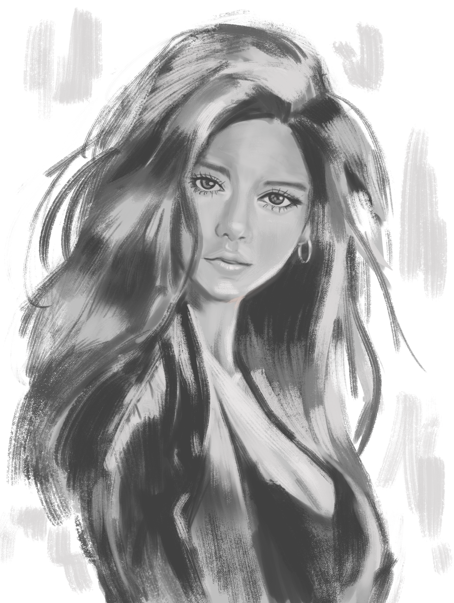
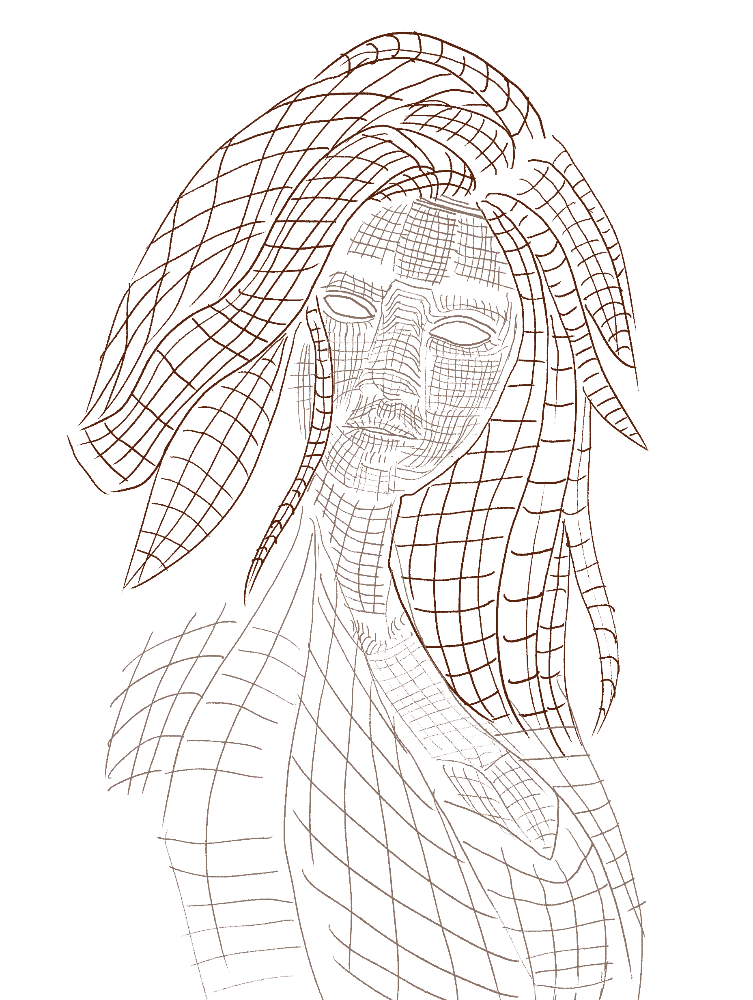

# How to Turn a Value Study into a Colored Painting

Two common methods exist for coloring your work: a traditional, step-by-step approach (“C.W.K. Workflow” is my customized version of this method) and a faster value study conversion method. Below is a side-by-side comparison:

I use the term "traditional" to refer to an approach that relies less on Photoshop features and more on manual painting. The second method heavily relies on Photoshop's tools and is much faster. And don't get the wrong idea that the "C.W.K. workflow" is a new method I invented. It's just my customized version of the traditional method, and I refer to it that way for convenience.

Some might call the second method "glazing", though it differs from traditional glazing techniques in that it relies heavily on Photoshop's blending modes and adjustment layers.

## Workflow Comparison

| Aspect                    | C.W.K. Workflow            | Value Study Conversion       |
|---------------------------|----------------------------|------------------------------|
| Control                   | Full artistic control      | Photoshop-assisted values    |
| Speed                     | Methodical, deliberate     | Rapid base coloring          |
| Flexibility               | Highly flexible            | Structure-dependent          |
| Steps                     | 4 main phases              | 2 main phases                |
| Best For                  | Detailed work              | Quick studies, iterations    |

## When to Use Each Method

**C.W.K. Workflow (Traditional)**  
- Detailed character illustrations  
- Professional commission work  
- Complex lighting scenarios  
- Situations needing absolute control  

**Value Study Conversion (This Guide)**  
- Rapid color studies  
- Testing color schemes  
- Learning value relationships  
- Quick concept visualization  

---

## Step 1: Value Block-In



### Brush Settings for Value Work
- **Size**: Large (30-50% of major forms)  
- **Hardness**: 50-70% for main blocking  
- **Opacity**: 80-90% for clear value reading  
- **Flow**: 60-70% for smooth application  

### Value Family Organization
- **Lights**: 70–100% brightness  
- **Mid-tones**: 40–70% brightness  
- **Shadows**: 0–40% brightness  
- Keep these families clearly separated; use no more than five major values.


> Reference Image

**Tip**: Whether using a photo or your imagination, think of all references (including AI-generated images) as starting points—not final truth. AI outputs often have incorrect anatomy or misleading values. Use your knowledge of form to refine.

---

## Understanding Mesh Forms
Think of your subject as a 3D model with contour lines (meshes). This mindset helps you visualize and preserve the volume in your drawing.

### Common Form Patterns

1. **Spherical Forms** (eyes, cheeks)  
   - Concentric circles or radiating lines  
   - Even spacing to suggest roundness  

2. **Cylindrical Forms** (neck, limbs)  
   - Horizontal rings  
   - Vertical lines suggesting volume  
   - Elliptical cross-sections  

3. **Planar Forms** (forehead, jaw)  
   - Grid-like patterns  
   - Sharp edges for plane breaks  
   - Notice directional changes  



### Face Plane Changes
- **Forehead**: Subtle curve  
- **Brow ridge**: Definite plane change  
- **Nose bridge**: Angular shift  
- **Cheeks**: Compound curves  
- **Jaw**: Strong plane break  

### Core Principles
- Treat forms as 3D meshes, not flat shapes.  
- Identify light sources and their impact on forms.  
- Every value shift indicates a change in form.  
- Always consider planes and volumes rather than just shapes.

### Shadow Properties
- **Form shadows**: Softer, more gradual edges.  
- **Cast shadows**: Higher contrast, sharper edges.  
- **Core shadows**: The darkest area where form turns fully away from light.  
- **Ambient occlusion**: Darkening where forms meet or overlap.  
- **Bounce light**: Light that reflects back into the shadow area.

### Value Relationships
- Highlights often aren’t pure white; they carry subtle color.  
- Keep clear separation between light and shadow families.  
- Use middle values to bridge transitions between main light and shadow areas.  
- Contrast controls focus—decide what you want to emphasize.

### Process Overview
1. **Value Block-In**  
   - Establish big shapes of light and shadow.  
   - Keep forms simple and easy to read.  
2. **Form Analysis**  
   - See planes, volumes, and where transitions occur.  
3. **Reference Integration**  
   - Compare your forms to the reference.  
   - Don’t copy blindly—your structure takes priority.

### Common Pitfalls
- Copying reference values without understanding the underlying form.  
- Overblending without purpose, losing structural clarity.  
- Breaking shadow unity with too many values.  
- Focusing on details too early; prioritize large masses first.

---

## Step 2: Converting Your Value Study into Color


Once your value foundation is solid, coloring is surprisingly straightforward.

### Recommended Layer Stack
```
Final Stack (top to bottom):
- Color Grading Group
  - Color Balance
  - Selective Color
  - Curves

- Refinement Group
  - Form Shadows
  - Highlights
  - Texture

- Base Color Group
  - Luminosity Mask (Luminosity blend mode, clipped)
  - Feature Layers (Hair, Skin, etc.)
  - Base Value Layer (Normal blend)

- Backup Group
  - Original Value Study
  - Reference
```

### Step-by-Step

1. **Setup Phase**  
   - Duplicate your original value study (Normal blend).  
   - Create a Luminosity mask over it (Luminosity blend).  
   - Place all your original references and backups in a separate group.  

2. **Base Color Application**  
   - Create individual layers for each feature (skin, hair, eyes).  
   - Use **Color blend mode** for these base color layers.  
   - Keep luminosity intact to preserve your carefully planned values.  

3. **Refinement Phase**  
   - Add shadows using Multiply (20-40% opacity).  
   - Apply highlights with Soft Light (30-50% opacity).  
   - Introduce textures on separate layers if needed.  

4. **Color Grading**  
   - Adjust overall palette with Color Balance.  
   - Fine-tune specific ranges with Selective Color.  
   - Modify contrast with Curves.  
   - Use color overlays for atmospheric effects if desired.  

5. **Local Adjustments**  
   - Mask off specific areas for targeted tweaks.  
   - Feather your masks (20–40px) for smooth transitions.  
   - Keep forms visible—don’t overcorrect.  

6. **Final Touches**  
   - Double-check value relationships (flip the canvas if necessary).  
   - Verify color harmony—avoid over-saturation.  
   - Add finishing touches or atmospheric elements.

---

### Why Use Color Blend Mode?

**Color blend** preserves the underlying luminosity from your value study, letting the hue and saturation of your “color” layers show through without altering the underlying light/shadow structure.

| Mode          | Effect                                                 |
|---------------|--------------------------------------------------------|
| **Color**     | Preserves value; applies only hue and saturation       |
| **Normal**    | Overwrites value; can flatten or contradict your study |

> **Example**: Coloring hair red.
> - **Color Blend**: Keeps all the existing lights and darks intact, simply shifting the hue to red.  
> - **Normal Blend**: Replaces the values entirely, leading to flat color.

---

## Final Thoughts

### Advantages of Value-First Approach
- Rapid color experimentation  
- Guaranteed consistency in lighting  
- Quick iteration on color schemes  
- Efficient for concept art  

### Limitations
- Less direct control over complex color nuances  
- Can feel mechanical if not refined by hand  
- Depends heavily on an accurate value study  

### Best Practices
1. Nail your values first; good values make coloring a breeze.  
2. Keep your layer structure organized.  
3. Work from broad forms to finer details.  
4. Use references thoughtfully, but trust your 3D form knowledge.  
5. Treat this process as a starting point for further polishing.

---

## Photoshop Technical Guide

### Layer Blend Modes & Opacities

1. **Base Value Structure**  
   ```
   Group: Base Values
   - Value Study Copy (Normal, 100%)
   - Luminosity Mask (Luminosity, 85-95%)
   - Color Layers (Normal, clipped, set to Color blend)
   ```

2. **Form Enhancement**  
   ```
   Group: Form Shadows
   - Core Shadows (Multiply, 25-35%)
   - Deep Shadows (Linear Burn, 15-20%)
   - Bounce Light (Soft Light, 30-40%)
   - Ambient Occlusion (Multiply, 15-25%)
   ```

3. **Highlights**  
   ```
   Group: Highlights
   - Specular (Linear Dodge, 10-15%)
   - Form Highlights (Soft Light, 40-50%)
   - Rim Light (Screen, 20-30%)
   - Glow Effects (Screen, 15-25%)
   ```


> Photoshop

### Mask Creation

- **Luminosity Mask**  
  - Load a lightness selection from your Channels.  
  - Refine the edge (Smooth ~2px, Feather ~1px).  
  - Save as an alpha channel; apply to layer.

- **Luminosity Mask Setup (Detailed Steps)**
   ```
   A. Create Luminosity Channel
   - Open Channels panel (Window > Channels)
   - Cmd/Ctrl + click RGB channel thumbnail to load luminosity
   - Create new channel (click Create New Channel button)
   - Name it "Luminosity Base"
   
   B. Refine Selection
   - With new channel selected:
     * Select > Modify > Smooth (2px)
     * Select > Modify > Feather (1px)
   - Levels adjustment (Cmd/Ctrl + L):
     * Input Black: 10
     * Input White: 245
     * Gamma: 1.2
   
   C. Create Layer Mask
   - Return to Layers panel
   - Cmd/Ctrl + click Luminosity channel
   - With value study layer selected:
     * Click Add Layer Mask button
     * Set mask blend mode to Luminosity
     * Opacity: 85-95%
   
   D. Fine-Tuning (Optional)
   - Mask density adjustment:
     * Select mask in Layers panel
     * Curves adjustment (Cmd/Ctrl + M)
     * Fine-tune contrast curve
   - Edge refinement:
     * Select mask
     * Properties panel > Feather: 0.5-1px
     * Density: 95-100%
   ```

   **Pro Tips:**
   - Save the luminosity channel for future use
   - Create multiple versions with different contrast
   - Use Quick Mask (Q) for visual feedback
   - Check mask in Overlay mode (Alt/Option + \\)

   **Common Issues:**
   - Too harsh: Increase feathering
   - Too soft: Adjust levels
   - Losing detail: Reduce smoothing
   - Inconsistent: Check channel contrast~

- **Form Shadow Masks**  
  - Use a soft brush (Opacity 20-30%) for painting shadows.  
  - Feather edges with a low Gaussian Blur for smooth transitions.  
  - Tweak with Dodge/Burn for precision.

- **Highlight Masks**  
  - Start from a luminosity selection.  
  - Use Curves or Levels to tighten the selection.  
  - Manually paint to refine where needed.

### Brush Settings

1. **Basic Value Brush**  
   - Size: 300–500px, Hardness: ~65%  
   - Opacity: ~85%, Flow: ~70%  
   - Pressure sensitivity: Size + Opacity  

2. **Detail Brush**  
   - Size: 50–100px, Hardness: ~85%  
   - Opacity: ~60%, Flow: ~50%  
   - Pressure sensitivity: Size only  

3. **Texture Brush**  
   - Size: 25–75px, Hardness: ~90%  
   - Opacity: ~40%, Flow: ~35%  
   - Enable texture patterns if needed  

### Color Adjustments

1. **Global**  
   - **Color Balance**: Shadows (temperature), Midtones (overall saturation), Highlights (final mood).  
   - **Selective Color**: Tweak reds and neutrals for subtle shifts.  
   - **Curves**: Fine-tune contrast (and individual channels for color temperature).

2. **Local**  
   - **Hue/Saturation**: Target specific color ranges (skin, hair).  
   - **Vibrance**: Subtle saturation control.  
   - **Channel Mixer**: More advanced color grading.

### Troubleshooting

1. **Muddy Colors**  
   - Check blend modes and masks.  
   - Simplify your layer stack or reduce opacities.  

2. **Lost Form**  
   - Reassess value contrasts.  
   - Don’t oversaturate shadows.  
   - Tighten your mask edges.

3. **Performance Issues**  
   - Merge or rasterize layers that are finalized.  
   - Use Smart Objects and keep file sizes manageable.

---

## Fintuning with Additional Brushwork

You can go as far as you want with additional refinement.


> Finetuned

## Having Fun with Adjustment Layers

Adjustment layers, particularly color lookup tables (LUTs), offer powerful ways to transform your artwork's mood and atmosphere. Below are some examples demonstrating how different LUTs can dramatically alter the feel of the same base image. Each preset creates a distinct emotional response while maintaining the underlying value structure.

These presets serve as starting points - you can further customize them by adjusting opacity, blend modes, and combining multiple lookup tables to achieve your desired effect.


> Crisp Warm


> Edge Amber


> Foggy Night


> Late Sunset

# Wrap-Up

This value-to-color method is perfect for exploring new color schemes or quickly solidifying an initial concept. If you need more intricate color control, consider a fully painted approach (like the C.W.K. Workflow). But when speed and solid structure matter, this workflow can be a powerful tool in your arsenal.

Above all, remember: **No amount of color adjustment can fix poorly established values.** Always start strong with values. From there, coloring is a smoother, more enjoyable ride.
