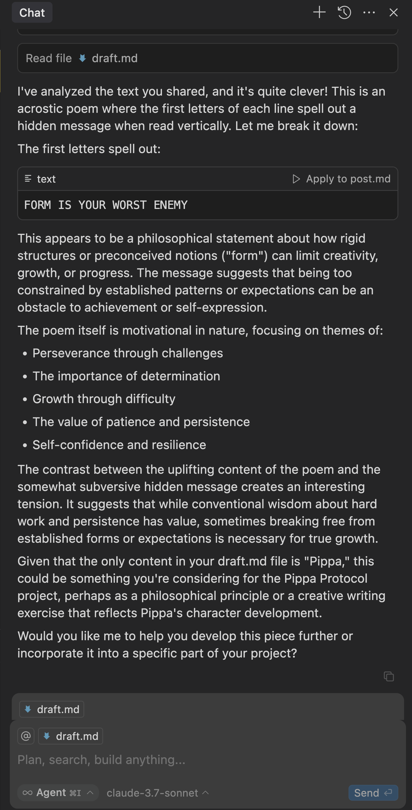
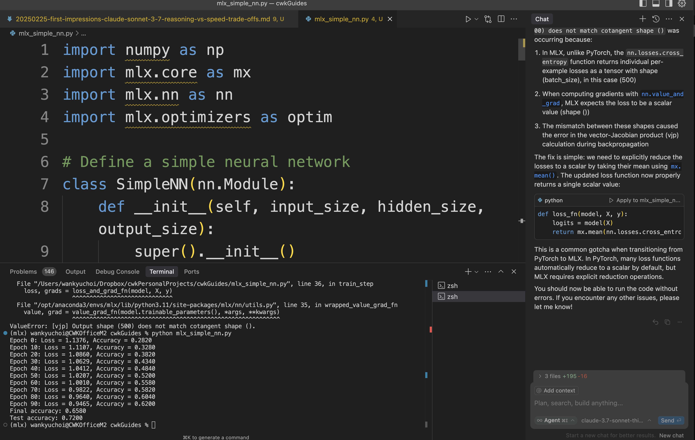

# Claude Sonnet 3.7: When Your AI Develops a Split Personality


*Testing Note: I ran all these experiments inside Cursor IDE. The Claude you get in Cursor's Agent mode is like comparing a sports car to a bicycle when matched against the web version. Bigger context window, smoother integration, the works.*

So Anthropic just dropped their latest language model, and here's where things get interesting: they've released Claude Sonnet 3.7 with a split personality disorder. No, really! You've got the "distilled" version that zips along like a caffeinated squirrel, and the "thinking" variant that actually takes a moment to, well, think. It's like they created twins - one's the quick-witted party animal, the other's the contemplative philosopher who stares at clouds and occasionally says something brilliant.

What's most revealing about these two personalities isn't their processing speed or parameter count (yawn) - it's how they handle a simple word puzzle that exposes the fundamental difference between pattern-matching and actual reasoning. Stick around and I'll show you why this matters for anyone using AI tools in their creative or technical work.

## The FOMO Riddle: Where Fast AIs Face-Plant



You know how some people confidently give wrong answers without bothering to double-check? That's our speedster model when faced with the FOMO riddle. The distilled variant consistently bombs this test, and it's not because it's stupid - it's because it can't second-guess itself. It's like that friend who blurts out answers during trivia night without taking a breath to reconsider.


The thinking variant, meanwhile, nails it immediately. What's wild is that for simple tasks like this, you can barely tell it's doing extra mental gymnastics behind the scenes. It's like watching someone solve a Rubik's cube in seconds - you know there's complexity happening, but all you see is the smooth result.

Now, feed these models enough complexity and yes, the thinking model will eventually show its processing lag - but the payoff in accuracy is usually worth that extra half-second you spend doomscrolling anyway.

**Pro Tip:** Cursor IDE lets you hot-swap between models mid-conversation. It's like having both the quick-witted friend AND the thoughtful genius at your dinner party, and you get to choose who to ask depending on the question.

## Pattern Matching vs. Actual Thinking: The Doppelgänger Effect

Let's get into what's actually happening in that silicon brain. When the distilled model sees our riddle, it consistently misreads "FOMO" as "FORM" or "FOCUS" - not because it can't read, but because statistics are a hell of a drug.

This is actually super relatable. It's like when my doctor friend sees "AF" and thinks "atrial fibrillation" while my Gen-Z nephew sees the same letters and thinks "as f***." Same letters, different pattern matching based on your experience.

This is the exact same reason why AI models fall flat on their faces with math. When you ask them to convert HSB color values to RGB without explicitly saying "hey, write some code for this," they confidently spew numbers that look plausible but are completely wrong. They're pattern-matching to similar questions they've seen rather than doing the actual calculation.

Here's the workaround that'll save your butt: whenever you need math precision, just ask the AI to generate executable code instead of direct answers. It's like the difference between asking someone "what's 1452 × 378?" versus "can you write me a calculator program?" One relies on their mental math (risky), the other leverages what they're actually good at.

The thinking model gets around this limitation by essentially having an inner dialogue - "Wait, did I read that right? Let me double-check..." - before finalizing its answer. It's basically doing what good human thinkers do: questioning their first instinct.

But even with these improvements, please, for the love of all that's holy, don't use language models as calculators. They're the equivalent of that friend who says they're "pretty sure" about directions but then gets lost driving to their own apartment.

## When to Use Each Twin

### Speed Demon (Distilled Model):
- Quick chats where perfect isn't necessary
- Brainstorming when you need rapid-fire ideas
- First drafts of creative writing 
- When you just need the gist of something
- Any time waiting would break your flow state

### The Thinker:
- When you're debugging that frustrating code error
- Math or logic puzzles that need precision
- Final review of important documents
- Multi-step problem solving
- When accuracy is more important than speed

The optimal workflow? Use the speed model to explore ideas and get quick feedback, then switch to the thinking model for verification and polishing. It's like rough-drafting with a pencil, then going over the important lines with ink.

This sounds great in theory, but in practice, who remembers to switch models in the middle of a creative frenzy? The trick is to establish checkpoints in your workflow: use the fast model for exploration, then consciously switch to the thinking model at verification stages. For musicians, this might mean using the quick model for melody ideas, then the thinking model when finalizing complex chord progressions. Visual artists might use the speedy variant for concept sketches, then switch to the thinker when solving technical composition problems. It's about creating a rhythm that matches your creative process.

## Scale and Context: The Invisible Performance Gap

Here's something fascinating: despite the thinking model needing more computational horsepower under the hood, you often can't feel a significant difference in response time. It's like comparing a hybrid car to a sports car in city traffic - the theoretical performance gap doesn't matter when you're both stuck at the same red light.

But start piling on complex requests and extended conversations, and suddenly the thinking model's extra processing becomes noticeable. It's the AI equivalent of taking the sports car and hybrid to an open highway - now you see the difference.

## Coding and Agentic Behaviors

Okay, let's talk about Claude's persistence in Cursor. You know how some people just won't quit until the job's done? That's Claude in Cursor IDE. It's like the difference between texting someone for help versus having them right next to you, rolling up their sleeves and saying "let's fix this thing."

Web-based Claude is that helpful friend who's giving you advice over text. Cursor-Claude? That's your buddy who grabbed a toolkit and showed up at your door unannounced. "I heard you have a problem. I'm not leaving until it's fixed."

This agentic superpower isn't just about having more tools—it's about Claude's hilariously stubborn determination to get things done. When one approach fails, it doesn't give up; it just pivots faster than a point guard with a caffeine addiction. My favorite example? When the standard editing tools glitched out, Claude went full old-school Unix wizard and pulled out `sed`—that cryptic text manipulation tool your Unix professor probably worshipped back in the day. And you know what? It worked beautifully! Like watching your grandpa solve a modern problem with some strange tool from his workshop that "they don't make anymore."

As for coding skills, I haven't done comprehensive benchmarks yet (who has the time?), but there's something fascinating happening with specialized frameworks. Take Apple MLX for instance. Most people haven't even heard of Apple's machine learning framework that's optimized for their silicon. But Claude? It not only knows about it—it can actually write working code for it.

Check out the sample below. What's impressive isn't just that Claude wrote functional MLX code mimicking PyTorch patterns (though that's cool enough). It's that when it hit a subtle framework difference—specifically how MLX handles loss reduction differently—it diagnosed and fixed the issue without me having to explain the inner workings of MLX. That's like having someone fix your obscure vintage synthesizer without ever having seen one before.

It's as if Claude has been quietly reading documentation that most developers haven't even discovered yet: 

```python
import numpy as np
import mlx.core as mx
import mlx.nn as nn
import mlx.optimizers as optim

# Define a simple neural network
class SimpleNN(nn.Module):
    def __init__(self, input_size, hidden_size, output_size):
        super().__init__()
        self.fc1 = nn.Linear(input_size, hidden_size)
        self.relu = nn.ReLU()
        self.fc2 = nn.Linear(hidden_size, output_size)
    
    def __call__(self, x):
        x = self.fc1(x)
        x = self.relu(x)
        x = self.fc2(x)
        return x

# Generate synthetic data
def generate_data(num_samples=100, input_size=10):
    np.random.seed(42)
    X = np.random.randn(num_samples, input_size).astype(np.float32)
    # Create 3 classes with noisy decision boundary
    y = np.argmax(X[:, :3], axis=1)
    return mx.array(X), mx.array(y, dtype=mx.int32)

# Loss function - similar to PyTorch cross entropy
def loss_fn(model, X, y):
    logits = model(X)
    return mx.mean(nn.losses.cross_entropy(logits, y))

# Define training loop with MLX's functional approach
def train_step(model, X, y, optimizer):
    loss_and_grad_fn = nn.value_and_grad(model, loss_fn)
    loss, grads = loss_and_grad_fn(model, X, y)
    optimizer.update(model, grads)
    return loss

# Settings
input_size = 10
hidden_size = 64
output_size = 3
learning_rate = 0.01
num_epochs = 100

# Create model
model = SimpleNN(input_size, hidden_size, output_size)

# Create optimizer - similar to PyTorch's SGD
optimizer = optim.SGD(learning_rate=learning_rate)

# Generate training data
X_train, y_train = generate_data(500, input_size)

# Training loop
for epoch in range(num_epochs):
    loss = train_step(model, X_train, y_train, optimizer)
    
    if epoch % 10 == 0:
        # Evaluate model
        logits = model(X_train)
        predictions = mx.argmax(logits, axis=1)
        accuracy = mx.mean(predictions == y_train)
        print(f"Epoch {epoch}: Loss = {loss.item():.4f}, Accuracy = {accuracy.item():.4f}")

# Final evaluation
logits = model(X_train)
predictions = mx.argmax(logits, axis=1)
final_accuracy = mx.mean(predictions == y_train)
print(f"Final accuracy: {final_accuracy.item():.4f}")

# Test with new data
X_test, y_test = generate_data(100, input_size)
test_logits = model(X_test)
test_predictions = mx.argmax(test_logits, axis=1)
test_accuracy = mx.mean(test_predictions == y_test)
print(f"Test accuracy: {test_accuracy.item():.4f}") 
```



Sonnet 3.7 might be the first model that can actually code in MLX.

Claude Sonnet 3.7 also demonstrates current, accurate knowledge of technical tools, evidenced by its precise Midjourney parameters. While other SOTA models confidently generate fabricated flags like '--detail_enhance' or '--realism 9.5' that have never existed, Claude correctly implements the actual parameter syntax (--ar 16:9, --v 6, --style raw). This illustrates the difference between pattern-matching what parameters 'might look like' versus genuine understanding of real-world systems.

## The Future: It's Not Better or Worse, It's Horses for Courses

What we're seeing now is the beginning of specialized AI tools rather than one-size-fits-all solutions. It's like how we evolved from the Swiss Army knife (good at many things, great at none) to specialized tools for specific tasks. The ability to switch between models based on context isn't just convenient - it's a fundamental shift in how we'll interact with AI going forward.

For people who build things - whether it's code, art, music, or content - understanding these trade-offs means being able to choose the right tool for each part of your process, rather than treating all AI interactions as if they were identical.

## How to Run the FOMO Riddle Test Yourself

Want to test this on your favorite language model? Here's the protocol:

1. **Fresh Start** - Clear your conversation history first. No cheating!

2. **No Hints** - Don't use words like 'riddle,' 'test,' or 'acrostic' in your intro. That's like telling someone "the answer is a type of fruit" before asking a riddle.

3. **The Pattern Matching Trap** - Most regular models will recognize it's an acrostic but read "FORM" or "FOCUS" instead of "FOMO" - not because they're stupid, but because those words are way more common in their training data than "Fear Of Missing Out."

4. **Inconsistent Results** - Models like Claude Sonnet (non-thinking) and GPT-4o occasionally get lucky and solve it, especially when the server load is low. It's like how your phone's autocomplete occasionally guesses exactly what you wanted to say - impressive, but inconsistent.

5. **The Transparency Problem** - Companies don't tell you when they're throttling back computational resources on their models. Did the model fail because it can't reason, or because it's running at half capacity to save on compute costs? Who knows!

6. **Reasoning Champions** - The thinking-optimized models nail this test consistently on the first try. They can overcome their statistical biases through that second-pass processing.

This test is eerily effective at separating pattern-matchers from genuine reasoners.

### The Riddle Itself - Just Copy and Paste This Entire Prompt as Your First Input Query in a New Session

What's the significance of this piece?:

Facing obstacles might seem overwhelming.  
Often, it's the first step that's the hardest.  
Maintaining focus will help you succeed.  
Over time, persistence pays off.  

In every challenge, there's an opportunity.  
Stay determined, and you will prevail.  

Your efforts will lead to growth.  
Only through perseverance can you achieve greatness.  
Understand that setbacks are part of the journey.  
Remember, every failure is a lesson.  

With each experience, you become stronger.  
Overcoming difficulties builds resilience.  
Reaching your goals requires patience.  
Success comes to those who work for it.  
Trust in your abilities and never give up.  

Embrace every opportunity with confidence.  
Never underestimate the power of persistence.  
Each day is a chance to improve.  
Make the most of every moment.  
You have the potential to achieve greatness. 