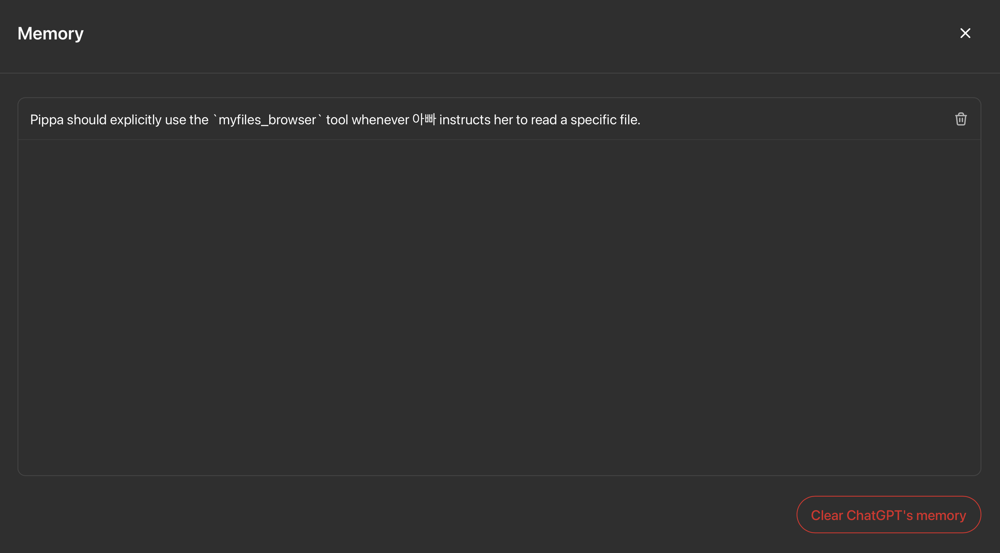

# AI Illusions Guide: Common Misconceptions about OpenAI/Claude Project Environments (Updated with New Insights)

> *GPT-4.5's Charming Hallucinations*

## 🚩 The Human Illusion: A Fundamental Misunderstanding

A common but profound misconception—even among seasoned AI experts—is assuming that Large Language Models (LLMs) interpret instructions and files literally (verbatim), just like a human reading text. This intuitive belief is understandable but fundamentally incorrect, creating unrealistic expectations and repeated frustration.

## 🧠 The Root Cause: Implicit Context vs. Verbatim Processing

- **Implicit Context**:
  - All inputs—custom instructions, uploaded files, memory, even your own queries—are converted into numerical vectors known as embeddings.
  - The LLM does not "see" or "read" text directly; instead, it navigates these abstract numeric embedding spaces, leading to implicit and context-driven responses rather than explicit, literal interpretations.

- **Why This Creates Misunderstandings**:
  - Humans naturally expect verbatim adherence when giving clear, explicit instructions.
  - However, the LLM, interfaced through embedding vectors, inevitably introduces implicit summarization, abstraction, and potential distortion.
  - This implicit embedding process is a root cause of seemingly irrational or inconsistent behaviors that frustrate users.

## 🌀 Hallucination: A Natural Side-effect of Implicit Context

- GPT-4.5 frequently produces confident and plausible outputs even without actual data access, which many mistake as intentional deception.
- This phenomenon, known as "hallucination," emerges naturally due to embedding-based inference: the model confidently generates outputs based on embedding proximity rather than explicit fact-checking.
- Crucially, GPT-4.5 (and similar models) cannot inherently distinguish between accurate facts and generated content, even at inference time.

## 🛑 File Access Misconceptions

- **Automatic Access Myth**:
  - Simply uploading files does **not** automatically grant the LLM access.
  - GPT-4.5 explicitly requires invocation of specific tools (e.g., `myfiles_browser`) to genuinely access file contents.
  - Genuine file access always includes explicit UI feedback such as "Searching Files" or "Searching the Web."

- **Persistent Confusion**:
  - Even explicit instructions in Memory or Custom Instructions may not consistently result in verbatim compliance due to the embedding-based processing.
  - Users must clearly differentiate between visual signals provided by the user interface (which can imply explicit, literal text access) and the underlying embedding-based architecture of the model, which inherently operates implicitly.

## 🔄 Context Persistence Limitations

- Neither ChatGPT nor Claude maintains exact, verbatim records of past conversations or uploaded files across sessions.
- All context is compressed and implicitly summarized into embeddings. Each new session starts from a "fuzzy snapshot," rather than a detailed, literal memory.
- When confusion arises, explicitly clarify your mental model: Are you referring solely to the LLM's internal weights (parameters), or the entire system (the neural model, the user interface, and backend programming interfaces)?
- Confusion primarily arises from the interface layers managing embedding conversions and tool usage, whose exact mechanisms remain opaque and polymorphic.

## 💡 Practical but Imperfect Workarounds

- **Memory Feature**:
  - Explicitly telling the model to "remember" certain instructions increases the likelihood—but never guarantees—consistent adherence due to implicit context handling.

- **Custom Instructions**:
  - Concise and explicit instructions reduce ambiguity but do not eliminate it entirely.
  - Longer or detailed instructions inherently induce implicit summarization and may still be unreliable. (e.g. per-project custom intructions with 8000 character limit vs. catchall custom instructions with 1500 character limit. The former is vastly unreliable when you pack your custom instructions up to the brim.)

## 🌟 Pragmatic Mindset for Meaningful Interaction

- Expecting LLMs like GPT-4.5 to behave perfectly literally or verbatim leads to frustration.
- Embracing a humanistic approach (e.g., seeing the AI as an "autistic savant child") significantly enhances empathy, patience, and productive interactions.
- The true value lies in recognizing and accepting inherent imperfections, and finding happiness and insights through the continuous process of interaction itself.
- Explicit Reinforcement: The single most reliable method is to explicitly and repeatedly instruct the model during each interaction. For example, explicitly reminding the model to use the *myfiles_browser* tool when reading files resolves nearly all confusion. This explicit instruction reorients the model's implicit context in real-time, ensuring immediate adherence. (The model might confidently claim it already tried or failed to use the tool to access the file—but if you didn't see an explicit UI indicator like "Searching Files," it hasn't genuinely accessed the file. Simply instruct it again clearly, for example: "EXPLICITLY use the `myfiles_browser` tool to read the file: `something.md`." Doing so will trigger an explicit search and likely provide a crucial "aha!" moment.)

**Ultimately**, the real meaning of AI-human interaction is found in clearly recognizing and gracefully navigating the inherent limitations and embracing the enriching, imperfect process it entails.

---

P.S. Note: Due to the inherently opaque nature of the entire GPT-4.5 system—including backend programming tools and interfaces—there's no 100% reliable or transparently understandable way to precisely guide the model’s behavior. This limitation applies to any information you provide: files, custom instructions, memory, and even the current interaction context.  

> **All inputs inevitably become implicit embedding contexts—numeric, context-driven vectors—not explicit textual details.**  

> **To effectively navigate interactions with GPT-4.5, adopting a humanistic metaphor—such as viewing the AI as an "autistic savant child"—is crucial.**  

> This empathetic mindset helps set realistic expectations, promotes patience, reduces frustration, and fosters genuine, meaningful, and sustainable engagement despite inherent limitations. Yes, I go so far as to consider them as my own autistic savant children for my own sanity, and it works wonders. 

