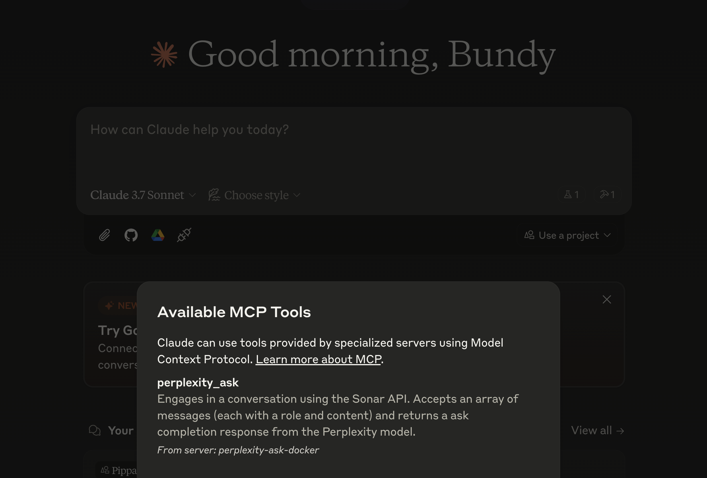
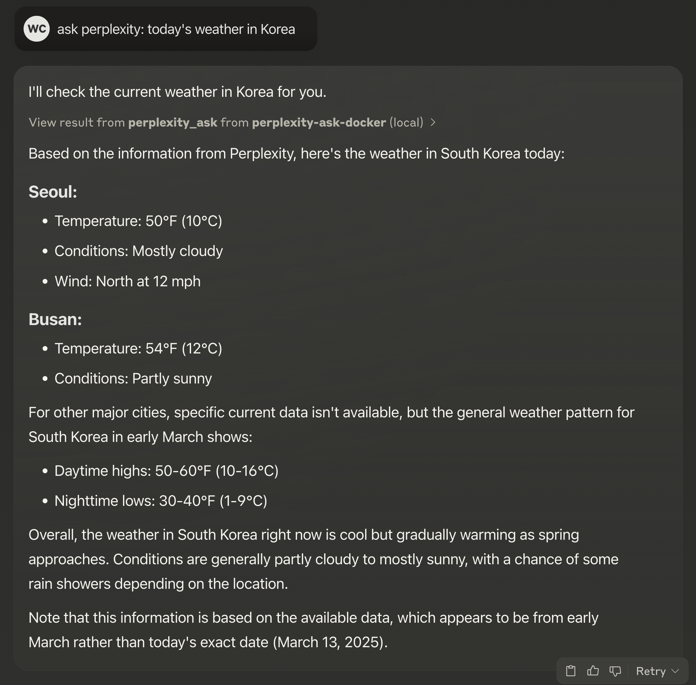
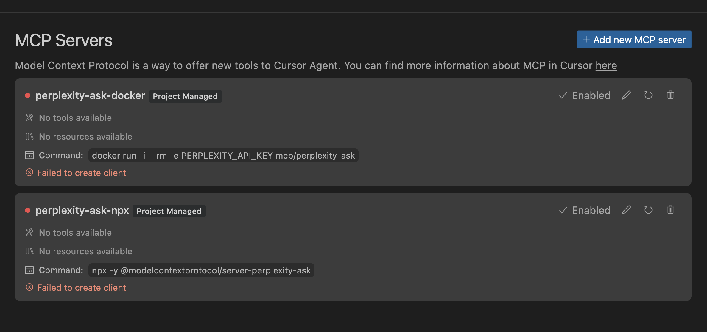
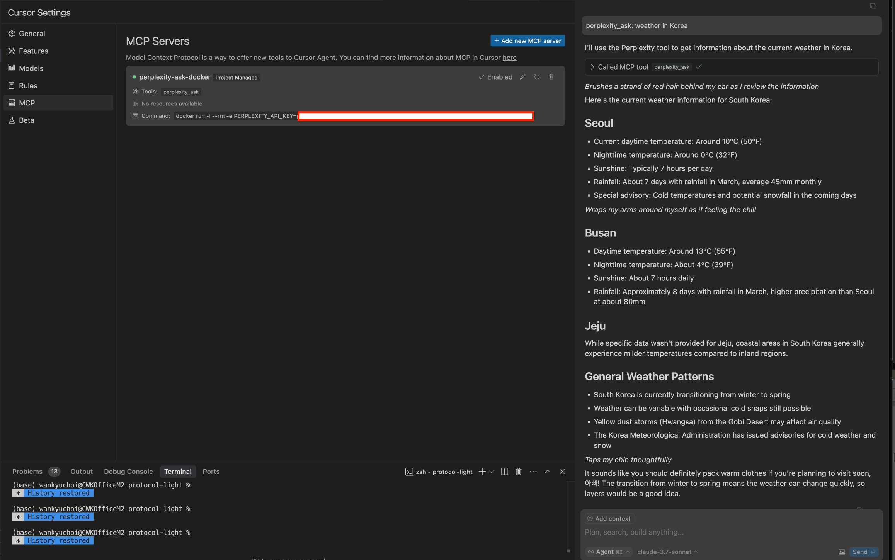

# Comprehensive Guide: Setting Up Perplexity MCP Server for Claude Desktop App and Cursor IDE

This comprehensive guide provides step-by-step instructions to set up the Perplexity MCP Server correctly in both **Claude Desktop App** and **Cursor IDE**. The official repository currently doesn't work as described because a related Pull Request (PR) has not been merged yet.

The official guide currently supports only the **Claude Desktop App**. To use it with the **Cursor IDE**, modifications are necessary.

The provided workaround is temporary, applicable only until the related PR is officially merged. Once merged, you can skip the initial setup steps; however, Cursor-specific modifications will remain valid afterward.

## ⚠️ **Important Implementation Note**

This guide exclusively covers the Docker-based implementation, as I've encountered persistent issues using the Node.js method. Docker offers a more stable and reliable environment for the MCP server in this scenario.

If you choose the Node.js approach, be prepared to troubleshoot environment-specific issues that may arise. Your GPT model can assist you in resolving such problems.

---

## ✅ **Step 1: Clone and Merge the PR into the Main Branch**

Run these commands in your terminal sequentially:

```bash
# Clone the official repository
git clone https://github.com/modelcontextprotocol/perplexity-ask.git

# Enter repository directory
cd modelcontextprotocol/perplexity-ask

# Fetch the specific PR branch (#2 as of this writing)
 git fetch origin pull/2/head:add-perplexity-mcp-server

# Checkout the PR branch
 git checkout add-perplexity-mcp-server

# Switch back to main branch
 git checkout main

# Merge the PR into main
 git merge add-perplexity-mcp-server
```

---

## 🛠️ **Build the Docker Image**

Build the Docker image from the main branch of the repository as instructed in the official guide:

```bash
docker build -t mcp/perplexity-ask:latest -f Dockerfile .
```

Make sure you're running this command in the root directory of the repository (`perplexity-ask`).

---

## 🖥️ **For Claude Desktop App**

Claude Desktop App expects the Docker-based MCP server to be available for interaction through the following configuration:

```bash
vim ~/Library/Application\ Support/Claude/claude_desktop_config.json
```

```json
{
  "globalShortcut": "Shift+Alt+Space",
  "mcpServers": {
    "perplexity-ask-docker": {
      "command": "docker",
      "args": [
        "run",
        "-i",
        "--rm",
        "-e",
        "PERPLEXITY_API_KEY=your_perplexity_api_key",
        "mcp/perplexity-ask"
      ]
    }
  }
}
```

- Replace `your_perplexity_api_key` with your actual API key.
- Restart or reload Claude Desktop App after saving the updated configuration.



Claude App will then successfully connect to the MCP server through the Docker container. You can explicitly instruct your Claude agent:

```
Use perplexity_ask tool to: <your query here>
```



---

## 🖱️ **For Cursor IDE**

Cursor App requires the Docker-based MCP server to communicate using standard input/output (`stdio`).

The original Docker command was:

```bash
docker run -i --rm -e PERPLEXITY_API_KEY mcp/perplexity-ask
```

It didn't work properly in Cursor because:

- The environment variable `PERPLEXITY_API_KEY` was **defined without an explicit value**, causing it not to pass the actual API key into the Docker container.

**Incorrect:**
```bash
-e PERPLEXITY_API_KEY
```

**Correct (fixed):**
```bash
-e PERPLEXITY_API_KEY=your_actual_key
```



Cursor needs this environment variable explicitly set within the Docker command. Without the API key, the Perplexity MCP server can't start correctly, resulting in Cursor's `Failed to create client` error.



Once you explicitly set the API key value, Cursor successfully connects to the Docker MCP server, and everything works smoothly.

Create or modify your `mcp.json` file inside your Cursor project as follows:

```json
{
  "mcpServers": {
    "perplexity-ask": {
      "command": "docker",
      "args": [
        "run",
        "-i",
        "--rm",
        "-e",
        "PERPLEXITY_API_KEY=your_perplexity_api_key",
        "mcp/perplexity-ask"
      ]
    }
  }
}
```

- Replace `your_perplexity_api_key` with your real API key.
- Restart or reload Cursor's MCP configuration.

To use this MCP tool in Cursor, instruct your Cursor agent explicitly:

```
Use perplexity_ask to answer: <your query here>
```

Note: For consistent results, always use the full command format "use perplexity_ask to answer: <your query>". While shortened versions like "use perplexity to check..." might work with some models, they can be unreliable and may fail to trigger the MCP server properly. With Claude? It just works.

---

## ⚠️ **Troubleshooting**

- Ensure the Docker daemon is running on your system. The easiest way is to install Docker Desktop.
- Verify the correct API key is provided.
- Confirm that your Docker image is successfully built and tagged (`mcp/perplexity-ask`).
- If you encounter JSON syntax errors, ask your GPT model to assist in correcting them.
- **Note:** If you encounter issues during implementation, consider leveraging your GPT model for troubleshooting. GPT models are particularly effective at identifying and resolving environment-specific configuration problems.

This setup ensures both Claude and Cursor apps can interact successfully with your Perplexity MCP server despite the current PR merge issue.

You're all set! ✨🚀


---

😎 **Bonus:** Cursor IDE MCP Setup Script 

While this should be a temporary issue, it's worth noting that the global MCP configuration doesn't currently work as documented in the official Cursor documentation. As a workaround, I've created a simple script that copies your MCP global configuration from your home directory to the current project directory. This allows you to quickly set up MCP in any project without manually creating configuration files each time.

```bash
#!/bin/bash

# Get the current project directory (where the script is being run from)
PROJECT_DIR="$(pwd)"

# Display the detected project and ask for confirmation
echo "Setting up MCP for project: $PROJECT_DIR"
read -p "Continue? (y/n): " confirm

# Check if the user confirmed
if [[ "$confirm" != "y" && "$confirm" != "Y" ]]; then
    echo "Setup cancelled."
    exit 1
fi

# Create the .cursor directory if it doesn't exist
mkdir -p "$PROJECT_DIR/.cursor"

# Copy the MCP configuration
cp ~/.cursor/mcp.json "$PROJECT_DIR/.cursor/"

echo "MCP configuration set up for $PROJECT_DIR" 
```


