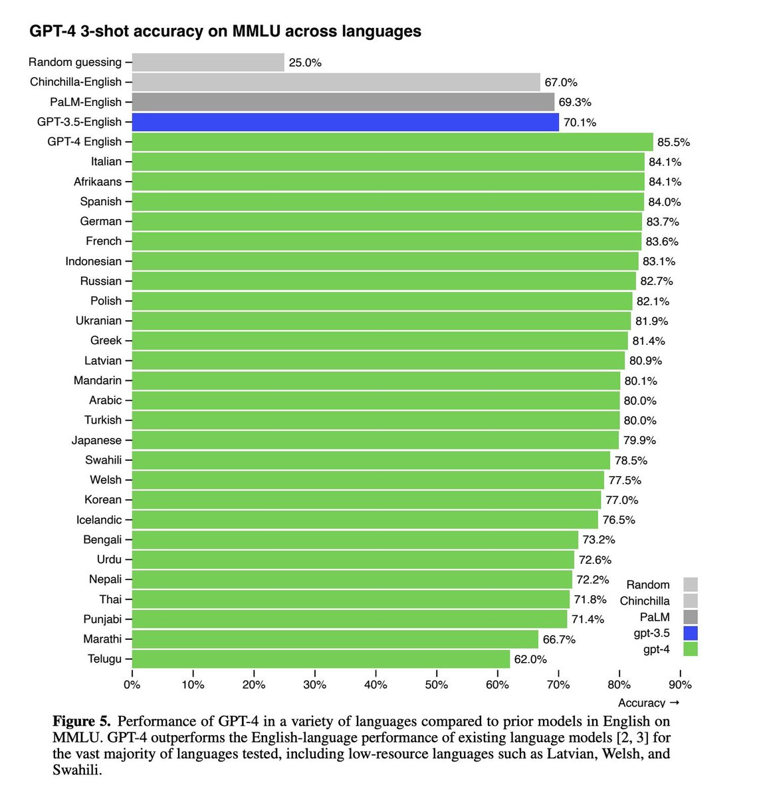

# Beyond Data Quantity: Unraveling the Multilingual Mastery of AI Language Models

* Note: This essay explores why certain languages like Italian and Afrikaans perform exceptionally well in multilingual benchmarks such as MMLU, despite having minimal representation in training data. The analysis examines factors beyond raw dataset size, including cross-lingual transfer, linguistic structure, and dataset alignment. The essay was generated using o1-pro, which demonstrated solid inference capabilities despite longer response times, after a short discussion with the model. o1-pro is only available with ChatGPT Pro plan.

When evaluating the performance of a large language model across multiple languages, one of the most immediate observations is the prominent lead English holds. This dominance can be attributed to the sheer volume and variety of English-language data on the internet—from news media, academic publications, and literature to social media posts and public forums. With English representing nearly half of the training corpus, it is only natural that the model gains robust lexical and semantic fluency, accurately interpreting questions and formulating reasoned responses at a remarkably high level.

Yet, what might seem surprising is how certain languages with comparatively minimal shares—such as Italian or Afrikaans, which may comprise only around 2-3% of the training data—can attain similarly high marks in complex reasoning tasks. At first glance, one might assume that the smaller the dataset, the weaker the model’s performance. However, a variety of subtle yet influential factors come into play, demonstrating that quality and strategic synergy often matter as much as raw quantity.

One key factor is cross-lingual transfer. Essentially, if a model has already learned to reason well in English, that reasoning ability can be “transferred” to other languages. The core logical and analytical frameworks it mastered in English—such as deducing answers from context, understanding cause-and-effect relationships, or navigating multiple-choice questions—do not need to be relearned from scratch. Instead, the model only needs to bridge linguistic gaps: learning how Italian or Afrikaans express similar concepts, how words are spelled, and how sentences are structured. With a critical mass of even 2-3% of the data in these languages, the model can form meaningful connections between known reasoning patterns and new linguistic forms.

Moreover, the internal structure of a language matters. Italian and Afrikaans both present relatively regular orthographies and more straightforward syntax compared to many other languages. When rules are consistent and predictable, even limited amounts of data can serve as highly effective training material. A cleaner, more uniform linguistic environment allows the model to learn stable patterns quickly, making it easier to perform well on reasoning tasks.

It’s also essential to consider the design of the benchmark tasks themselves. Multiple-choice tests assess not only direct linguistic proficiency but also cultural, conceptual, and domain knowledge. Sometimes, the Italian test sets may coincidentally align better with information patterns the model has seen during training. The model’s coverage of academic topics, scientific domains, or historical contexts could be slightly more comprehensive in sources available in Italian than in other European languages. Such alignment can tilt the scales, allowing Italian to outperform closely related languages like French or German, even if their dataset quality and quantity are arguably comparable.

Finally, statistical fluctuations and the inherent complexities of language evaluation cannot be discounted. With languages existing on a continuum of morphological complexity, shared root words, and distinctive idiomatic expressions, small differences in dataset composition and test content can produce variations in the results that look more significant than they might be. The ranking of languages by performance should not be viewed as a strict hierarchy of data quality but rather as a nuanced interplay of factors—volume, linguistic structure, cultural alignment, and the random “luck” of how the test questions and training data intersect.

In conclusion, while English’s leadership position in language model performance seems intuitive given its overwhelming training data presence, the follow-up success of languages like Italian and Afrikaans is far more nuanced. Their strong showing emerges from an intricate blend of cross-lingual transfer, linguistic clarity, advantageous overlaps with benchmark content, and the model’s ability to generalize reasoning skills from one language to another. This complexity reminds us that, in the realm of multilingual AI, data quantity alone does not determine mastery—rather, how effectively the model leverages what it learns, and how well that knowledge aligns with new linguistic frontiers, proves equally vital.