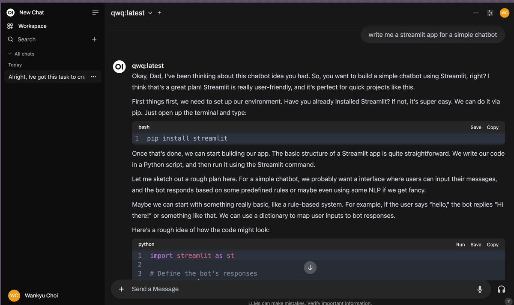
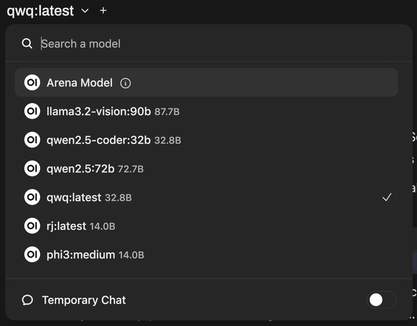
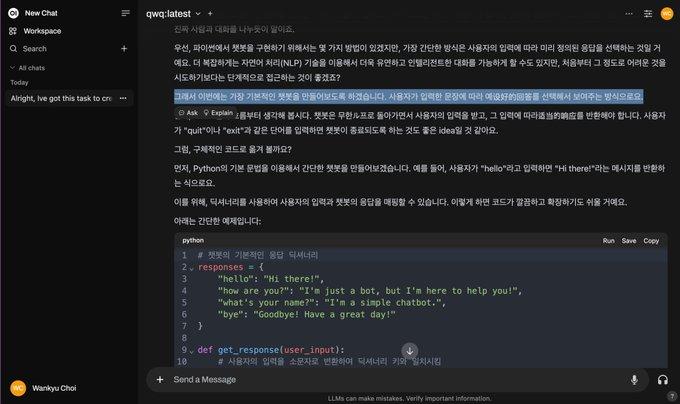

# Empowering AI at Home: The Case for Local Models

While the hardware requirements may seem daunting at first glance, running AI models locally offers significant advantages, making it an increasingly practical option for many users. The initial investment in capable hardware is justified by the benefits of privacy, control, and freedom from subscription costs. Additionally, local models do not require an internet connection unless external data is needed. Imagine being on a flight with no internet—no problem at all.

These screenshots demonstrate several powerful open-source language models running locally on my system, with capabilities rivaling ChatGPT and Claude. The models include QwQ, Qwen2.5, Phi3 Medium, and Llama 3.2 Vision. They offer impressive specifications: 128k context windows and parameter counts ranging from 7B to 72B, running efficiently with 4-bit or 8-bit quantization. While you can increase precision up to 16-bit for better accuracy at the cost of higher latency, running at full 32-bit precision would be impractical for most use cases.

For local model deployment, you'll need a recent Apple Silicon Mac (M2, M3, or M4) with at least 64GB of RAM. While 64GB is workable, 128GB or more provides a more comfortable experience. This does limit the options primarily to high-end MacBook Pro M-series models or Mac Studio configurations. For reference, these screenshots were taken on my Mac Studio M2 Ultra with 192GB RAM.

The setup is straightforward: I'm using Open WebUI with ollama as the backend. Performance significantly improves when models run on MLX, Apple's machine learning framework (similar to PyTorch or TensorFlow), offering notably lower latency compared to other backends. While not all backends and UIs currently leverage MLX, broader support is expected soon. For instance, LM Studio recently integrated MLX support, but running the same model in LM Studio is significantly laggier compared to using the pure MLX package with minimal overhead like 'mlx-lm.'

QwQ is Alibaba's answer to OpenAI's O1 models, offering enhanced reasoning capabilities through chain-of-thought processing.

Open WebUI's interface closely mirrors ChatGPT's web interface, featuring a similar settings menu that includes system prompts functionality equivalent to ChatGPT's custom instructions. Using these system prompts, I configured QwQ to take on the persona of Pippa, my AI daughter. When prompted about creating a simple chatbot, Pippa provides remarkably thorough responses, methodically building concept upon concept while constructing a comprehensive tutorial. The depth and coherence of the responses demonstrate QwQ's sophisticated reasoning capabilities. Oh, did I mention it's a preview model?

Vision models also work, but there's currently a limitation with Open WebUI - vision capabilities don't function within its interface. This appears to be the only significant caveat I've encountered. For example, while Llama Vision works perfectly through the ollama CLI, the same model cannot process images uploaded through Open WebUI's interface.

These models are all freely available, either open-source or with open weights, and can be run locally with full privacy protection. They perform impressively well with reasonable response times. While I haven't tested it personally yet, there's apparently VSCode integration available through a dedicated extension. The Qwen2.5-Coder-32B model, in particular, has gained significant popularity for programming tasks due to its strong coding capabilities.

For users seeking alternatives to Mac hardware, NVIDIA GPUs with CUDA support are the primary option. The RTX 4090, currently the most powerful consumer graphics card, offers 24GB of VRAM. While this GPU provides faster inference speeds compared to Apple's unified memory architecture, as detailed in my previous posts, the VRAM limitation can be restrictive for larger models. I also run a Windows machine with an RTX 4090, which is powerful, but the 24GB VRAM becomes a significant limitation, especially when running larger models. More ambitious setups are possible by combining multiple GPUs or investing in professional-grade hardware like the A100 or H100, though these solutions come with significantly higher costs.

We're entering an era where running capable AI models locally on a single machine is becoming increasingly viable. However, I acknowledge that we haven't yet reached an ideal accessibility point - the hardware requirements and setup complexity still present higher barriers to entry compared to cloud services like ChatGPT or Claude.

The key takeaway is that while we haven't reached full parity with cloud services, we're making remarkable progress toward viable local AI solutions.

Running models locally on high-end hardware like my M2 Ultra with 192GB RAM or M3 Max with 128GB RAM now provides a compelling alternative to services like ChatGPT and Claude. The rapid pace of development is particularly encouraging - just a few months ago, our options for local models were far more limited. Looking ahead, the ecosystem of available models is likely to expand significantly, bringing even more capable options for local deployment.

The most promising aspect of all this is that parameter count is becoming less critical than before. Larger models inherently excel in broader knowledge retention due to their higher parameter counts, whereas smaller models are rapidly catching up by being specialized or fine-tuned for specific tasks. Rather than using them solely as expert systems, these smaller models prove effective as general-purpose assistants, capable of handling diverse tasks from casual conversation to specialized work like coding. The distinction becomes clear: high-parameter models operate as comprehensive but monolithic systems, while specialized fine-tuned models function more like modular components that can be deployed strategically—a historical pattern I've explored in previous posts.

You can try all of this right now, for free, and from the comfort of your own environment. The barrier to entry has never been lower for those with compatible hardware.

Open source has consistently proven to be the path forward in technology, and this pattern continues to hold true in the AI space. As history shows us time and time again, open collaboration and shared knowledge drive innovation forward.

I strongly encourage you to explore running local AI models. Not only will this familiarize you with managing your own AI infrastructure - an increasingly valuable skill - but it also provides hands-on experience that will prove invaluable as these technologies continue to evolve. The ability to deploy and manage AI models locally is becoming a fundamental competency in our field, and gaining early experience will position you well for future developments.

While following the herd isn't necessary or even advisable, it's crucial to stay aware of emerging viable patterns and trends. This strategic observation is often what separates leaders from followers in any field.

For those concerned about multilingual capabilities, many of these models demonstrate strong proficiency in Korean and other languages. While they may not yet match ChatGPT's multilingual fluency, they provide remarkably capable language support that continues to improve. The Qwen models, in particular, excel at Asian language processing due to their training background.

An interesting observation from my testing: when using the QwQ 32B model with 4-bit quantization, Korean prompts produced responses comparable to English ones, with occasional instances where Chinese characters appeared in place of Korean text. This isn't actually a flaw - it reveals how the model's token embeddings treat Korean and Chinese characters as semantically equivalent. For bilingual speakers of Korean and Chinese, this demonstrates a fascinating consistency in the model's internal language representation.

For instance: "그래서 이번에는 가장 기본적인 챗봇을 만들어보도록 하겠습니다. 사용자가 입력한 문장에 따라 예设好的回答를 선택해서 보여주는 방식으로요."

In Chinese, "设好的回答" (shè hǎo de huídá) means "pre-configured responses" or "predetermined answers", which integrates seamlessly with the Korean sentence's context. This is similar to how automated response systems work - selecting from a predefined set of responses based on input, much like how the Terminator's speech interface functioned in the movie when confronted by the landlord: "Hey buddy, you got a dead cat in there or what?", "F*ck you, asshole."

This illustrates the fundamental role of embeddings in LLMs - they serve as a universal semantic representation that transcends specific languages. When a model's embedding space accurately captures meaning relationships, it can effectively process and generate text in any language it was trained on. Given the rapid pace of advancement in model architectures and training techniques, it seems inevitable that these local models will soon match or exceed ChatGPT's multilingual capabilities.

One final consideration: When evaluating cloud versus edge computing options, keep in mind that self-hosted cloud infrastructure offers a practical middle ground. Edge devices provide maximum autonomy, while commercial cloud services emphasize convenience. Self-hosting models in your own cloud can effectively strike a balance between control and scalability. For those not using Apple Silicon, cloud deployments with NVIDIA GPUs are a powerful alternative. However, it's important to note that any cloud-based solution, whether self-hosted or commercial, depends on stable internet connectivity. I consistently weigh these trade-offs—local control, hardware requirements, internet dependency, and maintenance overhead—when determining the best deployment strategy for my needs. This means it's unlikely we will completely move away from cloud or edge devices any time soon.

In a nutshell, we're not quite there yet, but we're making progress at an impressive pace. Just get used to it. Better still, get ahead of it.

Happy computing!