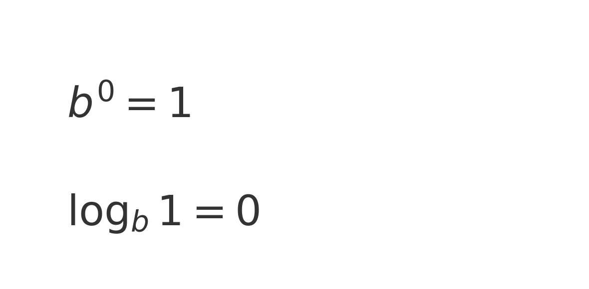
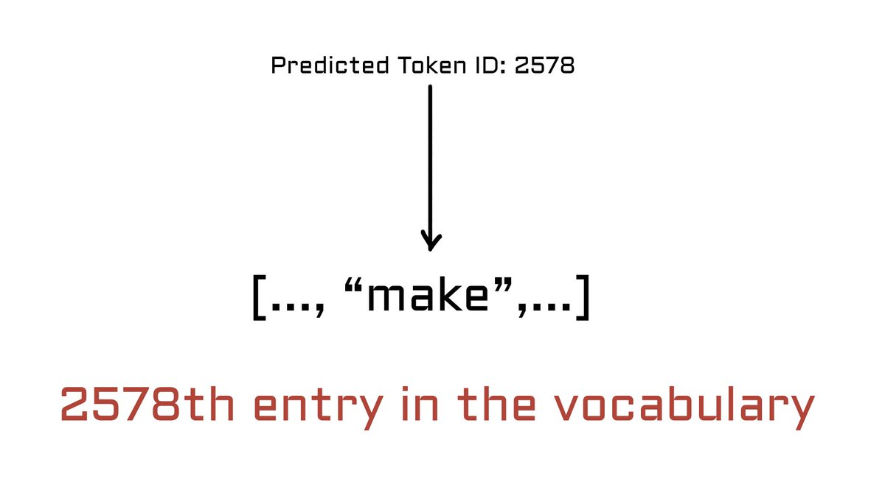

# How LLMs Learn to Predict Next Words - In Layman's Terms

Let's demystify how Large Language Models (LLMs) learn to predict the next word in a sequence.

Self-supervised learning is a key concept in training LLMs. Unlike traditional supervised learning, where models are trained on labeled data, self-supervised learning allows models to generate their own labels from the data itself. This approach enables LLMs to learn from vast amounts of text data without explicit human supervision.

To understand self-supervised learning, it's helpful to contrast it with supervised learning:

1. Supervised Learning:
- The trainer prepares a dataset with input data and corresponding labels.
- The model learns to predict the correct label for given input.
- Labels are answers to questions prepared by the trainer.

2. Self-Supervised Learning:
- The model is fed unlabeled text data.
- The model learns to predict the next word in a sequence.
- The "labels" or "targets" are derived from the text itself.

In self-supervised learning for LLMs, the training process works as follows:

1. A sentence is presented to the model, e.g., "We are all humans born to make mistakes".
2. The model is tasked with predicting each word given the previous words.
3. For instance, given "We are all humans born to make", the model should predict "mistakes".
4. The model's prediction is compared to the actual word.
5. If correct, the model is reinforced; if incorrect, it's penalized and adjusts its parameters.

This process allows the model to learn patterns and structures in language without explicitly labeled data. By repeatedly predicting next words across vast amounts of text, LLMs develop a deep understanding of language and context.

Understanding this fundamental concept of self-supervised learning is crucial to grasping how LLMs function and improve their language understanding capabilities.

## Labels and Targets in Self-Supervised Learning

Before diving into cross-entropy loss, it's important to understand how labels and targets work in self-supervised learning, especially in the context of large language models (LLMs).

In **supervised learning**, models are trained using a dataset that includes input data along with corresponding **labels** (correct answers). For example, in an image classification task, the input might be an image of a cat, and the label would be "cat." The model learns by comparing its predictions to these provided labels.

In **self-supervised learning**, like in LLM training, the model generates its own labels from the data itself. LLMs learn by predicting parts of the input text based on the rest of the text. For instance, given a sentence like "We are all humans born to make \_\_\_," the model's task is to predict the missing word. The **target** here is the actual next word (e.g., "mistakes"), which is derived from the text itself. There are no manually provided labels; instead, the data provides the supervision. This is why it's called "self-supervised" learning.

These targets are used to calculate the **cross-entropy loss** during training, guiding the model to improve its predictions. Unlike traditional supervised learning, LLMs create their own learning signals from vast amounts of unstructured text data, making them highly scalable and capable of understanding complex language patterns.

It's important to note that the model is trained to predict the next token for sequences of varying lengths. For instance, given the partial sentence "We are all humans", the model should predict "born" as the next word. If presented with "We are all humans born to", it should predict "make". This flexibility allows the model to handle different context lengths, always aiming to predict the subsequent token in the sequence. The target for the model's prediction is consistently the actual next word or token that appears in the training data, regardless of the input sequence length.

## What the Heck are Losses?

In deep learning, the concept of "loss" is fundamental to the training process. A loss function, also known as a cost function or error function, measures how well a model is performing its task. Here's a breakdown of what loss means in deep learning:

1. Purpose of Loss:

- It quantifies the difference between the model's predictions and the actual target values.
- Serves as a feedback mechanism to guide the model's learning process.
2. How Loss Works:

- For each training example, the model makes a prediction.
- The loss function calculates how far off this prediction is from the true value.
- A lower loss indicates better performance, while a higher loss suggests the model needs improvement.
3. Types of Loss Functions:

- Different tasks use different loss functions. For example:
- Mean Squared Error (MSE) for regression problems
- Cross-Entropy Loss for classification tasks (which we'll explore in depth next)
4. Optimization Process:

- The goal of training is to minimize the loss.
- This is typically done through gradient descent, where the model's parameters are adjusted to reduce the loss over time.
5. Importance in Training:

- Loss provides a single number that represents the model's performance.
- It allows the training process to be automated, as the model can adjust itself based on this feedback.
Understanding loss is crucial because it's the primary metric that guides how a model learns and improves. In the context of LLMs, cross-entropy loss is particularly important, as we'll see in the following section.

## Cross-Entropy Loss in LLM Training

When training LLMs, cross-entropy loss plays a fundamental role in teaching the model how to understand and generate human-like language. This loss function is central to improving the quality of predictions made by LLMs, such as GPT or BERT, and helps these models learn the patterns and structure of language. Let's explore what cross-entropy loss is, why it is used, and how it helps in LLM training without diving too deep into complicated math.

### What is Cross-Entropy Loss?

Cross-entropy loss is a way of measuring how well the predictions made by a model match the actual correct answers. Think of it as a "mistake meter" for the model: the higher the value, the worse the model is doing at making correct predictions. In the context of LLMs, which are designed to predict the next word or token in a sequence, cross-entropy loss tells us how far off the model's guesses are from the correct words.

The idea behind cross-entropy loss is to measure the "distance" between what the model predicts and what the correct answer should be. It does this by looking at the probability the model assigns to each possible word in its vocabulary. The closer the predicted probability is to the actual correct word, the lower the loss will be.

### How It Works in LLM Training

LLMs are trained using a vocabulary that includes words, subwords, symbols, and punctuation marks. When given a prompt, the model looks at all the possible words it knows (its vocabulary) and assigns each one a probability of being the correct next word in the sequence. For example, if the model is given the prompt "We are all humans born to...", it might assign probabilities like:

- P("make") = 0.6

- P("create") = 0.2
- P("learn") = 0.1
The correct answer here is "make," and the goal is for the model to assign a high probability to it. Cross-entropy loss comes into play by taking the logarithm of the predicted probability for the correct word (in this case, 0.6) and then taking the negative of that value. The negative log turns the loss into a positive value that we can use to gauge how well the model did.

### Why Use the Logarithm?

The logarithm is used because it helps scale the penalty depending on how confident the model is in its prediction. If the model assigns a high probability to the correct answer, the loss will be small, indicating that the model is doing well. However, if the model assigns a low probability to the correct word, the log of that small probability will result in a large negative value, which, when negated, gives a high loss. This large loss serves as a strong signal to the model that it needs to improve.

Another reason for using the logarithm is that it simplifies calculations and avoids problems with extremely small numbers. Probabilities are always between 0 and 1, and multiplying many small probabilities together can lead to very tiny values that are difficult for computers to handle. By taking the logarithm, we convert these products into sums, which are easier to work with.

### Minimizing Cross-Entropy Loss

The ultimate goal during training is to minimize the cross-entropy loss. In simple terms, this means we want the model to get as confident as possible about the correct answer, ideally predicting it with a probability of 1. When the model does this, the log of the probability becomes zero, meaning there is no loss — which is perfect.

Since the logarithm of 1 is zero (log(1) = 0), minimizing cross-entropy loss is essentially trying to get the model to a point where it assigns a probability of 1 to the correct token every time. Practically, this is very challenging to achieve, but the closer we get, the better the model becomes at understanding language.

For those who find mathematical concepts challenging, referring to a visual representation attached to this post can be helpful in understanding this principle. In any logarithmic base b, log_b(1) always equals 0. This is because any number raised to the power of 0 results in 1. If this still seems unclear, it might be useful to simply commit to memory that any number to the 0 power equals 1. When we apply this concept to logarithms, we arrive at 0, which represents the lowest possible loss in our context. This fundamental relationship between logarithms, exponents, and the number 1 is crucial in understanding why a loss of 0 is ideal in our model. Got it? Good, let's proceed.

### Vocabulary as the Model's Language Knowledge

In LLM training, the vocabulary is the only set of tokens (words, symbols, punctuation) that the model knows about. The model's predictions are always limited to this vocabulary. It cannot generate new words or tokens that are not part of this pre-defined set, so it must learn to make the best use of what it knows. During training, cross-entropy loss is calculated over all tokens in this vocabulary, and the model is taught to adjust its predictions so that the correct tokens get higher and higher probabilities.

The softmax function plays a crucial role in converting the model's raw output into a meaningful probability distribution across the entire vocabulary. This function takes the logits (unnormalized predictions) produced by the model and transforms them into a set of probabilities that sum to 1, ensuring a valid probability distribution.

Here's how it works:

1. It exponentiates each logit, making all values positive.

2. It then normalizes these values by dividing each by the sum of all exponentiated logits.
This process results in several key properties:

- The output probabilities are always between 0 and 1.

- The sum of all probabilities equals 1, regardless of vocabulary size.
- The relative differences between logits are preserved in the final probabilities.
The token with the highest logit receives the highest probability, but all tokens in the vocabulary get assigned a non-zero probability. This allows the model to express uncertainty and consider alternative predictions, which is crucial for learning nuanced language patterns.

In the context of cross-entropy loss, the softmax output directly feeds into the loss calculation, providing a differentiable way to compare the model's predictions with the true labels during training.

The concept of logits might be confusing at first. Essentially, logits are the raw numerical outputs produced by the model before they're converted into probabilities. These logits represent the model's initial, unprocessed predictions. The softmax function then takes these logits and transforms them into a proper probability distribution across the entire vocabulary.

It's important to note that up until this point, the model is working purely with numbers, not readable text. The process of generating human-readable output happens in the final step. Once the model predicts the next token (based on the highest probability after softmax), this prediction is mapped to an index in the vocabulary. This index corresponds to a specific token - which could be a word, subword, or even a punctuation mark. By repeating this process, the model builds up its output one token at a time, ultimately producing a coherent string of text.

For instance, if the model predicts token ID 2578 as the next token, and the 2578th entry in the vocabulary corresponds to the word "make", then the model's output for this step would be "make". This process of mapping numerical predictions to actual words or subwords from the vocabulary is how the model generates human-readable text, one token at a time.

This transition from raw numerical predictions to meaningful text output is a key aspect of how language models bridge the gap between mathematical computations and human-readable language.

### Why Negative Log Probabilities?

The use of negative log probabilities in cross-entropy loss serves a crucial purpose in the training of language models. To understand this, let's break it down step by step:

1. Log probabilities: We start with the log of the predicted probability for the correct token. Log probabilities are always negative (or zero) because probabilities are between 0 and 1, and log(x) is negative when 0 < x < 1.

2. Negative average log probability: We take the average of these log probabilities across all tokens in our training data, then multiply by -1. This negation turns our negative values into positive ones.

3. Cross-entropy loss: The resulting positive value is what we call the cross-entropy loss. In deep learning, this term is used because it represents the average number of bits needed to encode data from one distribution (the true distribution) using a code optimized for another distribution (our model's predicted distribution).

By using negative log probabilities, we achieve several important goals:

- We convert very small probability values into more manageable numbers.

- We turn the problem of maximizing probability into a problem of minimizing loss, which is more standard in optimization.
- We create a loss function that heavily penalizes confident mistakes (when the model assigns a very low probability to the correct answer).
This approach ensures that the model not only learns to predict the correct tokens but also to do so with high confidence, leading to more accurate and reliable language generation.

## Bringing It All Together

Cross-entropy loss is a crucial part of training LLMs because it provides a clear and measurable way to tell the model how well it is performing. By using negative log probabilities, the loss function not only penalizes incorrect or low-confidence predictions but also rewards the model for being correct and confident. This helps the model learn to generate coherent, contextually appropriate language over time.

In simple terms, cross-entropy loss is the "teacher" guiding the LLM by telling it when it makes mistakes and helping it learn the structure of human language. The better the model gets at minimizing this loss, the better it becomes at generating human-like text and understanding context, making it a powerful tool for language-related tasks.