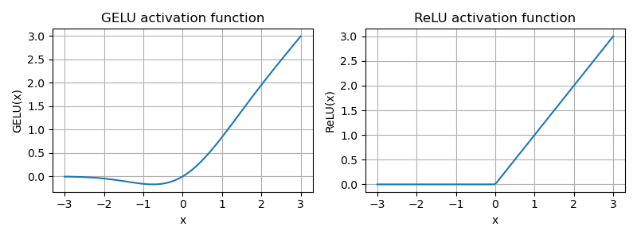
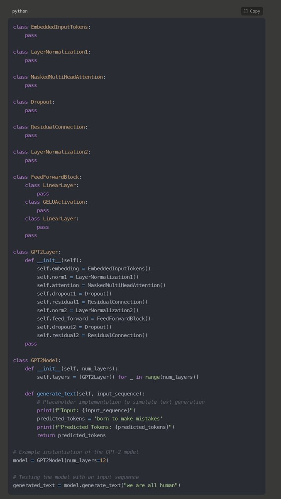

# GPT Architecture In a Nutshell

 
 
 

👉 The GPT-2 Architecture shown in the first screenshot is from the book:

Build a Large Language Model (From Scratch) by Sebastian Raschka
https://amazon.com/Build-Large-Language-Model-Scratch/dp/1633437167

The GPT-2 transformer architecture consists of several key components that work together to process and generate text. Here's an overview of each component and its role in the architecture:

1. **Embedded Input Tokens**: The process begins by converting input words or tokens into fixed-size vector representations (embeddings). For GPT-2, these are typically 768-dimensional vectors.

2. **Layer Normalization 1**: This initial normalization step is applied to the embedded input vectors. It stabilizes the learning process and improves convergence by normalizing across features.

3. **Masked Multi-Head Attention**: This mechanism allows the model to focus on different parts of the input sequence when predicting a token. The masking ensures that the model only considers previous tokens, maintaining its autoregressive property.

4. **Dropout**: Applied after the attention mechanism, dropout helps prevent overfitting by randomly setting a fraction of activations to zero during training.

5. **Shortcut Connection (Residual Connection)**: The original input to the attention block is added back to the output. This helps train deeper networks by mitigating the vanishing gradient problem and ensuring better gradient flow.

6. **Layer Normalization 2**: Another normalization layer is applied after the residual connection and attention block, similar to Layer Normalization 1.

7. **Feed-Forward Block**: This consists of two linear layers with a GELU (Gaussian Error Linear Unit) activation function between them:
   - First Linear Layer: Projects the input to a higher-dimensional space.
   - GELU Activation: Introduces non-linearity to the model.
   - Second Linear Layer: Projects the representation back to the original dimensionality.

8. **Dropout**: Another dropout layer is applied after the feed-forward block for further regularization.

9. **Shortcut Connection (Residual Connection)**: The input to the feed-forward block is added back to its output, following the same principle as the earlier residual connection.

These components are stacked multiple times to create the complete GPT-2 transformer model. Each layer works in concert to learn complex dependencies within the input text, enabling GPT-2 to generate coherent and contextually appropriate text.

## Inference Process

To illustrate how GPT-2 processes input, let's consider the sequence "We are all human":

1. **Token Embedding**: Each word is tokenized and embedded into a 768-dimensional vector.

2. **Layer Normalization and Attention**: The embedded input passes through the first layer normalization, then the masked multi-head attention layer processes it, focusing on relevant parts of the sequence while maintaining the model's autoregressive nature.

3. **Residual Connection and Layer Normalization**: The original embedded input is added to the attention output, followed by another layer normalization.

4. **Feed-Forward Transformation**: The output passes through the feed-forward block, projecting it to a higher-dimensional space, applying GELU activation, and projecting it back. Dropout is applied for regularization.

5. **Residual Connection and Output Generation**: Another residual connection is applied after the feed-forward block. The resulting representation is used to predict the next token in the sequence.

This process repeats for each new token, generating coherent and contextually appropriate text.

## Key Components Explained

### GELU Activation Function

The Gaussian Error Linear Unit (GELU) is chosen for GPT-2 because it provides a smoother, more probabilistic approach to activation compared to functions like ReLU. GELU applies a non-linear transformation considering both the input value and its probability of being positive. This allows the model to capture complex relationships in the data more effectively.

### Dropout

Dropout is a regularization technique that prevents overfitting by randomly setting a fraction of activations to zero during training. This forces the model to learn redundant representations and not rely too heavily on specific neurons, improving robustness and generalization.

### Skip or Shortcut Connections

Also known as residual connections, these help address the vanishing gradient problem in deep neural networks. By adding the original input back to the output of specific layers, the model preserves information from earlier layers and ensures smoother gradient flow during backpropagation.

### Layer Normalization

Layer Normalization (LayerNorm) stabilizes the learning process and improves convergence. Unlike batch normalization, LayerNorm normalizes across the feature dimension for each input separately, making it effective for sequential models like transformers where batch sizes can vary.

### Double LayerNorm Blocks

GPT-2 applies LayerNorm twice in each transformer layer—before the masked multi-head attention block and before the feed-forward block. This dual application ensures that each component receives normalized inputs, improving gradient flow and reducing issues like internal covariate shift.

## Simplified Explanation of Transformer Function

Imagine the transformer as a team of detectives working to understand a story. Each word in a sentence is a clue, and some clues depend on others. The detectives work together to determine how each word relates to every other word.

They first form initial ideas about what each clue means, then meet to discuss which clues are important and how they connect. They focus on previous clues to predict what could come next, ignoring anything they haven't seen yet.

After discussing, they refine their thoughts, repeating this process until they understand the whole story. Sometimes, they might ignore parts they deem unimportant (like dropout). They use normalization to balance each detective's opinions.

Finally, they predict what might come next in the story. This constant collaboration and refinement allow the transformer to generate meaningful and coherent text, one word at a time, like piecing together a mystery story.

## Implementing GPT-2 Architecture

The screenshot of python code provides a foundational structure for the GPT-2 architecture, implemented using Python classes.

This framework serves as a basis for developing the GPT-2 model, with each component encapsulated within its respective class. To create a fully functional GPT-2 model, you will need to populate these classes with the appropriate PyTorch code.

## GPT-2 Text Generation Process

After processing the input through its layers, GPT-2 generates text as follows:

1. **Logit Output**: The model produces logits for each token in its vocabulary. These logits are raw, unnormalized scores indicating the model's preference for each possible next token.

2. **Softmax Conversion**: The logits are passed through a softmax function, which converts them into a probability distribution. This step normalizes the scores, making them sum to 1 and easier to interpret as probabilities.

3. **Token Selection**: To generate the next token, one of several decoding strategies can be employed:

   a) **Greedy Decoding**: The simplest method, where the token with the highest probability is always chosen. This often leads to repetitive or predictable text.
   
   b) **Temperature Sampling**: A temperature parameter (0 < T ≤ 1) is applied to the logits before softmax. Lower temperatures make the distribution more peaked (more conservative choices), while higher temperatures flatten it (more diverse, potentially less coherent choices).
   
   c) **Top-k Sampling**: Only the k most likely next tokens are considered, and the probability mass is redistributed among these k tokens.
   
   d) **Top-p (Nucleus) Sampling**: Tokens are chosen from the smallest possible set whose cumulative probability exceeds a threshold p. This dynamically adjusts the number of tokens considered based on the confidence of the model's predictions.
   
   e) **Beam Search**: Multiple alternative sequences are maintained and extended in parallel, ultimately selecting the sequence with the highest overall probability.

4. **Token-to-Text Conversion**: The selected token ID is converted back into its corresponding word or subword using the model's vocabulary.

5. **Iteration**: This process repeats, with the newly generated token added to the input sequence for the next iteration, until a stop condition is met (e.g., maximum length or special end token).

By adjusting the decoding strategy and its parameters, users can control the trade-off between output coherence and diversity, tailoring the generated text to their specific needs.

## GPT-2 Text Generation Process Simulation

Input sequence: "We are all humans"
Predicted tokens: "born to make mistakes"

Let's simulate the process step by step:

1. Initial input: "We are all humans"

2. The model processes this input through its layers and produces logits for the next token.

3. Logits to probabilities (simplified example):

Token    | Logit  | Probability
---------|--------|------------
born     | 5.2    | 0.60
created  | 3.8    | 0.17
designed | 3.5    | 0.12
meant    | 3.2    | 0.09
...      | ...    | ...

4. Token selection (assuming greedy decoding): "born" (highest probability)

5. Updated sequence: "We are all humans born"

6. The model processes the updated sequence and produces logits for the next token.

7. Logits to probabilities:

Token    | Logit  | Probability
---------|--------|------------
to       | 4.9    | 0.55
and      | 3.6    | 0.15
for      | 3.4    | 0.12
with     | 3.1    | 0.09
...      | ...    | ...

8. Token selection: "to" (highest probability)

9. Updated sequence: "We are all humans born to"

10. The process repeats for "make":

Token    | Logit  | Probability
---------|--------|------------
make     | 5.1    | 0.58
create   | 3.7    | 0.15
do       | 3.5    | 0.12
build    | 3.2    | 0.09
...      | ...    | ...

11. Updated sequence: "We are all humans born to make"

12. Finally, for "mistakes":

Token    | Logit  | Probability
---------|--------|------------
mistakes | 5.3    | 0.62
choices  | 3.6    | 0.11
decisions| 3.4    | 0.10
errors   | 3.2    | 0.09
...      | ...    | ...

13. Final generated sequence: "We are all humans born to make mistakes"

Note: The logits and probabilities shown are simplified examples. In reality, GPT-2 has a much larger vocabulary (50,000+ tokens), and the probability distributions would be more complex.

It's crucial to understand that regardless of the size of the model's vocabulary, the probabilities of all possible next tokens always sum to **1**. This is a fundamental property of the softmax function used to convert logits to probabilities. Whether the vocabulary contains 1,000 tokens or 50,000 tokens, the model assigns a probability to each token such that the total probability across all tokens is exactly 1. This ensures that the model's predictions are always expressed as a valid probability distribution, with each token's likelihood considered relative to all other possible tokens. In our simplified examples, we've shown only a few tokens, but in the full model, even tokens with very small probabilities contribute to this sum of 1.

This simulation demonstrates how GPT-2 generates text token by token, always considering the full context of previously generated words. The model's understanding of language patterns allows it to generate coherent continuations of the input sequence.