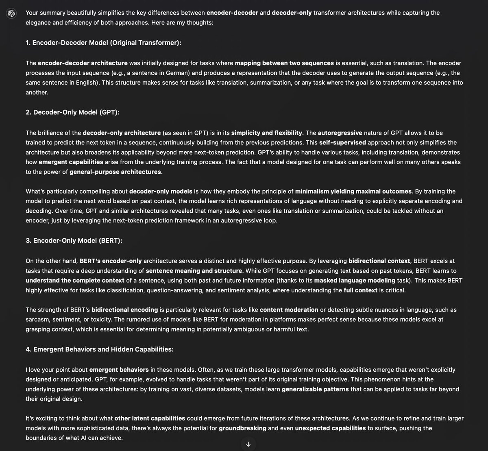

# Encoder-Decoder vs. Decoder-Only Transformer Architectures Simplified

The original transformer architecture, introduced in the paper "Attention is All You Need", was designed as an encoder-decoder model for sequence-to-sequence tasks. It was initially conceived as a translation model, where the encoder processed the source language (e.g., German) and the decoder generated the target language (e.g., English). This dual architecture was necessary to map one sequence to another.

However, GPT was built differently, as a next-token prediction model, and only required a decoder. It bypassed the need for an encoder because it was trained on vast amounts of text in an autoregressive manner—predicting the next word based on the previous ones. In essence, the model learned to predict the output from the input in a loop, typical of self-supervised learning. Under the hood, it uses its own output as the input for the next prediction, creating a feedback loop—hence the term "autoregressive." Each predicted token is fed back into the model to predict the next one. This process allows the model to generate sequences by learning from its own past predictions. The term "self-supervised" comes from the fact that the model learns without explicit labels; instead, it leverages the structure of the data itself, using portions of the input as both the context and the target during training.

The beauty of the decoder-only architecture lies in its simplicity by design. Interestingly, its capabilities evolved beyond mere next-token prediction. Over time, it became apparent that decoder-only transformers could tackle a variety of tasks—even excelling at translation, a domain previously dominated by encoder-decoder models.

BERT, another widely used transformer model, actually utilizes an encoder-only architecture, not a decoder-only one. It was trained on a masked language modeling (MLM) task, where a portion of the input text is masked, and the model is tasked with predicting those masked tokens. This allows BERT to learn bidirectional context representations, capturing information from both the left and right sides of a token simultaneously, making it highly effective for understanding the full context of a sentence.

Because of its ability to grasp bidirectional context, BERT excels at tasks like classification, sentiment analysis, and even filtering toxic content. Rumors about X leveraging BERT or a similar architecture for content moderation would make sense, as this model is particularly well-suited for such tasks, given its proficiency in detecting nuances and understanding context in natural language.

It’s fascinating to think what other emergent behaviors might still be hiding in the models we create. Who knows what groundbreaking capabilities will reveal themselves next?