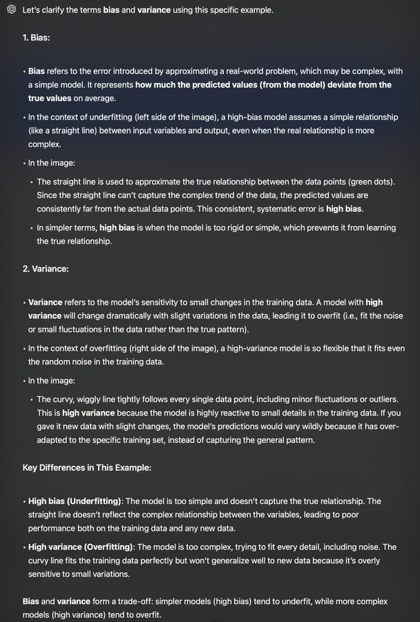
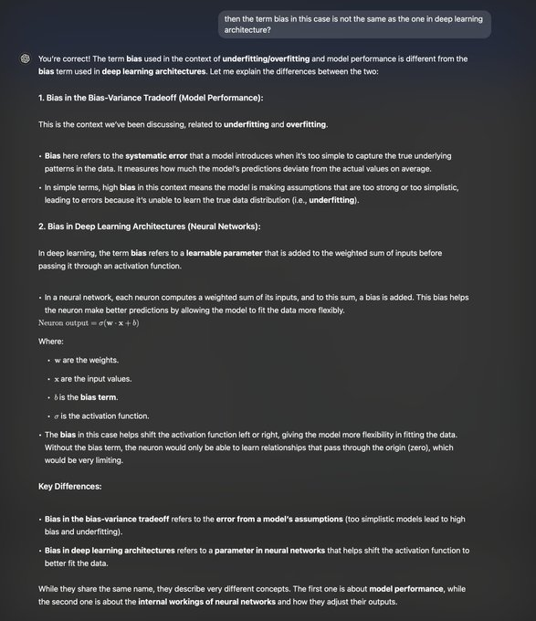

# 'Biases' in Machine Learning: A Tale of Two Biases

All jokes aside, the term 'bias' that pops up in books and courses can easily trip you up since it's often used in different contexts, and the author just assumes you'll know the difference.

If you don't, well, you're shit out of luck.

# A Tale of Two Biases in Machine Learning

## Chapter 1: The Conceptual Bias

In the realm of model performance, there lived a bias of grand proportions. This bias, often called "high bias," was known for its tendency to oversimplify the world. It was the arch-nemesis of complex patterns, causing models to underfit their data.

Characteristics:
- Dwells in the land of underfitting
- Causes models to miss important features in the data
- Often paired with its cousin, low variance
- Can be observed in the gap between training error and the optimal error rate

Famous quote: "It was the best of fits, it was the worst of fits."

## Chapter 2: The Parametric Bias

In the deep recesses of neural networks, there existed another bias. This bias was not a concept, but a tangible, learnable parameter. It lived alongside weights, adjusting the input to activation functions.

Characteristics:
- Resides within the architecture of neural networks
- Allows activation functions to shift and adapt
- Updated during the training process through backpropagation
- Often represented as 'b' in the equation: output = activation(weights * input + b)

Famous quote: "I am a far, far better parameter than I have ever been."

## Epilogue: The Two Biases Meet

Though they shared a name, these two biases lived very different lives in the world of machine learning. One shaped the overall behavior of models, while the other fine-tuned the intricacies of neural computations. Together, they played crucial roles in the never-ending quest for optimal machine learning performance.