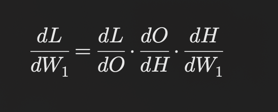

# Understanding the Chain Rule in Backpropagation With Minimal Formulae

Deep learning is all about training neural networks to learn from data well. To do that, we need to fine-tune the model's parameters (like weights and biases) to reduce the error between what the model predicts and the actual answer. **Backpropagation** is the key algorithm that helps us adjust these parameters to make the model better over time. At the core of backpropagation is the chain rule, which makes sure each parameter gets updated the right way. While the chain rule might sound like "mathematical magic," it's really just a logical, step-by-step method that handles the complexity of all the layers in a neural network.

## What is the Chain Rule (Without the Math)

The chain rule is a way to figure out how changing something early in a process affects the final outcome. Imagine it like a chain of cause and effect, where each link in the chain is connected to the next. In a neural network, each layer depends on the one before it, and ultimately everything affects the final output. The chain rule helps us calculate how changes in one layer influence the outcome, step by step, making it easier to know how to tweak each part of the network to get the best results.

You might have first encountered the chain rule in calculus class, where it was used to find the derivative of a composition of functions. It helps break down how changes in an input influence a final result when multiple functions are involved. For example, if you think about calculating how the area of a circle changes when you change the radius, you're using the chain rule. You first figure out how changing the radius affects the circumference, and then how that affects the area. In deep learning, we're essentially applying the same idea to figure out how changes in the parameters affect the overall output.

## What is the Chain Rule (With the Math)

The formula in the screenshot shows how we use the chain rule to calculate the gradient of the loss with respect to a weight in an earlier layer. The idea is to break the calculation into smaller, more manageable pieces. The gradient of the loss (L) with respect to a weight (W1) is expressed as a product of partial derivatives: how the loss changes with the output (dL/dO), how the output changes with the hidden layer (dO/dH), and how the hidden layer changes with the weight (dH/dW1). By multiplying these gradients, we can trace the influence of each layer on the final loss, step by step. This detailed approach helps determine exactly how much each parameter needs to be tweaked to minimize the error effectively.

Don't get caught up in calculating everything step-by-step; instead, try to mentally visualize compressing the chain rule into a single fraction (the final result). This approach helps you see the pattern and understand how the gradients flow through each layer. Once you do this, you can arrive at dL/dW1 by eliminating the common numerators and denominators between the terms in the chain rule. This way, you can clearly see how each layer relates to the next and how they collectively influence the final outcome.

## The Basics of Backpropagation

At a high level, backpropagation is the process of passing the error (or loss) from the output layer of a neural network back through the hidden layers. The goal is to adjust the parameters at each layer so that, over time, the model makes better predictions. The loss function measures how far off the model’s predictions are from the true values, and backpropagation helps the network figure out how to reduce this loss by adjusting the parameters in a way that improves the performance.

The challenge arises when you consider how these parameters influence the final prediction. The network has multiple layers, and parameters in earlier layers (like those in hidden layers) don’t directly affect the output. Instead, their effect is indirect, influencing the next layer, which then influences the following layer, and so on until the final output. To understand how a change in one layer’s parameters affects the final prediction, we need to track these dependencies carefully. This is where the chain rule comes in.

## The Role of the Chain Rule

In essence, the chain rule allows us to "connect the dots" between the output and the parameters in the hidden layers. It works by breaking down the complex dependencies between layers into simpler, more manageable parts. Instead of trying to figure out how every weight across the entire network influences the output in one giant calculation, the chain rule lets us handle each layer step by step.

For example, in a simple neural network with three layers—an input layer, a hidden layer, and an output layer—the output is influenced by the hidden layer, and the hidden layer is influenced by the input layer. The chain rule helps us calculate how much the output depends on the hidden layer, and then how much the hidden layer depends on the input layer. By chaining these dependencies together, we can figure out how much each parameter in the hidden layer needs to be adjusted to improve the final output.

## An Everyday Analogy

To understand the chain rule more intuitively, think of making a sandwich. The final taste of the sandwich depends on the layers of ingredients, like bread, mustard, and meat. If you want to change the taste, you could adjust the ingredients in any layer. For example, adding more mustard in the middle layer could improve the overall flavor. However, the effect of this change isn’t isolated; it interacts with the other layers. If you want to optimize the sandwich, you need to understand how the ingredients in one layer (like mustard) affect the whole.

Similarly, in a neural network, changes to the hidden layers affect the output in ways that depend on the interactions between layers. The chain rule helps us measure how changes in one layer affect the whole, ensuring that we adjust each parameter optimally to reduce the error in the final prediction.

## Why the Chain Rule Is Necessary

Without the chain rule, it would be nearly impossible to determine how changes in early layers (like the hidden layer in our sandwich analogy) affect the final output. Since each layer is connected to the next, and each one depends on the other, we need a systematic way to trace these dependencies. The chain rule enables us to efficiently update the parameters in each layer, even if those parameters don’t have a direct link to the output. It makes sure we consider the entire flow of information through the network, from the input to the output.

## Conclusion

In deep learning, the chain rule is an essential part of the backpropagation process. It allows us to trace how changes in one part of a neural network impact the final prediction by breaking down complex dependencies between layers. While it may seem like "mathematical magic," the chain rule is actually a logical method for managing the intricate relationships between layers. By helping us adjust each parameter correctly, the chain rule ensures that the network learns efficiently, improving its predictions over time. Without it, the process of updating parameters in a deep learning model would be far more difficult, if not impossible, in practice.

