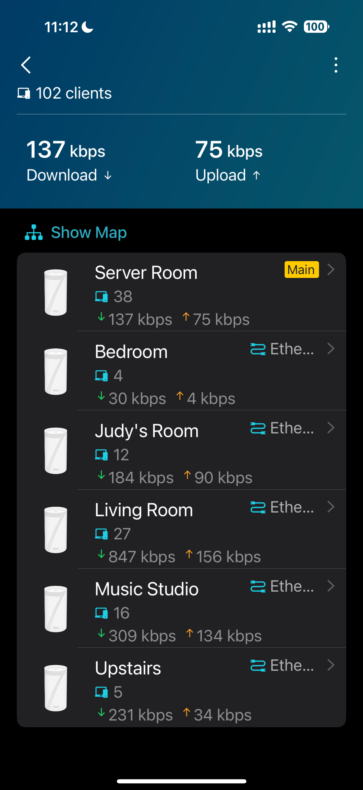
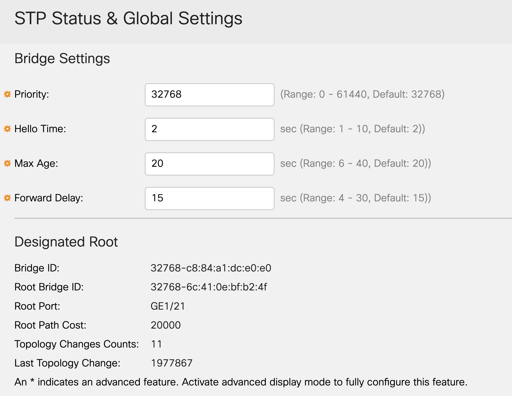
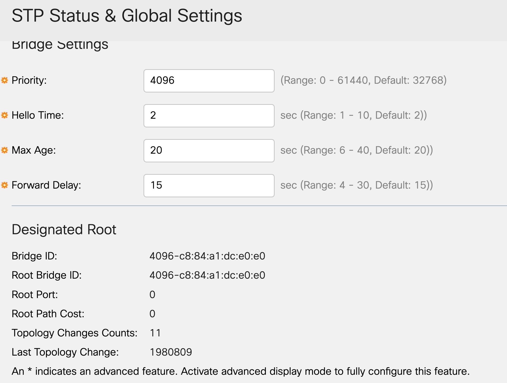

# Working with GPT o1 to Resolve Elusive Network Issues 

First, I was amazed by both the process and the results of this collaboration.

My home network is more akin to a small enterprise setup, featuring six Cisco small-business switches, a six-node mesh system, and over a hundred wired and wireless devices. It’s the kind of complex environment that could make a seasoned network engineer cringe.

I designed and implemented this network myself during a home remodel. With enough experience to qualify as a network engineer, I coordinated everything—cable runs, proper RJ45 termination, and thorough testing with professional-grade tools (Fluke and NetAlly)—ensuring the network’s physical layer was solid from the start.

Over time, the network grew in complexity. Mesh systems were added and replaced—first Linksys, then TP-Link—introducing even more moving parts. Eventually, issues began to surface: intermittent internet dropouts on certain TVs and network players, firmware updates repeatedly failing on some devices, and occasionally nodes reverting to wireless backhaul instead of using their wired connections. Annoying, intermittent, and perplexing issues—especially since wired networking should be more stable than wireless.

Determined to solve this once and for all, I sought advice and collaborated extensively with o1. After reviewing screenshots, topology details, and device configurations, we narrowed the problem down to the Spanning Tree Protocol (STP) configuration on the main Cisco switch. The main switch wasn’t acting as the root bridge, causing unnecessary STP recalculations and resulting in those elusive dropouts.

O1 initially suggested working with specific ports connected to the mesh nodes. However, tracking ports in this complex network proved challenging. I had lost my network map detailing port connections, and even if I hadn't, frequent topology changes would have rendered it obsolete. While using a network tester to re-map connections might seem like an obvious solution, it's a daunting task in a complex home network with hundreds of devices. Technically feasible, yes, but not the most practical approach given the circumstances. If you put a gun to my head, I can do it. But I'd rather not.  

The solution was simple and elegant: adjust the STP priority on the main switch so it becomes the root bridge. By lowering the priority to 4096—and without needing a reboot—stability was restored. Firmware updates now complete reliably, and all wired devices, including TVs and network players, function as intended.

All issues are resolved, and the network once again behaves as a wired network should—predictably and reliably. Below is the concise summary created by o1, reflecting the entire diagnostic and resolution process.

- Screenshot 1: Mesh Network Topology Diagram  
- Screenshot 2: Main Cisco Switch and Patch Panels for Efficient Cable Management  
- Screenshot 3: Main Cisco Switch STP Configuration (Before Changes)  
- Screenshot 4: Main Cisco Switch STP Configuration (After Adjusting Priority)

Note: The network flow is ISP Modem → Mesh Main Node (Router) → Cisco Main Switch → Mesh Nodes/Additional Switches → Wired/Wireless Devices.

## Summary by o1

### Background

The home network consisted of an ISP modem, a main mesh router node, Cisco managed switches (CBS350-48T-4X), multiple wired mesh nodes, and over a hundred connected devices, including smart TVs and network media players. While wireless devices and some wired clients worked fine, certain wired TVs and network players experienced intermittent internet dropouts, firmware update failures, and sluggish responses.

### Symptoms

- TVs and some network players frequently lost internet access when wired.
- Firmware updates on specific network players would repeatedly fail or reset.
- Switching affected devices from wired to wireless resolved the issues temporarily.
- The complex network environment included mesh backhaul cables, VLANs, IPTV isolation, and advanced switch features like STP and IGMP snooping.

### Troubleshooting Steps

1. Initial Suspicions:  
   We considered various advanced network features—IGMP snooping, VLANs, and DHCP or DNS issues—as potential culprits. We also explored the possibility of physical cable problems, IPv6 misconfiguration, and device-specific firmware quirks.

2. Ruling Out Factors:
   - Multicast/IGMP snooping: Seemed less likely since IPTV was isolated and other multicast-dependent features were not causing widespread issues.
   - IPv6 and Cable Checks: Disabling IPv6 and testing cables did not resolve the intermittent problems.
   - Firmware and Device-Specific Protocols: Certain devices from a specific brand struggled, hinting that they were more sensitive to network conditions.

3. Focusing on STP (Spanning Tree Protocol):  
   We identified that STP might be causing intermittent transitions and minor outages. Ports connected to mesh nodes or devices could be going through unnecessary STP states, leading to transient disruptions that certain sensitive devices (like those network players) could not handle gracefully.

### Key Change Implemented

- Set the Main Cisco Switch as Root Bridge:  
  By changing the STP priority on the main Cisco CBS350 switch to a lower number (4096), the switch became the root bridge. This provided a stable, predictable STP topology and minimized unnecessary port state changes and recalculations.

### Outcome

- After making the main switch the root bridge, the wired dropouts stopped.
- The problematic network players successfully completed firmware updates without resetting.
- TVs and all other wired devices regained stable, responsive connectivity.

### Conclusion

With the main switch in a stable root bridge role, STP complexity and recalculations diminished, resolving the previously elusive intermittent connectivity issues. By working through each potential cause step-by-step and simplifying the network’s STP hierarchy, we restored full wired stability without needing extensive port-by-port troubleshooting. The solution showcases the importance of proper STP configuration and root bridge election in complex home networks.
