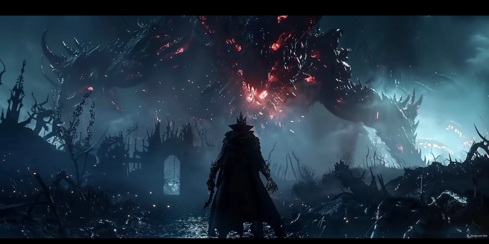
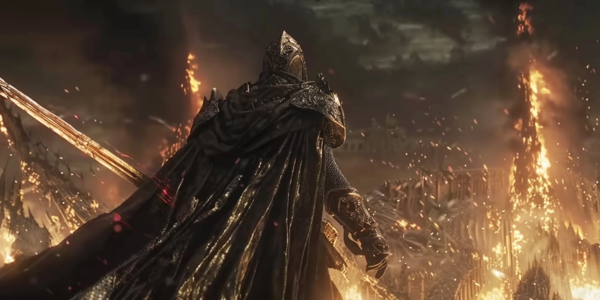

# What Makes the Soulsborne Genre Unique

The Soulsborne genre is often misunderstood as merely difficult, but its true uniqueness lies in its emphasis on growth and the Hero's Journey.
Let me share my thoughts on what makes the Soulsborne genre unique. You might feel differently, and that's okay.

The tackiest moment in my entire gaming life was unlocking the "This is Dark Souls!" achievement in Dark Souls 2. It pops up the first time you die, which for me was against a hippo-like monster that was way beyond my reach as I had just started the game. This creature literally devoured my head in one go. This achievement felt cheesy and superficial, seemingly embodying the notion that a Soulsborne game’s uniqueness lies solely in its difficulty.
But I don't think so. At that moment, I was sure I wouldn't like the game, and I didn't. It wasn't directed by Hidetaka Miyazaki, the creator of the Soulsborne genre, as he was working on Bloodborne at the time. I don't consider Dark Souls 2 a true Soulsborne game. I played through it but never revisited it. The director seemed to be trying too hard to outdo Miyazaki by making the game absurdly difficult. It was a disaster for me.

Unfortunately, other developers of Soulsborne follow-ups often adopt this approach, thinking that making a game irrationally difficult and stressful is what defines the genre. They impose their interpretation on players: every item ambushes, every corner has a trap, every enemy is a mini-boss, and every boss is a nightmare. Boss arena terrains constantly hinder you. Every small space is rigged with traps and crowded with monsters sporting egregious health bars, ready to gang up on you. It's not difficult; it's unfair and irrational. If these are the standards, anyone could make a game more challenging by simply multiplying every obstacle.

The essence of the Soulsborne genre is not about difficulty but about growth, the very essence of the Hero's Journey. However, with these irrationally difficult games, random luck often outweighs learned skills or strategies. I find myself exclaiming "it's pure luck, damn it!" far too often. The more you try, the higher the likelihood of success—that should be the principle. Even in the world of Soulsborne, common sense should prevail, not luck.

Narratively, Miyazaki’s Dark Souls and Bloodborne weren't novel either. He drew inspiration from many sources and was honest about it. He didn't aim to be original but unique in his way. Nothing is original; you can't create something from nothing. You can only combine and reinterpret what you've seen and experienced.

Miyazaki doesn't even force his interpretation of certain concepts on players. He claims they are open to interpretation, even to the point of being perceived as vague. Do we need a fourth book of 1Q84 to explain who the Little People are? I made a bold claim that if Haruki Murakami bows to the pressure and writes a fourth book, it will ruin the series, and I will interpret the event as him selling out. He wouldn't. But in America, they had to prolong the narratives of The X-Files, Lost, and Twin Peaks, and they all ended up being a mess. Sequels after sequels, prequels after prequels, and spin-offs after spin-offs. It's a symptom of a dying industry.

Most other developers, however, just borrow the base concept of a 'dilemma between right and wrong from various perspectives' and wrap it in familiar packages of old stories like myths, fables, historical events, and religious texts. It's been done to death. Multiple endings? The mention of multiple endings makes me cringe now: good (normal), bad (your forced perspective), and the true ending (the most unlikely but superficially thought-provoking). This setup originates from the original Dark Souls. Amusingly, they never come up with five unique endings like Elden Ring, a masterpiece in terms of unique multiple endings.

What makes the true Soulsborne narrative feel unique is the subtle nudge it gives to players to think about right and wrong, shedding traditional notions of good and evil. It prompts players to ask questions like, "Are gods good and do they truly love their creations?" as the Plain Doll in Bloodborne prompts the good hunter. We're designed to love them, but they don't necessarily have to love us back—this sort of reasonable dilemma. But this was a one-time deal. Repeated by the same creator, it reflects his worldview; repeated by others, it becomes a cheap trick to feign depth. Fake depth is often spoonfed to players in the form of obvious lore, which is typically just a collection of random stories that don't add up to anything meaningful or thought-provoking.

They might have a misconception about provoking thoughts: you have to make us seriously doubt our beliefs even for a moment, not just rehash old bedtime stories so obvious that you don't even have to use your brain power at all.

Bloodborne is unique in its exploration of how we deal with fearsome beings like the Great Ones: worship, fear, or attempt to become like them. Even though this concept borrows from Lovecraft and the Bible, its execution blurs the line between dream and reality in a unique way. Similarly, The Three-Body Problem series by Liu Cixin walks the same fine line regarding what's right or wrong. The books are unique because they challenge our earthbound perspectives against those of the Trisolarans. The ultimate question they pose is: in the universe, does the concept of right and wrong even exist? This profound uncertainty sends chills down our spines, making the series truly distinctive.

So, here's the bottom line: don’t try to outdo Miyazaki. He’s so unique and talented that you can't outshine him. Do your own thing.

Other would-be Miyazakis often produce shallow and derivative work that’s hard to take seriously.

I'm aware that certain templates, like the Hero's Journey, shouldn't be altered too much. But it's not about the template; it's about the execution.
If you can figure out a game's message within the first hour, it’s not good narratively. Developers throw in what they think are clever twists, but these are often cheap tricks that have been overdone.

Take Team Ninja games like the Nioh series and their follow-ups. They don't even pretend to be unique in their narratives. They just focus on gameplay, which makes their games unique and satisfying. You don't think about the story; you just play the game. They don't try to be something they're not. But even this approach gets old. With their latest game, I got bored after a few hours.

The gist? Don’t try too hard to look and feel different. Don’t force your ideas of the genre onto players.

We can figure out what's unique and what's not. We can tell what's difficult and what's unfair. We see what's original and what's borrowed.

Don't claim originality when it's obvious where your ideas come from. Just be unique in your own way. Once you borrow the ideas, unshackle yourself from their sources. That's what Miyazaki excels at.

Players will notice.

This isn't a critique of any specific game, just a general observation and a futile rant to let off some steam.