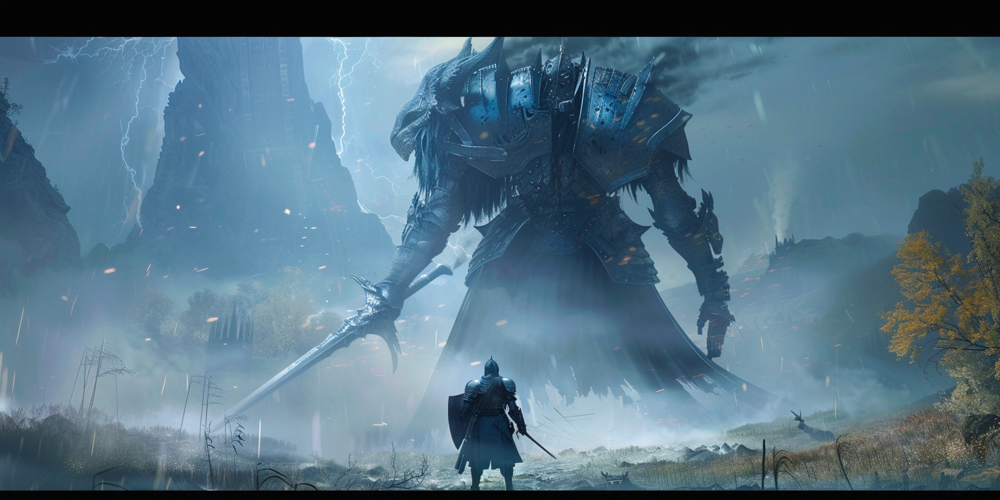

# Heeding the Unheard: Messages from Visionary Minds

"Hideo Kojima: Connecting Worlds" is a documentary available on Disney Plus, exploring the life and contributions of Hideo Kojima, the mastermind behind the Metal Gear series and Death Stranding. The documentary primarily sheds light on the creation of Death Stranding, while also offering insights into Kojima's creative process and the philosophical underpinnings of his projects, which are arguably the most captivating aspects.

In essence, Kojima mirrors the archetype of the obsessively detail-oriented genius that history often celebrates. He stands out as an innovator, a nonconformist, and a stickler for perfection. Additionally, he tends to keep to himself, embraces risks willingly, and epitomizes the quintessence of an artist, with his work serving as a testament to his distinct vision. The Metal Gear series and Death Stranding are unmistakably his creations, born from his unparalleled imagination.

Looking back, it's amusing yet unsurprising that, akin to other geniuses plagued with obsessive-compulsive tendencies throughout history, Kojima has faced substantial skepticism and criticism. Even those who initially believe in his vision frequently find themselves questioning it, only to realize later that he was correct all along. The documentary even labels him a prophet for creating a game reminiscent of the COVID pandemic before it occurred, alluding to Death Stranding.

Kojima's profound love for cinema heavily influences his games, often leading to criticism from his fans about the abundance of lengthy cutscenes, which can exhaust the battery life of their controllers. Nevertheless, this is a reflection of who he is: a storyteller unafraid to devote the necessary time to narrate his tales. Watching him at work, one can't help but compare him to a meticulously attentive film director, obsessed with every detail of his creation.

Moreover, while Kojima delegates tasks to other specialists and technicians, he remains a guiding and mentoring presence, deeply versed in every facet of his field. He is a formidable leader whose team is consistently inspired and driven towards a common goal. He has the ability to propel his company to unprecedented success and nurture its growth. Notably, he supervises almost every innovation from conception to completion.

Nearly every highly productive creator and entrepreneur with obsessive-compulsive tendencies seems to possess certain common characteristics. Colleagues and observers often marvel at their capacity for work, frequently asking, "When does he find time to sleep? Does he ever rest?" This perception stems from their seemingly boundless energy and dedication, giving the impression they are everywhere at once, always in the know and engaged in every aspect of their projects.

Hidetaka Miyazaki, a visionary creator and director at From Software, who pioneered the Soulsborne genre with games like Dark Souls, Bloodborne, and Elden Ring, accepted the role of CEO on one condition: he would continue working on his games. This highlights the fact that such creators aren't merely leaders; they're also the key to their companies' achievements. While many would prioritize administrative duties upon becoming CEO, Miyazaki's commitment to his craft is clear in his choice. He's a creator first and foremost, and his company's success is inextricably linked to his creative output.

This documentary may initially give the impression that Kojima is universally admired, but that's not entirely accurate. He's often labeled as difficult or even derogatory terms, yet he's also recognized as an exceptional leader. Those who have collaborated with him typically describe him as a visionary, an innovator, and a perfectionist, though some may feel neglected by him. His ability to perceive what others cannot often leads to misunderstandings, and he's not bothered by the prospect of being disliked for the sake of achieving greater goals. This approach was particularly evident in the casting for Death Stranding, where actors and actresses were required to fully trust in Kojima's vision, often performing without visual aids or comprehensive context.

Regardless of one's opinion on Death Stranding as a game, its compelling narrative stands as another testament to Kojima's extraordinary vision. Even without any background information, the trailers alone are telltale signs of a Kojima creation. It underscores his unparalleled imagination.

I encourage you to watch the trailers for the upcoming Death Stranding 2; you'll likely find yourself in agreement.

Certainly, appreciating Hideo Kojima's contributions doesn't necessarily equate to idolizing him as a person. History is replete with brilliant minds whose personal virtues didn't always match their intellectual or creative achievements. Recognizing someone's professional excellence is one thing; assessing their character and morality is another. These are two distinct domains, each with its own set of criteria for evaluation.

Towards the documentary's conclusion, Kojima shares his thoughts, offering a deeper insight into his perspective and approach to his work.

Hideo Kojima: "As possibilities increase, desires expand even more. Because there's this effect of imagination in my mind where things that were like this (small) become even more expanded, that's precisely why entertainment in this technology zone is something you just can't quit. It's like there's no limit, or you never get bored of it. Well, it's fun, irresistibly enjoyable."

小島秀夫: "できることが増えてくると欲望はもっと広がるので、頭の中ではこんな物だった物がもっとこう広がっていくっていう想像効果があるので、だからこそこのテクノロジーのゾーンのエンターテインメントというのがやっぱりやめられないというか、際限ないというか、もう飽きないんですね。まあ、楽しい、楽しくて仕方がないという感じです。"

코지마 히데오: "할 수 있는 게 늘어날수록 욕망은 더 넓게 뻥튀기되고, 머리 속에서는 요 정도였던 게 이만한 걸로 더 넓게 확장되어 가는 상상의 효과가 있기 때문에, 바로 그때문에라도 이 기술 분야의 엔터테인먼트는 정말 멈출 수가 없게 되는 거죠. 마치 한계가 없다 거나, 뭐, 이젠 싫증날 일이 없다거나. 음, 재미있어서, 너무 재미있어서 어쩔 수 없는 기분인 거죠."

The documentary is available with English and Korean subtitles, which I found lacking. Not due to mistranslation, but because certain nuances may lead to misinterpretation. I recommend watching it yourself for the full context—it makes a difference.

Kojima stands as a testament to visionary creators throughout history, demonstrating a consistent pattern in their messaging. His genius isn't crafted; it's inherent. You can't transform into Kojima through sheer will and practice, just as you can't become Michelangelo by the same means. The key is to recognize such brilliance in others and nurture your own unique trajectory.

Visionaries often emerge not from traditional academic paths or median societal groups but from environments less restricted by conventional norms. Systems preoccupied with compliance rarely breed innovation. Instead, pioneers thrive in spaces where creativity is limitless.

This prompts a critical inquiry: why do we continue to categorize such unique minds alongside the average? Why do we impose the same expectations, demand universal likability, or confine them within the same regulatory frameworks as everyone else? Doing so only stifles their potential.

We yearn for greatness from these exceptional individuals, yet paradoxically, we often constrain them to conform to mediocrity.

It's quite fascinating to discover that Sony was the sole entity to seize the opportunity to collaborate with Kojima, even without any foresight into the specific games he would develop next. Despite Kojima's impressive track record with Konami, Sony was the only one to recognize and invest in the potential of his future visions. It's akin to others attempting to dictate Michelangelo's next masterpiece—such endeavors are futile. Sony's unique foresight and willingness to embrace Kojima's creative freedom stand out as a rare and commendable approach in the industry. 

Investing billions of dollars in a creator without a clear blueprint of what they will produce is a bold move, one that Sony bravely undertook with Kojima. This decision wasn't solely about the commercial success of Death Stranding; more significantly, it was about earning Kojima's trust and respect. Sony managed to secure a partnership with a visionary akin to Michelangelo, emphasizing the value of supporting unparalleled creative talent over immediate returns. In essence, Sony didn't just finance a project; they invested in a legacy, gaining an ally with the creative stature of one of history's most revered artists.

Identifying a Kojima requires a trained eye—recognizing the rare gems that defy standard metrics. Being an effective educator, parent, or investor involves spotting these individuals and providing them with the right conditions to excel. It's about fostering an environment that celebrates their distinctiveness, allowing them the freedom to explore, create, and be truly themselves—whether they align with Kojima's archetype or not.

Avoid forcing non-Kojimas into a mold they don't fit, and equally, don't constrain Kojimas to conform to standard expectations. Allow them the liberty to navigate their creativity in their own unparalleled ways.

As you take a moment to observe those around you, think about who catches your attention.

Yet, even more importantly, ponder your own essence. In the grand scheme of creativity and innovation, who or what do you represent?

Aren't you stifling your inner Kojima by confining yourself to mediocrity?
