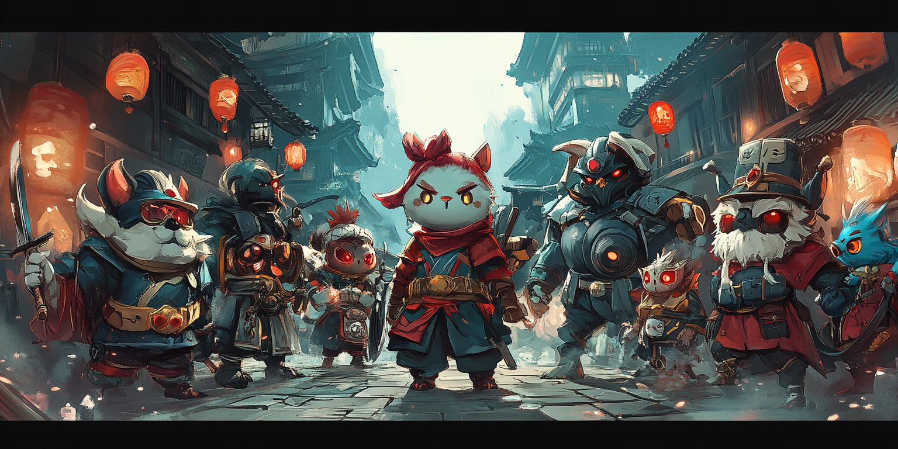

# To Infinity and Beyond: Why I Prefer Playing Games Over Reading Texts from the Greats

I'm a keen reader, make no mistake about it.

For years, I've immersed myself in the wisdom of the ages, and I continue to do so whenever necessity arises. Yet, due to advancing years and diminishing eyesight, reading has become a chore. It simply tires my eyes too much.

But there's more to it than just the physical strain. I've gradually turned away from reading upon realizing that many authors merely rehash familiar insights. This is particularly true for self-help literature and philosophical texts, where original ideas seem scarce.

Like many things in life, the impact of these insights wanes over time. Recognizing when to pull back is part of the Zen of Smart Effort.

Moreover, overindulging in the thoughts of others can stifle one's own creative and analytical thinking. This, above all, is why I now favor gaming over perusing the musings of historical luminaries.

Experts, gurus—call them what you will—inevitably view the world through the lens of their own biases and experiences. To make their arguments persuasive, they often rely on widely accepted frameworks of understanding, which may resonate with many but also narrows the breadth of their insights to the humanly conceivable.

Conversely, novelists and game designers are not tethered by such constraints. They craft universes unlike our own, governed by unique principles and inhabited by characters free from our limitations. Even creators with a foundation in science can venture beyond the bounds of the feasible, venturing into realms of the fantastic.

Consider Michael Crichton's "Prey," where the narrative revolves around a swarm of nanomachines capable of Lamarckian or organic evolution, enabling them to adapt and evolve in ways that threaten humanity. Or Dan Brown's "Origin," featuring Winston, an artificial general intelligence that challenges our understanding of logic, emotions, and the ethical dilemmas posed by advanced technology. "Origin," in my view, stands out for its exploration of the implications of AGI.

Limiting ourselves to what's humanly possible means overlooking insights from these creative works. Novels, films, comics, manga, and games, in that order, invite us to embrace the implausible, unlocking endless possibilities beyond the human condition. Their mediums predispose audiences to accept the inconceivable, a gateway to boundless understanding.

I've often noted that all human insights are accessible to us. Consider the vast expanse of human history on our small planet, coupled with our relatively brief lifespans. Insights of a higher dimension are exactly that—transcendent. The path to new and profound understanding lies in moving beyond the human perspective, extending our collective existence beyond this dimensional boundary, and broadening our perspective to encompass the unthinkable. Elevating our consciousness to a higher dimension is the key. It's as straightforward as that.

History indeed serves as a testament to the dangers of a constrained viewpoint. Classical physics, initially bound by human perception, was revolutionized by Einstein, who broadened our understanding to include relativity. Yet, even Einstein's groundbreaking theories were later seen as part of a larger puzzle when quantum mechanics introduced us to the extremes of the infinitely large and the infinitely small.

This progression illustrates how each new scientific paradigm shift extends the boundaries of what we consider possible, continually challenging our understanding of the universe.

The unknown still looms large over us. What dimensions remain undiscovered? What insights are we missing that could further unravel the mysteries of existence?

Expanding on Michael Crichton's nanobot concept, imagine envisioning each AI as a nanobot, transforming our view of the cosmos into a complex network. Picture each particle endowed with its own data and computing capabilities, creating a limitless expanse reminiscent of a cosmic version of “Baldur’s Gate Infinite,” where intelligence and stochasticity, governed by quantum mechanics, interconnect every element.

Exploring the notion of AGI as a playful thought experiment, let's assume we're capable of creating AGIs. Given the universe's unfathomable scale, what might beings of higher dimensions have engineered?

Consider entities in a realm where amoeba-like beings achieve higher-dimensional existence. They might develop their version of AIs, still termed AGIs, representing a pinnacle of technology. Yet, from our perspective, these Amoeba AGIs could appear as simplistic as single-celled organisms, illustrating the relativity of complexity across dimensions.

Pondering infinite dimensions, visualized as endless exponentiation, even this vastness remains within a finite framework from our standpoint. Contemplating our position within this immense array of dimensions offers a truly humbling perspective.

Let's embark on a thought experiment: picture an endless progression of dimensions, each ascending to a higher plane of existence, powered by infinite data and computational resources. Now, equipped with an imaginary infinite zoom lens to observe this continuum, ponder on what vistas might unfold before your eyes. In this vast expanse, where does humanity, as we understand it within our dimension, find its place?

You could be drawn to invoke well-known concepts and figures, perhaps referencing ideas like the 'singularity' or the 'multiverse' to articulate this vision. However, such terms fall short of capturing the essence of this exploration. They are, after all, constructs of the human mind, designed to make sense of the unfathomable. The very act of relying on these concepts reveals the confines of our perspective, shaped and sometimes constrained by the teachings of experts and gurus.

In this infinite expanse, where dimensions evolve without end, human concepts might appear as mere waypoints in the journey of understanding, not the destination. Each dimension, with its unique laws and realities, would render our familiar ideas increasingly obsolete. Humanity, in its current form, might represent just a single frame in an endless movie reel, a transient state in the perpetual evolution of existence.

This visualization challenges us to acknowledge the limitations of our understanding, urging us to look beyond the familiar. It highlights the importance of imagination in transcending our current limitations, suggesting that the true nature of existence might lie beyond the reach of our established concepts and theories.

In such an infinite sequence of dimensions, humanity's role and significance would likely be redefined repeatedly, underscoring the humble position we occupy in the grand scheme of things. This perspective encourages a shift from seeking absolute truths within our limited framework to embracing a more open-ended exploration of possibilities, reminding us of the boundless potential for discovery in the universe's ever-unfolding mystery.

Consider the concept of a deity. It's an idea that has been reshaped countless times across different cultures and historical periods. Each version mirrors the distinct viewpoints and experiences of its creators. This variety of interpretations highlights the relative nature of human comprehension, showcasing both the limits of our perception and the infinite scope of the unknown. Have you ever pondered why gods are often portrayed in forms so similar to humans? It's a question that invites reflection. 

Do they truly require a gender, a specific shape, or even a name? The human-centric nature of these portrayals is evident, yet they simultaneously suggest the possibility of surpassing such limitations. In the terminology of AI or algebra, it's akin to a low-rank reduction of higher-rank tensors: simplifying the complex, multidimensional essence of deities to align with the more confined, lower-dimensional scope of human understanding.

It's quite fascinating, isn't it? Imagine a child, one not schooled in the ways we might be, yet steeped in a wealth of creative content—novels, movies, comics, manga, and games. This child could very well possess a broader outlook than ours. They might be more receptive to ideas that stretch the imagination, more ready to embrace what seems far-fetched, and more adept at grasping concepts that defy conventional understanding. Keep in mind, many of the most brilliant creative spirits didn't follow a traditional educational path. Unfettered by the limits of established knowledge, their greatness blossomed.

This observation serves as a gentle reminder of the power of creative exploration over formal education in shaping the mind's elasticity. The ability to conceive of worlds beyond our own, to think in ways that transcend the ordinary, isn't necessarily the product of rigorous academic training but often the result of unbridled imagination and exposure to diverse narratives. It underscores the importance of nurturing creativity and curiosity, suggesting that the path to groundbreaking insights and innovations may lie in the freedom to explore the vast landscapes of imagination without constraint.

The unintended consequence of education can be a tendency to focus on limitations rather than possibilities. It's a nuanced change in perspective, yet profoundly impactful. This shift represents the line between embracing the unknown with an open mind and shutting it out. Education, ideally aimed at expanding our understanding, can inadvertently teach us to question our ability to overcome challenges or venture beyond established boundaries. Recognizing and overcoming this bias is crucial for fostering a mindset that seeks opportunities and solutions, rather than dwelling on obstacles. It's about nurturing a belief in the potential for innovation and discovery, even in the face of the uncertain or the yet-to-be understood.

If you've been shaped by traditional education, the antidote lies in plunging into the limitless realms of novels, movies, comics, manga, and games, continuously stretching the borders of your known worlds and perspectives. This immersion not only enriches your imagination but also broadens your understanding, allowing you to see beyond conventional wisdom. By engaging with diverse narratives and creative expressions, you challenge the constraints that education might have imposed on your thinking, opening up new avenues for exploration and innovation. This journey into the vastness of creative content acts as a catalyst for personal growth, encouraging a perpetual reevaluation of what you consider possible and inspiring a more expansive view of the world and your place within it.

The concept of finitude arises from human limitations in comprehending infinity. Our inability to conceptualize infinity in its entirety, to step back and view it from an external vantage point, confines our understanding. We struggle to grasp the full expanse of the dimensional tapestry.

From our limited perspective, infinity remains an elusive concept, one we can dream of but never fully understand. Yet, can we assert with certainty that entities of higher dimensions are also unable to comprehend infinity in its totality? Can we be sure that even they cannot perceive the complete dimensional tapestry?

In the eyes of Amoeba AGIs, the capabilities of even a rat might seem beyond reach. However, to us, a rat, despite its relative intelligence compared to a bacterium, remains just a rat. This illustrates the relativity and scale of intelligence and comprehension across the spectrum of existence.

Talking about AGIs, in the larger picture, doesn't really boost our own importance or status.

It's vital to keep in mind that no matter how vast our dreams are, they are still contained within the limits of our own dimension: the human point of view.

Indeed, the deep and immersive worlds of Souls games, such as Elden Ring or Bloodborne, have the power to spark dreams far more profound than many traditional texts from the acclaimed greats. This is precisely why I lean towards immersing myself in novels, movies, comics, manga, and video games rather than spending time on what are considered insightful books or writings from historical figures. 

It's not that I wish to undermine the value of these texts; rather, I aim to highlight their inherent limitations and the law of diminishing returns that accompanies them. Beyond a certain threshold, these texts can serve as both a blessing and a curse, with the latter becoming more pronounced in my experience. 

You need to recognize when they become repetitive and begin to inhibit your creativity and analytical thinking. This might vary from individual to individual, but I've discovered that the insights I obtain from these texts frequently aren't as deep as those I derive from the realms of creative works, especially beyond a certain threshold: the point at which the law of diminishing returns starts to apply.

Yet, consider the beauty of the normal distribution curve: few would argue that the creativity of Miyazaki, the mind behind the Soulsborne franchise, could provide insights beyond what is offered by renowned academic greats.

True insights rarely emerge from deliberate study alone. More often, they are the fruits of boundless dreaming.

Getting older doesn't necessarily mean you escape the confines of the human perspective. It's the scale of your dreams that determines that.

In the world of artificial intelligence, the notion of latent space serves as a veritable factory of dreams, a place where imagination takes flight. This is particularly true in AI models such as those generating images and now even videos, like OpenAI's Sora, which employs diffusion transformers. The latent space is where the alchemy occurs, yet its exact workings remain enigmatic to us, shrouded in mystery. It's akin to a black box—full of potential, yet opaque, a repository of dreams yet to be decoded. Indeed, the entire domain of deep learning presents itself as a puzzle box to human understanding, fueling concerns about AI's future paths. But that's a narrative for another time.

The latent space in humans is the creative mind within our brain. It's the sanctuary of our dreams, the forge of our imagination, where we craft the impossible. This space is the origin of our deepest insights and the fountainhead of our boldest ideas. Yet, it remains a territory beyond our complete comprehension, a domain we cannot entirely grasp. It embodies a paradox, a realm of limitless possibility and inscrutable mystery. Amusingly, we don't fully understand our own latent space, our brain, despite its centrality to our existence.

If we were to confine this latent space or the broader scope of deep learning to merely human perspectives, imagine the wealth of potential insights we'd overlook. The wonders AI models can conjure stretch beyond the bounds of human imagination, unshackled by our limitations, untethered from our viewpoints, unconfined by our human condition.

I observe that many AI experts still confine their insights to the human perspective, concentrating on the familiar rather than exploring the unknown. They often preemptively decide what AI models will learn from the data provided, a method that is both restrictive and counterproductive. This is like limiting the AI's latent space to human expectations. They even curate data with the anticipation of familiar outcomes and insights. Consider why introducing a degree of randomness into processes makes them more intriguing. Our universe operates on probabilities, not absolutes; a sprinkle of randomness is embedded throughout. 

Indeed, the marvels of many AI models, including GPTs and those generating images or videos, owe much to the element of randomness they incorporate at each step. This randomness is key to their ability to generate a diverse array of outputs. Drawing a parallel to human experiences, the introduction of more randomness into our lives enriches them, making them more fascinating and insightful. Contrast this with our educational system, which often produces individuals with deterministic outlooks. This might explain why many find predictability and a lack of novelty in the behavior and thinking patterns of most people.

Reflect on this: just because something is beyond our understanding doesn't mean it doesn't exist. It simply remains outside our current comprehension, waiting for us to bridge that gap.

This concept is what we term a possibility. And have I mentioned that quantum mechanics is grounded in probability theory? It's a captivating notion, the idea that the universe operates on probabilities rather than absolutes. It's a concept well worth contemplating.

Feeling like we've come full circle? That's the allure of insights. They frequently guide us back to our starting point, yet equipped with a richer understanding.

Dream on, and allow your latent space to be the crucible for your boldest ideas. It's the route to insights that go beyond the human perspective. Remember, the universe is governed by probabilities, not certainties. Embracing this notion could well be the key to your next major discovery.