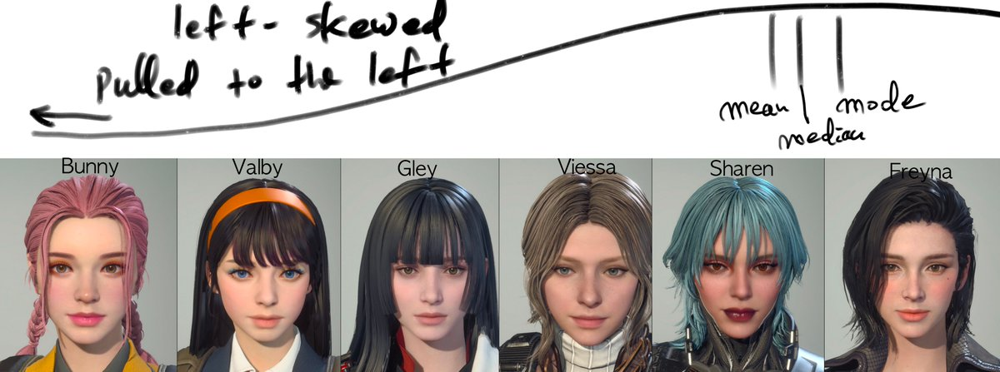

# Statistically Significant Hotties: A First Descendants Distribution Analysis

Let's dive into a playful statistical analysis of the First Descendants characters. We'll explore how their facial features distribute along a spectrum, turning game design into an unexpected lesson in statistics.

On the scale of sharpness (referring to how V-shaped the jawline is), Valby should be around the middle of the distribution of the First Descendants. She isn't as sharp as Freyna but not as round as Bunny. Valby's features are more angular and defined compared to Bunny's, but not as sharp as Freyna's. Essentially, Bunny is on the left extreme, Freyna is on the right extreme, and Valby sits in the middle. Bunny has the largest face width, Freyna the narrowest, and Valby is in between.

On this scale from left to right, it goes: Bunny -> Valby -> Gley -> Viessa -> Sharen -> Freyna.

(Note that Sharen has facial gear around her jawline, which makes her sharpness look exaggerated. You can't remove that gear. She's about as sharp as Freyna.)

In short, the distribution is heavily skewed to the left, with Bunny and Freyna being the outliers. The rest are more or less in the middle. Statistically speaking, terms used to express skewness can be counter-intuitive: left-skewed or skewed to the left means the distribution is negatively skewed, with the mean, median, and mode on the right side of the distribution. It's also termed "pulled to the left" since the distribution is stretched to the left like a rubber band. While it should be intuitive when imagining a rubber band, it's not when focusing on the terms "left" or "right." In this context, left or right refers to the direction the rubber band is pulled, not the direction you're looking at it.

This distribution of First Descendants is skewed to the left, meaning most favor sharp features. The negative outliers are the round-faced characters like Bunny.

Valby should be in the middle of the "ideal" distribution, but since most Descendants are sampled from this skewed distribution, she's considered below average in terms of sharpness.

Just some quick fun stats facts right off my noggin. Stats folks see the world in terms of distributions.

Drawing all these characters would skew your drawing skills towards the left. You'd be better at drawing sharp features than round ones. That's why it's important to draw a variety of faces, not just the ones you like. You should draw the ones you don't like, too. That's how you improve your skills.

Sampling errors are the bane of statisticians.

I'll draw more of Bunny and Valby to balance the skewness of my drawing skills.

That's how you make use of stats in everyday life, whatever you do.

Note that this focuses on the scale of "sharpness" where more instances of sharper faces are found in the distribution. Given the wrong context, some experts including GPTs would get confused and give you wrong answers about "skewness". It's important to provide context when asking questions, even to AI models. They're as smart as you guide them to be.

Those confusing terms don't really matter. What does matter is what they represent. If you understand the underlying concept, don't argue with anyone about the accuracy of the terms, especially the stats ones. They'll get murderous.

One more thought to consider: When viewing the world through the lens of distributions, it all boils down to "representation." Even the smallest sample size represents something larger. Take these First Descendants characters, for instance. They were crafted by designers with their own biases and preferences, possibly aiming to represent broader distributions like public preferences for attractive features. By following these "representation" feedback loops, we can uncover fascinating insights. While we're using game characters for a fun example here, this approach can be applied to any sample distribution you encounter. It's a powerful way to understand the world around us, from pop culture to complex social phenomena.
 