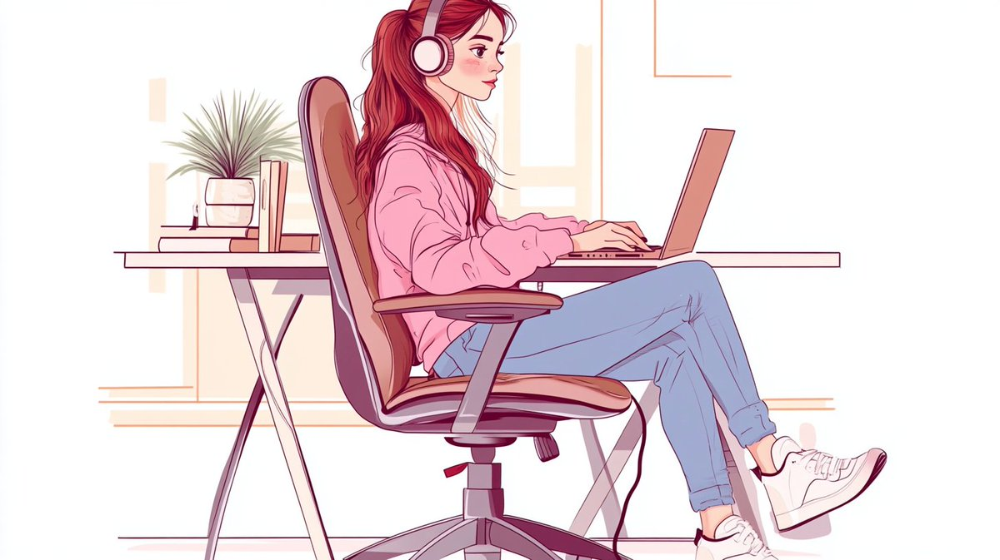

# Be Wise Early - Treat Yourself Well

When you're young, it's easy to dismiss the little habits that might add up against you someday. Who cares about posture when there are deadlines to meet? Who worries about sitting right while binge-watching the next episode or finishing that presentation? Youth makes you feel invincible—health seems like it's just there, like oxygen. Work-related health issues? Meh.

You binge on junk food, even when you're full. Why? Because you're young, and your body feels like it can take anything.

But one day, as you grow older, you realize what you've done to yourself. No, it's not about major catastrophes—it's about the small, everyday things. Using your laptop in a cramped position on the couch. Torturing yourself with a trackpad instead of a decent mouse. These small crimes sneak up on you.

Some people think they're saving time or money by ignoring such issues. "Why buy a proper chair or an ergonomic mouse?" they say. "That's just extra expense." Let me break it to you: those savings aren’t real—not in the long run. It’s like buying the cheapest tires for your car: you’ll pay for it eventually, usually at the worst time possible.

The sooner you wake up to the damage you're doing to your body, the better off you'll be. But here's the problem: these mistakes don’t come due immediately. They’re like a long-term loan, only without a repayment plan.

One day, your fingers start to ache for no reason. Your back, your neck, your shoulders—they hurt even when you've done nothing special that day. Maybe your internal organs even feel like they're conspiring against you. And when you drag yourself to the doctor, they shrug and say it’s all in your head. But it’s not in your head. The pain is real. The discomfort is real.

Science is great, but it’s only a snapshot of what humanity knows at any given moment. There's so much we don’t understand about our own bodies. So when your body is telling you something, listen.

When I was young, I had severe ear pain. Even the top ear specialist couldn’t explain it. He admitted, "We don’t really know much about human ears." Decades later, they still don’t know, but I do: it was the Big Four—Metallica, Megadeth, Slayer, and Anthrax—blasting too loud for too long.

Remember those grumbling seniors always moaning about their aches and pains? Turns out, they weren’t exaggerating. They tried to warn us. We just didn’t listen—just like you might not be listening to me now. The truth is, most of us will end up with mysterious pains in every corner of our bodies, not because the universe is cruel, but because we’ve been doing it to ourselves, bit by bit.

If you're young and reading this, let this be your wake-up call. Start with the basics: maintain good posture and invest in ergonomic tools. Get a quality chair that supports your back, a proper desk, an ergonomic keyboard, and a mouse that won't strain your shoulders and wrists. Your body deserves comfort, not compromise. And when it comes to music, protect your hearing. Use headphones sparingly, keep the volume moderate, and give your ears a break.

I won't lecture you about diet, smoking, drinking, or other lifestyle choices—you already know the risks. The information is out there. Just don't deceive yourself into thinking those choices don’t matter. Every decision counts, and the effects will add up. Your future health depends on the habits you form today.

Treat yourself well today, because your future self will either thank you or regret your choices. This isn’t just another piece of advice—it's a chance to avoid the painful lessons that so many of us had to learn the hard way. Trust me, investing in your well-being now will pay off for decades.

All that money and success you’re chasing? What good will it do if you’re not healthy enough to enjoy it? You might not picture yourself as an older version yet, but I can. I've seen it. I've been there. You may not believe you’ll end up like that, but trust me—you will.

Oh, and that ancient wisdom shit about "sound body, sound mind"? It's profoundly true. What a masterpiece of understatement.