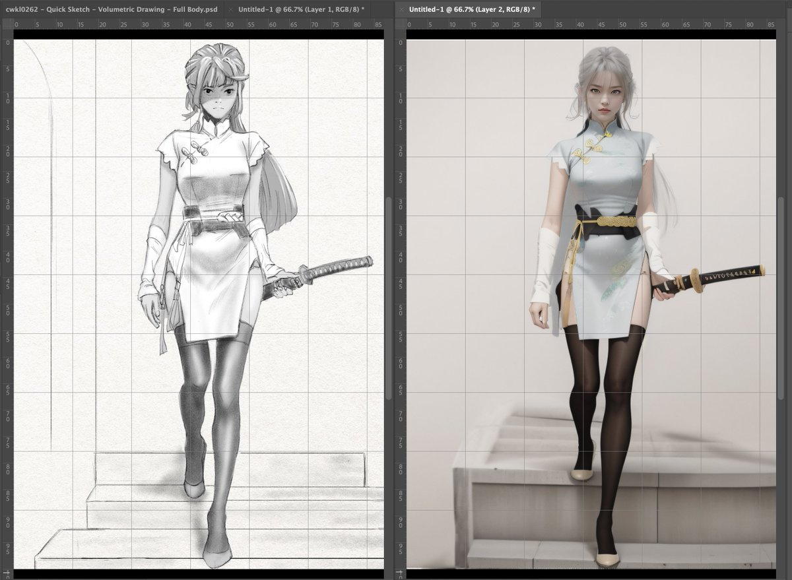

# The Normalization Pitfall: How Our Minds Distort Reality

As I've been stressing lately, we don't see things as they truly are due to our built-in normalization bias. Our brains simply cannot process all the analog information from the real world in its raw form. Even as our intelligence evolves, we'll never be able to process reality in a purely analog way. Some degree of normalization is inevitable.

Normalization is a fundamental cognitive process where our brains compress and simplify the overwhelming complexity of reality into manageable mental models. Like a sophisticated data compression algorithm, our minds attempt to preserve what they deem essential while discarding seemingly irrelevant details. This compression isn't just a convenience—it's a necessity for our cognitive functioning. However, this process inevitably involves loss and distortion of the original information, much like how a compressed digital image loses some of its original fidelity. The notion of perfect, lossless compression of reality is an illusion—our perception will always be a simplified approximation of the true complexity that surrounds us.

Yet we rarely remain consciously aware of this normalization bias. We tend to forget about it and mistakenly believe we perceive and understand things exactly as they are. Nothing could be further from the truth.

Here's a simple experiment to demonstrate this: Take a photo or drawing and try to copy it, even by tracing. If you've done this before, you may recall the surprising results, though the lesson likely faded with time.

Using digital tools like Photoshop with layers makes this exercise particularly revealing:

1. Place the original image on one layer
2. On another layer, attempt to copy it using a pencil brush
3. You can use grids and measurement tools, or even trace directly by reducing the opacity of the original

The results are often startling:

- With freehand copying, most non-professional artists will produce something notably different from the original
- Even with precise grids and measurements, significant deviations emerge
- When tracing, which seems foolproof, subtle differences still appear unless you're skilled with techniques like line weight and shading

The more complex the image, the more dramatic these differences become. And if you get absorbed in the drawing process, you're likely to drift even further from accuracy as your normalization bias takes over.

This simple drawing exercise powerfully demonstrates how our senses can deceive us. Once you truly grasp the existence of this normalization bias - a natural and necessary feature of human cognition - you begin to see the world differently.

Now consider the implications beyond drawing. How does this bias affect our daily decisions? Our critical choices? When making important decisions, how much are we relying on actual information versus our normalized interpretation of it?

In essence, we're dancing with our perceptions, which may be significantly out of step with reality. It's crucial to remember this fundamental truth: what we perceive isn't necessarily what is.