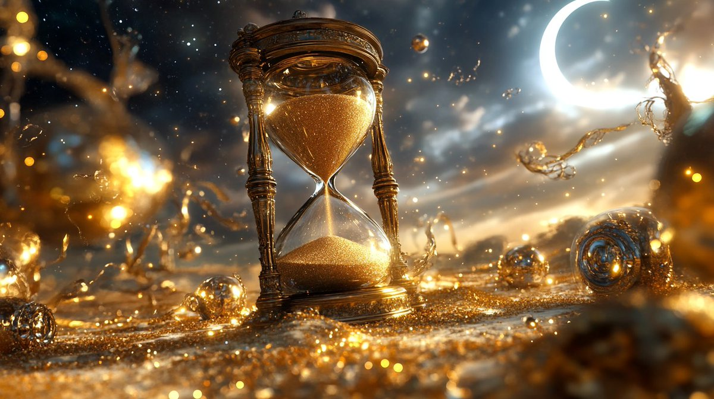

# Do the Math: Maximizing the Return on Your Time and Energy

You might wonder why I sometimes stop drawing a piece halfway through or abandon it entirely.

The simple answer: do the math. Consider how much effort, time, and dedication it truly takes to achieve mastery in anything—it’s more than just wishful thinking.

Whenever you invest time and energy into anything, always ask yourself:

How much time and energy will it take to get to a point where I can call myself good at it—whether that means achieving a professional level, reaching personal satisfaction, or meeting a specific benchmark?

If you're serious about pursuing something—serious enough to think of it as a career—then you need to be serious about doing this math.

Take drawing, for example. Unless you're born a Michelangelo-level prodigy, you'll need to invest a significant amount of time to reach a high level of skill. Studies suggest it takes around 10,000 hours to master a skill, which means years of dedicated practice. Let's assume you commit a decade to it:

10 years × 365 days/year = 3,650 days.

To be more realistic, let's round down to 300 days per year. That's about 3,000 days. Currently, I invest nearly 10 hours a day, without skipping a single day. This level of dedication is important to me because it represents my commitment to continuous growth and improvement, allowing me to make consistent progress towards mastery.

To finish a piece of master study quality, it takes me around 3-4 hours. I don’t fully replicate the reference but get close enough. For a line art portrait, it takes 1-2 hours. Quick sketches take less than an hour, and basic learning or practice sketches also take less than an hour.

Realistically, I end up with about 2 master studies, a couple of line art portraits, and some quick sketches per day—adding up to well over 10 hours daily. But is that practical or sustainable for 3,000 days? Probably not. And even if you could, this only includes the drawing, up to the shading stage—no coloring, no fine details, no post-processing.

Adding those elements means that one piece could take days or even weeks, as they significantly enhance the quality and depth of the artwork by adding richer details, lifelike coloring, and a polished finish. On top of that, you're constantly learning and improving. Even professionals—even geniuses like Michelangelo, da Vinci, or other modern  contemporary artists—never stop learning.

This means you'd need to allocate additional time each day for learning and skill development. This learning time is crucial for staying current with new techniques, exploring different styles, and continuously improving your craft. It's not just about practice, but also about expanding your knowledge and pushing your boundaries as an artist.

So, let's face it—what I described above is just the minimum investment to get to a certain level and sustain it.

Now, let’s do the math again.

If you invest time without a smart approach to ROI, you'll burn out due to a lack of visible progress. You shouldn't finish a piece just for the sake of finishing it. If you’ve put in enough time and energy to learn from that piece, it’s often best to put it down and move on—that’s the smartest strategy.

Why? Because time and energy are limited resources, and wasting them on something that's not worth it can rob you of future opportunities. A decade isn't very long when you do the math seriously.

Suppose I start a serious master study project, aiming to fully replicate a masterpiece, including shading and coloring. Replicating a masterpiece is valuable because it helps improve technique, understand composition, and grasp the methods used by great artists. Given the learning curve, it might take me three days to finish a piece—or about two pieces per week:

54 weeks × 2 pieces/week = 108 pieces per year.

10 years × 108 pieces/year = 1,080 pieces.

Every drawing project I start has '1000 pieces' as the minimum goal. I’d spend a decade getting good at it. And even after that, I'd still be a novice, only then ready to try creating my own original work—not necessarily at a professional level.

At 56 years old, this means I'd reach professional quality at age 66. And even then, I wouldn’t be proficient in every style or genre—I’d have focused on just one, like portraiture, figure drawing, or manga.

To truly encompass all styles and genres, you'd have to do the math all over again.

Doing the math like this gives you a glimpse of a future version of yourself, and it helps you set realistic, motivating goals to keep moving forward. If you don't like that version, adjust the variables. There are no constants except for time itself. All other factors—effort, focus, intensity—are adjustable.

Adjust those variables wisely. Just putting in mindless hours without a clear return is a waste of time and energy—resources you don’t have much of.

It's crucial to note that this calculation only covers a single skill or area of expertise. If you're aiming to expand your horizons and master multiple skills, you'll need to repeat this mathematical exercise for each one. This comprehensive approach gives you a clearer picture of your "total portfolio return" - the cumulative investment and potential payoff across all the skills and domains you aspire to master.

Consider how this impacts your overall life plan. If mastering one skill takes a decade, how does that align with your other goals and aspirations? How many skills can you realistically pursue in depth over your lifetime? These are important questions to ponder as you map out your personal and professional development journey.

One encouraging insight I can share is that as you expand your horizons and master more skills, the process of acquiring new ones often becomes more efficient. This is due to the interconnected nature of knowledge and the transferable skills you develop along the way. By broadening your expertise across various domains, you create a rich network of understanding that can accelerate learning in new areas.

That's what the object-oriented approach to learning is all about.

For instance, mastering one visual art form can provide insights that make learning another easier. The principles of composition, color theory, and perspective often translate across different mediums. My experience in photography and video production helps me a lot in drawing and painting since they share the same underlying principles: optical illusions, perspective, lighting, color theory, etc.

Similarly, learning multiple programming languages can make picking up new ones quicker, as you recognize common patterns and structures.

This synergy between different skills and knowledge areas can effectively compress the time and energy required to master new competencies. It's as if you're building a personal knowledge framework that supports and enhances future learning endeavors. This process mirrors key principles in object-oriented learning: inheritance and polymorphism. Just as a derived class inherits properties and methods from its base class, you inherit foundational knowledge from previously acquired skills. And like polymorphism allows objects to take on multiple forms, your existing skills can adapt and transform to suit new learning contexts, accelerating your mastery of related disciplines.

Moreover, this approach to continuous learning and skill acquisition can lead to a more intellectually fulfilling life. By constantly challenging yourself and expanding your capabilities, you're not just accumulating skills—you're cultivating a mindset of growth and adaptability that can enrich your experiences and perspectives well beyond the ordinary.

One more thing: this approach will compel you to fully embrace life. Trust me on this. When you realize the vast array of things you want to learn, do, experience, and enjoy, you'll find yourself reluctant to waste even a single day. Every day becomes a precious gift, and indeed, every single minute takes on new significance. This heightened appreciation for life—for each and every moment—is perhaps the most profound gift this approach offers. It's not just about skill acquisition or career advancement; it's about cultivating a deep-seated gratitude for the time we have and the opportunities it presents. So, do yourself this invaluable favor: take the time to do the math now. It's more than just numbers—it's a roadmap to a more purposeful, fulfilling life.