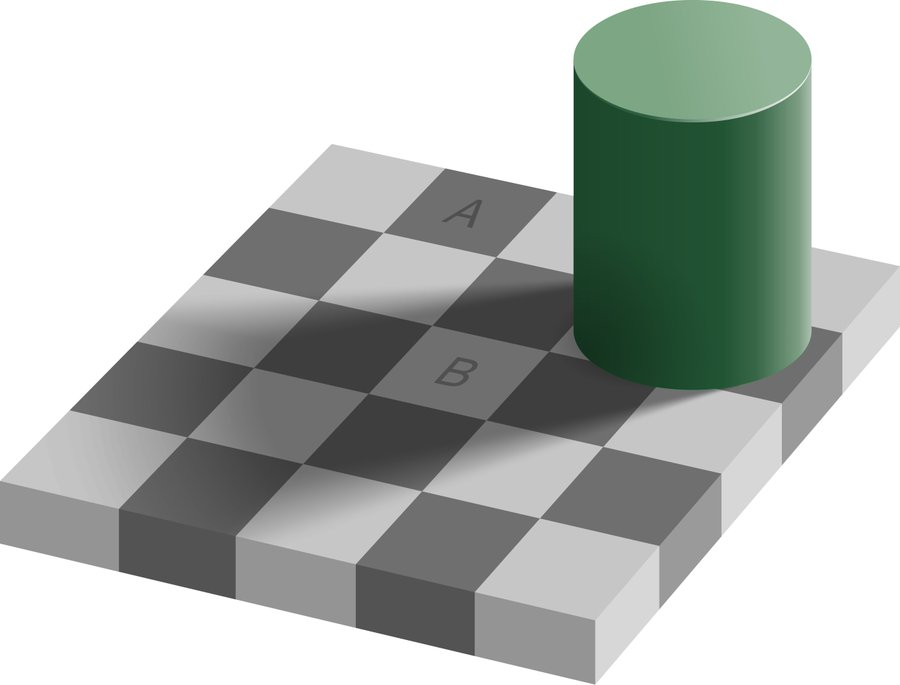
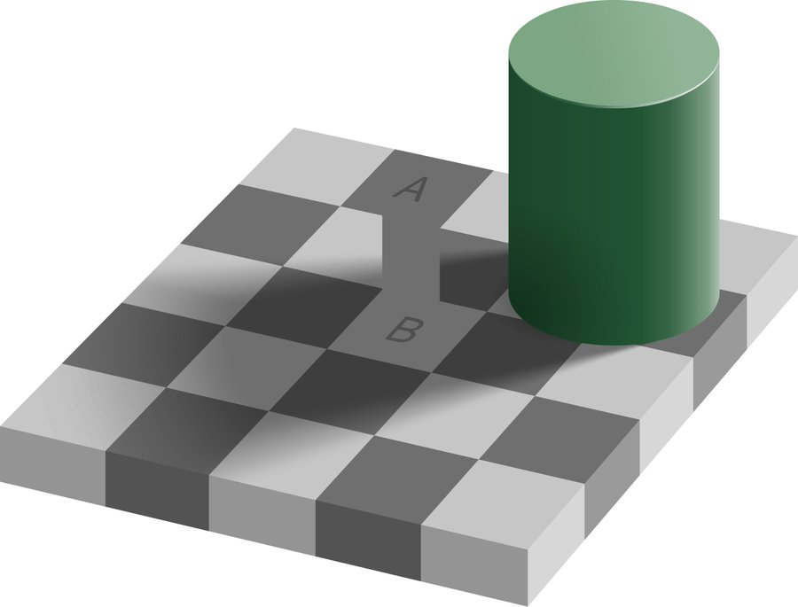

# Seeing Beyond Illusions: How to Be a Better Normalizer

One of the most striking optical illusions in vision science was introduced by Edward H. Adelson at MIT - the famous "Checker Shadow" illusion. Even after seeing it countless times, our brains still resist accepting its truth.

In this illusion, two squares labeled A and B appear dramatically different in brightness, yet they are demonstrably identical when measured. This isn't a trick - it's a profound demonstration of how our visual system processes information.

The illusion powerfully illustrates our brain's built-in normalization process - the automatic adjustments and corrections it makes to help us navigate a complex visual world. While usually helpful, this normalization can sometimes lead us astray.

When you study the image, try to consciously override your immediate perception. Notice how difficult it is to see the squares as identical, even when you know they are. This resistance reveals just how deeply ingrained our brain's normalization processes are - not just for vision, but for all our senses including hearing and touch. What we perceive is often not an accurate representation of reality, but rather our brain's normalized interpretation of it.

Visual and optical illusions are striking precisely because they reveal how our perception can deviate from objective reality. This has profound implications, particularly in legal contexts where eyewitness testimony is concerned. While courts may consider eyewitness accounts, they recognize that human perception is inherently fallible and subject to normalization biases. This is why eyewitness testimony alone, without corroborating physical evidence, is often insufficient for conviction. Consider someone confidently testifying, "I clearly saw someone in dark clothes in the room." After understanding how dramatically our brains can misinterpret visual information, as demonstrated by optical illusions, how much weight should we give such testimony? Our brains automatically normalize and interpret sensory data, sometimes at the expense of accuracy. This conservative approach to eyewitness testimony helps prevent false convictions—what statisticians call type I errors, which we'll explore further.

Animation provides another compelling example of our brain's normalization process. When watching animated content, our visual system automatically fills in the gaps between discrete frames to create the illusion of continuous motion. This principle is fundamental to keyframe animation, where artists only need to create specific pivotal frames while software interpolates the intermediate positions. Consider a simple bouncing ball - by defining just the key positions and timing, the animation software can generate smooth transitional frames, which our brain then further processes into fluid movement.

Keyframes are strategically placed at critical moments that define the animation's core motion - changes in direction, speed, or position. For instance, in a simple linear motion, only two keyframes are needed: one at the start and one at the end. The animation software can reliably interpolate the intermediate frames. However, when the motion becomes more complex - like a ball bouncing, accelerating, or changing direction - additional keyframes become necessary to accurately capture these variations in movement and timing.

Consider this remarkable fact: An object moving from Earth to Pluto at constant velocity requires only two keyframes to animate - one at Earth and one at Pluto. The software can accurately interpolate all intermediate positions because the motion follows a simple linear path at uniform speed. This elegantly demonstrates how complex motion can sometimes be reduced to just a few essential keyframes.

The evolution of frame rates in motion pictures illustrates our brain's remarkable ability to perceive continuous movement from discrete images. Early Disney animations achieved fluid motion with just 15 frames per second, as viewers' brains effectively interpolated between frames. Today's standard frame rates - 24 fps for film and 30 fps for broadcast television - provide smooth motion for most content. Higher rates of 60-120 fps are favored in gaming for responsive feedback, while ultra-high frame rates in the thousands serve specialized needs like detailed motion analysis.

Yet even at extremely high frame rates, digital video can never fully capture analog reality. This stems from a fundamental limitation: the conversion of continuous analog signals to discrete digital samples. When we digitize real-world motion, we're essentially taking snapshots at fixed intervals, inevitably missing the infinite moments between frames. Consider that between frame 23,976 and frame 23,977, there exists a continuous flow of motion that no digital system can completely record. This isn't a technological limitation we can overcome - it's inherent in the analog-to-digital conversion process.

This digital approximation of analog reality through discrete sampling applies not just to video, but to all digital representations of continuous phenomena. While higher sampling rates can increase precision, they can never achieve perfect continuity. The gap between analog (continuous) and digital (discrete) is not just technical - it represents a fundamental philosophical divide in how we represent and process information.

Consider a hypothetical world where beings move at speeds measured in milliseconds. Even our most advanced high-speed cameras would fail to capture their motion with sufficient detail for legal evidence. The gap between their reality and our ability to record it digitally would be too vast - much like trying to capture quantum phenomena with conventional photography. In their legal system, human video evidence would be fundamentally unreliable, as it could never accurately represent the continuous nature of their ultra-rapid movements.

This is why our brains must normalize sensory input. Without this built-in filtering mechanism, we would be overwhelmed by the sheer volume of raw data streaming in through our senses. Our survival depends on our ability to process and prioritize information efficiently.

This normalization process extends beyond sensory inputs to memory itself. Our brains reconstruct complete memories from mere fragments, filling in missing details through a similar normalization process. Given just a few key details - the "puzzle pieces" - our mind automatically generates a seemingly complete and vivid memory, even though most of the original information has been lost. This is why eyewitness accounts can feel absolutely certain while being objectively inaccurate.

Consider your own dreams - do you truly remember them as vividly as you believe? When you wake up convinced you recall every detail of a dream, pause to examine that certainty. Like other memories, dream recollections are heavily normalized and reconstructed by our brains. What feels like perfect recall may actually be your mind automatically filling in gaps and creating a coherent narrative from fragments. This illustrates how powerfully our brain's normalization process can create an illusion of complete memory even when much of the original information is lost.

This fundamental aspect of human cognition has profound implications for justice systems worldwide. Even when someone with supposedly perfect recall testifies, we must maintain the presumption of innocence unless supported by concrete physical evidence. DNA analysis, fingerprints, and other forensic data provide objective verification that transcends our brain's inherent normalization biases. Our perceptual systems, no matter how confident we feel, can deceive us in subtle yet significant ways. We may believe with absolute certainty that we accurately perceived something through sight, sound, or touch, when in fact our brain has normalized and potentially distorted that information.

Consider the philosophical question posed in "The Matrix": What constitutes reality, and how do we define it? At its core, our experience of reality is fundamentally an interpretation of sensory signals processed by our brain. This concept illustrates how our perception of reality depends entirely on how our brain normalizes and interprets incoming data - making us vulnerable to systematic misinterpretation of our environment.

In statistical terms, the presumption of innocence in criminal law parallels the concept of null hypothesis testing. The null hypothesis - that the defendant is innocent - must be accepted unless sufficient evidence exists to reject it. Just as the burden of proof lies with researchers attempting to reject a null hypothesis, prosecutors must provide compelling evidence of guilt. The defendant bears no obligation to prove their innocence.

When a prosecutor fails to meet this burden of proof but obtains a conviction anyway, statisticians would classify this as a type I error - incorrectly rejecting a true null hypothesis. In other words, convicting an innocent person represents a false rejection of the presumption of innocence. Conversely, when a prosecutor fails to reject the null hypothesis despite the defendant's actual guilt, this constitutes a type II error - failing to reject a false null hypothesis. This occurs when there is insufficient evidence to prove guilt beyond reasonable doubt, even though the defendant committed the crime.

The terminology of type I and type II errors can be confusing and unnecessarily complex. A more intuitive way to understand these concepts is through the terms "false positive" and "false negative." A false positive occurs when we incorrectly reject a true null hypothesis - in legal terms, convicting an innocent person. A false negative happens when we fail to reject a false null hypothesis - letting a guilty person go free. These terms are more descriptive and memorable: "positive" indicates a guilty verdict, while "negative" suggests innocence. While traditional statistical terminology may be required for academic settings, these alternative terms better serve practical understanding and application. The concepts themselves, rather than their formal names, are what truly matter for sound decision-making.

I have written extensively about normalization bias because it represents a fascinating paradox - while essential for human survival, it remains widely misunderstood and can lead us dangerously astray when left unexamined.

Consider how many otherwise rational people react with outrage when courts prioritize avoiding false convictions. They struggle to accept when someone they believe is "obviously guilty" goes free due to insufficient evidence. While such scenarios make for compelling entertainment in movies and television dramas, the real-world implications are far more serious. This conservative approach to justice exists to protect us all - after all, would you want to be convicted of a crime based solely on someone's normalized perception rather than concrete evidence?

Our senses deceive us constantly, yet we remain convinced of their accuracy. We believe we see things clearly, hear sounds precisely, and feel sensations accurately - even when objective evidence proves otherwise. Given this fundamental unreliability of human perception, how can we justify convicting someone based solely on witness testimony? Without concrete, verifiable evidence, the risk of error is simply too high.

We should be profoundly grateful for science's role in helping us understand perceptual biases. Throughout history, countless lives were lost to witch hunts and persecution based solely on witness testimony of alleged misdeeds. The scientific method provides an objective framework to evaluate evidence, helping prevent the mass hysteria and injustice that can arise from unchecked perceptual biases. This systematic approach to understanding reality serves as a crucial safeguard against the exploitation of human cognitive limitations.

Consider again the checker shadow illusion - you would likely stake your reputation on area A being darker than area B. Your perception feels utterly convincing. Yet careful measurement proves they are identical. This isn't a simple trick - it's a profound demonstration of how our brain's processing can diverge dramatically from objective reality.

This perceptual fallibility extends far beyond the legal system. It impacts every aspect of our daily lives. We navigate the world believing we perceive and understand it accurately, trusting our senses and judgment implicitly.

But this confidence is often misplaced. While our brain's automatic normalization processes enable basic functioning and survival, they simultaneously make us vulnerable to systematic errors in perception and judgment. The very mechanisms that help us function can lead us astray when we fail to recognize their limitations.

Hence, we must return to the drawing board with this humbling truth: our knowledge is far more limited than our confidence suggests.

Start from this fundamental realization - embrace the vastness of your uncertainty - and paradoxically, you'll find yourself standing on more solid ground. For it is only by acknowledging the boundaries of our understanding that we can begin to expand them meaningfully.

Speaking of the drawing board, I've been drawing a lot lately, as you've seen. Drawing skills fundamentally rely on understanding and leveraging optical illusions - strategically reducing lines and values, selectively omitting details, and allowing the viewer's brain to complete the image. This process depends entirely on the viewer's natural normalization tendencies. When you truly grasp how viewers normalize and mentally complete your drawings, you gain a powerful tool that makes depicting any subject more approachable. The key is not to render every detail, but rather to provide just enough visual information for the viewer's brain to construct a compelling whole.

Normalization is so deeply woven into the fabric of our consciousness that it forms the very foundation of our existence. Every sensation, every perception, every thought passes through layers of normalization before reaching our awareness. This raises profound questions about the nature of reality and truth - if everything we experience is normalized, what can we truly know with certainty?

Descartes grappled with this same dilemma centuries ago, arriving at his famous conclusion: "I think, therefore I am." This remains perhaps the only absolute truth we can claim - the mere act of questioning our existence proves we exist to do the questioning.

You might wonder why this matters. What practical value is there in recognizing the pervasiveness of normalization?

The answer lies in conscious engagement with the process. While normalization is inevitable - even our knowledge and understanding are normalized - we can choose to become more skillful at it. By acknowledging and working with our brain's normalizing tendencies rather than fighting against them, we can better navigate reality's complexity. The goal isn't to eliminate normalization, but to harness and refine it.

Consider drawing as an example. A skilled artist is, in essence, a better normalizer - they can more effectively filter and process visual information, capturing the essential elements while discarding the superfluous. Most of us are average normalizers, but with dedication and practice, we can enhance our normalization abilities in specific domains like art. It's a learnable skill.

This principle extends to all learning. While your brain will inevitably normalize new information, you can actively work to preserve crucial details and relationships while filtering out noise. The key is being intentional about what you retain and what you let go, rather than letting automatic normalization take its course.

Consider data compression - how do file compressors actually work? At their core, compression algorithms are sophisticated normalizers that identify and eliminate redundant patterns while preserving essential information. A more efficient compressor employs smarter normalization techniques to achieve higher compression ratios without sacrificing critical data. Just as our brains normalize sensory input, these algorithms normalize digital information, finding the optimal balance between file size reduction and data preservation. The better the normalization strategy, the more effectively the compressor can maximize quality while minimizing data loss.

Speaking of compression, musicians rely heavily on audio normalization during music production. Take a guitarist using a compressor pedal to control their electric guitar's dynamics. Poor quality compressors can degrade the signal, resulting in unnatural volume fluctuations. High-end compressors, however, skillfully normalize the audio, maintaining consistent levels across instruments while preserving the natural character of each sound. This exemplifies how normalization is fundamental to audio engineering, but it's just one instance of countless normalizing processes we encounter daily.

Dynamic range compression in photography and videography is another prime example of normalization at work. High-quality cameras employ sophisticated algorithms to normalize the dynamic range between bright highlights and dark shadows, preventing both overexposure and loss of detail in shadows. This process, also known as HDR (High Dynamic Range), allows cameras to capture scenes more similarly to how our eyes naturally perceive them. Just as our visual system automatically adjusts to varying light conditions, modern cameras use multiple exposure levels and intelligent processing to produce images that feel natural and balanced to viewers.

In essence, when it comes to optical illusions like the one shown here, our brain's normalization process can be quite unreliable - similar to how a low-quality audio compressor or camera fails to accurately process signals. Just as those devices distort reality, our visual perception often fails to show us what's truly there. This demonstrates how our brain's built-in normalization can sometimes work against us rather than for us.

The examples of normalization in our world are truly endless, from the microscopic to the cosmic scale. But I trust these illustrations have helped illuminate this fundamental concept. I hope these examples have helped illustrate the limitations and potential pitfalls of our brain's normalization processes. While normalization is essential for our survival and functioning, being aware of its constraints and biases is crucial for making better decisions and understanding reality more accurately.

Consider life itself - a continuous process of normalization. Even as you read these words, your brain is normalizing this information, filtering and processing it through existing mental frameworks. Are you consciously engaging with this process? Are you maximizing the value you extract while minimizing cognitive waste?

We must accept that we cannot perfectly perceive or retain everything. The key is to acknowledge this limitation and work within it by becoming more intentional normalizers - choosing what to preserve and what to let go.

Despite reading this, you will likely return to automatic normalization patterns. Your brain will revert to its default state - what statisticians call mean reversion. This isn't a failure; it's your brain's survival mechanism at work. The entire premise of this essay demonstrates why this happens.

This is precisely why I regularly revisit the topic of normalization bias. By maintaining awareness through consistent examination and reflection, I strive to refine my own normalization processes. These writings serve as periodic reminders, helping me stay conscious of these patterns.

I encourage you to do the same - to periodically examine and refine your normalization processes. Through conscious practice, we can become more skilled at this fundamental aspect of human cognition.

Happy and conscious normalizing!